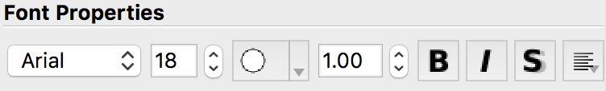
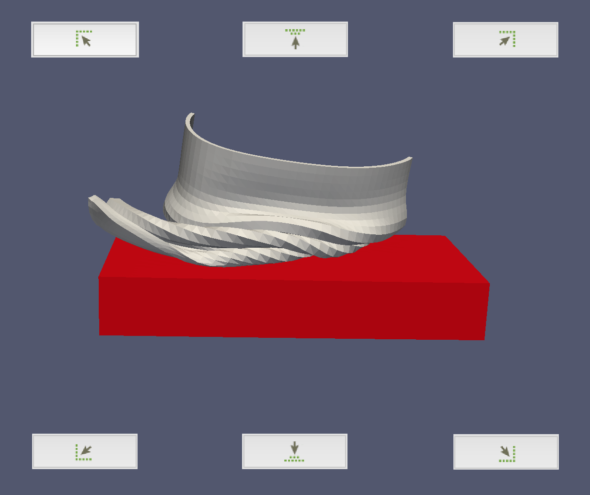
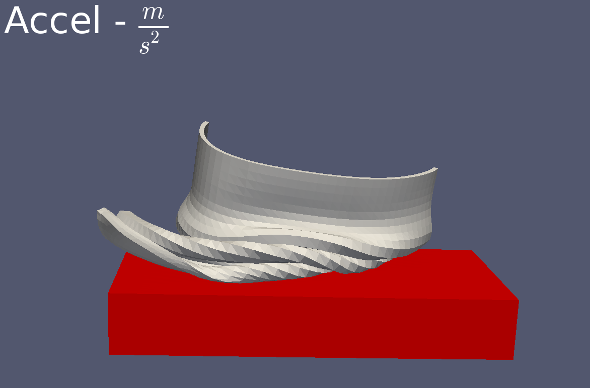
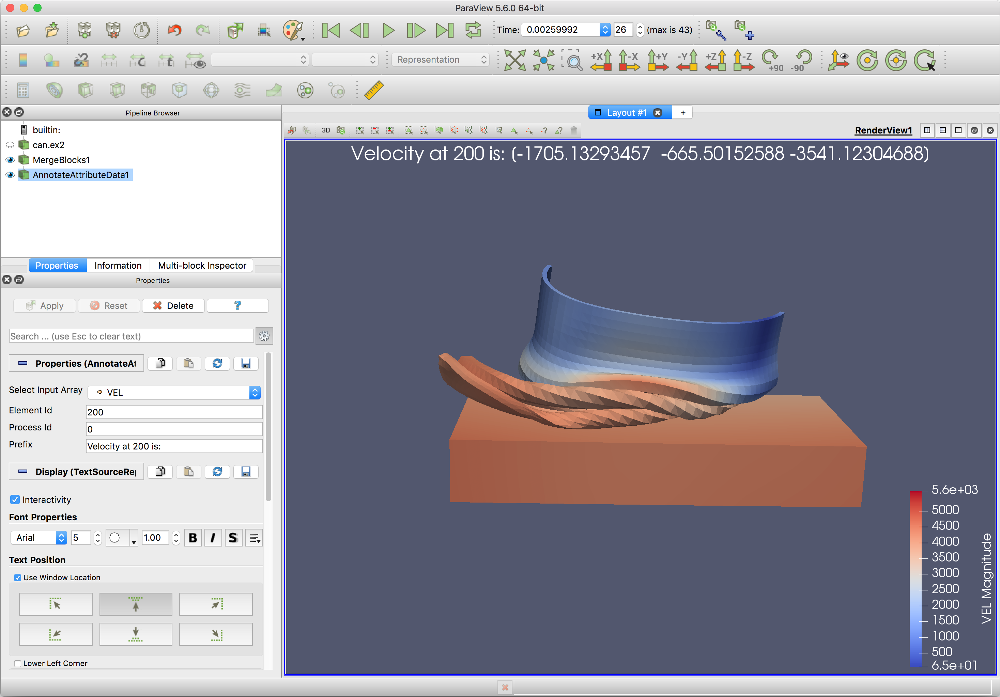
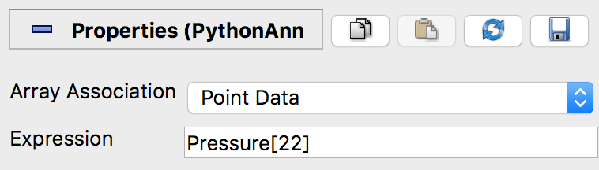

.. include:: ../macros.hrst
.. include:: ../abbreviations.hrst

.. _chapter:Annotations:

Annotations
###########

Explicit labeling and annotation of particular data values is often an important
element in data visualization and analysis. ParaView provides a variety of
mechanisms to enable annotation in renderings ranging from free floating text
rendered alongside other visual elements in the render view to data values
associated with particular points or cells.

Annotation sources
==================

Several types of text annotations can be added through the :guilabel:`Sources >
Alphabetical` menu. Text from these sources is drawn on top of 3D elements in
the render view. All annotation sources share some common properties under the
``Display`` :index:`\ <Display>`\  section of the  ``Properties`` :index:`\ <Properties>`\  panel. 
These include  ``Font Properties`` :index:`\ `\  such as the font to use, the size of the text, its color, opacity,
and justification, as well as text effects to apply such as making it bold,
italic, or shadowed.

    Font property controls in annotation sources and filters.

There are three fonts available in |ParaView|: Arial, Courier, and Times. You can
also supply an arbitrary TrueType font file (\*.ttf) to use by selecting the
``File`` :index:`\ <File>`\  entry in the popup menu under  ``Font Properties`` :index:`\ `\  and clicking on the
``...`` :index:`\ <...>`\  button to the right of the font file text field. A file selection
dialog will appear letting you choose a font file from the file system on which
|paraview| (or |pvpython|) is running.

The remaining display properties control where the text is placed in the render
view. There are two modes for placement, one that uses predefined positions
relative to the render view, and one that enables arbitrary interactive
placement in the render view. The first mode is active when the  
``Use Window Location`` :index:`\ <Use Window Location>`\  checkbox is selected. It enables the annotation to be placed in one of
the four corners of the render view or centered horizontally at the top or
bottom of the render view. Buttons with icons representing the location are
shown in the  ``Pipeline`` :index:`\ <Pipeline>`\  browser. These buttons correspond to locations in
the render view as depicted in :numref:`fig:AnnotationLocations`.

    Annotation placement buttons and where they place the annotation.

The second mode, activated by clicking the  ``Lower Left Corner`` :index:`\ <Lower Left Corner>`\  checkbox, lets
you arbitrarily place the annotation. If the  ``Interactivity`` :index:`\ <Interactivity>`\  property is
enabled, you can click and drag the annotation in the render view to place it,
or you can manually enter a location where the lower left corner of the
annotation's bounding box should be placed. The coordinates are defined in terms
of fractional coordinates that range from [0, 1] in the x and y dimensions. The
coordinate system of the render view has a lower left origin, so a  
``Lower Left Corner`` :index:`\ <Lower Left Corner>`\  value of [0, 0] will place the annotation in the lower left corner
of the render view.

``Text`` source
^^^^^^^^^^^^^^^

The  ``Text`` :index:`\ <Text>`\  source enables you to add a text annotation in the render view. It
has one property defining what text is displayed. Text can be multiline, and it
can contain numbers and unicode characters. Text may also contain Mathtex
expressions between starting and ending dollar signs. Mathtext expressions are a
subset of TeX math expressions :cite:`mathtext` . When Mathtext is used, the text
can only be on a single line.

    An example of the  ``Text`` :index:`\ <Text>`\  source annotation in the upper left corner
    with a math expression rendered from a Mathtext :cite:`mathtext` expression.

``Annotate Time`` source
^^^^^^^^^^^^^^^^^^^^^^^^

The  ``Annotate Time`` :index:`\ <Annotate Time>`\  source is nearly identical to the  ``Text`` :index:`\ <Text>`\  source, but
it also offers access to the current time value set in ParaView. The time value
is placed in the first format specifier in the  ``Format`` :index:`\ <Format>`\  text property. The
format specifier can be any number format valid for ``printf`` and related
functions in the C standard library. The default format results in renderig the
time value with six decimal digits of precision. Only one format specifier is
valid in the property. Additional specifiers after the first will produce
undefined results in the annotation text.

Annotation filters
==================

The annotation sources described in the previous section are available for
adding text annotations tht do not depend on any loaded datasets. To create
annotations that show values from an available data source in the 
``Pipeline Browser`` :index:`\ <Pipeline Browser>`\ , 
several annotation filters are available. The properties available to
change the text font and annotation location are exactly the same as those
available for the annotation sources described in the previous section.

``Annotate Attribute Data`` filter
^^^^^^^^^^^^^^^^^^^^^^^^^^^^^^^^^^

The  ``Annotate Attribute Data`` :index:`\ <Annotate Attribute Data>`\  makes it possible to create an annotation with
a data value from an array (or attribute) in a dataset. To use the filter, first
select the data array with the data of interest in the  ``Select Input Array`` :index:`\ <Select Input Array>`\ .
These arrays may be point, cell, or field data arrays. The  ``Element Id`` :index:`\ <Element Id>`\ 
property specifies the index of the point or cell whose value should be shown in
the annotation. If the selected input array is a field array (not associated
with points or cells), the  ``Element Id`` :index:`\ <Element Id>`\  specifies the tuple of the array to
show. When running in parallel, the  ``Process Id`` :index:`\ <Process Id>`\  denotes the process that
holds the array from which the value should be obtained.

    Properties of the  ``Annotate Attribute Data`` :index:`\ <Annotate Attribute Data>`\  filter.

The  ``Prefix`` :index:`\ <Prefix>`\  text property precedes the attribute value in the rendered
annotation. There is no formatting string - the number is appended after the
prefix. If the array value selected is a scalar value, the annotation will
contain just the number. On the other hand, if the array value is from a
multicomponent array, the individual components will be added to the annotation
label in a space-separated list that is surrounded by parentheses.

``Annotate Global Data`` filter
^^^^^^^^^^^^^^^^^^^^^^^^^^^^^^^

Some file formats include the concept of ``global data``, a single data value
stored in the data array for each time step. |ParaView| stores the set of such
data values as a field data array associated with the dataset with the same
number of values as timesteps. To display these global values in the render
view, use the  ``Annotate Global Data`` :index:`\ <Annotate Global Data>`\  filter.
The  ``Select Arrays`` :index:`\ <Select Arrays>`\  popup
menu shows the available field data arrays. The  ``Prefix`` :index:`\ <Prefix>`\  and  ``Suffix`` :index:`\ <Suffix>`\ 
properties come before and after the data value in the annotation, respectively.
The  ``Format`` :index:`\ <Format>`\  property is a C language number format specifier.

``Annotate Time Filter``
^^^^^^^^^^^^^^^^^^^^^^^^

A nice feature of |ParaView| is that it supports data sources that produce
different data at different times. Examples include file readers that read in
data for a requested time step and certain temporal filters. Each data source
advertises to |ParaView| the time values for which it can produce data. The data
produced and displayed in ParaView depends on the time you set in the |ParaView|
``VCR Controls`` :index:`\ <VCR Controls>`\  or  ``Time Inspector`` :index:`\ <Time Inspector>`\  panel.

What is even nicer is that you can have several data sources that each advertise
and respond to a possibly unique set of times. That is, available sources do not
need to advertise that they support the same set of time points - in fact, they
may define data at entirely different time points. Given a requested
time, each data source will produce the data corresponding to the time it
supports closest to the requested time. This features makes it possible to
create animations from multiple datasets varying at different time resolutions,
for instance.

While the  ``Annotate Time`` :index:`\ <Annotate Time>`\  source can be used to display |ParaView|'s currently
requested time, it does not show the time value to which a particular data
source is responding. For example |ParaView| may be requesting data for time 5.0,
but if a source produces data for time values 10.0 and above, it will produce
the data for time 10.0, even though time 5.0 was requested. To show the time for
which a data source is producing data, you can use the  
``Annotate Time Filter`` :index:`\ <Annotate Time Filter>`\ . 
Simply attach it to the source of interest. If several data sources are
present, a separate instance of this filter may be attached to each one.

This property includes  ``Shift`` :index:`\ <Shift>`\  and  ``Scale`` :index:`\ <Scale>`\  parameters used to linearly
transform the displayed time. The time value is first multiplied by the
scale and then the shift is then added to it.

``Environment Annotation`` filter
^^^^^^^^^^^^^^^^^^^^^^^^^^^^^^^^^

If you want to display information about the environment in which a
visualization was generated, use the  ``Environment Annotation`` :index:`\ <Environment Annotation>`\  filter. By
attaching this filter to a data source, you can have it automatically display
your user name on the system running |ParaView|, show which operating system was
used to generate it, present the date and time when the visualization was
generated, and show the file name of the source data if applicable. Each of
these items can be enabled or disabled by checkboxes in the  ``Properties`` :index:`\ <Properties>`\ 
panel for this filter.

If the input source for this filter is a file reader, the  ``File Name`` :index:`\ <File Name>`\ 
property is initialized to the name of the file. A checkbox labeled  ``Display
Full Path`` :index:`\ <Display Full Path>`\  is available to show the full path of the file, but if unchecked,
only the file name will be displayed. This default file path can be overridden
by changing the text in the  ``File Name`` :index:`\ <File Name>`\  property. If this filter is attached
to a filter instead of a reader, the file path will be initialized to an empty
string. It can be changed to the original file name manually, or an arbitrary
string if so desired.

``Python Annotation`` filter
^^^^^^^^^^^^^^^^^^^^^^^^^^^^

The most versatile annotation filter, the  ``Python Annotation`` :index:`\ <Python Annotation>`\  filter,
offers the most general way of generating annotations that include information
about the dataset. Values from point, cell, field, and row data arrays may be
accessed and combined with mathematical operations in a short Python expression
defined in the  ``Expression`` :index:`\ <Expression>`\  property. The type of data arrays available for use
in the  ``Expression`` :index:`\ <Expression>`\  is set with the  ``Array Association`` :index:`\ <Array Association>`\  property.

Before going further, let's look at an example of how to use the  
``Python Annotation`` :index:`\ <Python Annotation>`\  filter. 
Assume you want to show a data value at from a point array
named  ``Pressure`` :index:`\ <Pressure>`\  at point index 22. 
First, set the  ``Array Association`` :index:`\ <Array Association>`\  to
``Point Data`` :index:`\ <Point Data>`\  to ensure point data arrays can be referenced in the Python
annotation expression. To show the pressure value at point 22, set the
``Expression`` :index:`\ <Expression>`\  property to

.. code-block:: python

  Pressure[22]

    An example of a basic  ``Python Annotation`` :index:`\ <Python Annotation>`\  filter showing the value
    of the  ``Pressure`` :index:`\ <Pressure>`\  array at point 22.

You can augment the Python expression to give the annotation more meaning. To
add a prefix, set the  ``Expression`` :index:`\ <Expression>`\  to

.. code-block:: python

  'Pressure: %f' % (Pressure[22])

\noindent All data arrays in the chosen association are provided as variables
that can be referenced in the expression as long as their names are valid Python
variables. Array names that are invalid Python variable names are available
through a modified version of the array name. This sanitized version of the
array name consists of the subset of characters in the array name that are
letters, numbers, or underscore (``_``) joined together without spaces in the
order in which they appear in the original array name. For example, an array
named ``\#Velocity X`` :index:`\ <\#Velocity X>`\  will be made available in the variable  ``VelocityX`` :index:`\ <VelocityX>`\ .

Point and cell data in composite datasets such as multiblock datasets is
accessed somewhat differently than point or cell data in non-composite datasets.
The expression

.. code-block:: python

  Pressure[22]

retrieves a single scalar value from a point array in a non-composite
dataset, the same expression retrieves the 22nd element of the  ``Pressure`` :index:`\ <Pressure>`\ 
array in each block. These values are held in a VTKCompositeDataArray, which is
a data structure that holds arrays associated with each block in the dataset.
Hence, when the expression

.. code-block:: python

  Pressure[22]

is evaluated on a composite dataset, the value returned and displayed
is actually an assemblage of array values from each block. To access the value
from a single block, the array from that block must be selected from the
``Arrays`` :index:`\ <Arrays>`\  member of the result VTKCompositeDataArray. To show the
``Pressure`` :index:`\ <Pressure>`\  value associated with 22nd point of block 2, for example, set the
expression to

.. code-block:: python

  Pressure[22].Arrays[2]

This expression yields a single data value in the rendered annotation, assuming
that the  ``Pressure`` :index:`\ <Pressure>`\  array has a single component. To show a range of array
values, use a Python range expression in the index into the  ``Pressure`` :index:`\ <Pressure>`\  field,
e.g.,

.. code-block:: python

  Pressure[22:24].Arrays[2]

This will show the  ``Pressure`` :index:`\ <Pressure>`\  values for points 22 and 23 from
block 2. You can also retrieve more than one array using an index range on the
``Arrays`` :index:`\ <Arrays>`\  member, e.g.,

.. code-block:: python

  Pressure[22:24].Arrays[2:5]

This expression evaluates to  ``Pressure`` :index:`\ <Pressure>`\  for points 22 and 23 for
blocks 2, 3, and 4.

The  ``Array Association`` :index:`\ <Array Association>`\  is really a convenience to make the set of data
arrays of the given association available as variables that can be used in the
``Expression`` :index:`\ <Expression>`\ . The downside of using these array names is that arrays from
only one array association are available at a time. That means annotations that
require the combination of a cell data array and point data array, for example,
cannot be expressed with these convenience Python variables alone.

Fortunately, you can access any array in the input to this filter with a
slightly more verbose expression. For example, the following expression
multiplies a cell data value by a point data value:

.. code-block:: python

  inputs[0].CellData['Volume'][0] * inputs[0].PointData['Pressure'][0]

Note that the arrays in the input are accessed in the above example
using their original array names.

In the example above, the expression  ``inputs[0]`` :index:`\ <inputs[0]>`\  refers to the first input to
the filter. While this filter can take only one input, it is based on the same
code used by the  ``Python Calculator`` :index:`\ <Python Calculator>`\  (described in 
:numref:`sec:PythonCalculator`), which puts its several inputs into a Python list,
hence the input to the  ``Python Annotation`` :index:`\ <Python Annotation>`\  filter is referenced as
``inputs[0]`` :index:`\ <inputs[0]>`\ .

In addition to making variables for the current array association available in
the expression, this filter provides some other variables that can be useful
when computing an annotation value.

* ``points`` :index:`\ <points>`\ : Point locations (available for datasets with explicit points).
* ``time_value`` :index:`\ <time_value>`\ ,  ``t_value`` :index:`\ <t_value>`\ : The current time value set in |ParaView|.
* ``time_steps`` :index:`\ <time_steps>`\ ,  ``t_steps`` :index:`\ <t_steps>`\ : The number of timesteps available in the input.
* ``time_range`` :index:`\ <time_range>`\ ,  ``t_range`` :index:`\ <t_range>`\ : The range of timesteps in the input.
* ``time_index`` :index:`\ <time_index>`\ ,  ``t_index`` :index:`\ <t_index>`\ : The index of the current timestep in |ParaView|.

There are some situations where the variables above are not defined. If the
input has no explicitly defined points, e.g., image data, the  ``points`` :index:`\ <points>`\ 
variable is not defined. If the input does not define timesteps, the  ``time_*`` :index:`\ <time_*>`\ 
and  ``t_*`` :index:`\ <t_*>`\  variables are not defined.

.. admonition:: **Common Errors**
   :class: error

   The time-related variables are not needed to index into point or cell data arrays.
   Only the point and cell arrays loaded for the current timestep are available in
   the filter. You cannot access point or cell data from arbitrary timesteps from
   within this filter.

With the capabilities in this filter, it is possible to reproduce the other
annotation sources and filters, as shown below.

* ``Text`` :index:`\ <Text>`\  source: To produce the text "My annotation", write  ``"My annotation"`` :index:`\ <"My annotation">`\ 
* ``Annotate Time`` :index:`\ <Annotate Time>`\  source: To produce the equivalent of ``Time: %f``, write
  ``"Time :%f" % time_value`` :index:`\ <"Time :%f" % time_value>`\ 
* ``Annotate Attribute Data`` :index:`\ <Annotate Attribute Data>`\  filter: To produce the equivalent of setting
  ``Select Input Array`` :index:`\ <Select Input Array>`\  to ``EQPS``,  
  ``Element Id`` :index:`\ <Element Id>`\  to 0 
  and  ``Process Id`` :index:`\ <Process Id>`\  to 0, and  ``Prefix`` :index:`\ <Prefix>`\ 
  to ``Value is:``, write  ``'Value is: %.12f' % (inputs[0].CellData['EQPS'][0])`` :index:`\ <'Value is: %.12f' % (inputs[0].CellData['EQPS'][0])>`\ .

* ``Annotate Global Data`` :index:`\ <Annotate Global Data>`\  filter: To produce the same annotation as setting
  ``Select Arrays`` :index:`\ <Select Arrays>`\  to ``KE``,  ``Prefix`` :index:`\ <Prefix>`\  to  ``Value is: `` :index:`\ <Value is: >`\ ,  ``Format`` :index:`\ <Format>`\  to ``%7.5g``,
  and empty suffix, write  ``"Value is: %7.5g" % (inputs[0].FieldData['KE'].Arrays[0][time_index])`` :index:`\ <"Value is: %7.5g" % (inputs[0].FieldData['KE'].Arrays[0][time_index])>`\ 
* ``Annotate Time Filter`` :index:`\ <Annotate Time Filter>`\ : To produce the equivalent of setting  ``Format`` :index:`\ <Format>`\  to ``Time: %f``,
  ``Shift`` :index:`\ <Shift>`\  to 3, and  ``Scale`` :index:`\ <Scale>`\  to 2, write  ``"Time: %f" % (2*time_value + 3)`` :index:`\ <"Time: %f" % (2*time_value + 3)>`\ .

The examples above are meant to illustrate the versatility of the  ``Python Annotation`` :index:`\ <Python Annotation>`\  filter. 
Using the specialized annotation sources and filters are
likely to be more convenient than entering the expressions in the examples.
