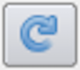

.. include:: ../macros.hrst
.. include:: ../abbreviations.hrst

.. _chapter:AxesGrid:

Axes Grid
#########

Oftentimes, you want to render a reference grid in the backgroud for a
visualization -- think axes in a chart view, except this time we are talking of the 3D
``Render View`` :index:`\ <Render View>`\ . Such a grid is useful to get an understanding for the data bounds and
placement in 3D space. In such cases, you use the  ``Axes Grid`` :index:`\ <Axes Grid>`\ .  ``Axes Grid`` :index:`\ <Axes Grid>`\  renders a 3D
grid with labels around the rendered scene. In this chapter, we will take a
closer look at using and customizing the  ``Axes Grid`` :index:`\ <Axes Grid>`\ .

The basics
==========

To turn on the  ``Axes Grid`` :index:`\ <Axes Grid>`\  for a  ``Render View`` :index:`\ <Render View>`\ , you use the
``Properties`` :index:`\ <Properties>`\  panel. Under the  ``View`` :index:`\ <View>`\  section, you check the  
``Axes Grid`` :index:`\ <Axes Grid>`\  checkbox to turn the  ``Axes Grid`` :index:`\ <Axes Grid>`\  on for the active view.

Clicking on the  ``Edit`` :index:`\ <Edit>`\  button will pop up the  ``Axes Grid`` :index:`\ <Axes Grid>`\ 
properties dialog (  :numref:`fig:EditAxesGridDialog`)
that allows you to customize the  ``Axes Grid`` :index:`\ <Axes Grid>`\ . As with the  ``Properties`` :index:`\ <Properties>`\ 
panel, this is a searchable dialog, hence you can use the  ``Search`` :index:`\ <Search>`\  box at the
top of the dialog to search of properties of interest. At the same time, the
|pqAdvanced26| button can be used to toggle between default and
advanced modes for the panel.

.. |pqAdvanced26| image:: ../images/pqAdvanced26.png
                  :width: 0.5cm

Using this dialog, you can change common properties like the titles
( ``X Title`` :index:`\ <X Title>`\ ,  ``Y Title`` :index:`\ <Y Title>`\ , and  ``Z Title`` :index:`\ <Z Title>`\ ), 
title and label fonts using  ``Title Font Properties`` :index:`\ <Title Font Properties>`\  
and  ``Label Font Properties`` :index:`\ <Label Font Properties>`\  for each of the axes directions,
as well as the  ``Grid Color`` :index:`\ <Grid Color>`\ . Besides labelling the axes, you can render a
grid by checking  ``Show Grid`` :index:`\ <Show Grid>`\ . Once you have the  ``Axes Grid`` :index:`\ <Axes Grid>`\  setup to your
liking, you can use the |SaveAsDefaultButton| to save your
selections so that they are automatically loaded next time you launch ParaView.
You can always use the |ReloadButton| to revert back to ParaView
defaults.

.. |SaveAsDefaultButton| image:: ../images/SaveAsDefaultButton.png
                         :width: 0.5cm

    ``Edit Axes Grid`` :index:`\ <Edit Axes Grid>`\  dialog is used to customize the  ``Axes Grid`` :index:`\ <Axes Grid>`\ .

Use cases
=========

To get a better look at the available customizations, let's look at various
visualizations possible and then see how you can set those up using the
properties on the  ``Edit Axes Grid`` :index:`\ <Edit Axes Grid>`\  dialog. In these examples, we use the
``disk_out_ref.ex2`` example dataset packaged with ParaView.

|AxesGridBasic| |AxesGridShowGrid|

In the images above, on the left is the default  ``Axes Grid`` :index:`\ <Axes Grid>`\ . 
Simply turning on the visibility of the  ``Axes Grid`` :index:`\ <Axes Grid>`\
will generate such a visualization. The axes places always stay behind the
rendered geometry even as you interact with the scene. As you zoom in and out,
the labels and ticks will be updated based on visual cues.

To show a grid along the axes planes, aligned with the ticks and labels, turn
on the  ``Show Grid`` :index:`\ <Show Grid>`\  checkbox, resulting in a visualization on the right.

By default, the gridded faces are always the farthest faces i.e. they stay behind
the rendered geometry and keep on updating as you rotate the scene. To fix which
faces of the bounding-box are to be rendered, use the  ``Faces To Render`` :index:`\ <Faces To Render>`\ 
button (it's an advanced property, so you may have to search for it using the
``Seach`` :index:`\ <Seach>`\  box in the  ``Edit Axes Grid`` :index:`\ <Edit Axes Grid>`\  dialog). Suppose, we want to label
just one face, the lower XY face. In that case, uncheck all the other faces
except  ``Min-XY`` :index:`\ <Min-XY>`\  in menu popped up on clicking on the  ``Faces to Render`` :index:`\ <Faces to Render>`\ 
button. This will indeed just show the min-XY face, however as you rotate the
scene, the face will get hidden as soon as the face gets closer to the camera
than the dataset. This is because, by default,  ``Cull Frontfaces`` :index:`\ <Cull Frontfaces>`\  is enabled.
Uncheck  ``Cull Frontfaces`` :index:`\ <Cull Frontfaces>`\  and ParaView will stop removing the face as it
comes ahead of the geometry, enabling a visualization as follows.

.. figure:: ../images/AxesGridNoCulling.png
    :width: 80%
    :align: center

Besides controlling which faces to render, you can also control where the labels
are placed. Let's say we want ParaView to decide how to place labels along the Y
axis, however for the X axis, we want to explicitly label the values :math:`2.5`,
:math:`0.5`, :math:`-0.5`, and :math:`-4.5`. To that, assuming we are the advanced mode for the
``Edit Axes Grid`` :index:`\ <Edit Axes Grid>`\  panel, 
check  ``X Axis Use Custom Labels`` :index:`\ <X Axis Use Custom Labels>`\ .
That will show a table widget that allows you to add values as shown below.

Using the |pqPlus16| button, add the custom values.
While at it, let's also change the  ``X Axis Label Font Properties`` :index:`\ <X Axis Label Font Properties>`\ 
and  ``X Axis Title Font Properties`` :index:`\ <X Axis Title Font Properties>`\  to change the color
to red and similar for the Y axis, let's change the color to green. Increase the
title font sizes to 18, to make them stand out and you will get a visualization
as follows (below, left).

.. |pqPlus16| image:: ../images/pqPlus16.png
              :width: 0.5cm

|AxesGridCustomLabels| |AxesGridCustomAxesToLabel|

Here we see that both sides of the axis plane are
labeled. Suppose you only want to label one of the sides, in that case use the
``Axes To Label`` :index:`\ <Axes To Label>`\  property to uncheck all but 
``Min-X`` :index:`\ <Min-X>`\  and  ``Min-Y`` :index:`\ <Min-Y>`\ . This
will result in the visualization shown above, right.

``Axes Grid`` in ``pvpython``
=============================

In |pvpython|,  ``Axes Grid`` :index:`\ <Axes Grid>`\  is accessible as the  ``AxesGrid`` :index:`\ <AxesGrid>`\  property on the
render view.

.. code-block:: python

  >>> renderView = GetActiveView()
  
  # AxesGrid property provides access to the AxesGrid object.
  >>> axesGrid = renderView.AxesGrid
  
  # To toggle visibility of the axes grid,
  >>> axesGrid.Visibility = 1

All properties on the  ``Axes Grid`` :index:`\ <Axes Grid>`\  that you set using the  ``Edit Axes Grid`` :index:`\ <Edit Axes Grid>`\ 
dialog are available on this  ``axesGrid`` :index:`\ <axesGrid>`\  object and can be changed as follows:

.. code-block:: python

  >>> axesGrid.XTitle = 'X Title'
  >>> axesGrid.XTitleColor = [0.6, 0.6, 0.0]
  >>> axesGrid.XAxisLabels = [-0.5, 0.5, 2.5, 3.5]

Note you can indeed use the tracing capabilities described in
:numref:`sec:PythonTracing` to determine what Python API to use to change a
specific property on the  ``Edit Axes Grid`` :index:`\ <Edit Axes Grid>`\  dialog or use  ``help`` :index:`\ <help>`\ .

.. code-block:: python

  >>> help(axesGrid)
  Help on GridAxes3DActor in module paraview.servermanager object:
  
  class GridAxes3DActor(Proxy)
   |  GridAxes3DActor can be used to render a grid in a render view.
   |
   |  Method resolution order:
   |      GridAxes3DActor
   |      Proxy
   |      __builtin__.object
   |
   |  Methods defined here:
   |
   |  Initialize = aInitialize(self, connection=None, update=True)
   |
   |  ----------------------------------------------------------------------
   |  Data descriptors defined here:
   |
   |  AxesToLabel
   |      Set the mask to select the axes to label. The axes labelled will be a subset of the
   |      axes selected depending on which faces are also being rendered.
   |
   |  CullBackface
   |      Set to true to hide faces of the grid facing away from the camera i.e. hide all
   |      back faces.
   |
   |  CullFrontface
   |      Set to true to hide faces of the grid facing towards from the camera i.e. hide all
   |      front faces.
   |
   |  DataPosition
   |      If data is being translated, you can show the original data bounds for the axes
   |      instead of the translated bounds by setting the DataPosition to match the
   |      translation applied to the dataset.
   |
   ...
