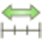

.. include:: ../macros.hrst
.. include:: ../abbreviations.hrst

.. _chapter:ColorMapping:

Color maps and transfer functions
*********************************

One of the first things that any visualization tool user does when
opening a new dataset and looking at the mesh is to color the mesh with some
scalar data. Color mapping is a common visualization technique that maps data to
color, and displays the colors in the rendered image. Of course, to map the
data array to colors, we use a transfer function. A transfer function can also
be used to map the data array to opacity for rendering translucent surfaces or
for volume rendering. This chapter describes the basics of mapping data arrays to
color and opacity.

The basics
==========

Color mapping (which often also includes opacity mapping) goes by various names
including scalar mapping and pseudo-coloring. The basic principle entails
mapping data arrays to colors when rendering surface meshes or volumes. Since
data arrays can have arbitrary values and types, you may want to define to which
color a particular data value maps. This mapping is defined using what are
called *color maps* or *transfer functions*. Since such mapping from
data values to rendering primitives can be defined for not just colors, but
opacity values as well, we will use the more generic term *transfer functions*.

Of course, there are cases when your data arrays indeed specify the
red-green-blue color values to use when rendering (i.e., not using a transfer
function at all). This can controlled using the  ``Map Scalars`` :index:`\ <Map Scalars>`\  display property.
Refer to Chapter :numref:`sec:RenderView:DisplayProperties` for details. This
chapter relates to cases when  ``Map Scalars`` :index:`\ <Map Scalars>`\  is enabled, i.e., when the transfer
function is being used to map arrays to colors and/or opacity.

In |ParaView|, you can set up a transfer function for each data array
for both color and opacity separately. |ParaView| associates a transfer function
with the data array identified by its name. The same transfer function is used
when coloring with the same array in different 3D views or results from
different stages in the pipeline. You can also use :numref:`sec:SeparateColorMap`
to have independant color map by array name and representation.

For arrays with more than one component, such as vectors or tensors, you can
specify whether to use the magnitude or a specific component for the
color/opacity mapping. Similar to the transfer functions themselves, this
selection of how to map a multi-component array to colors is also associated
with the array name. Thus, two pipeline modules being colored with the arrays
that have the same name will not only be using the same transfer functions for
opacity and color, but also the component/magnitude selection.

.. admonition:: **Common Errors**
   :class: error

   Beginners find it easy to forget that the transfer function is associated with
   an array name and, hence, are surprised when changing the transfer function for
   a dataset being shown in one view affects other views as well. Using different
   transfer functions for the same variable is discouraged by design in |ParaView|,
   since it can lead to the misinterpretation of values. If you want to use different
   transfer functions, despite this caveat, you can use the Separate Color Map feature
   (see :numref:`sec:SeparateColorMap`).

There are separate transfer functions for color and opacity. The opacity
transfer function is used for volume rendering, and it is optional when used for surface
renderings.

Color mapping in ``paraview``
^^^^^^^^^^^^^^^^^^^^^^^^^^^^^

 
    The controls used for selecting the array to color within the
    ``Properties`` :index:`\ <Properties>`\  panel (top) and the  ``Active Variables Controls`` :index:`\ <Active Variables Controls>`\  toolbar (bottom).

You can pick an array to use for color mapping, using either the  ``Properties`` :index:`\ <Properties>`\ 
panel or the  ``Active Variables Controls`` :index:`\ <Active Variables Controls>`\  toolbar. You first select the array
with which to color and then select the component or magnitude for multi-component
arrays. |ParaView| will either use an existing transfer function or create a new
one for the selected array.

Color mapping in ``pvpython``
^^^^^^^^^^^^^^^^^^^^^^^^^^^^^

Here's a sample script for coloring using a data array from the
``disk_out_ref.ex2`` dataset.

.. code-block:: python

  from paraview.simple import *
  
  # create a new 'ExodusIIReader'
  reader = ExodusIIReader(FileName=['disk_out_ref.ex2'])
  reader.PointVariables = ['V']
  reader.ElementBlocks = ['Unnamed block ID: 1 Type: HEX8']
  
  # show data in view
  display = Show(reader)
  
  # set scalar coloring
  ColorBy(display, ('POINTS', 'V'))
  
  # rescale color and/or opacity maps used to include current data range
  display.RescaleTransferFunctionToDataRange(True)

The  ``ColorBy`` :index:`\ <ColorBy>`\  function provided by the  ``simple`` :index:`\ <simple>`\  module ensures that the color
and opacity transfer functions are set up correctly for the selected array, which
is using an existing one already associated with the array name or is creating a
new one. Passing ``None`` as the second argument to  ``ColorBy`` :index:`\ <ColorBy>`\  will
display scalar coloring.

Editing the transfer functions in ``paraview``
==============================================

    ``Color Map Editor`` :index:`\ <Color Map Editor>`\  panel in ``paraview`` showing the major components of the panel.

In ``paraview``, you use the  ``Color Map Editor`` :index:`\ <Color Map Editor>`\  to customize the
color and opacity transfer functions. You can toggle the  ``Color Map Editor`` :index:`\ <Color Map Editor>`\ 
visibility using the :guilabel:`View > Color Map Editor` menu option.

As shown in  :numref:`fig:colormapeditorpanel`, the panel follows a layout
similar to the  ``Properties`` :index:`\ <Properties>`\  panel. The panel shows the properties for the
transfer function, if any, used for coloring the active data source (or filter)
in the active view. If the active source if not visible in the active view, or
is not employing scalar coloring, then the panel will be empty.

Similar to the Properties panel, by default, the commonly used properties are
shown. You can toggle the visibility of advanced properties by using the
|pqAdvanced26| button. Additionally, you can search for a
particular property by typing its name in the  ``Search`` :index:`\ <Search>`\  box.

Whenever the transfer function is changed, we need to re-render, which may be
time consuming. By default, the panel requests a render on every change. To avoid
this, you can toggle the |AutoApplyIcon| button. When unchecked,
you will need to manually update the panel using the  ``Render Views`` :index:`\ <Render Views>`\  button.

.. |AutoApplyIcon| image:: ../images/AutoApplyIcon.png
                   :width: 0.5cm

The |SP_BrowserReload| button restores the application
default settings for the current color map.

The |pqSaveArray16| and |pqSave32|
buttons save the current color and opacity transfer function, with all
its properties, as the default transfer function. |ParaView| will use
it next time it needs to set up a transfer function to color a new data
array. The |pqSaveArray16| button saves the transfer
function as default for an array of the same name while the
|pqSave32| button saves the transfer function as
default for all arrays. Note that this will not affect transfer
functions already setup. Also this is saved across sessions,
so |ParaView| will remember this even after restart.

.. |pqSave32| image:: ../images/pqSave32.png
              :width: 0.5cm

.. _sec:SeparateColorMap:

Separate Color Map
^^^^^^^^^^^^^^^^^^

    The Separate Color Map button

In order to force |ParaView| to use a separate color map on the current Active Representation,
click on the button shown in  :numref:`fig:separatecolormap`. A separate color map
is not shared across representations by name, but is instead uniquely associated with the array
name and the representation.

This can also easily be done in Python:

.. code-block:: python

  from paraview.simple import *
  
  Wavelet()
  wavelet1Display = Show()
  wavelet1Display.SetRepresentationType('Surface')
  
  # set scalar coloring
  ColorBy(wavelet1Display, 'RTData')
  
  # set the usage of a Separate Color Map
  wavelet1Display.UseSeparateColorMap = True
  
  # or use the ColorBy interface directly
  ColorBy(wavelet1Display, 'RTData', separate = True)
  
  # display the same data in another view for comparison with different color map
  # get layout
  layout1 = GetLayout()
  
  # split cell
  layout1.SplitHorizontal(0, 0.5)
  
  renderView1 = GetActiveView()
  
  # Create a new 'Render View'
  renderView2 = CreateView('RenderView')
  
  # place view in the layout
  layout1.AssignView(2, renderView2)
  
  # set active view
  SetActiveView(renderView2)
  
  wavelet2Display = Show()
  wavelet2Display.SetRepresentationType('Surface')
  
  # Use the ColorBy interface to create a separated color map
  ColorBy(wavelet2Display, 'RTData', separate = True)
  
  # get separate color transfer function/color map for 'RTData'
  separate_wavelet2Display_RTDataLUT = GetColorTransferFunction('RTData', wavelet2Display, separate=True)
  
  # Apply a preset using its name.
  separate_wavelet2Display_RTDataLUT.ApplyPreset('Cold and Hot', True)
  
  ResetCamera(renderView1)
  ResetCamera(renderView2)
  RenderAllViews()

.. _sec:ColorMapping:MappingData:

Mapping data
^^^^^^^^^^^^

    Transfer function editor and related properties

The ``Mapping Data`` :index:`\ <Mapping Data>`\  group of properties controls how the data is mapped to
colors or opacity. The transfer function editor widgets are used to control the
transfer function for color and opacity. The panel always shows both the
transfer functions. Whether the opacity transfer function gets used depends on
several things:

* When doing surface mesh rendering, it will be used only if
  ``Enable opacity mapping for surfaces`` :index:`\ <Enable opacity mapping for surfaces>`\  is checked

* When doing volume rendering, the opacity mapping will always be used.

To map the data to color using a log scale, rather than a linear scale, check
the  ``Use log scale when mapping data to colors`` :index:`\ <Use log scale when mapping data to colors>`\ . It is assumed that the data
is in the non-zero, positive range. |ParaView| will report errors and try to
automatically fix the range if it is ever invalid for log mapping.

The range of a color map is a very important property that controls the mapping
of data values to colors. The range can be automatically updated in a number
of situations for convenience. How the range is updated is controlled by the
``Automatic Rescale Range Mode`` :index:`\ <Automatic Rescale Range Mode>`\  property in the  ``Color Map Editor`` :index:`\ <Color Map Editor>`\ . When
``Never`` :index:`\ <Never>`\  is selected, the data range will never be updated automatically. When
``Grow and update on 'Apply'`` :index:`\ <Grow and update on 'Apply'>`\  is selected, |ParaView| will grow the color/opacity
map range to include the current data range every time you hit  ``Apply`` :index:`\ <Apply>`\  on the
``Properties`` :index:`\ <Properties>`\  panel. Thus, when the data range changes, if the timestep is changed,
the color/opacity map range won't be affected. To grow the range on change in
timestep as well, use the  ``Grow and update every timestep`` :index:`\ <Grow and update every timestep>`\  option. Now the
range will be updated on  ``Apply`` :index:`\ <Apply>`\  as well as when the timestep changes.
*Grow* indicates that the color/opacity map range will only be increased,
never shrunk, to include the current data range. If you want the range to
match the current data range exactly, then you should use the  ``Clamp and
update every timestep`` :index:`\ <Clamp and update every timestep>`\  option. Now the range will be clamped to the exact data
range each time you hit  ``Apply`` :index:`\ <Apply>`\  on the  ``Properties`` :index:`\ <Properties>`\  panel or when the
timestep changes. The initial value for the  ``Automatic Rescale Range Mode`` :index:`\ <Automatic Rescale Range Mode>`\ 
is controlled by the  ``General`` :index:`\ <General>`\  setting  ``Transfer Function Reset Mode`` :index:`\ <Transfer Function Reset Mode>`\  in the
``Settings`` :index:`\ <Settings>`\  dialog (see  :numref:`sec:GeneralSettings` ).

Transfer function editor
^^^^^^^^^^^^^^^^^^^^^^^^

Using the transfer function editors is pretty straightforward. Control points
in the opacity editor widget and the color editor widget are independent of each
other. To select a control point, click on it. When selected, the control point
is highlighted with a red circle and data value associated with the control
point is shown in the  ``Data`` :index:`\ <Data>`\  input box under the widget. Clicking in an empty area
will add a control point at that location. To move a control point, click on the
control point and drag it. You can fine tune the data value associated with the
selected control point using the  ``Data`` :index:`\ <Data>`\  input box. To delete a control point,
select the control point and then type the |DEL| key. Note that the mouse pointer
should be within the transfer function widget for Qt to send the event to the
editor widget correctly. While the end control points cannot be moved or deleted,
you can rescale the entire transfer function to move the control
points, as is explained later.

In the opacity transfer function widget, you can move the control points
vertically to control the opacity value associated with that control point. In
the color transfer function widget, you can double click on the control point to
pop up a color chooser widget to set the color associated with that control
point.

The opacity transfer function widget also offers some control over the
interpolation between the control points. Double click on a control point to
show the interpolation control widget, which allows for changing the sharpness and
midpoint that affect the interpolation. Click and drag the control points to
see the change in interpolation.

The several control buttons on the right side of the transfer function widgets
support the following actions:

* |pqResetRange24| : Rescales the color and opacity transfer
  functions using the data range from the data source selected in the Pipeline
  browser, i.e., the active source. This rescales the entire transfer function.
  Thus, all control points including the intermediate ones are proportionally
  adjusted to fit the new range.
* |pqResetRangeCustom24| : Rescales the color and opacity transfer
  functions using a range provided by the user. A dialog will be popped up for
  the user to enter the custom range.
* |pqResetRangeTemporal24| : Rescales the color and
  opacity transfer functions to the range of values for data over all
  timesteps. This operation may be costly as data for all timesteps
  needs to be read.
* |pqResetToVisibleRange32| : Rescales the color
  and opacity transfer functions using the range of values for the
  elements (cells or points) visible in the view. This operations
  assigns the entire range of colors to visible elements which may
  reveal patterns not visible otherwise.
* |pqInvert24| : Inverts the color transfer function
  by moving the control points, e.g,. a red-to-green transfer function will be
  inverted to a green-to-red one. This only affects the color transfer function and
  leaves the opacity transfer function untouched.
* |pqFavorites32| : Loads the color transfer function
  from a preset. The  ``Color Preset`` :index:`\ <Color Preset>`\  manager dialog pops up to enable you to choose
  one of the color maps included with ParaView or import presets from a file.
* |pqSave32| : Saves the current color transfer
  function to presets. The  ``Color Preset`` :index:`\ <Color Preset>`\  manager dialog pops up to let you
  name the transfer function and export the transfer function to a file. The
  opacity function can also be saved with the transfer function.
* |pqAdvanced26| : This toggles the detailed view for the
  transfer function control points. This is useful to manually enter values for
  the control points rather than using the UI.

Color mapping parameters
^^^^^^^^^^^^^^^^^^^^^^^^

    Color Mapping Parameters, including advanced properties. Advanced
    properties are enabled by clicking the gear icon at the top right of the
    ``Color Map Editor`` :index:`\ <Color Map Editor>`\  (not shown).}

The  ``Color Mapping Parameters`` :index:`\ <Color Mapping Parameters>`\  group of properties provides additional
control over the color transfer function, including control over the color
interpolation space, which is either RGB, HSV, Lab, Diverging, or Lab/CIEDE2000.
To color data values falling below or above the range of the color map with special colors, enable the
advanced  ``Use Below Range Color`` :index:`\ <Use Below Range Color>`\  and  ``Use Above Range Color`` :index:`\ <Use Above Range Color>`\  options,
respectively. You can choose different colors for data falling on either side of
the range. When color mapping floating point arrays with NaNs, you can select
the color and opacity to use for NaN values. You can also affect whether the color transfer
function uses smooth interpolation or discretizes the map into a fixed
number of colors.

Editing the transfer functions in ``pvpython``
==============================================

In |pvpython|, you control the transfer functions by getting access
to the transfer function objects and then changing properties on those. The
following script shows how you can access transfer functions objects.

.. code-block:: python

  from paraview.simple import *
  
  # You can access the color and opacity transfer functions
  # for a particular array as follows. These functions will
  # create new transfer functions if none exist.
  # The argument is the array name used to locate the transfer
  # functions.
  >>> colorMap = GetColorTransferFunction('Temp')
  >>> opacityMap = GetOpacityTransferFunction('Temp')

Once you have access to the color and opacity transfer functions, you can change
properties on these similar to other sources, views, etc. Using the Python
tracing capabilities to discover this API is highly recommended.

.. code-block:: python

  # Rescale transfer functions to a specific range
  >>> colorMap.RescaleTransferFunction(1.0, 19.9495)
  >>> opacityMap.RescaleTransferFunction(1.0, 19.9495)
  
  # Invert the color map.
  >>> colorMap.InvertTransferFunction()
  
  # Map color map to log-scale preserving relative positions for
  # control points
  >>> colorMap.MapControlPointsToLogSpace()
  >>> colorMap.UseLogScale = 1
  
  # Return back to linear space.
  >>> colorMap.MapControlPointsToLinearSpace()
  >>> colorMap.UseLogScale = 0
  
  # Change using of opacity mapping for surfaces
  >>> colorMap.EnableOpacityMapping = 1
  
  # Explicitly specify color map control points
  # The value is a flattened list of tuples
  # (data-value, red, green, blue). The color components
  # must be in the range [0.0, 1.0]
  >>> colorMap.RGBPoints = [1.0, 0.705, 0.015, 0.149,
                            5.0, 0.865, 0.865, 0.865,
                           10.0, 0.627, 0.749, 1.0,
                           19.9495, 0.231373, 0.298039, 0.752941]
  
  # Similarly, for opacity map. The value here is
  # a flattened list of (data-value, opacity, mid-point, sharpness)
  >>> opacity.Points = [1.0, 0.0, 0.5, 0.0,
                        9.0, 0.404, 0.5, 0.0,
                       19.9495, 1.0, 0.5, 0.0]
  
  # Note, in both these cases the controls points are assumed to be sorted
  # based on  the data values. Also, not setting the first and last
  # control point to have same data value can have unexpected artifacts
  # in the 'Color Map Editor' panel.

Oftentimes, you want to rescale the color and opacity maps to fit the
current data ranges. You can do this as follows:

.. code-block:: python

  >>> source = GetActiveSource()
  
  # Update the pipeline, if it hasn't been updated already.
  >>> source.UpdatePipeline()
  
  # First, locate the display properties for the source of interest.
  >>> display = GetDisplayProperties()
  
  # Reset the color and opacity maps currently used by 'display' to
  # use the range for the array 'display' is using for color mapping.
  # This requires that the 'display' has been set to use scalar coloring
  # using an array that is available in the data generated. If not, you will
  # get errors.
  >>> display.RescaleTransferFunctionToDataRange()

Color legend
============

    Color legend in |ParaView|.

The color legend, also known as scalar bar or color bar, is designed to provide
the user information about which color corresponds to what data value in the
rendered view. You can toggle the visibility of the color legend corresponding
to the transfer function being shown/edit in the  ``Color Map Editor`` :index:`\ <Color Map Editor>`\  by using the
|ParaView_UsersGuide_ColorLegendButton| button near the top of
the panel. This button affects the visibility of the legend in the active view.

:numref:`fig:colormaplegenddetail` shows the various components of the color
legend. By default, the title is typically the name of the array (and component
number or magnitude for non-scalar data arrays) being mapped. Automatically generated
labels appear on one side of the color legend, while on the other side are annotations,
optionally including start and end annotations depicting the minimum and maximum
of the color legend range.

The color legend can be manipulated with the mouse. You can click and drag the legend to place it
at any position in the view. Additionally, you can change the length of the legend
by clicking and dragging the end-markers shown when you hover the mouse
pointer over the legend.

.. _sec:ColorLegendParameters:

Color legend parameters
^^^^^^^^^^^^^^^^^^^^^^^

    ``Edit Color Legend Parameters`` :index:`\ <Edit Color Legend Parameters>`\  dialog in |paraview|.

You can edit the color legend parameters by clicking on the
|pqEditScalarBar16|  button on the  ``Color Map Editor`` :index:`\ <Color Map Editor>`\  panel. This
will pop up the  ``Edit Color Legend Properties`` :index:`\ <Edit Color Legend Properties>`\  dialog that shows the available
parameters. Any changes made will affect only the particular color legend in
the active view.

The first few options in the  ``Edit Color Legend Properties`` :index:`\ <Edit Color Legend Properties>`\  control the
orientation and location of the color legend in the render view.  ``Auto Orient`` :index:`\ <Auto Orient>`\  turns on automatic determination of the color legend's orientation. The
color legend will change orientation to horizontal when it is dragged to the
bottom or the top of the render view, and it will change to vertical when it is
dragged to the left or right side. When disabled, you can choose the orientation
you want the color legend to have by choosing an option in the  ``Orientation`` :index:`\ <Orientation>`\ 
combo-box. The  ``Window Location`` :index:`\ <Window Location>`\  option controls the location of the color legend in
the window; if the value  ``AnyLocation`` :index:`\ <AnyLocation>`\  is selected, then the color
legend will not be forced into any particular position. The color legend can be
positioned by clicking and dragging it with the mouse in the render view,
or the  ``Position`` :index:`\ <Position>`\  property can be specified explicitly with
fractional coordinates that range from [0, 1] and represent the fraction of the window
width (or height) where the color legend's bottom left corner should be placed. Note
that if the color legend is placed interactively with the mouse, the  ``Window Location`` :index:`\ <Window Location>`\  option
will automatically change to  ``AnyLocation`` :index:`\ <AnyLocation>`\ .

Besides the obvious changing of title text and font properties for the title,
labels, and annotations, there are some other parameters that control the
appearance of the color legend.

By default, the title is rotated 90 degrees counter-clockwise when the legend
is oriented vertically to better align with the legend. Checking the
``Horizontal Title`` :index:`\ <Horizontal Title>`\  box forces the title of the color legend to be horizontal
regardless of color legend orientation.

``Draw Annotations`` :index:`\ <Draw Annotations>`\  determines whether the annotations
(including the start and end annotations) are to be drawn at all.

When checked,  ``Draw Nan Annotation`` :index:`\ <Draw Nan Annotation>`\  results in the color legend showing the
NaN color set in the  ``Color Map Editor`` :index:`\ <Color Map Editor>`\  panel in a separate color box right beside the
color legend. The annotation text shown for that box can be modified by changing
the  ``Nan Annotation`` :index:`\ <Nan Annotation>`\  text.

    Color legend showing NaN annotation

If ``Automatic Label Format`` :index:`\ <Automatic Label Format>`\  is checked, |ParaView| will try to pick an optimal
representation for numerical values based on the value and available screen
space. By unchecking it, you can explicitly specify the ``printf``-style
format to use for numeric values. To explicitly label values of interest, enable
the ``Use Custom Labels`` :index:`\ <Use Custom Labels>`\  option. You can specify exactly the labeled values
you wish to display in the table that appears when this option is chosen.
``Color Bar Thickness`` :index:`\ <Color Bar Thickness>`\  is used to control the thickness of the legend. It is
defined in terms of points just like how font sizes are specified. Use  ``Color Bar
Length`` :index:`\ <Color Bar Length>`\  to explicitly set the length of the color bar. This property is defined
as a fraction in the range [0, 1] of the window width (when the color legend is
oriented horizontally) or height (when oriented vertically).

Color legend in ``pvpython``
^^^^^^^^^^^^^^^^^^^^^^^^^^^^

To show the color legend or scalar bar for the transfer function used for scalar
mapping a source in a view, you can use API on its display properties:

.. code-block:: python

  >>> source = ...
  >>> display = GetDisplayProperties(source, view)
  
  # to show the color legend
  >>> display.SetScalarBarVisibility(view, True)
  
  # to hide the same
  >>> display.SetScalarBarVisibility(view, False)

To change the color legend properties as in
:numref:`sec:ColorLegendParameters`, you need to first get access to the
color legend object for the color transfer function in a particular view. These
are analogous to display properties for a source in a view.

.. code-block:: python

  >>> colorMap = GetColorTransferFunction('Temp')
  
  # get the scalar bar in a view (akin to GetDisplayProperties)
  >>> scalarBar = GetScalarBar(colorMap, view)
  
  # Now, you can change properties on the scalar bar object.
  >>> scalarBar.TitleFontSize = 8
  >>> scalarBar.DrawNanAnnotation = 1

Annotations
===========

Simply put, annotations allow users to put custom text at particular data values
in the color legend. The min and max data mapped value annotations are
automatically added. To add any other custom annotations, you can use the
``Color Map Editor`` :index:`\ <Color Map Editor>`\ .

Since the list of annotations is an advanced property, you need to either toggle the
visibility of advanced properties using the |pqAdvanced26| icon
near the top of the panel or type ``annotations`` in the
search box. That will show the  ``Annotations`` :index:`\ <Annotations>`\  widget, which is basically a
list widget where users can enter key-value pairs, rather than value-annotation
pairs, as shown in  :numref:`fig:colormapwidget`.

    Widget to add/edit annotations on the  ``Color Map Editor`` :index:`\ <Color Map Editor>`\  panel

You can use the buttons of the right on the widget to add/remove entries. Enter
the data value to annotate under the  ``Value`` :index:`\ <Value>`\  column and then enter the text to
display at that value under the  ``Annotation`` :index:`\ <Annotation>`\  column.

You can use the |TAB| (tab) key to edit the next entry. Hitting |TAB| after
editing the last entry in the table will automatically result in adding a new
row, thus, making it easier to add bunch of annotations without having to click
any buttons.

Some annotation texts may not show up on the legend. There are two possible reasons
an annotation may not be shown. First, the value added is outside the mapped range of the color transfer
function. Second,  ``Draw Annotations`` :index:`\ <Draw Annotations>`\  is unchecked in the  ``Color Legend Parameters
dialog`` :index:`\ <Color Legend Parameters dialog>`\ .

The |pqFilter32| and |pqFilterEyeball16| buttons can be used to fill the
annotations widget with unique discrete values from a data array, if
possible. Based on the number of distinct values present in the data
array, this may not yield any result (Instead, a warning message will
be shown). The data array values come either from the selected source object
if you use the |pqFilter32| button or it comes from
the visible pipeline objects if you use the
|pqFilterEyeball16| button.

Annotations in ``pvpython``
^^^^^^^^^^^^^^^^^^^^^^^^^^^

Annotations is a property on the color map object. You simply get access to the
color map of interest and then change the  ``Annotations`` :index:`\ <Annotations>`\  property.

.. code-block:: python

  >>> colorMap = GetColorTransferFunction('Temp')
  
  # Annotations are specified as a flattened list of tuples
  # (data-value, annotation-text)
  >>> colorMap.Annotations = ['1', 'Slow',
                              '10', 'Fast']

Categorical colors
==================

A picture is worth a thousand words, they say, so let's just let the picture do
the talking. Categorical color maps allow you to render visualizations as shown
in  :numref:`fig:colormapcategorical`.

    Visualization using a categorical color map for discrete coloring

When one thinks of scalar coloring, one is typically talking of mapping
numerical values to colors. However, in some cases, the numerical values are not
really numbers, but enumerations such as elements types and gear types (as in
:numref:`fig:colormapcategorical`) or generally, speaking, categories. The
traditional approach of using an interpolated color map specifying the range of
values with which to color doesn't really work here. While users could always play
tricks with the number of discrete steps, multiple control points, and annotations,
it is tedious and cumbersome.

Categorical color maps provide an elegant solution for
such cases. Instead of a continuous color transfer function, the user specifies a
set of discrete values and colors to use for those values. For any element where
the data value matches the values in the lookup table exactly, |paraview| renders
the specified color; otherwise, the NaN color is used.

The color legend or scalar bar also switches to a new mode where it renders
swatches with annotations, rather than a single bar. You can add custom
annotations for each value in the lookup table.

Categorical Color: User Interface
^^^^^^^^^^^^^^^^^^^^^^^^^^^^^^^^^

    Default  ``Color Map Editor`` :index:`\ <Color Map Editor>`\  when  ``Interpret Values As Categories`` :index:`\ <Interpret Values As Categories>`\  is checked.

To tell |paraview| that the data array is to be treated as categories for coloring,
check the  ``Interpret Values As Categories`` :index:`\ <Interpret Values As Categories>`\  checkbox in the  ``Color Map
Editor`` :index:`\ <Color Map
Editor>`\  panel. As soon as that's checked, the panel switches to categorical mode:
The  ``Mapping Data`` :index:`\ <Mapping Data>`\  group is hidden, and the  ``Annotations`` :index:`\ <Annotations>`\  group becomes a
non-advanced group, i.e., the annotations widget is visible even if the panel is
not showing advanced properties, as is shown in
:numref:`fig:colormapcategoricaleditor`.

The annotations widget will still show any annotations that may have been added
earlier, or it may be empty if none were added. You can add annotations for data values
as was the case before using the buttons on the side of the widget. This time, however, each
annotation entry also has a column for color. If color has not been specified, a
question mark icon will show up; otherwise, a color swatch will be shown. You can
double click the color swatch or the question mark icon to specify the color to
use for that entry. Alternatively, you can choose from a preset collection of
categorical color maps by clicking the |pqFavorites32| button.

.. %% \begin{figure}[htb]
   %\begin{center}
   %\includegraphics[width=0.4\linewidth]{Images/ParaView_UsersGuide_ColorMapPreset.png}
   %\caption{Choose preset dialog for categorical color maps}
   %.. _fig:colormappreset:
   %\end{center}
   %\end{figure}

As before, you can use |TAB| key to edit and add multiple values. Hence,
you can first add all the values of interest in one pass and then pick a preset
color map to set colors for the values added. If the preset has fewer colors than
the annotated values, then the user may have to manually set the colors for those
extra annotations.

.. admonition:: **Common Erros**
   :class: error

   Categorical color maps are designed for data arrays with enumerations, which are
   typically integer arrays. However, they can be used for arrays with floating
   point numbers as well. With floating point numbers, the value specified
   for annotation may not match the value in the dataset exactly, even when the user
   expects it to match. In that case, the NaN color will be used.

Categorical colors in ``pvpython``
^^^^^^^^^^^^^^^^^^^^^^^^^^^^^^^^^^

.. code-block:: python

  >>> categoricalColorMap = GetColorTransferFunction('Modes')
  >>> categoricalColorMap.InterpretValuesAsCategories = 1
  
  # specify the labels for the categories. This is similar to how
  # other annotations are specified.
  >>> categoricalColorMap.Annotations = ['0', 'Alpha', '1', 'Beta']
  
  # now, set the colors for each category. These are an ordered list
  # of flattened tuples (red, green, blue). The first color gets used for
  # the first annotation, second for second, and so on
  >>> categoricalColorMap.IndexedColors = [0.0, 0.0, 0.0,
                                           0.89, 0.10, 0.10]
