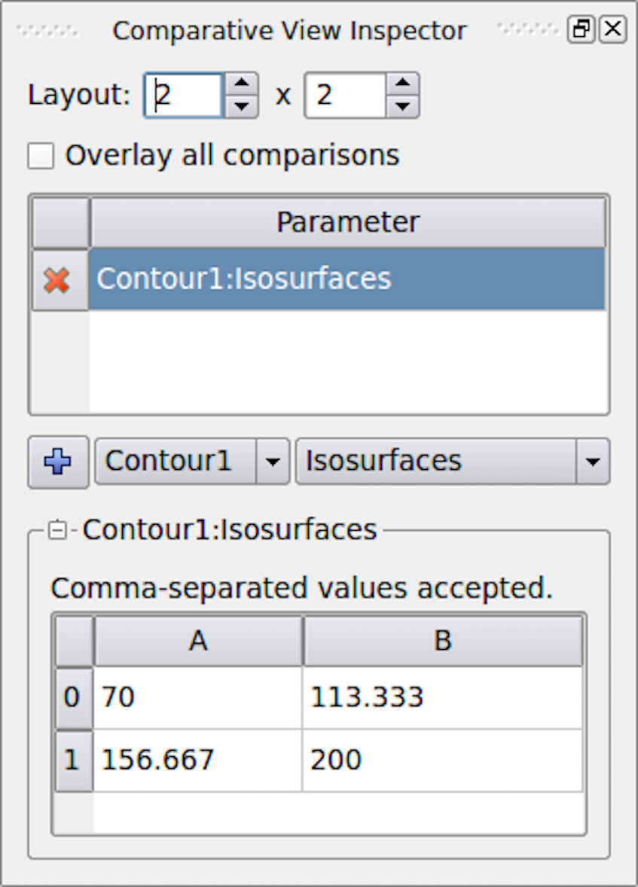
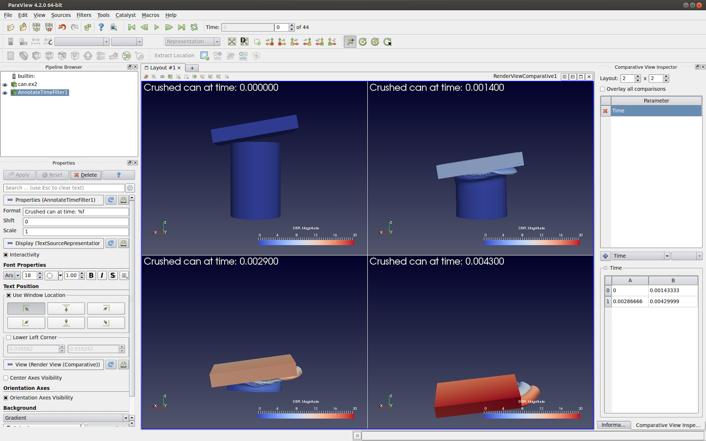
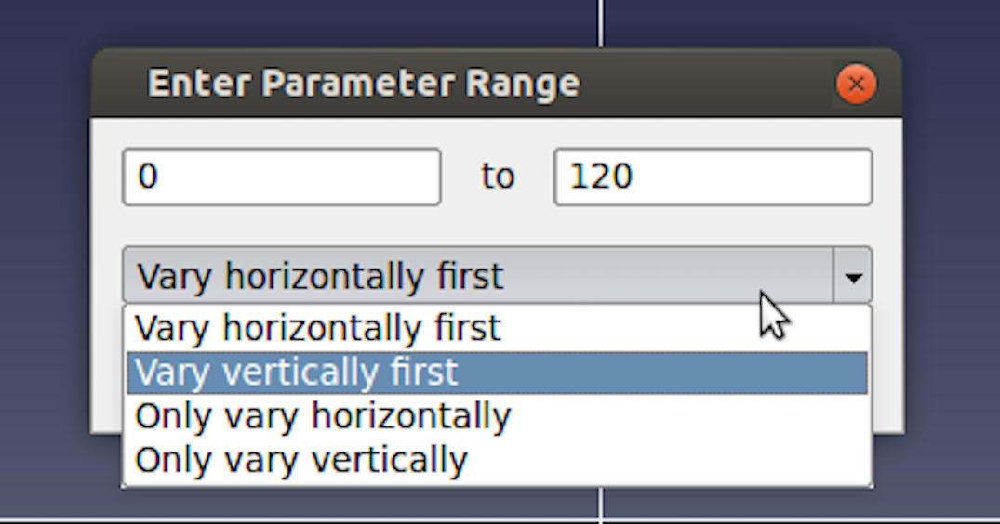

.. include:: ../macros.hrst
.. include:: ../abbreviations.hrst

.. _chapter:ComparativeVisualization:

Comparative visualization
#########################

Comparative visualization in |ParaView| refers to the ability to create
side-by-side visualizations for comparing with one another. In its most
basic form, you can indeed use |ParaView|'s ability to show multiple views side by
side to set up simultaneous visualizations. But, that can get cumbersome too
quickly. Let's take a look at a simple example: Let's say you want to do a parameter
study where you want to compare isosurfaces generated by a set of isovalues in a
dataset. To set up such a visualization, you'll need to first create as many
``Render View`` :index:`\ <Render View>`\ s as isovalues. Then, create just as many  ``Contour`` :index:`\ <Contour>`\  filters,
setting each one up with a right isovalue for the contour to generate and
display the result in one of the views. As the number of isovalues increases,
you can see how this can get tedious. It is highly error prone, as you need to
keep track of which view shows which isovalue. Now, imagine after having set up
the entire visualization that you need to change the  ``Representation`` :index:`\ <Representation>`\  type for
all the of the isosurfaces to  ``Wireframe`` :index:`\ <Wireframe>`\ !

``Comparative View`` :index:`\ <Comparative View>`\ s were designed to handle such use-cases. Instead of
creating separate views, you create a single view  ``Render View
(Comparative)`` :index:`\ <Render View
(Comparative)>`\ . The view itself comprises of a configurable
:math:`m\times n`  ``Render View`` :index:`\ <Render View>`\ s. Any data that you show in this view gets shown in
all the internal views simultaneously. Any display property changes, such as
scalar coloring and representation type are also maintained consistently between
these internal views. The interactions in the internal views are linked, so when
you interact with one, all other views update as well. While this is all
nice and well, the real power of  ``Comparative View`` :index:`\ <Comparative View>`\ s becomes apparent
when you set up a parameter to vary across the views. This parameter can be
any of the properties on the pipeline modules such as filter properties and
opacity, or it could be the data time. Each of these internal views will
now render the result obtained by setting the parameter as per your selection.
Going back to our original example, we will create a single  ``Contour`` :index:`\ <Contour>`\  filter
that we show in  ``Render View (Comparative)`` :index:`\ <Render View (Comparative)>`\  with as many internal views as
the isovalue to compare. Next, we will set up a parameter study for varying the
``Isosurfaces`` :index:`\ <Isosurfaces>`\  property on the  ``Contour`` :index:`\ <Contour>`\  filter, and, viola! The view will
generate the comparative visualization for us!

In this chapter, we look at how to configure this view and how to set these
parameters to compare. We limit our discussion to  ``Render View
(Comparative)`` :index:`\ <Render View
(Comparative)>`\ . However, the same principles are applicable to other comparative
views, including  ``Bar Chart View (Comparative)`` :index:`\ <Bar Chart View (Comparative)>`\  and  ``Line Chart View
(Comparative)`` :index:`\ <Line Chart View
(Comparative)>`\ .

.. figure:: ../images/ComparativeRenderView.png
    :name: fig:ComparativeRenderView
    :width: 80%
    :align: center
    
    ``Render View (Comparative)`` :index:`\ <Render View (Comparative)>`\  in |paraview| showing a
    parameter study. In this case, we are comparing the visualization generated
    using different isovalues for the  ``Contour`` :index:`\ <Contour>`\  filter. The  ``Comparative View
    Inspector`` :index:`\ <Comparative View Inspector>`\  dockpanel (on the right) is used to configure the parameter study.

Setting up a comparative view
=============================

To create ``Render View (Comparative)`` :index:`\ <Render View (Comparative)>`\  in |paraview|, split or
close the active view and select  ``Render View (Comparative)`` :index:`\ <Render View (Comparative)>`\  from the new
view creation widget. |paraview| will immediately show four  ``Render View`` :index:`\ <Render View>`\ s 
laid out in a :math:`2\times 2` grid. While you cannot resize these internal views,
notice that you can still split the view frame and create other views if
needed.

The  ``Properties`` :index:`\ <Properties>`\  panel will show properties similar to those available on the
``Render View`` :index:`\ <Render View>`\  under the  ``View`` :index:`\ <View>`\  properties section. If you change any of
these properties, they will affect all these internal views, e.g., setting the
``Background`` :index:`\ <Background>`\  color to  ``Gradient`` :index:`\ <Gradient>`\  will make all the views show a gradient
background.

    ``Comparative View Inspector`` :index:`\ <Comparative View Inspector>`\  in |paraview| used to configure the active comparative view.

To configure the comparative view itself, you must to use the
``Comparative View Inspector`` :index:`\ <Comparative View Inspector>`\  ( :numref:`fig:ComparativeViewInspector`)
accessible from the :guilabel:`View` menu. The
``Comparative View Inspector`` :index:`\ <Comparative View Inspector>`\  is a dockable panel that is enabled when the
active view is a comparative view.

To change how many internal views are used in the active comparative view and
how they are laid out, use the  ``Layout`` :index:`\ <Layout>`\ . The first value is the number of
views in the horizontal direction and the second is the count in the vertical
direction.

Besides doing a parameter study in side-by-side views, you can also show all the
results in a single view. For that, simply check the  
``Overlay all comparisons`` :index:`\ <Overlay all comparisons>`\  
checkbox. When checked, instead of getting a grid of :math:`m\times n`
views, you will only see one view with all visible data displayed :math:`m\times n`
times.

To show data in this view is the same as any other view: Make this view active and
use the  ``Pipeline Browser`` :index:`\ <Pipeline Browser>`\  to toggle the eyeball icons to show data produced
by the selected pipeline module(s). Showing any dataset in this view will
result in the data being shown in all the internal views simultaneously. As is true with
``View`` :index:`\ <View>`\  properties, with  ``Display`` :index:`\ <Display>`\  properties, changing
``Coloring`` :index:`\ <Coloring>`\ ,  ``Styling`` :index:`\ <Styling>`\ , or any other properties will reflect in all
internal views.

Since the cameras among the internal views are automatically linked, if you
interact with one of the views, all views will also update simultaneously when
you release the mouse button.

Setting up a parameter study
============================

    ``Render View (Comparative)`` :index:`\ <Render View (Comparative)>`\  with  ``Annotate Time`` :index:`\ <Annotate Time>`\  filter showing
    the time for each of the views. In this case, the parameter study is varying
    ``Time`` :index:`\ <Time>`\  across the views.

To understand how to setup a parameter study, let's go back to our original
example. Our visualization pipeline is simply
``Wavelet`` :index:`\ <Wavelet>`\ :math:`\rightarrow` ``Contour`` :index:`\ <Contour>`\  (assuming default property values), and we
are showing the result from the  ``Contour`` :index:`\ <Contour>`\  filter in the :math:`2 \times 2`  ``Render View
(Comparative)`` :index:`\ <Render View (Comparative)>`\  with  ``Overlay all comparisons`` :index:`\ <Overlay all comparisons>`\  unchecked.

Now, we want to vary the  ``Isosurfaces`` :index:`\ <Isosurfaces>`\  property value for the visualization
in each of the internal views. That's our parameter to study. Since that's a
property on the  ``Contour`` :index:`\ <Contour>`\  filter, we select the  ``Contour`` :index:`\ <Contour>`\  filter instance.
Then, its property  ``Isosurfaces`` :index:`\ <Isosurfaces>`\  is in the parameter selection
combo-boxes. To add the parameter to the study, you must hit the
|pqPlus16| button.

The parameter  ``Contour1:Isosurfaces`` :index:`\ <Contour1:Isosurfaces>`\  will then show up in the  ``Parameter`` :index:`\ <Parameter>`\ 
list above the combo-boxes. You can delete this parameter by using the
|pqDelete32| button next to the parameter name.

.. admonition:: **Did you know?**
  :class: tip

  Notice how this mechanism for setting up a parameter study is similar to
  how animations are set up. In fact, under the cover, the two mechanisms are not
  that different, and they share a lot of implementation code.

Simultaneously, the table widget below the combo-boxes is populated with a
default set of values for the  ``Isosurfaces`` :index:`\ <Isosurfaces>`\ . This is where you specify the
parameter values for each of the views. The location of the views matches the
location in the table. Hence, :math:`0-A` is the top-left view, :math:`0-B` is the second
view from the left in the topmost row, and so on. The parameter value at a
specific location in the table is the value used to generate the visualization
in the corresponding view.

To change the parameter (in our case  ``Isosurfaces`` :index:`\ <Isosurfaces>`\ ) value, you can double
click on the cell in the table and change it one at a time. Also, to make it
easier to fill the cells with a range of values, you can click and drag over
multiple cells. When you release the mouse, a dialog will prompt you to enter
the data value range ( :numref:`fig:ComparativeViewRangeDialog`).
In case you selected a combination of rows and columns,
the dialog will also let you select in which direction the parameter is varied
using the range specified. You can choose to vary the parameter horizontally
first, vertically first, or only along one of the directions while keeping the
other constant. This is useful when doing a study with multiple parameters.

    Dialog used to select a range of parameter values and control how to vary them in |paraview|.

As soon as you change the parameter values, the view will update to reflect the
change.

Adding annotations
==================

You add annotations like color legends, text, and cube-axes
exactly as you would with a regular  ``Render View`` :index:`\ <Render View>`\ . As with other
properties, annotations will show up in all of the internal views.

.. admonition:: **Did you know?**
  :class: tip

  You can use the  ``Annotate Time`` :index:`\ <Annotate Time>`\  source or filter to show the data time or
  the view time in each of the internal views. If  ``Time`` :index:`\ <Time>`\  is one of the
  parameters in your study, the text will reflect the time values for each of
  the individual views, as expected ( :numref:`fig:ComparativeViewWithTime`)!
