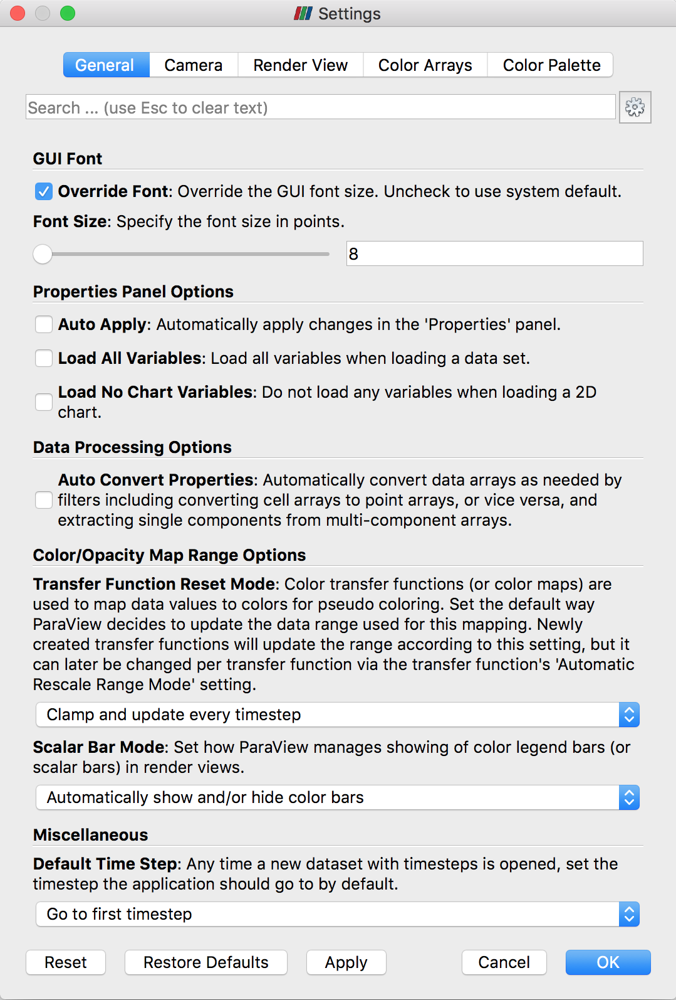
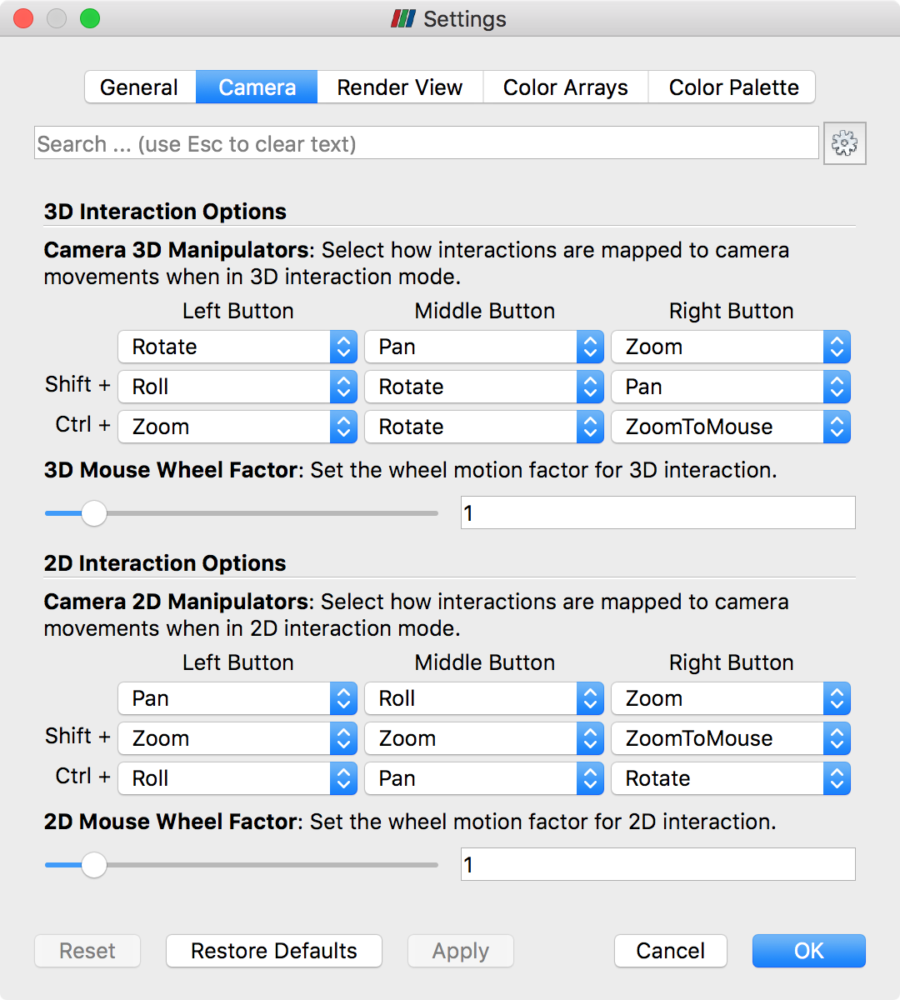
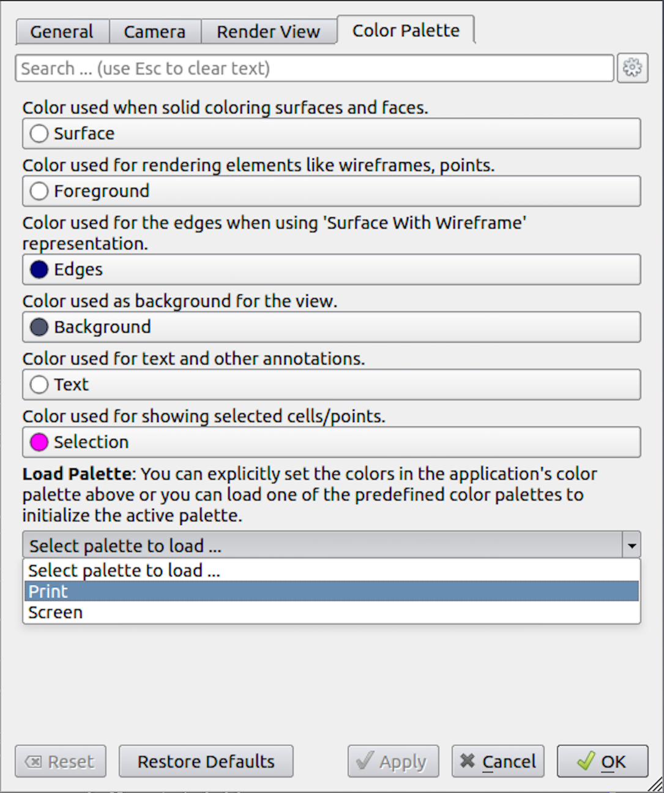
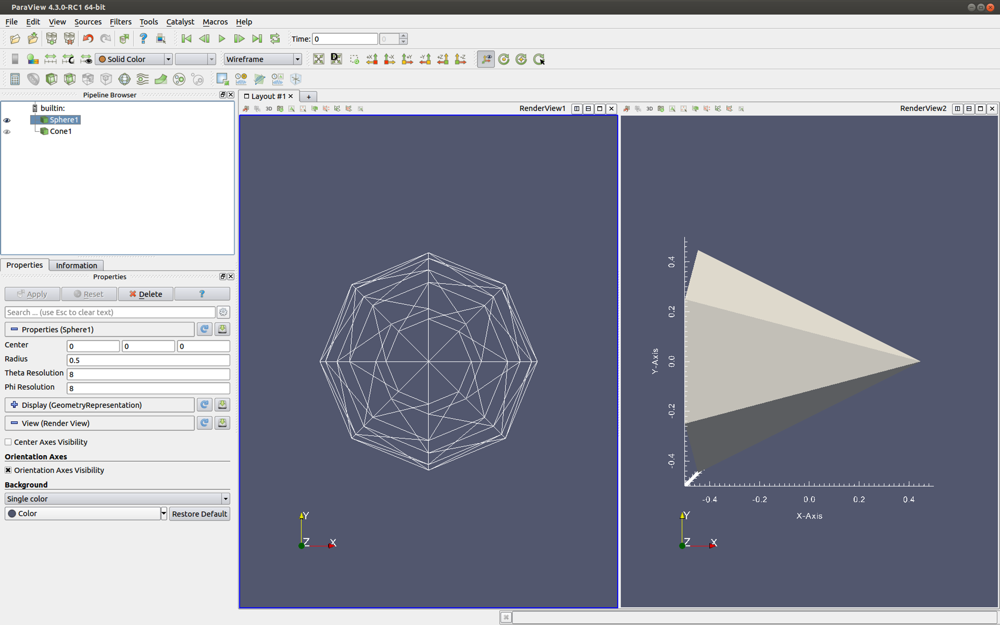
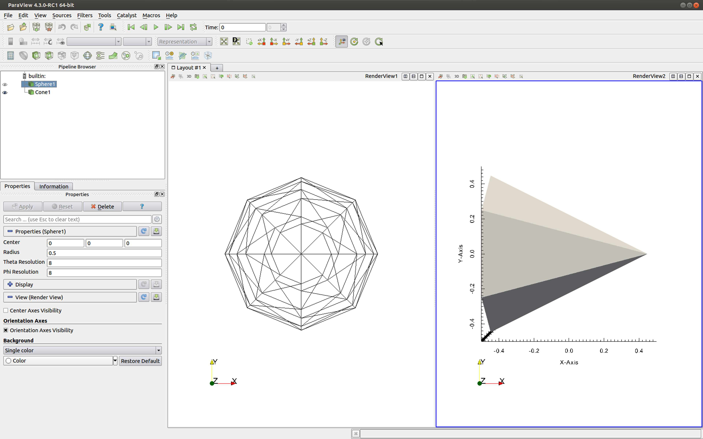
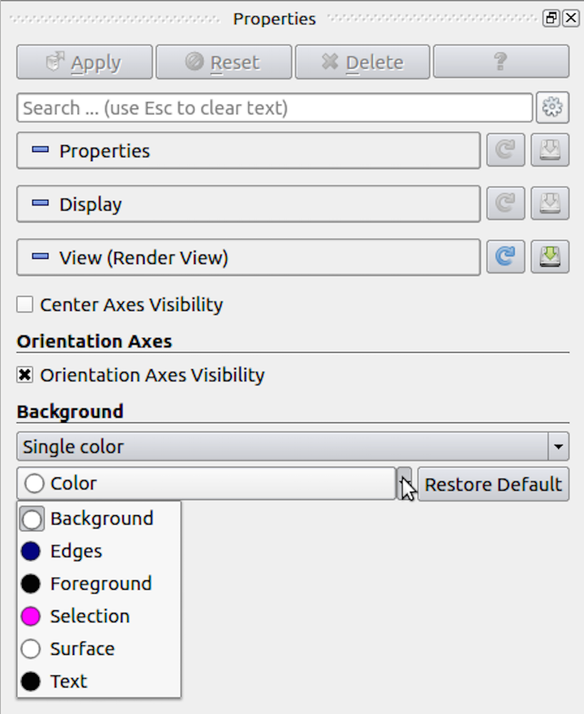
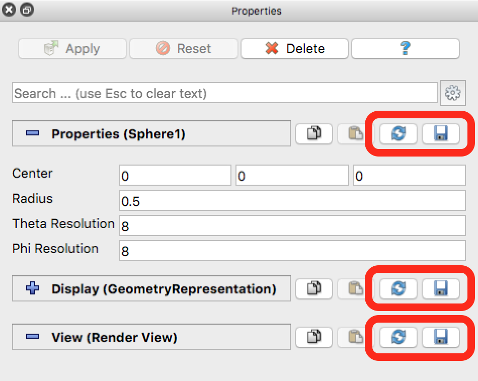

.. include:: ../macros.hrst
.. include:: ../abbreviations.hrst

.. used throughout the chapter

.. |pqAdvanced26| image:: ../images/pqAdvanced26.png
                  :width: 0.5cm

.. _chapter:CustomizingParaView:

Customizing ParaView
####################

|ParaView| can be customized in a number of ways to tailor it to your
preferences and needs. Customization options include setting general
application behavior, customizing default property values used for filters,
representations, and views, and customizing aspects of the |paraview| client.
This chapter describes the different ways to customize |ParaView|.

.. _sec:Settings:

Settings
========

:index:`\ <Settings>`\ 
As with any large application, |paraview| provides mechanisms to customize some
of its application behavior. These are referred to as  **application
settings** :index:`\ <application
settings>`\ . or just **settings**. Such settings can be changed using the  ``Settings`` :index:`\ <Settings>`\  dialog,
which is accessed from  the :guilabel:`Edit > Settings` menu (:guilabel:`ParaView >
Preferences` on the Mac). We have seen parts of this dialog earlier, e.g., in
:numref:`sec:PropertiesPanelLayoutSettings`,
:numref:`sec:BasicRenderingSettings`, and :numref:`sec:ParallelRenderParameters`. In
this section, we will take a closer look at some of the other options available
in this dialog.

The  ``Settings`` :index:`\ <Settings>`\  dialog is split into several tabs. The  ``General`` :index:`\ <General>`\  tab
consolidates most of the miscellaneous settings. The  ``Camera`` :index:`\ <Camera>`\  tab enables you
to change the mouse interaction mappings for the  ``Render View`` :index:`\ <Render View>`\  and similar
views. The  ``Render View`` :index:`\ <Render View>`\  tab, which we saw earlier in
s :numref:`sec:BasicRenderingSettings`
and :numref:`sec:ParallelRenderParameters`, provides options in regards to rendering in
``Render View`` :index:`\ <Render View>`\  and similar views. The  ``Color Palette`` :index:`\ <Color Palette>`\  tab is used to change
the active color palette.

Using this dialog is not much different than the  ``Properties`` :index:`\ <Properties>`\  panel. You have
the  ``Search`` :index:`\ <Search>`\  box at the top, which allows you to search properties matching
the input text ( :numref:`sec:PropertiesPanel:SearchBox`). The
|pqAdvanced26| button can be used to toggle between default and
advanced modes.

To apply the changes made to any of the settings, use the  ``Apply`` :index:`\ <Apply>`\  or  ``OK`` :index:`\ <OK>`\ 
buttons.  ``OK`` :index:`\ <OK>`\  will apply the changes and close the dialog, while  ``Cancel`` :index:`\ <Cancel>`\ 
will reject any changes made and close the dialog. Any changes made to
the options in this dialog are persistent across sessions. That is, the next time you
launch |paraview|, you'll still be using the same settings chosen earlier. To
revert to the default, use the  ``Restore Defaults`` :index:`\ <Restore Defaults>`\  button. You can also manually
edit the setting file as in  :numref:`sec:ConfiguringDefaultSettingsJSON`.
Furthermore, site maintainers can provide site-wide defaults for these, as is
explained in  :numref:`sec:ConfiguringDefaultSettingsSiteWide`.

Next, we will see some of the important options available. Those that are only
available in the advanced mode are indicated as such using the
|pqAdvanced26| icon. You will either need to toggle on the
advanced options with the |pqAdvanced26| button or search for the
option using the  ``Search`` :index:`\ <Search>`\  box.

.. _sec:GeneralSettings:

``General`` settings
^^^^^^^^^^^^^^^^^^^^

:index:`\ <General Settings>`\ 

    ``Settings`` :index:`\ <Settings>`\  dialog in |paraview| showing the  ``General`` :index:`\ <General>`\  settings tab.

* ``General Options`` :index:`\ <General Options>`\

  - ``Show Welcome Dialog`` :index:`\ <Show Welcome Dialog>`\ : Uncheck this to not show the welcome screen at
    application startup. You will need to restart |paraview| to see the effect.
    |pqAdvanced26|

  - ``Show Save State On Exit`` :index:`\ <Show Save State On Exit>`\ : When this is checked |paraview| will prompt you
    to save a state file when you exit the application. |pqAdvanced26|

  - ``Crash Recovery`` :index:`\ <Crash Recovery>`\ : When this is checked, |paraview| will intermittently
    save a backup state file as you make changes in the visualization pipeline.
    If |paraview| crashes for some reason, then when you relaunch |paraview|, it
    will provide you with a choice to load the backup state saved before the crash
    occurred. This is not $100\%$ reliable, but some users may find it useful to
    avoid losing their visualization state due to a crash. |pqAdvanced26|

  - ``Force Single Column Menus`` :index:`\ <Force Single Column Menus>`\ : On platforms that support multicolumn menus,
    ensure all menu items are selectable on low-resolution screens.

* ``GUI Font`` :index:`\ <GUI Font>`\

  - ``Override Font`` :index:`\ <Override Font>`\ : When checked, use a custom font size for the user interface.
    This overrides the system default font size.
  - ``Font Size`` :index:`\ `\ : The size of the font to use for UI elements.

* ``View Options`` :index:`\ <View Options>`\

  - ``Default View Type`` :index:`\ <Default View Type>`\ : When |paraview| starts up, it
    creates  ``Render View`` :index:`\ <Render View>`\  by default. You can use this option to change the
    type of the view that is created by default, instead of the  ``Render View`` :index:`\ <Render View>`\ .
    You can even pick ``None`` if you don't want to create any view by
    default. |pqAdvanced26|

* ``Properties Panel Options`` :index:`\ <Properties Panel Options>`\

  - ``Auto Apply`` :index:`\ <Auto Apply>`\ : When checked, the  ``Properties`` :index:`\ <Properties>`\  panel will
    automatically apply any changes you make to the properties without requiring you
    to click the  ``Apply`` :index:`\ <Apply>`\  button. The same setting can also be toggled using the
    |pqAdvanced26| button in the  ``Main Controls`` :index:`\ <Main Controls>`\  toolbar.
  - ``Auto Apply Active Only`` :index:`\ <Auto Apply Active Only>`\ : This limits the auto-applying to the properties
    on the active source alone.
    |pqAdvanced26|
  - ``Properties Panel Mode`` :index:`\ <Properties Panel Mode>`\ : 
    This allows you to split the  ``Properties`` :index:`\ <Properties>`\ 
    panel into separate panels as described in :numref:`sec:PropertiesPanelLayoutSettings`.  |pqAdvanced26|

* ``Data Processing Options`` :index:`\ <Data Processing Options>`\

  - ``Auto Convert Properties`` :index:`\ <Auto Convert Properties>`\ : Several filters only work on one type of
    array, e.g., point data arrays or cell data arrays. Before using such filters,
    you are expected to apply the  ``Point Data To Cell Data`` :index:`\ <Point Data To Cell Data>`\  or  ``Cell Data To
    Point Data`` :index:`\ <Cell Data To
    Point Data>`\  filters. To avoid having to add these filters explicitly, you can
    check this checkbox. When checked, |ParaView| will automatically convert data
    arrays as needed by filters, including converting cell array to point arrays
    and vice-versa, as well as extracting a single component from a
    multi-component array.

* ``Color/Opacity Map Range Options`` :index:`\ <Color/Opacity Map Range Options>`\

  - ``Transfer Function Reset Mode`` :index:`\ <Transfer Function Reset Mode>`\ : This setting controls the initial
    settings for how |ParaView|
    will reset the ranges for color and opacity maps (or transfer functions). This
    sets the initial value of the  ``Automatic Rescale Range Mode`` :index:`\ <Automatic Rescale Range Mode>`\  for newly created
    color/opacity maps ( :numref:`sec:ColorMapping:MappingData`). This setting can
    be changed on a per-color map basis after the color map has been created.

  - ``Scalar Bar Mode`` :index:`\ <Scalar Bar Mode>`\ : This settings controls how |paraview|
    manages showing the color legend (or scalar bar) in  ``Render View`` :index:`\ <Render View>`\  and
    similar views.

* ``Default Time Step`` :index:`\ <Default Time Step>`\
  Whenever a dataset with timesteps is opened, this setting controls how
  |paraview| will update the current time shown by the application. You can choose
  between ``Leave current time unchanged, if possible``, ``Go to
  first timestep``, and ``Go to last timestep``.

* ``Animation`` :index:`\ <Animation>`\

  - ``Cache Geometry For Animation`` :index:`\ <Cache Geometry For Animation>`\ : This enables caching of geometry when
    playing animations to attempt to speed up animation playback in a loop. When
    caching is enabled, data ranges reported by the  ``Information`` :index:`\ <Information>`\  panel and
    others can be incorrect, since the pipeline may not have updated.
    |pqAdvanced26|
  - ``Animation Geometry Cache Limit`` :index:`\ <Animation Geometry Cache Limit>`\ : When animation caching is enabled,
    this setting controls how much geometry (in kilobytes) can be cached by any
    rank. As soon as a rank's cache size reaches this limit, |ParaView| will no
    longer cache the remaining timesteps.
    |pqAdvanced26|
  - ``Animation Time Notation`` :index:`\ <Animation Time Notation>`\ : Sets the display notation for the time in
    the annotation toolbar. Options are  ``Mixed`` :index:`\ <Mixed>`\ ,  ``Scientific`` :index:`\ <Scientific>`\ , 
    and  ``Fixed`` :index:`\ <Fixed>`\ .
  - ``Animation Time Precision`` :index:`\ <Animation Time Precision>`\ : Sets the number of digits displayed in the
    time in the animation toolbar.

* ``Maximum Number of Data Representation Labels`` :index:`\ <Maximum Number of Data Representation Labels>`\
  When a selection is labeled by data attributes this is the maximum number of labels
  to use.  When the number of points/cells to label is above this value then a subset
  of this many will be labeled instead. Too many overlapping labels becomes illegible,
  so this is set to 100 by default.

.. %\item[ ``Miscellaneous`` :index:`\ <Miscellaneous>`\ ]~
   %  \begin{itemize}
   %  \item  ``Inherit Representation Properties`` :index:`\ <Inherit Representation Properties>`\ : Set whether representations try
   %  to maintain properties from an input representation, if present. For example,
   %  if you  ``Transform`` :index:`\ <Transform>`\  the representation for a source, then any filter that
   %  you connect to it and show in the same view will also get the same
   %  transformation.
   %  \icon{Images/pqAdvanced26.png}
   %  \end{itemize}

``Camera`` settings
^^^^^^^^^^^^^^^^^^^

:index:`\ <Camera Settings>`\ 

    ``Settings`` :index:`\ <Settings>`\  dialog in |paraview| showing the  ``Camera`` :index:`\ <Camera>`\  settings tab.

This tab allows you to control how you can interact in  ``Render View`` :index:`\ <Render View>`\  and
similar views. Basically, you are setting up a mapping between each of the mouse
buttons and keyboard modifiers, and the available interaction types including
``Rotate``, ``Pan``, ``Zoom``, etc. The dialog allows you to set
the interaction mapping separately for 3D and 2D interaction modes
(see  :numref:`sec:RenderView:Interactions`).

``Render View`` settings
^^^^^^^^^^^^^^^^^^^^^^^^

Refer to :numref:`sec:BasicRenderingSettings` and
:numref:`sec:ParallelRenderParameters` for various options available on the
``Render View`` :index:`\ <Render View>`\  tab.

``Color Palette``
^^^^^^^^^^^^^^^^^

    ``Settings`` :index:`\ <Settings>`\  dialog in |paraview| showing the  ``Color Palette`` :index:`\ <Color Palette>`\  settings tab.

The  ``Color Palette`` :index:`\ <Color Palette>`\  tab ( :numref:`fig:SettingsDialogColorPalette`)
allows you to change the colors in the active color
palette. The tab lists the available color categories  ``Surface`` :index:`\ <Surface>`\ ,
``Foreground`` :index:`\ <Foreground>`\ ,
``Edges`` :index:`\ <Edges>`\ ,
``Background`` :index:`\ <Background>`\ , 
``Text`` :index:`\ <Text>`\ , and  ``Selection`` :index:`\ <Selection>`\ . You
can manually set colors to use for each of these categories or load one of the
predefined palettes using the  ``Load Palette`` :index:`\ <Load Palette>`\  option. To understand
**color palettes** :index:`\ <color palettes>`\ , let's look at an example.

Let's start |paraview| and split the active view to create two  ``Render View`` :index:`\ <Render View>`\ 
instances side by side. You may want to start |paraview| with the ``-dr``
command line argument to stop any of your current settings from interfering
with this demo. Next, show  ``Sphere`` :index:`\ <Sphere>`\  as  ``Wireframe`` :index:`\ <Wireframe>`\  in the view
on the left, and show  ``Cone`` :index:`\ <Cone>`\  as  ``Surface`` :index:`\ <Surface>`\  in the view on the right.
Also, turn on  ``Cube Axis`` :index:`\ <Cube Axis>`\  for  ``Cone`` :index:`\ <Cone>`\ . You will see something like
:numref:`fig:ColorPaletteDemo` (top).

    The effect of loading the  ``Print`` :index:`\ <Print>`\  color palette as
    the active palette. The top is the original visualization and the bottom shows the
    result after loading the  ``Print`` :index:`\ <Print>`\  palette.

Now let's say you want to generate an image for printing. Typically, for
printing, you'd want the background color to be white, while the wireframes and
annotations to be colored black. To do that, one way is to go change each of the
colors for each each of the views, displays and cube-axes. You can imagine how
tedious that will get especially with larger pipelines. Alternatively, using the
``Settings`` :index:`\ <Settings>`\  dialog, change the active color palette to  ``Print`` :index:`\ <Print>`\  as shown in
:numref:`fig:SettingsDialogColorPalette` and then click  ``OK`` :index:`\ <OK>`\  or  ``Apply`` :index:`\ <Apply>`\ .
The visualization will immediately change to something like
:numref:`fig:ColorPaletteDemo` (bottom).

Essentially, |ParaView| allows you to *link* any color property to one of
the color categories. When the color palette is changed, any color property
linked to a palette category will also be automatically updated to match the category color.
:numref:`fig:LinkToColorPalette` shows how to link a color
property to a color palette category in the  ``Properties`` :index:`\ <Properties>`\  panel. Use the tiny
drop-down menu marker to make the menu pop up that shows the color palette categories.
Select any one of them to link that property with the category. The link is
automatically severed if you manually change the color by simply clicking on the
button.

    Popup menu allows you to link a color property to a color palette
    category in the  ``Properties`` :index:`\ <Properties>`\  panel.}

.. _sec:CustomDefaultSettings:

Custom default settings
=======================

The section describes how to specify custom default settings for the
properties of sources, readers, filters, representations, and views.
This can be used to specify, for example, the default background color
for new views, whether a gradient background should be used, the
resolution of a sphere source, which data arrays to load from a
particular file format, and the default setting for almost any other
object property.

The same custom defaults are used across all the |ParaView|
executables. This means that custom defaults specified in the
|paraview| executable are also used as defaults in
|pvpython| and |pvbatch|, which makes it easier
to set up a visualization with |paraview| and use
|pvpython| or |pvbatch| to generate an animation
from time-series data, for example.

Customizing defaults for properties
^^^^^^^^^^^^^^^^^^^^^^^^^^^^^^^^^^^

The Properties panel in |paraview| has three sections,
``Properties`` :index:`\ <Properties>`\ ,
``Display`` :index:`\ <Display>`\ , and  ``View`` :index:`\ <View>`\ . Each section has two
buttons. These buttons are circled in red in
:numref:`fig:SaveRestoreSettingsButtons`. The button with the disk
icon is used to save the current property values in that section that
have been applied with the  ``Apply`` :index:`\ <Apply>`\  button. Property values that
have been changed but not applied with the  ``Apply`` :index:`\ <Apply>`\  button will not
be saved as custom default settings.

The button with the circular arrow (or reload icon) is used to restore
any custom property settings for the object to |ParaView|'s application
defaults. Once you save the current property settings as defaults, those
values will be treated as the defaults from then on until you change
them to another value or reset them. The saved defaults are written to
a configuration file so that they are available when you close and
launch |ParaView| again.

    Buttons for saving and restoring default property values in the  ``Properties`` :index:`\ <Properties>`\  panel.

You can undo your changes to the default property values by clicking
on the reload button. This will reset the current view property values
to |paraview|'s application defaults. To fully restore
|paraview|'s default values, you need to click the save
button again. If you don't, the restored default values will be
applied only to the current object, and new instances of that object
will have the custom default values that were saved the last time you
clicked the save button.

Example: specifying a custom background color
^^^^^^^^^^^^^^^^^^^^^^^^^^^^^^^^^^^^^^^^^^^^^

Suppose you want to change the default background color in the
``Render View`` :index:`\ <Render View>`\ . To do this, scroll down to the  ``View`` :index:`\ <View>`\  section of
the  ``Properties`` :index:`\ <Properties>`\  panel and click on the combo box that shows the
current background color. Select a new color, and click  ``OK`` :index:`\ <OK>`\ . Next,
scroll up to the  ``View (Render View)`` :index:`\ <View (Render View)>`\  section header and click on
the disk button to the right of the header. This will save the new
background color as the default background color for new views. To see
this, click on the  ``+`` :index:`\ <+>`\  sign next to the tab above the 3D view to
create a new layout. Click on the  ``Render View`` :index:`\ <Render View>`\  button. A new
render view will be created with the custom background color you just
saved as default.

.. _sec:ConfiguringDefaultSettingsJSON:

Configuring default settings with JSON
^^^^^^^^^^^^^^^^^^^^^^^^^^^^^^^^^^^^^^

Custom default settings are stored in a text file in the |JSON|
format. We recommend to use the user interface
in |paraview| to set most default values, but it is
possible to set them by editing the |JSON| settings file directly. It is
always a good idea to make a backup copy of a settings file prior to
manual editing.

The |ParaView| executables read from and write to a file named
``ParaView-UserSettings.json``, which is located in your home
directory on your computer. On Windows, this file is located at
``%APPDATA%/ParaView/ParaView-UserSettings.json``, where the
``APPDATA`` environment variable is usually something like
``C:/Users/USERNAME/AppData/Roaming``, where ``USERNAME`` is
your login name. On Unix-like systems, it is located under
``~/.config/ParaView/ParaView-UserSettings.json``. This file will
exist if you have made any default settings changes through the user
interface in the |paraview| executable. Once set, these
default settings will be available in subsequent versions of |ParaView|.

A simple example of a file that specifies custom default settings is
shown below:

.. code-block:: python

  {
    "sources" : {
      "SphereSource" : {
        "Radius" : 3.5,
        "ThetaResolution" : 32
      },
      "CylinderSource" : {
        "Radius" : 2
      }
    },
    "views" : {
      "RenderView" : {
        "Background" : [0.0, 0.0, 0.0]
      }
    }
  }

Note the hierarchical organization of the file. The first level of the
hierarchy specifies the group to which the object whose settings are
being specified refers ("sources" in this example). The second level
names the object whose settings are being specified. Finally, the
third level specifies the custom default settings themselves. Note
that default values can be set to literal numbers, strings, or arrays
(denoted by comma-separated literals in square brackets).

The names of groups and objects come from the XML proxy definition
files in |ParaView|'s source code in the directory
``ParaView/ParaViewCore/ServerManager/SMApplication/Resources`` 
(``ParaView\ParaViewCore\ServerManager\SMApplication\Resources`` on Windows systems) . The
group name is defined by the ``name`` attribute in a
``ProxyGroup`` element. The object name comes from the
``name`` attribute in the ``Proxy`` element (or elements of
``vtkSMProxy`` subclasses). The property names come from the
``name`` attribute in the ``*Property`` XML elements for the
object.

.. admonition:: **Did you know?**
   :class: tip

   The application-wide settings available in |paraview|
   through the :guilabel:`Edit > Settings` menu are also saved to this user
   settings file. Hence, if you have changed the application settings,
   you will see some entries under a group named "settings".

.. _sec:ConfiguringDefaultSettingsSiteWide:

Configuring site-wide default settings
^^^^^^^^^^^^^^^^^^^^^^^^^^^^^^^^^^^^^^

In addition to individual custom default settings, |ParaView| offers a
way to specify site-wide custom default settings for a |ParaView|
installation. These site-wide custom defaults must be defined in a
|JSON| file with the same structure as the user settings file. In fact,
one way to create a site settings file is to set the custom defaults
desired in |paraview|, close the program, and then copy the
user settings file to the site settings file. The site settings file
must be named ``ParaView-SiteSettings.json``.

The |ParaView| executables will search for the site settings file in
several locations. If you installed |ParaView| in the directory
``INSTALL``, then the |ParaView| executables will search for the
site settings file in these directories in the specified order:

* `INSTALL/share/paraview-X.Y` ( `INSTALL\share\paraview-X.Y` in Windows systems)
* `INSTALL/lib` (`INSTALL\lib` in Windows systems)
* `INSTALL` 
* `INSTALL/..` (`INSTALL/lib` in Windows systems)

where ``X`` is |ParaView|'s major version number and ``Y`` is
the minor version number. |ParaView| executables will search these
directories in the given order, reading in the first
``ParaView-SiteSettings.json`` file it finds. The conventional
location for this kind of configuration file is in the ``share``
directory (the first directory searched), so we recommend placing the
site settings file there.

Custom defaults in the user settings file take precedence over custom
defaults in the site settings. If the same default is specified in
both the ``ParaView-SiteSettings.json`` file and
``ParaView-UserSettings.json`` file in a user's directory, the
default specified in the ``ParaView-UserSettings.json`` file will
be used. This is true for both object property settings and
application-settings set through the :guilabel:`Edit > Settings` menu.

To aid in debugging problems with the site settings file location, you
can define an evironment variable named ``PV_SETTINGS_DEBUG``
to something other than an empty string. This will turn on verbose
output showing where the |ParaView| executables are looking for the site
settings file.
