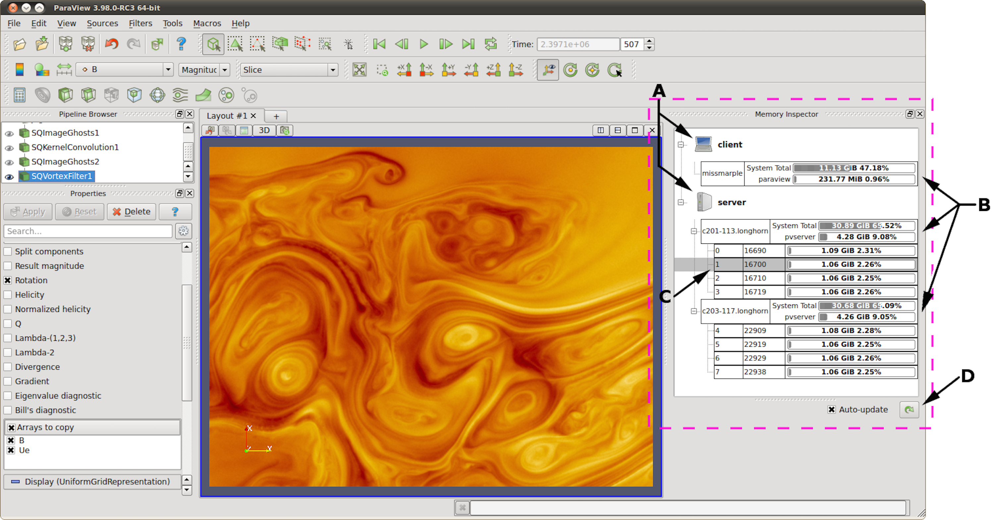
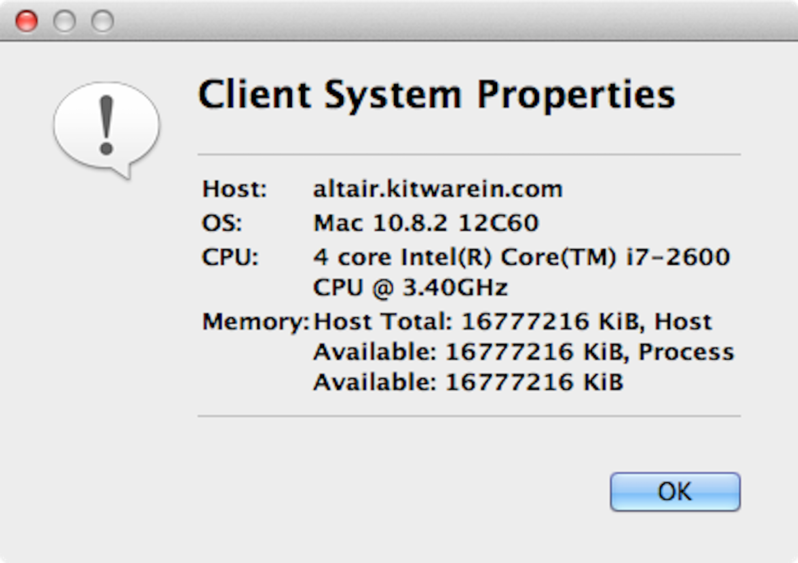
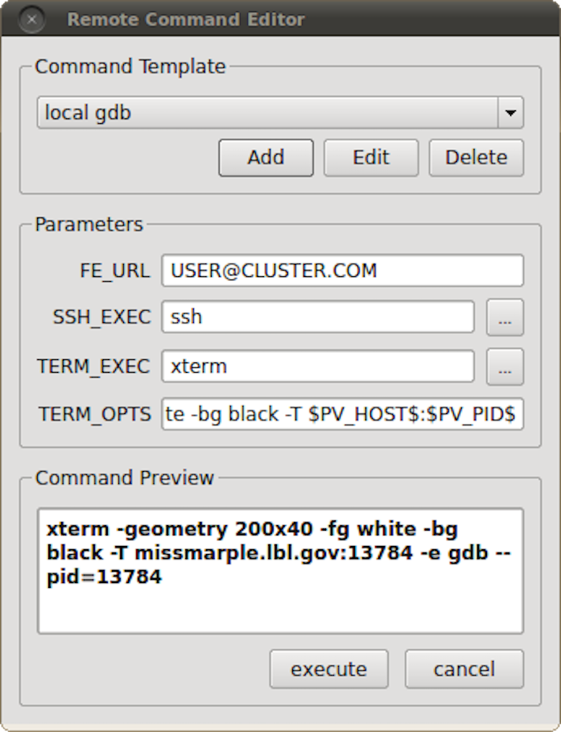

.. include:: ../macros.hrst
.. include:: ../abbreviations.hrst

.. _chapter:MemoryInspector:

Memory Inspector
################

The |ParaView|  ``Memory Inspector`` :index:`\ <Memory Inspector>`\  panel provides users with a convenient way to monitor
|ParaView|'s memory usage during interactive visualization. It also provides developers with a
point-and-click interface for attaching a debugger to local or remote client and
server processes. As explained earlier, both the  ``Information`` :index:`\ <Information>`\  panel and the
``Statistics Inspector`` :index:`\ <Statistics Inspector>`\  are prone to over and under estimate the total memory used
for the current pipeline. The  ``Memory Inspector`` :index:`\ <Memory Inspector>`\  addresses those issues through
direct queries to the operating system. A number of diagnostic statistics are
gathered and reported, including the total memory used by all processes on a
per-host basis, the total cumulative memory use by |ParaView| on a per-host basis,
and the individual per-rank use by each |ParaView| process. When
memory consumption reaches a critical level, either cumulatively on the host
or in an individual rank, the corresponding GUI element will turn red, alerting
you that you are in danger of potentially being shut down. This
gives you a chance to save state and restart the job with more
nodes to avoid losing your work. On the flip side, knowing when you're not
close to using the full capacity of available memory can be useful to conserve
computational resources by running smaller jobs. Of course, the memory foot print
is only one factor in determining the optimal run size.

    The main UI elements of the  ``Memory Inspector`` :index:`\ <Memory Inspector>`\  panel. A: Process Groups,
    B: Per-Host statistics, C: Per-Rank statistics, and D: Update controls.

.. _sec:MemoryInspector:UserInterfaceAndLayout:

User interface and layout
=========================

The  ``Memory Inspector`` :index:`\ <Memory Inspector>`\  panel displays information about the current memory usage
on the client and server hosts.  :numref:`fig:MemoryInspectorUI`
shows the main UI elements labeled A-D.
A number of additional features are provided via specialized context menus
accessible from the Client and Server group, Host, and Rank's UI elements.
The main UI elements are:

A. *Process Groups*

   1. *Client* : There is always a client group that reports statistics
      about the |ParaView| client.

   2. *Server* : When running in client-server mode, a server group
      reports statistics about the hosts where |pvserver| processes are running.

   3. *Data Server* : When running in client-data-render server mode, a
      data server group reports statistics about the hosts where |pvdataserver|
      processes are running.

   4. *Render Server* : When running in client-data-render server mode, a render
      server group reports statistics about the hosts where |pvrenderserver| processes
      are running.

B. *Per-Host Statistics* : Per-host statics are reported for each host
   where a |ParaView| process is running. Hosts are organized by host name, which is
   shown in the first column. Two statics are reported: 1) total memory used by all
   processes on the host and 2) |ParaView|'s cumulative usage on this host. The
   absolute value is printed in a bar that shows the percentage of the total
   available memory used. On systems where job-wide resource limits are enforced, |ParaView|
   is made aware of the limits via the *PV_HOST_MEMORY_LIMIT* environment
   variable, in which case, |ParaView|'s cumulative percent used is computed using the
   smaller of the host total and the resource limit.

C. *Update Controls* : By default, when the panel is visible, memory use
   statistics are updated automatically as pipeline objects are created, modified,
   or destroyed and after the scene is rendered. Updates may be triggered manually
   by using the refresh button. Automatic updates may be disabled by un-checking
   the *Auto-update* check box. Queries to remote systems have proven to be very
   fast even for fairly large jobs. Hence, the auto-update feature is enabled by
   default.

D. *Host Properties Dialog* : The :guilabel:`Host` context menu provides the  
   ``Host Properties`` :index:`\ <Host Properties>`\  dialog, which reports 
   various system details such as the OS version and
   the CPU version, as well as the memory installed and available to the host context and
   process context. While the  ``Memory Inspector`` :index:`\ <Memory Inspector>`\  
   panel reports memory use as a percent of the available in the given context, 
   the  ``Host Properties`` :index:`\ <Host Properties>`\  dialog
   reports the total memory installed and available in each context. Comparing the
   installed and available memory can be used to determine if you are impacted by
   resource limits.

    Host properties dialog.

Advanced debugging features
===========================

Remote commands
^^^^^^^^^^^^^^^

    The remote command dialog.

The  ``Memory Inspector Panel`` :index:`\ <Memory Inspector Panel>`\  provides a remote (or local) command feature, allowing
you to execute a shell command on a given host. This feature is exposed via a
specialized Rank item context menu. Because we have information such as a rank's
process id, individual processes may be targeted. For example, this allows you to
quickly attach a debugger to a server process running on a remote cluster. If
the target rank is not on the same host as the client, then the command is
considered remote. Otherwise, it is considered local. Therefore, remote commands are
executed via ``ssh``
, while local commands are not. A list of command templates is
maintained. In addition to a number of pre-defined command templates, you may
add templates or edit existing ones. The default templates allow you to:

* Attach ``gdb`` to the selected process
* Run top on the host of the selected process
* Send a signal to the selected process

Prior to execution, the selected template is parsed, and a list of special tokens
are replaced with runtime-determined or user-provide values. User-provided
values can be set and modified in the dialog's parameter group. The command,
with tokens replaced, is shown for verification in the dialog's preview pane.

The following tokens are available and may be used in command templates as needed:

#. *$TERM_EXEC$* : The terminal program that will be used to execute
   commands. On Unix systems, xterm is typically used. On Windows systems,
   ``cmd.exe``
   is typically used. If the program is not in the default
   path, then the full path must be specified.

#. *$TERM_OPTS$* : Command line arguments for the terminal program.
   On Unix, these may be used to set the terminals window title, size, colors, and
   so on.

#. *$SSH_EXEC$* : The program to use to execute remote commands. On
   Unix, this is typically ``ssh``. On Windows, one option is
   ``plink.exe``. 
   If the program is not in the default path, then the full
   path must be specified.

#. *$FE_URL$* : Ssh URL to use when the remote processes are on
   compute nodes that are not visible to the outside world. This token is used to
   construct command templates where two ``ssh`` hops are made to execute
   the command.

#. *$PV_HOST$* : The hostname where the selected process is running.
#. *$PV_PID$* : The process-id of the selected process.

Note: On Windows, the debugging tools found in Microsoft's SDK need to be
installed in addition to Visual Studio (e.g., ``windbg.exe``). 
The ``ssh`` program ``plink.exe`` for Windows doesn't parse ANSI
escape codes that are used by Unix shell programs. In general, the Windows-
specific templates need some polishing.

Stack trace signal handler
^^^^^^^^^^^^^^^^^^^^^^^^^^ 

The Process Group's context menu
provides a back trace signal handler option. When enabled, a signal handler is
installed that will catch signals such as SEGV, TERM, INT, and ABORT and that
will print a stack trace before the process exits. Once the signal handler is
enabled, you may trigger a stack trace by explicitly sending a signal. The stack
trace signal handler can be used to collect information about crashes or to
trigger a stack trace during deadlocks when it's not possible to ``ssh``
into compute nodes. Sites that restrict users' ``ssh``
access to compute nodes often provide a way to signal running processes from the
login node. Note that this feature is only available on systems that provide
support for POSIX signals, and we currently only have implemented stack trace
for GNU-compatible compilers.

Compilation and installation considerations
===========================================

If the system on which |ParaView| will run has special resource limits enforced,
such as job-wide memory use limits, or non-standard per-process memory limits,
then the system administrators need to provide this information to the running
instances of |ParaView| via the following environment variables. For example, those
could be set in the batch system launch scripts.

#. *PV_HOST_MEMORY_LIMIT* : For reporting host-wide resource limits.
#. *PV_PROC_MEMORY_LIMIT* : For reporting per-process memory limits.
   that are not enforced via standard Unix resource limits.

A few of the debugging features (such as printing a stack trace) require debug
symbols. These features will work best when |ParaView| is built with
``CMAKE_BUILD_TYPE=Debug`` or, for release builds,
``CMAKE_BUILD_TYPE=RelWithDebugSymbols``.
