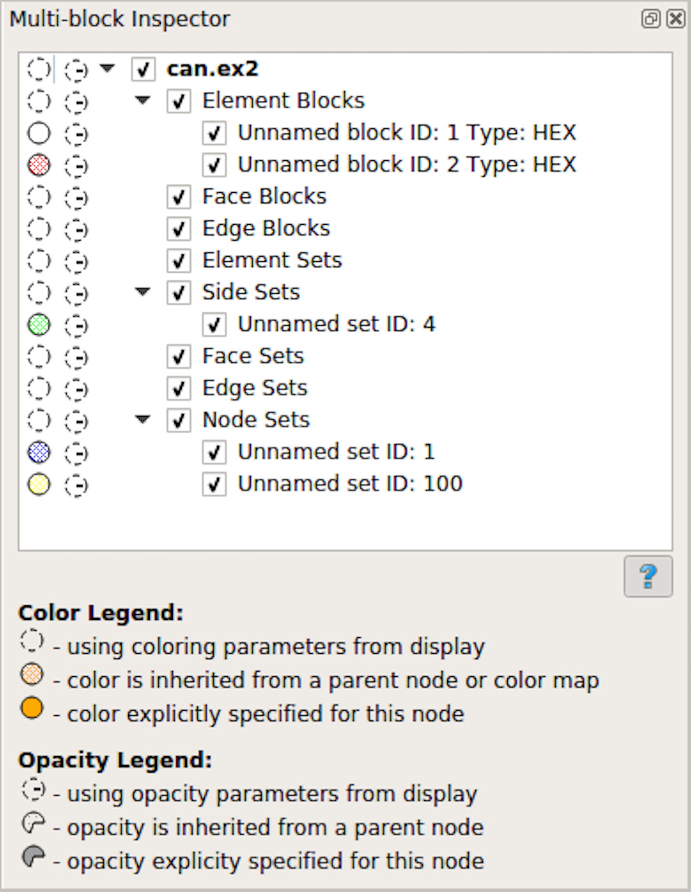
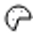
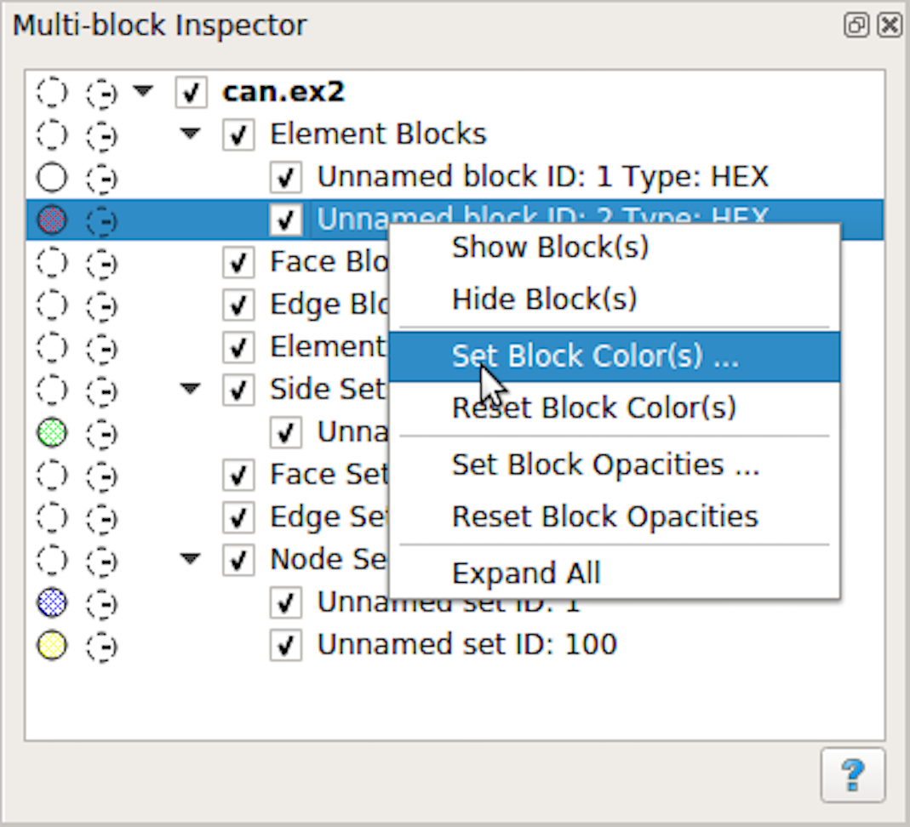
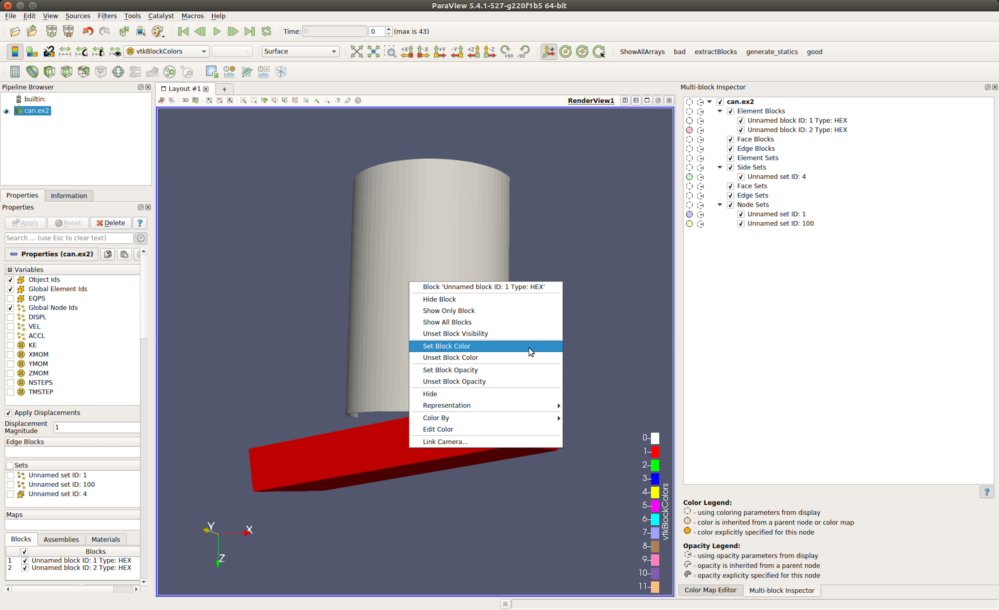
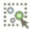

.. include:: ../macros.hrst
.. include:: ../abbreviations.hrst

.. _chapter:MultiblockInspector:

Multiblock Inspector
####################

Composite datasets :numref:`chapter:UnderstandingData` such as multiblock datasets
and AMR are often encountered when visualizing results from several
scientific simulation codes e.g. OpenFOAM, Exodus, etc. Readers for several of
these simulation file formats support selecting which blocks to read.
Additionally, you may want to control display properties such as visibility, opacity,
and color for individual blocks or subtress. You can use the
``Multiblock Inspector`` :index:`\ <Multiblock Inspector>`\  panel for this.

:numref:`fig:MultiblockInspector` shows the  ``Multiblock Inspector`` :index:`\ <Multiblock Inspector>`\  showing the
hieararchy from an Exodus dataset. The panel tracks the active source and reflects the
structure for the data produced by the active source. The display properties reflect
their state in the active view.

    The  ``Multiblock Inspector`` :index:`\ <Multiblock Inspector>`\ 

To show or hide a block you have to click on the checkbox next to the
block name. Toggling the visibility of a non-leaf block, affects the
visibility of the entire subtree.

The first column reflects the color used for the block. The color for a block
can be specified in multiple ways. First, you can choose to not use any block
specific overrides and simply let the default display properties (
:numref:`sec:DisplayingData:DisplayProperties`) affect the
rendering. This is the default behavior. When that is the case for any block,
it is indicated in the color column by an empty dotted circle
|no_color|. Second, you can explicitly override the color to use
for a block or a subtree. To do this, simply double click on the color column
next to the block of interest. This will pop up the color chooser dialog.
Explicitly overridden color for a block is indicated by a solid filled circle
icon |explicit_color| filled with the selected color.
When an explicit color is set on a non-leaf node, all its children (and their
children) inherit that color unless explicitly overridden. For such nodes that
have a color inherited from their parent, we use the dotted-circle icon filled
with a pattern icon |inherited_color|.

The second column reflects the opacity override for the blocks. Similar to
color, the opacity could be simply using value from the display properties
|no_opacity|, or explicitly set
|explicit_opacity|, or inhertied from parent node
|inherited_opacity|.

.. |no_opacity| image:: ../images/no_opacity.png
                :width: 0.5cm

.. admonition:: **Did you know?**
   :class: tip

   In most cases with multiblock datasets, ParaView uses the  ``vtkBlockColors`` :index:`\ <vtkBlockColors>`\ 
   array for coloring. This is an array filled with random values so that each
   block can be colored using a different color. That makes it easier to visually
   see each of the blocks in the view. When in this mode,
   the  ``Multiblock Inspector`` :index:`\ <Multiblock Inspector>`\ 's color column shows the color used for each of
   the blocks using the same icon as the one used
   for inherited colors i.e. |inherited_color|.

You can change colors and opacities for a specific block by double clicking
on the corresponding icon. This allows setting values one at a time. For
specifying color and opacity overrides for multiple elements, you can select the
items and then right click to get the context menu. The context menu allows you
to change these properties for all the selected items, as shown in
:numref:`fig:MultiblockInspectorContextMenu`.

    The  ``Multiblock Inspector`` :index:`\ <Multiblock Inspector>`\  context menu.

Besides using the  ``Multiblock Inspector`` :index:`\ <Multiblock Inspector>`\  to set color and opacity overrides
for blocks, you can also directly changes these parameters from the  
``Render View`` :index:`\ <Render View>`\  itself. 
Simply right-click in the render view on the block of interest and
you'll get a context menu,  :numref:`fig:RenderViewContextMenu`, that allows
changing the block properties and are more.

    Context menu in  ``Render View`` :index:`\ <Render View>`\  can be used to change block display
    properties.

Another useful feature with the  ``Multiblock Inspector`` :index:`\ <Multiblock Inspector>`\  is selection. If you
simply click on any row in the inspector, you will select the block (or
subtree) and the active view will highlight the selected block(s). Conversely,
if you make a block-based selection in the active
``Render View`` :index:`\ <Render View>`\  using |pqSelectBlock24|,
you will see the corresponding blocks highlighted 
in the  ``Multiblock Inspector`` :index:`\ <Multiblock Inspector>`\  panel.

