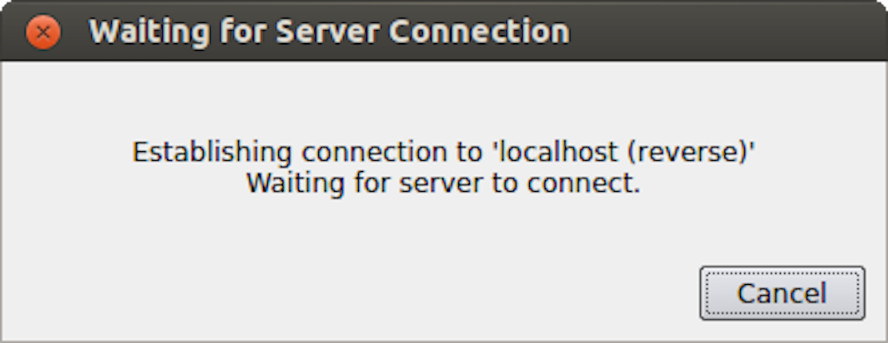

.. include:: ../macros.hrst
.. include:: ../abbreviations.hrst

.. _chapter:ParallelDataVisualization:

Remote and parallel visualization
#################################

One of the goals of the |ParaView| application is enabling data analysis and
visualization for large datasets. |ParaView| was born out of the need for
visualizating simulation results from simulations run on supercomputing
resources that are often too big for a single desktop machine to
handle. To enable interactive visualization of such datasets, |ParaView| uses
remote and/or parallel data processing. The basic concept is that if a
dataset cannot fit on a desktop machine due to memory or other
limitations, we can split the dataset among a cluster of machines,
driven from your desktop. In this chapter, we will look at the basics
of remote and parallel data processing using |ParaView|. For information on
setting up clusters, please refer to the |ParaView|
Wiki :cite:`ParaViewServerSetup`.

.. admonition:: **Did you know?**
  :class: tip

  Remote and parallel processing are often used together, but they refer to
  different concepts, and it is possible to have one without the other.
  
  In the case of ParaView, remote processing refers to the concept of
  having a client, typically |paraview| or |pvpython|, connecting to a |pvserver|, which
  could be running on a different, remote machine. All the data
  processing and, potentially, the rendering can happen on the
  |pvserver|. The client drives the visualization process by
  building the visualization pipeline and viewing the generated results.
  
  Parallel processing refers to a concept where instead of single core
  --- which we call a ``rank`` --- processing the entire dataset, we
  split the dataset among multiple ranks. Typically, an instance of
  |pvserver| runs in parallel on more than one rank. If a
  client is connected to a server that runs in parallel, we are using
  both remote and parallel processing.
  
  In the case of |pvbatch|, we have an application that operates in parallel
  but without a client connection.  This is a case of parallel
  processing without remote processing.

Understanding remote processing
===============================

Let's consider a simple use-case. Let's say you have two computers, one located
at your office and another in your home. The one at the office is a nicer,
beefier machine with larger memory and computing capabilities than the one at
home. That being the case, you often run your simulations on the office
machine, storing the resulting files on the disk attached to your office
machine. When you're at work, to visualize those results, you simply launch
|paraview| and open the data file(s). Now, what if you need to
do the visualization and data analysis from home? You have several options:

* You can copy the data files over to your home machine and then use
  |paraview| to visualize them. This is tedious, however, as you not only 
  have to constantly keep copying/updating your files manually, but your machine
  has poorer performance due to the decreased compute capabilities and memory
  available on it!

* You can use a desktop sharing system like *Remote Desktop* or
  *VNC*, but those can be flaky depending on your network connection.

Alternatively, you can use |ParaView|'s remote processing capabilities. The
concept is fairly simple. You have two separate processes: |pvserver| (which runs
on your work machine) and a |paraview| client (which runs on your home machine).
They communicate with each other over sockets (over an SHH tunnel, if needed).
As far as using |paraview| in this mode, it's no different than how we have been
using it so far -- you create pipelines and then look at the data produced by
those pipelines in views and so on. The pipelines themselves, however, are created
remotely on the |pvserver| process. Thus, the pipelines have access to the disks
on your work machine. The  ``Open File`` :index:`\ <Open File>`\  dialog will in fact browse the file
system on your work machine, i.e., the machine on which |pvserver| is running. Any
filters that you create in your visualization pipeline execute on the
|pvserver|.

While all the data processing happens on the |pvserver|, when it
comes to rendering, |paraview| can be configured to either do the rendering on
the server process and deliver only images to the client (remote rendering)
or to deliver the geometries to be rendered to the client and let it do the
rendering locally (local rendering).
When remote rendering, you'll be using the graphics capabilities on your work
machine (the machine running the |pvserver|). Every time a new rendering needs to
be obtained (for example, when pipeline parameters are changed or you interact
with the camera, etc.), the |pvserver| process will re-render a new image and
deliver that to the client. When local rendering, the geometries to be rendered
are delivered to the client and the client renders those locally. Thus, not all
interactions require server-side processing. Only when the
visualization pipeline is updated does the server need to deliver
updated geometries to the client.

.. %One of the main purposes of |ParaView| is to allow you to create
   %visualizations of large datasets that reside on remote systems
   %without first bringing the data to a local machine. Transferring the
   %data is often slow and wasteful of disk and network resources, and the
   %visualization of large datasets can easily overwhelm the processing
   %and especially memory resources of even high-performance
   %workstations. To overcome these challenges, |ParaView| enables processing
   %data on remote resources closer to where the data resides.
   %
   %To see how |ParaView| enables remote processing and explain where data is
   %stored in the different |ParaView| executables, we refer back to
   % :numref:`chapter:Introduction` where we saw how to create a simple
   %processing and visualization pipeline using |paraview|. In this section, we
   %will create that same pipeline while the |ParaView| client is connected to a
   %remote server. Because |ParaView| was designed from the beginning to support
   %remote processing, most of the steps involved in creating the pipeline
   %are exactly the same as when |ParaView| is used locally without being
   %connected to a remote server.

.. _sec:RemoteVisualization:

Remote visualization in ``paraview``
====================================

Starting a remote server
^^^^^^^^^^^^^^^^^^^^^^^^

To begin using |ParaView| for remote data processing and visualization, we must
first start the server application |pvserver| on the remote system. To do this,
connect to your remote system using a shell and run:

.. code-block:: shell

  > pvserver

You will see this startup message on the terminal:

.. code-block:: shell

  Waiting for client...
  Connection URL: cs://myhost:11111
  Accepting connection(s): myhost:11111

This means that the server has started and is listening for a
connection from a client.

Configuring a server connection
^^^^^^^^^^^^^^^^^^^^^^^^^^^^^^^

To connect to this server with the
|paraview| client, select :guilabel:`File > Connect` or click
the |pqConnect32| icon in the toolbar to bring up the
``Choose Server Configuration`` :index:`\ <Choose Server Configuration>`\  dialog.

    The  ``Choose Server Configuration`` :index:`\ <Choose Server Configuration>`\  dialog is used to connect to a server.

.. admonition:: **Common Errors**
   :class: error

   If your server is behind a firewall and you are attempting to connect
   to it from outside the firewall, the connection may not be established
   successfully. You may also try reverse connections ( :numref:`sec:ReverseConnections`)
   as a workaround for firewalls. Please consult your
   network manager if you have network connection problems.

Figure :numref:`fig:server_connect_dialog` shows the  ``Choose Server
Configuration`` :index:`\ <Choose Server
Configuration>`\  dialog with a number of entries for remote servers.  In
the figure, a number of servers have already been configured, but when
you first open this dialog, this list will be empty. Before you can
connect to a remote server, you will need to add an entry to the list
by clicking on the  ``Add Server`` :index:`\ <Add Server>`\  button. When you do, you will see
the  ``Edit Server Configuration`` :index:`\ <Edit Server Configuration>`\  dialog as in
Figure :numref:`fig:edit_server_configuration_dialog`.

    The ``Edit Server Configuration`` :index:`\ <Edit Server Configuration>`\  dialog is used to
    configure settings for connecting to remote servers.

You will need to set a name for the connection, the server type, the
DNS name of the host on which you just started the server, and the
port. The default  ``Server Type`` :index:`\ <Server Type>`\  is set to Client / Server, which
means that the server will be listening for an incoming connection
from the client. There are several other options for this setting that
we will discuss later.

When you are done, click the  ``Configure`` :index:`\ <Configure>`\  button. Another dialog, as
shown in :numref:`fig:ConfigureServerManualDialog`, will appear
where you specify how to start the server. Since we started the server
manually, we will leave the  ``Startup Type`` :index:`\ <Startup Type>`\  on the default
``Manual`` :index:`\ <Manual>`\  setting. You can optionally set the  ``Startup Type`` :index:`\ <Startup Type>`\  to
``Command`` :index:`\ <Command>`\  and specify an external shell command to launch a server
process.

    Configure the server manually. It must be started outside of ParaView.

When you click the  ``Save`` :index:`\ <Save>`\  button, this particular server
configuration will be saved for future use. You can go back and edit
the server configuration by selecting the entry in the list of servers
and clicking the  ``Edit Server`` :index:`\ <Edit Server>`\  button in the  ``Choose Server
Configuration`` :index:`\ <Choose Server
Configuration>`\  dialog. You can delete it by clicking the  ``Delete`` :index:`\ <Delete>`\ 
button.

Server configurations can be imported and exported through the
``Choose Server Configuration`` :index:`\ <Choose Server Configuration>`\  dialog. Use the  ``Load Servers`` :index:`\ <Load Servers>`\ 
button to load a server configuration file and the  ``Save Servers`` :index:`\ <Save Servers>`\ 
button to save a server configuration file. Files can be exchanged
with others to access the same remote servers.

.. admonition:: **Did you know?**
   :class: tip

   Visualization centers can provide system-wide server configurations on
   web servers to allow non-experts to simply select an already
   configured |ParaView| server. The format of the XML file for saving the
   server configurations is discussed online on the |ParaView| Wiki at
   http://paraview.org/Wiki/Server_Configuration. These site-wide
   settings can be loaded with the  ``Fetch Servers`` :index:`\ <Fetch Servers>`\  button.

.. _subsec:ConnectToRemoteServer:

Connect to the remote server
^^^^^^^^^^^^^^^^^^^^^^^^^^^^

To connect to the server, select the server configuration you just set
up from the configuration list and click  ``Connect`` :index:`\ <Connect>`\ . We are now
ready to build the visualization pipelines.

.. admonition:: **Common Errors**
   :class: error

   ParaView does not perform any kind of authentication when clients
   attempt to connect to a server. For that reason, we recommend that you
   do not run |pvserver| on a computing resource that is open to the outside
   world.
   
   ParaView also does not encrypt data sent between the client and
   server. If your data is sensitive, please ensure that proper network
   security measures have been taken. The typical approach is to use an
   SSH tunnel.

.. \fixme{Add section on SSH authentication.}

Managing multiple clients
^^^^^^^^^^^^^^^^^^^^^^^^^

|pvserver| can be configured to accept connections from multiple clients at the same time.
In this case only one, called the master, can interact with the pipeline.
Others clients are only allowed to visualize the data. The  ``Collaboration Panel`` :index:`\ <Collaboration Panel>`\ 
shares information between connected clients.

To enable this mode, |pvserver| must be started with the ``--multi-clients`` flag:

.. code-block:: shell
	
  pvserver --multi-clients

If your remote server is accessible from many users, you may want to restrict the access.
This can be done with a connect id.
If your client does not have the same connect-id as the server you want to connect to,
you will be prompted for a connect-id.
Then, if you are the master, you can change the connect-id in the  ``Collaboration Panel`` :index:`\ <Collaboration Panel>`\ .

Note that initial value for connect-id can be set by starting the |pvserver|
(and respectively |paraview|) with the ``--connect-id`` flag, for instance:

.. code-block:: shell

  pvserver --connect-id=147

The master client can also disable further connections in the  ``Collaboration Panel`` :index:`\ <Collaboration Panel>`\ 
so you can work alone, for instance. Once you are ready, you may allow other people to connect
to the |pvserver| to share a visualization. This is the default feature when |pvserver| is
started with ``--multi-clients --disable-further-connections``.

Setting up a client/server visualization pipeline
^^^^^^^^^^^^^^^^^^^^^^^^^^^^^^^^^^^^^^^^^^^^^^^^^

Using |paraview| when connected to a remote server is not any different than when
it's being used in the default stand-alone mode. The only difference, as far as
the user interface goes, is that the  ``Pipeline Browser`` :index:`\ <Pipeline Browser>`\  reflects the name of
the server to which you are connected. The address of the server connection next to
the |pqServer16| icon changes from  ``builtin`` :index:`\ <builtin>`\ 
to  ``cs://myhost:11111`` :index:`\ <cs://myhost:11111>`\ .

Since the data processing pipelines are executing on the server side, all file
I/O also happens on the server side. Hence, the  ``Open File`` :index:`\ <Open File>`\  dialog, when
opening a new data file, will browse the file system local to the |pvserver|
executable and not the |paraview| client.

.. %Where does rendering occur?
   ^^^^^
   %
   %When the |paraview| client is connected to a server, rendering may take
   %place on either the client or the server. When the memory footprint of
   %the geometry representing a pipeline module is below a threshold you
   %specify, the geometry will be sent to the client for local
   %rendering. For large data, transferring the geometry to the client may
   %take too long, or the computing resources on the client machine may be
   %insufficient to store and display the data. In such cases, rendering
   %takes place on the server, and rendered images are sent to the client
   %for display. The geometry memory size threshold used to determine when
   %rendering occurs on the client versus on the server is defined through
   %the :guilabel:`Edit > Settings` menu item on the  ``Render View`` :index:`\ <Render View>`\  tab in
   %the  ``Remote/Parallel Rendering Options`` :index:`\ <Remote/Parallel Rendering Options>`\  section.
   %
   %The full geometry for a pipeline module is used for rendering still
   %frames when you are not interacting with the 3D scence.  If this
   %geometry is smaller than the geometry memory size threshold, still
   %frames will be rendered locally on the client. Otherwise, they are
   %rendered on the server.
   %
   %A decimated version of the geometry is optionally available for
   %rendering while you are interacting with the 3D scene. Decimation is a
   %process where the number of vertices and faces in a geometry are
   %reduced in a way that attempts to preserve shape while reducing the
   %memory footprint of the geometry. If the decimated geometry is less
   %than the geometry memory size threshold, it will be sent to the client
   %for client-side rendering during interaction. A separate geometry
   %memory size threshold that controls when the decimated geometry is
   %used is available in the  ``Interactive Rendering Options`` :index:`\ <Interactive Rendering Options>`\  section of
   %the  ``Render View`` :index:`\ <Render View>`\  settings panel.
   %
   %The use of decimated geometry for interactive rendering and full
   %geometry for still frames is meant to provide the advantages of local
   %rendering (higher frame rates and lower latency when interacting) and
   %remote rendering (greater large data capability) in a large number of
   %cases.
   %
   %Adding filters
   ^^^^^
   %
   %Adding filters to the pipeline works exactly the same as
   %when |ParaView| is using the built-in server. To continue our example
   %from  :numref:`chapter:Introduction`, click on the  ``Sphere1`` :index:`\ <Sphere1>`\ 
   %module in the  ``Pipeline Browser`` :index:`\ <Pipeline Browser>`\  and select :guilabel:`Filters >
   %Shrink`. When you click  ``Apply`` :index:`\ <Apply>`\ , the Shrink filter will execute on
   %the |pvserver| and, depending on the geometry memory size thresholds
   %you, sends the output geometry to the |paraview| client to render.
   %
   %Loading remote data files
   ^^^^^
   %
   %When the |ParaView| client is connected to a remote server, the files
   %displayed in the  ``Open File`` :index:`\ <Open File>`\  dialog that appear when :guilabel:`File >
   %Open` is selected are all on the file system of the remote system.  As
   %in the case when |paraview| is running without a remote connection, the
   %reader will appear as another pipeline module.

.. _sec:RemoteVisualizationPython:

Remote visualization in ``pvpython``
====================================

The |pvpython| executable can be used by itself for visualization of local
data, but it can also act as a client that connects to a remote |pvserver|.
Before creating a pipeline in |pvpython|, use the  ``Connect`` :index:`\ <Connect>`\  function:

.. code-block:: python

  # Connect to remote server "myhost" on the default port, 11111
  >>> Connect("myhost") # Connect to remote server "myhost" on a
                        # specified port
  >>> Connect("myhost", 11111)

Now, when new sources are created, the data produced by the sources
will reside on the server. In the case of |pvpython|, all data remains on
the server and images are generated on the server too. Images are
sent to the client for display or for saving to the local filesystem.

.. _sec:ReverseConnections:

Reverse connections
===================

It is frequently the case that remote computing resources are located
behind a network firewall, making it difficult to connect a client
outside the firewall to a server behind it. |ParaView| provides a way to
set up a *reverse connection* that reverses the usual client
server roles when establishing a connection.

To use a remote connection, two steps must be performed. First,
in |paraview|, a new connection must be configured with the connection type
set to reverse. To do this, open the  ``Choose Server Configuration`` :index:`\ <Choose Server Configuration>`\ 
dialog through the :guilabel:`File > Connect` menu item. Add a new
connection, setting the  ``Name`` :index:`\ <Name>`\  to ``myhost (reverse)'', and select
``Client / Server (reverse connection)`` :index:`\ <Client / Server (reverse connection)>`\  for  ``Server Type`` :index:`\ <Server Type>`\ . Click
``Configure`` :index:`\ <Configure>`\ . In the  ``Edit Server Launch Configuration`` :index:`\ <Edit Server Launch Configuration>`\  dialog that
comes up, set the  ``Startup Type`` :index:`\ <Startup Type>`\  to  ``Manual`` :index:`\ <Manual>`\ . Save the
configuration. Next, select this configuration and click  ``Connect`` :index:`\ <Connect>`\ .
A message window will appear showing that the client is awaiting a
connection from the server.

    Message window showing that the client is awaiting a connection from a server.

Second, |pvserver| must be started with the ``--reverse-connection``
(``-rc``) flag. To tell |pvserver| the name of the client, set
the ``--client-host`` (``-ch``) command-line argument to the
hostname of the machine on which the |paraview| client is running.  You
can specify a port with the ``--server-port`` (``-sp``)
command-line argument.

.. code-block:: shell

  pvserver -rc --client-host=mylocalhost --server-port=11111

When the server starts, it prints a message indicating the success or
failure of connecting to the client. When the connection is
successful, you will see the following text in the shell:

.. code-block:: shell

  Connecting to client (reverse connection requested)...
  Connection URL: csrc://mylocalhost:11111
  Client connected.

To wait for reverse connections from a |pvserver| in |pvpython|, you use
``ReverseConnect`` :index:`\ <ReverseConnect>`\  instead of  ``Connect`` :index:`\ <Connect>`\ .

 .. code-block:: python

  # To wait for connections from a 'pvserver' on the default port 11111
  >>> ReverseConnect()
  
  # Optionally, you can specify the port number as the argument.
  >>> ReverseConnect(11111)

Understanding parallel processing
=================================

Parallel processing, put simply, implies processing the data in parallel,
simultaneously using multiple workers. Typically, these workers are different
processes that could be running on a multicore machine or on several nodes of a
cluster. Let's call these ranks. In most data processing and visualization
algorithms, work is directly related to the amount of data that needs to be
processed, i.e., the number of cells or points in the dataset. Thus, a straight-forward
way of distributing the work among ranks is to split an input dataset
into multiple chunks and then have each rank operate only an independent set of
chunks. Conveniently, for most algorithms, the result obtained by splitting the
dataset and processing it separately is same as the result that we'd get if we
processed the dataset in a single chunk. There are, of course, exceptions. Let's
try to understand this better with an example. For demonstration purposes,
consider this very simplified mesh.

Now, let us say we want to perform visualizations on this mesh using three
processes.  We can divide the cells of the mesh as shown below with the
blue, yellow, and pink regions.

Once partitioned, some visualization algorithms will work by simply
allowing each process to independently run the algorithm on its local
collection of cells.  Take clipping as an example.  Let's say that we
define a clipping plane and give that same plane to each of the processes.

.. figure:: ../images/ParallelExampleClip1.png
    :width: 60%
    :align: center

Each process can independently clip its cells with this plane.  The end
result is the same as if we had done the clipping serially.  If we were to
bring the cells together (which we would never actually do for large data
for obvious reasons), we would see that the clipping operation took place
correctly.
 

Ghost levels
^^^^^^^^^^^^

Unfortunately, blindly running visualization algorithms on partitions of
cells does not always result in the correct answer.  As a simple example,
consider the  **external faces** :index:`\ <external faces>`\  algorithm.  The external faces
algorithm finds all cell faces that belong to only one cell, thereby,
identifying the boundaries of the mesh.

Oops!  We see that when all the processes ran the external faces algorithm
independently, many internal faces where incorrectly identified as being
external.  This happens where a cell in one partition has a neighbor in
another partition.  A process has no access to cells in other partitions,
so there is no way of knowing that these neighboring cells exist.

The solution employed by ParaView and other parallel visualization systems
is to use  **ghost cells** :index:`\ <ghost cells>`\ .  Ghost cells are cells that are held in
one process but actually belong to another.  To use ghost cells, we first
have to identify all the neighboring cells in each partition.  We then copy
these neighboring cells to the partition and mark them as ghost cells, as
indicated with the gray colored cells in the following example.

When we run the external faces algorithm with the ghost cells, we see that
we are still incorrectly identifying some internal faces as external.
However, all of these misclassified faces are on ghost cells, and the faces
inherit the ghost status of the cell from which it came.  ParaView then strips
off the ghost faces, and we are left with the correct answer.

In this example, we have shown one layer of ghost cells: only those cells
that are direct neighbors of the partition's cells.  ParaView also has the
ability to retrieve multiple layers of ghost cells, where each layer
contains the neighbors of the previous layer not already contained in a
lower ghost layer or in the original data itself.  This is useful when we have
cascading filters that each require their own layer of ghost cells.  They
each request an additional layer of ghost cells from upstream, and then
remove a layer from the data before sending it downstream.

Data partitioning
^^^^^^^^^^^^^^^^^

Since we are breaking up and distributing our data, it is prudent to
address the ramifications of how we partition the data.  The data shown in
the previous example has a  **spatially coherent** :index:`\ <spatially coherent>`\  partitioning.  That
is, all the cells of each partition are located in a compact region of
space.  There are other ways to partition data.  For example, you could
have a random partitioning.

Random partitioning has some nice features.  It is easy to create and is
friendly to load balancing.  However, a serious problem exists with respect
to ghost cells.

.. figure:: ../images/ParallelExampleRandomPartition2.png
   :width: 60%
   :align: center

In this example, we see that a single level of ghost cells nearly
replicates the entire dataset on all processes.  We have thus removed any
advantage we had with parallel processing.  Because ghost cells are used so
frequently, random partitioning is not used in ParaView.

D3 Filter
^^^^^^^^^

The previous section described the importance of load balancing and ghost
levels for parallel visualization.  This section describes how to achieve
that.

Load balancing and ghost cells are handled automatically by ParaView when
you are reading structured data (image data, rectilinear grid, and
structured grid).  The implicit topology makes it easy to break the data
into spatially coherent chunks and identify where neighboring cells are
located.

It is an entirely different matter when you are reading in unstructured
data (poly data and unstructured grid).  There is no implicit topology and
no neighborhood information available.  ParaView is at the mercy of how the
data was written to disk.  Thus, when you read in unstructured data, there
is no guarantee of how well-load balanced your data will be.  It is also
unlikely that the data will have ghost cells available, which means that
the output of some filters may be incorrect.

Fortunately, ParaView has a filter that will both balance your unstructured
data and create ghost cells.  This filter is called D3, which is short for
distributed data decomposition.  Using D3 is easy; simply attach the filter
(located in  :guilabel:`Filters > Alphabetical > D3`) to whatever
data you wish to repartition.

The most common use case for D3 is to attach it directly to your
unstructured grid reader.  Regardless of how well-load balanced the incoming
data might be, it is important to be able to retrieve ghost cell so that
subsequent filters will generate the correct data.  The example above shows
a cutaway of the extract surface filter on an unstructured grid.  On the
left, we see that there are many faces improperly extracted because we are
missing ghost cells.  On the right, the problem is fixed by first using the
D3 filter.

Ghost Cells Generator
=====================

If your unstructured grid data is already partitioned satisfactorily but does
not have ghost cells, it is possible to generate them using the  ``Ghost Cells Generator`` :index:`\ <Ghost Cells Generator>`\ 
filter. This filter can be attached to a source just like the  ``D3`` :index:`\ <D3>`\  filter.
Unlike  ``D3`` :index:`\ <D3>`\ , it will not repartition the dataset, it will only generate
ghost cells, which is needed for some algorithms to execute correctly.

The  ``Ghost Cells Generator`` :index:`\ <Ghost Cells Generator>`\  has several options.  ``Build If Required`` :index:`\ <Build If Required>`\ 
tells the filter to generate ghost cells only if required by a downstream filter.
Since computing ghost cells is a computationally and communications intensive
process, turning this option on can potentially save a lot of processing time.
The  ``Minimum Number Of Ghost Levels`` :index:`\ <Minimum Number Of Ghost Levels>`\  specifies at least how many ghost levels
should be generated if  ``Build If Required`` :index:`\ <Build If Required>`\  is off. Downstream filters may request
more ghost levels than this minimum, in which case the  ``Ghost Cells Generator`` :index:`\ <Ghost Cells Generator>`\ 
will generate the requested number of ghost levels. The  ``Use Global Ids`` :index:`\ <Use Global Ids>`\  option
makes use of a GlobalIds array if it is present if on. If off, ghost cells are
determined by coincident points.

ParaView architecture
=====================

Before we see how to use ParaView for parallel data processing, let's take a
closer look at the ParaView architecture. ParaView is designed as a three-tier
client-server architecture.  The three logical units of ParaView are as follows.

* **Data Server**  :index:`\ <data server>`\  The unit responsible for data
  reading, filtering, and writing.  All of the pipeline objects seen in the
  pipeline browser are contained in the data server.  The data server can
  be parallel.

* **Render Server**  :index:`\ <render server>`\ The unit responsible for
  rendering.  The render server can also be parallel, in which case built-in
  parallel rendering is also enabled.

* **Client**  :index:`\ <client>`\ The unit responsible for establishing
  visualization.  The client controls the object creation, execution, and
  destruction in the servers, but does not contain any of the data (thus
  allowing the servers to scale without bottlenecking on the client).  If
  there is a GUI, that is also in the client.  The client is always a
  serial application.

These logical units need not by physically separated.  Logical units are
often embedded in the same application, removing the need for any
communication between them.  There are three modes in which you can run
ParaView.

The first mode, with which you are already familiar, is
**standalone** :index:`\ <standalone>`\  mode.  In standalone mode, the client, data server,
and render server are all combined into a single serial application.  When
you run the |paraview| application, you are automatically connected
to a  **builtin** :index:`\ <builtin>`\  server so that you are ready to use the full
features of ParaView.

The second mode is  **client-server** :index:`\ <client-server>`\  mode.  In client-server mode,
you execute the |pvserver| program on a parallel machine and
connect to it with the |paraview| client application (or |pvpython|).  The
|pvserver| program has both the data server and render server
embedded in it, so both data processing and rendering take place there.
The client and server are connected via a socket, which is assumed to be a
relatively slow mode of communication, so data transfer over this socket is
minimized. We saw this mode of operation in
:numref:`sec:RemoteVisualization`.

 
The third mode is  **client-render server-data server** :index:`\ <client-render server-data server>`\  mode.  In this
mode, all three logical units are running in separate programs.  As before,
the client is connected to the render server via a single socket
connection.  The render server and data server are connected by many socket
connections, one for each process in the render server.  Data transfer over
the sockets is minimized.

Although the client-render server-data server mode is supported, we almost
never recommend using it.  The original intention of this mode is to take
advantage of heterogeneous environments where one might have a large,
powerful computational platform and a second smaller parallel machine with
graphics hardware in it.  However, in practice, we find any benefit is
almost always outstripped by the time it takes to move geometry from the
data server to the render server.  If the computational platform is much
bigger than the graphics cluster, then use software rendering on the large
computational platform.  If the two platforms are about the same size, just
perform all the computation on the graphics cluster. The executables used for
this mode are |paraview| (or |pvpython|) (acting as the client), |pvdataserver| for
the data-server, and |pvrenderserver| for the render-server.

.. _sec:ParallelProcessingParaView:

Parallel processing in ``paraview`` and ``pvpython``
====================================================

To leverage parallel processing capabilities in |paraview| or |pvpython|, one has
to use remote visualization, i.e., one has to connect to a |pvserver|. The
processing for connecting to this |pvserver| is not different from what we
say in :numref:`sec:RemoteVisualization`
and :numref:`sec:RemoteVisualizationPython`. The only thing that changes is how the
|pvserver| is launched.

You can start |pvserver| to run on more than one processing core
using ``mpirun``
.

.. code-block:: shell

  mpirun -np 4 pvserver

This will run |pvserver| on four processing cores. It will still listen
for an incoming connection from a client on the default port. The big
difference when running |pvserver| this way is that when data is loaded
from a source, it will be distributed across the four cores if the
data source is ``parallel aware`` and supports distributing the data
across the different processing cores.

To see how this data is distributed, run |pvserver| as the command above and
connect to it with |paraview|. Next, create another  ``Sphere`` :index:`\ <Sphere>`\  source
using :guilabel:`Source > Sphere`. Change the array to color by to
``vtkProcessId`` :index:`\ <vtkProcessId>`\ . You will see an image like Figure :numref:`fig:SphereColoredByProcessId`.

   Sphere source colored by  ``vtkProcessId`` :index:`\ <vtkProcessId>`\  array that encodes
   the processing core on which the sphere data resides. Here, the sphere
   data is split among the four processing cores invoked by the
   command ``mpirun -np 4 pvserver``.

If a data reader or source is not ``parallel aware``, you can still get
the benefits of spreading the data among processing cores by using the
``D3`` :index:`\ <D3>`\  filter. This filter partitions a dataset into convex regions
and transfers each region to a different processing core. To see an
example of how D3 partitions a dataset, create a :guilabel:`Source > Wavelet`
while |paraview| is still connected to the |pvserver|. Next, select
:guilabel:`Filters > Alphabetical > D3` and click  ``Apply`` :index:`\ <Apply>`\ . The output of  ``D3`` :index:`\ <D3>`\ 
will not initially appear different from the original wavelet source.
If you color by  ``vtkProcessId`` :index:`\ <vtkProcessId>`\ , however, you will see the four
partitions that have been distributed to the server processing cores.

    Wavelet source processed by the D3 filter and colored by  ``vtkProcessId`` :index:`\ <vtkProcessId>`\ 
    array. Note how four regions of the image data are split evenly among the four
    processing cores when |pvserver| is run with  ``mpirun -np 4 pvserver`` :index:`\ <mpirun -np 4 pvserver>`\.

.. _sec:UsingPVBatch:

Using ``pvbatch``
=================

In :numref:`sec:ParallelProcessingParaView`, we said that to use parallel
processing capabilities, one has to use remote visualization, i.e., one must use
ParaView in a client-server mode with the client (|paraview| or |pvpython|)
connecting to a server (|pvserver|) that is being run in parallel using
``mpirun``
. However, there is one exception: |pvbatch|. |pvpython| and
|pvbatch| are quite similar in that both are similar to the ``python``

executable that can be used to run Python scripts. The extra thing that these
executables do when compared with the standard ``python`` is that they
initialize the environment so that any scripts that you run will be able to
locate the ParaView Python modules and libraries automatically. |pvpython| is
exactly like the |paraview| executable without the GUI. You can think of it as
the GUI from |paraview| is replaced by a Python interpreter in |pvpython|.
|pvbatch|, on the other hand, can be thought of a |pvserver| where, instead of
taking the control command from a remote client (|paraview| or |pvpython|), in
|pvbatch|, the commands are taken from a Python script that is executed in the
|pvbatch| executable itself. Since |pvbatch| is akin to the |pvserver|, unlike
|pvpython|, it can be run in parallel using ``mpirun``
. In that case,
the root rank (or the first rank or the rank with index $0$) is the one that
acts as the client, interpreting the Python script to execute the commands.
Since |pvbatch| is designed to act is its own server, you cannot connect to a
remote server in the Python script, i.e., you cannot use  ``simple.Connect`` :index:`\ <simple.Connect>`\ .
Furthermore, |pvbatch| is designed for batch operation, which means that you can only
specify the Python script as a command line argument. Unlike |pvpython|, you
cannot run this executable to get an interactive shell to enter Python commands.

.. code-block:: shell

  # process the sample.py script in single process mode.
  > pvbatch sample.py
  
  # process the sample.py script in parallel.
  > mpirun -np 4 sample.py

In general, you should use |pvpython| if you will be using the interpreter
interactively and |pvbatch| if you are running in parallel.

.. \begin{TODO}
     Add discussion about symmetric batch mode. That can wait, however. Not super
     critical.
   \end{TODO}

.. _sec:Fetch:

Fetching data to the client
===========================

:numref:`sec:DataInformationInPython` describes how to obtain information
*about* a data object, but not how to access the data object itself. This
section describes several ways to access data from within a Python script. The
client/server nature of ParaView requires a couple steps to access the raw data.
The Python script runs on the client side in either |pvpython| or |paraview|, so
one step involves moving the data from the server to the client. This can be
accomplished with the following:

.. code-block:: python

  from paraview.simple import *
  Connect("myhost")
  
  # Create a sphere source on myhost
  s = Sphere()
  full_sphere = servermanager.Fetch(s)

Here, the full dataset is moved from the server to the client.

The second step is required to deal with the fact that data on the remote server
may be split across distributed processes. By default,
``servermanager.Fetch(s)`` :index:`\ <servermanager.Fetch(s)>`\  appends all the pieces on the different remote
processes and produces the appended data set on the client. The exact
append operation depends on the type of dataset being retrieved. Composite datasets
are merged by treating the dataset piece on each distributed process as a block
merged into a new multiblock dataset, polygonal datasets are appended into a single
polygonal dataset, rectilinear grids are appended into a single rectilinear grid,
and other datasets are appended into an unstructured grid. Distributed image
datasets cannot currently be fetched to the client. Care must be taken when
fetching an entire dataset to the client because the data that fits on many
distributed processes on a remote system may not fit in client memory.

Another option is to fetch just a single piece of the dataset on one remote
process to the client. To do this, pass the rank number of the remote process from
which you want to retrieve the data to the  ``Fetch`` :index:`\ <Fetch>`\  function, e.g.,

.. code-block:: python

  # Retrieve the piece of the data set on remote process 2
  s = Sphere()
  sphere_piece = servermanager.Fetch(s, 2)

Lastly,  ``servermanager.Fetch`` :index:`\ <servermanager.Fetch>`\  provides a way to apply helper filters to the
dataset that run at two stages. The filter for the first stage is applied to the
data on each remote process, and the filter for the second stage is applied to the
results from the first stage after they are gathered to the root server process.
The results from the second stage of filtering are then transferred from the root
server process to the client.

In the next example, the  ``Extract Surface`` :index:`\ <Extract Surface>`\  filter is applied to a source with
data on each process in the first stage. The results are then assembled with the
``Append Geometry`` :index:`\ <Append Geometry>`\  filter and sent to the client.

.. code-block:: python

  s = Sphere()
  extract = servermanager.filters.ExtractSurface()
  append = servermanager.filters.AppendGeometry()
  full_surface = servermanager.Fetch(s, extract, append)

The second filter must be able to accept multiple connections and handle the output
dataset type from the first filter.

.. _sec:Rendering:

Rendering
=========

Rendering is the process of synthesizing the images that you see based on
your data.  The ability to effectively interact with your data depends
highly on the speed of the rendering.  Thanks to advances in 3D hardware
acceleration, fueled by the computer gaming market, we have the ability to
render 3D quickly even on moderately-priced computers.  But, of course, the
speed of rendering is proportional to the amount of data being rendered.
As data gets bigger, the rendering process naturally gets slower.

.. %\index{rendering!interactive|see{interactive render}}
   %\index{rendering!still|see{still render}}

To ensure that your visualization session remains interactive, ParaView
supports two modes of rendering that are automatically flipped as
necessary.  In the first mode,  **still render** :index:`\ <still render>`\ , the data is rendered
at the highest level of detail.  This rendering mode ensures that all of
the data is represented accurately.  In the second mode,
**interactive render** :index:`\ <interactive render>`\ , speed takes precedence over accuracy.  This
rendering mode endeavors to provide a quick rendering rate regardless of
data size.

While you are interacting with a 3D view (for example, rotating, panning, or
zooming with the mouse), ParaView uses an interactive render.  This is
because, during the interaction, a high frame rate is necessary to make these
features usable and because each frame is immediately replaced with a new
rendering while the interaction is occurring so that fine details are less
important during this mode.  At any time when interaction of the 3D view is
not taking place, ParaView uses a still render so that the full detail of
the data is available as you study it.  As you drag your mouse in a 3D view
to move the data, you may see an approximate rendering.
The full detail will be presented as soon as you release the
mouse button.

The interactive render is a compromise between speed and accuracy.  As
such, many of the rendering parameters concern when and how lower levels of
detail are used.

.. _sec:BasicRenderingSettings:

Basic Rendering Settings
^^^^^^^^^^^^^^^^^^^^^^^^

Some of the most important rendering options are the LOD parameters.
During interactive rendering, the geometry may be replaced with a lower
**level of detail** :index:`\ <level of detail>`\  ( **LOD** :index:`\ <LOD>`\ ), an approximate geometry with
fewer polygons.

|LODFULL| |LOD50| |LOD10|

The resolution of the geometric approximation can be controlled. In the
proceeding images, the left image is the full resolution, the middle image
is the default decimation for interactive rendering, and the right image is
ParaView's maximum decimation setting.

The 3D rendering parameters are located in the settings dialog box, which is
accessed in the menu from the :guilabel:`Edit > Settings` menu
(:guilabel:`ParaView > Preferences` on the Mac).  The rendering options in the dialog
are in the  ``Render View`` :index:`\ <Render View>`\  tab.

The options pertaining to the geometric decimation for interactive
rendering are located in a section labeled  ``Interactive Rendering Options`` :index:`\ <Interactive Rendering Options>`\ .
Some of these options are considered advanced, so to access
them, you have to either toggle on the advanced options with the
|pqAdvanced26| button or search for the option using the edit box at
the top of the dialog. The interactive rendering options include the
following.

.. |pqAdvanced26| image:: ../images/pqAdvanced26.png
                  :width: 0.5cm

* ``LOD Threshold`` :index:`\ <LOD Threshold>`\ : Set the data size at which to use a decimated
  geometry in interactive rendering. If the geometry size is under this
  threshold, ParaView always renders the full geometry. Increase this value
  if you have a decent graphics card that can handle larger data. Try
  decreasing this value if your interactive renders are too slow.
* ``LOD Resolution`` :index:`\ <LOD Resolution>`\ : Set the factor that controls how large the
  decimated geometry should be. This control is set to a value between 0
  and 1. 0 produces a very small number of triangles but, possibly, with a
  lot of distortion. 1 produces more detailed surfaces but with larger
  geometry. |pqAdvanced26| 
* ``Non Interactive Render Delay`` :index:`\ <Non Interactive Render Delay>`\ : Add a delay between an interactive
  render and a still render. ParaView usually performs a still render
  immediately after an interactive motion is finished (for example,
  releasing the mouse button after a rotation). This option can add a delay
  that can give you time to start a second interaction before the still
  render starts, which is helpful if the still render takes a long time to
  complete. |pqAdvanced26|
* ``Use Outline For LOD Rendering`` :index:`\ <Use Outline For LOD Rendering>`\ : Use an outline in place of
  decimated geometry. The outline is an alternative for when the geometry
  decimation takes too long or still produces too much geometry. However, it
  is more difficult to interact with just an outline.

ParaView contains many more rendering settings. Here is a summary of some
other settings that can effect the rendering performance regardless of
whether ParaView is run in client-server mode or not. These options are
spread among several categories, and several are considered advanced.

* ``Translucent Rendering Options`` :index:`\ <Translucent Rendering Options>`\
    * ``Depth Peeling`` :index:`\ <Depth Peeling>`\ : Enable or disable depth peeling. Depth
      peeling is a technique ParaView uses to properly render translucent
      surfaces. With it, the top surface is rendered and then "peeled away"
      so that the next lower surface can be rendered and so on.  If you find
      that making surfaces transparent really slows things down or renders
      completely incorrectly, then your graphics hardware may not be
      implementing the depth peeling extensions well; try shutting off depth
      peeling. |pqAdvanced26|

    * ``Depth Peeling for Volumes`` :index:`\ <Depth Peeling for Volumes>`\ : Include volumes in depth peeling to
      correctly intermix volumes and translucent polygons.

    * ``Maximum Number Of Peels`` :index:`\ <Maximum Number Of Peels>`\ : Set the maximum number of peels to use with depth peeling. Using
      more peels allows more depth complexity, but allowing less peels runs
      faster. You can try adjusting this parameter if translucent geometry
      renders too slow or translucent images do not look correct. |pqAdvanced26|
* ``Miscellaneous`` :index:`\ <Miscellaneous>`\ 
    * ``Outline Threshold`` :index:`\ <Outline Threshold>`\ : When creating very large datasets, default to the outline
      representation. Surface representations usually require ParaView to
      extract geometry of the surface, which takes time and memory. For data
      with sizes above this threshold, use the outline representation, which
      has very little overhead, by default instead.

    * ``Show Annotation`` :index:`\ <Show Annotation>`\ : Show or hide annotation providing
      rendering performance information. This information is handy when
      diagnosing performance problems. |pqAdvanced26|

Note that this is not a complete list of ParaView rendering settings. We
have left out settings that do not significantly affect rendering
performance. We have also left out settings that are only valid for
parallel client-server rendering, which are discussed in
:numref:`sec:ParallelRenderParameters`.

Basic Parallel Rendering
^^^^^^^^^^^^^^^^^^^^^^^^

.. %\index{rendering!parallel|(}

When performing parallel visualization, we are careful to ensure that the
data remains partitioned among all of the processes up to and including
the rendering processes.  ParaView uses a parallel rendering library called
**IceT** :index:`\ <IceT>`\ .  IceT uses a  **sort-last** :index:`\ <sort-last>`\  algorithm for parallel
rendering.  This parallel rendering algorithm has each process
independently render its partition of the geometry and then
**composites** :index:`\ <composites>`\  the partial images together to form the final image.

The preceding diagram is an oversimplification.  IceT contains multiple
parallel image compositing algorithms such as  **binary tree** :index:`\ <binary tree>`\ ,
**binary swap** :index:`\ <binary swap>`\ , and  **radix-k** :index:`\ <radix-k>`\  that efficiently divide work
among processes using multiple phases.

The wonderful thing about sort-last parallel rendering is that its
efficiency is completely insensitive to the amount of data being rendered.
This makes it a very scalable algorithm and well suited to large data.
However, the parallel rendering overhead does increase linearly with the
number of pixels in the image.  Consequently, some of the rendering
parameters deal with the image size.

IceT also has the ability to drive tiled displays, which are large, high-resolution
displays comprising an array of monitors or projectors.  Using a sort-last
algorithm on a tiled display is a bit counterintuitive because the number
of pixels to composite is so large.  However, IceT is designed to take
advantage of spatial locality in the data on each process to drastically
reduce the amount of compositing necessary.  This spatial locality can be
enforced by applying the :guilabel:`Filters > Alphabetical > D3`
filter to your data.

Because there is an overhead associated with parallel rendering, ParaView
has the ability to turn off parallel rendering at any time.  When parallel
rendering is turned off, the geometry is shipped to the location where
display occurs.  Obviously, this should only happen when the data being
rendered is small.

Image Level of Detail
^^^^^^^^^^^^^^^^^^^^^

The overhead incurred by the parallel rendering algorithms is proportional
to the size of the images being generated.  Also, images generated on a
server must be transfered to the client, a cost that is also proportional
to the image size.  To help increase the frame rate during interaction,
ParaView introduces a new LOD parameter that controls the size of the
images.

During interaction while parallel rendering, ParaView can optionally
**subsample** :index:`\ <subsample>`\  the image.  That is, ParaView will reduce the
resolution of the image in each dimension by a factor during interaction.
Reduced images will be rendered, composited, and transfered.  On the
client, the image is inflated to the size of the available space in the
GUI.

|ImageLODFull| |ImageLOD2| |ImageLOD4| |ImageLOD8|

The resolution of the reduced images is controlled by the factor with which
the dimensions are divided.  In the proceeding images, the left image has
the full resolution.  The following images were rendered with the
resolution reduced by a factor of 2, 4, and 8, respectively.

ParaView also has the ability to compress images before transferring them
from server to client. Compression, of course, reduces the amount of data
transferred and, therefore, makes the most of the available bandwidth.
However, the time it takes to compress and decompress the images adds to
the latency.

ParaView contains several different image compression algorithms for
client-server rendering. The first uses LZ4 compression that is designed
for high-speed compression and decompression. The second
option is a custom algorithm called
**Squirt** :index:`\ <Squirt>`\ , which stands for Sequential Unified Image Run Transfer.
Squirt is a run-length encoding compression that reduces color depth to
increase run lengths. The third algorithm uses the  **Zlib** :index:`\ <Zlib>`\ 
compression library, which implements a variation of the Lempel-Ziv
algorithm. Zlib typically provides better compression than Squirt, but
it takes longer to perform and, hence, adds to the latency. |paraview| Windows
and Linux executables include a compression option that uses NVIDIA's
NVPipe library for hardware-accelerated compression and decompression if
a Kepler-class or higher NVIDIA GPU is available.

.. _sec:ParallelRenderParameters:

Parallel Render Parameters
^^^^^^^^^^^^^^^^^^^^^^^^^^

Like the other 3D rendering parameters, the parallel rendering parameters
are located in the  ``Settings`` :index:`\ <Settings>`\  dialog.
The parallel rendering options in the dialog are in the  
``Render View`` :index:`\ <Render View>`\  tab (intermixed with several other rendering options such as those
described in  :numref:`sec:BasicRenderingSettings`). The parallel and
client-server options are divided among several categories, and several are
considered advanced.

* ``Remote/Parallel Rendering Options`` :index:`\ <Remote/Parallel Rendering Options>`\ 

  * ``Remote Render Threshold`` :index:`\ <Remote Render Threshold>`\ : Set the data size at which to
    render remotely in parallel or to render locally. If the geometry is
    over this threshold (and ParaView is connected to a remote server), the
    data is rendered in parallel remotely, and images are sent back to the
    client. If the geometry is under this threshold, the geometry is sent
    back to the client, and images are rendered locally on the client.
  * ``Still Render Image Reduction Factor`` :index:`\ <Still Render Image Reduction Factor>`\ :
    Set the sub-sampling factor for still (non-interactive) rendering.
    Some large displays have more resolution than is really necessary, so
    this sub-sampling reduces the resolution of all images displayed.
    |pqAdvanced26|

* ``Client/Server Rendering Options`` :index:`\ <Client/Server Rendering Options>`\ 

  * ``Image Reduction Factor`` :index:`\ <Image Reduction Factor>`\ : Set the
    interactive subsampling factor. The overhead of parallel rendering is
    proportional to the size of the images generated.  Thus, you can speed
    up interactive rendering by specifying an image subsampling rate.  When
    this box is checked, interactive renders will create smaller images,
    which are then magnified when displayed.  This parameter is only used
    during interactive renders. |pqAdvanced26|

* ``Image Compression`` :index:`\ <Image Compression>`\ 

  * Before images are shipped from server to client, they can optionally
    be compressed using one of three available compression algorithms:
    LZ4 :index:`\ <LZ4>`\ , Squirt :index:`\ <Squirt>`\ , or Zlib :index:`\ <Zlib>`\ . To make the
    compression more effective, either algorithm can reduce the color resolution
    of the image before compression. The sliders determine the amount of color
    bits saved. Full color resolution is always used during a still
    render. |pqAdvanced26|
  * Suggested image compression presets are provided for several common
    network types. When attempting to select the best image compression
    options, try starting with the presets that best match your connection.
    |pqAdvanced26|

.. %\index{rendering!parallel|)}

Parameters for Large Data
^^^^^^^^^^^^^^^^^^^^^^^^^

The default rendering parameters are suitable for most users.  However,
when dealing with very large data, it can help to tweak the rendering
parameters.  While the optimal parameters depend on your data and the hardware
on which ParaView is running, here are several pieces of advice that you
should follow.

* If there is a long pause before the first interactive render of a
  particular dataset, it might be the creation of the decimated
  geometry. Try using an outline instead of decimated geometry for
  interaction. You could also try lowering the factor of the decimation to
  0 to create smaller geometry.
* Avoid shipping large geometry back to the client. The remote
  rendering will use the power of the entire server to render and ship images
  to the client.  If remote rendering is off, geometry is shipped back to
  the client.  When you have large data, it is always faster to ship images
  than to ship data. (Although, if your network has a high latency, this
  could become problematic for interactive frame rates.)
* Adjust the interactive image sub-sampling for client-server rendering
  as needed.  If image compositing is slow, if the connection between
  client and server has low bandwidth, or if you are rendering very large
  images, then a higher subsample rate can greatly improve your interactive
  rendering performance.
* Make sure  ``Image Compression`` :index:`\ <Image Compression>`\  is on.  It has a tremendous effect
  on desktop delivery performance, and the artifacts it introduces, which
  are only there during interactive rendering, are minimal.  Lower
  bandwidth connections can try using Zlib instead of Squirt compression.
  Zlib will create smaller images at the cost of longer
  compression/decompression times.
* If the network connection has a high latency, adjust the parameters
  to avoid remote rendering during interaction. In this case, you can try
  turning up the remote rendering threshold a bit, and this is a place
  where using the outline for interactive rendering is effective.
* If the still (non-interactive) render is slow, try turning on the
  delay between interactive and still rendering to avoid unnecessary
  renders.
