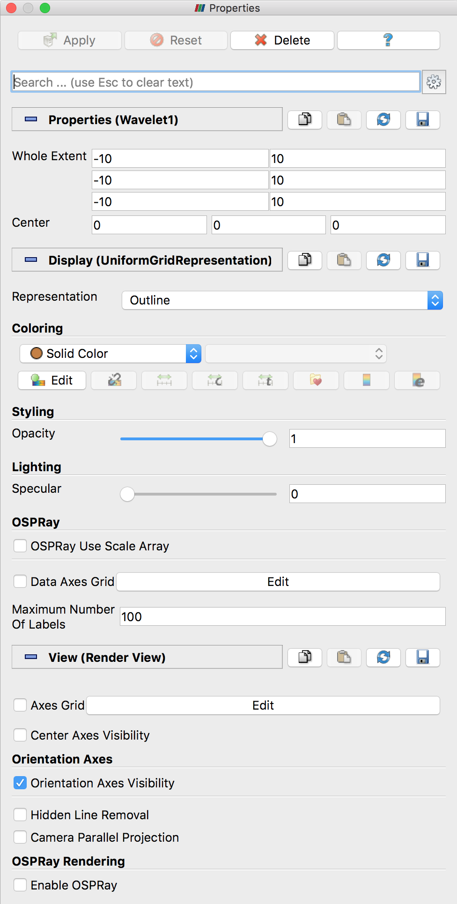
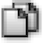
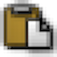
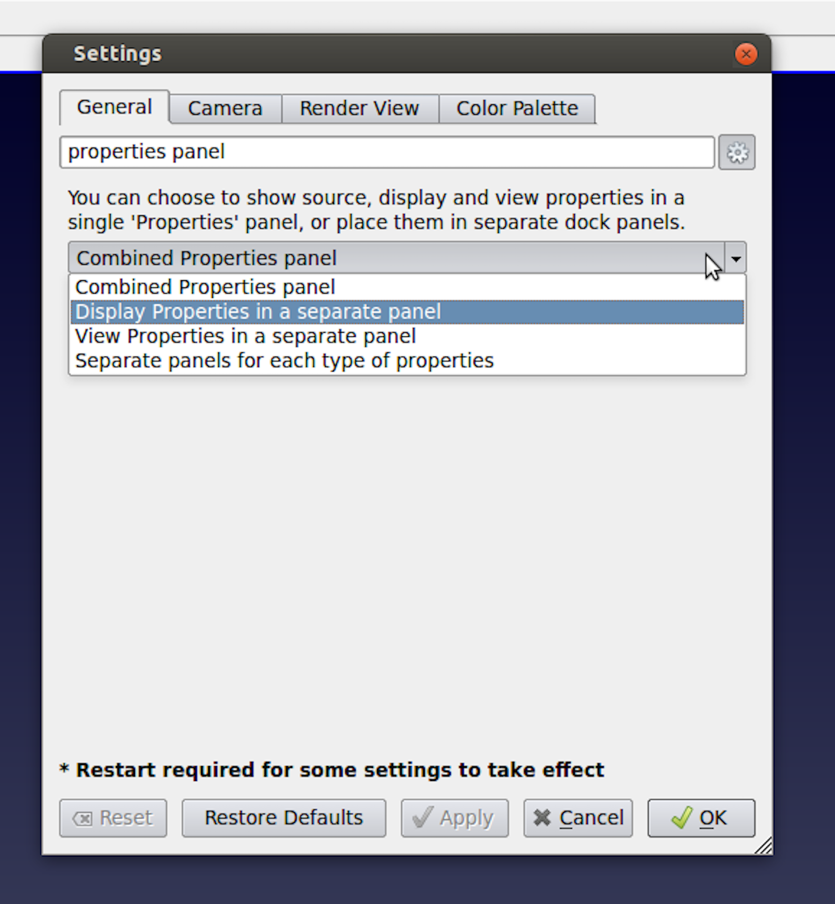

.. include:: ../macros.hrst
.. include:: ../abbreviations.hrst

.. _chapter:PropertiesPanel:

Properties Panel
################

The ``Properties`` :index:`\ <Properties>`\  panel is perhaps the most often used panel in
|paraview|. This is the panel you would use to change properties
on modules in the visualization pipeline, including sources and filters, to control how
they are displayed in views using the  ``Display`` :index:`\ <Display>`\  properties, and
to customize the view itself. In this chapter, we take a closer look at the
``Properties`` :index:`\ <Properties>`\  panel to understand how it works.

    ``Properties`` :index:`\ <Properties>`\  Panel in |paraview|

Anatomy of the ``Properties`` panel
===================================

Before we start dissecting the  ``Properties`` :index:`\ <Properties>`\ , remember that the  ``Properties`` :index:`\ <Properties>`\ 
panel works on *active* objects, i.e., it shows the properties for the active
source and active view, as well as the display properties, if any, for active source in the active view.

Buttons
^^^^^^^
:numref:`fig:PropertiesPanel` shows the various parts of the
``Properties`` :index:`\ <Properties>`\  panel. At the top is the group of buttons that let you accept,
reject your changes to the panel or  ``Delete`` :index:`\ <Delete>`\  the active source.

.. admonition:: **Did you know?**
   :class: tip

  You can delete multiple sources by selecting them using the
  |CTRL| (or |CMD|) key when selecting in the  ``Pipeline
  Browser`` :index:`\ <Pipeline Browser>`\  and then clicking on the  ``Delete`` :index:`\ <Delete>`\  button.
  Sometimes, the  ``Delete`` :index:`\ <Delete>`\  button may be disabled. That happens when the
  selected source(s) have other filters connected to them. You will need to
  delete those filters first.

.. _sec:PropertiesPanel:SearchBox:

Search box
^^^^^^^^^^

The  ``Search`` :index:`\ <Search>`\  box allows you to search for a property by using the name or the
label for the property. Simply start typing text in the  ``Search`` :index:`\ <Search>`\  box, and the
panel will update to show widgets for the properties matching the text.

The  ``Properties`` :index:`\ <Properties>`\  panel has two modes that control the verbosity of the panel:
default and advanced. In the default mode, a smaller subset of the available
properties is shown. These are generally the frequently used properties for the
pipeline modules. In advanced mode, you can see all the available properties.
You can toggle between default and advanced modes using the
|pqAdvanced26|  button next the  ``Search`` :index:`\ <Search>`\  box.

.. |pqAdvanced26| image:: ../images/pqAdvanced26.png
                  :width: 0.5cm

When you start searching for a property by typing text in the  ``Search`` :index:`\ <Search>`\  box,
irrespective of the current mode of the panel (i.e., default or advanced), all
properties that match the search text will be shown.

.. admonition:: **Did you know?**
   :class: tip

  The  ``Search`` :index:`\ <Search>`\  box is a recurring widget in |paraview|. Several other panels
  and dialog boxes, including the  ``Settings`` :index:`\ <Settings>`\  dialog and the  ``Color Map Editor`` :index:`\ <Color Map Editor>`\ ,
  show a similar widget. Its behavior is also exactly the same as in the case of the
  ``Properties`` :index:`\ <Properties>`\  panel. Don't forget that the |pqAdvanced26|
  button can be used to toggle between default and advanced modes.

Properties
^^^^^^^^^^

The  ``Properties`` :index:`\ <Properties>`\ ,  ``Display`` :index:`\ <Display>`\ , and  ``View`` :index:`\ <View>`\  sections in the panel
show widgets for properties on the active source, its display
properties in the active view, and the properties for the active view,
respectively. You can collapse/expand each of these sections by
clicking on the section name.

To the right of each section name is a set of four buttons. Clicking the
|CopyButton| copies the current set of property values to the
clipboard while clicking the |PasteButton| will paste those
property values into another compatible panel section. Note that the paste icon
is enabled only for panel sections where the copied properties can be pasted.

The next two buttons |ReloadButton| and
|SaveAsDefaultButton| enable customizing the default values
used for those properties. Refer to :numref:`sec:CustomDefaultSettings`
to learn more about customizing default property values.

.. |ReloadButton| image:: ../images/ReloadButton.png
                  :width: 0.5cm

.. |SaveAsDefaultButton| image:: ../images/SaveAsDefaultButton.png
                         :width: 0.5cm

.. _sec:PropertiesPanelLayoutSettings:

Customizing the layout
======================

    Options for customizing the  ``Properties`` :index:`\ <Properties>`\  panel layout using the
    ``Settings`` :index:`\ <Settings>`\  (left). View properties in a separate dock panel (right).

The  ``Properties`` :index:`\ <Properties>`\  panel, by default, is set up to show the source, display, and
view properties on the same panel. You may, however, prefer to have each of these
sections in a separate dockable panel. You can indeed do so using the
``Settings`` :index:`\ <Settings>`\  dialog accessible from the :guilabel:`Edit > Settings` menu.

On the  ``General`` :index:`\ <General>`\  tab search of the ``properties panel`` using the
``Search`` :index:`\ <Search>`\  box, you should see the setting that lets you pick whether to
combine all the sections in one (default), to separate out either the
``Display`` :index:`\ <Display>`\  or ``View`` :index:`\ <View>`\ 
sections in a  panel, or to create separate panels
for each of the sections. You will need to restart |paraview| for
this change to take effect. Also, since the  ``Apply`` :index:`\ <Apply>`\  and  ``Reset`` :index:`\ <Reset>`\  buttons only
apply to the  ``Properties`` :index:`\ <Properties>`\  section, they will only be shown in the dock panel
that houses it.
