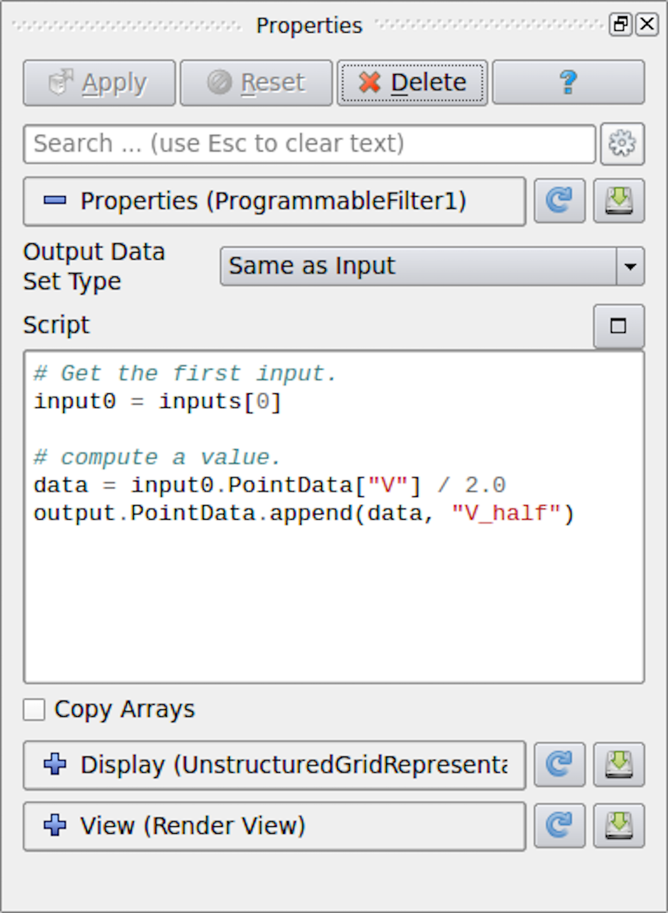
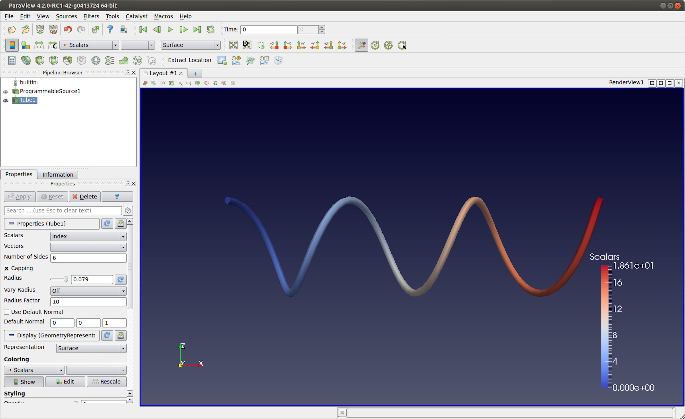
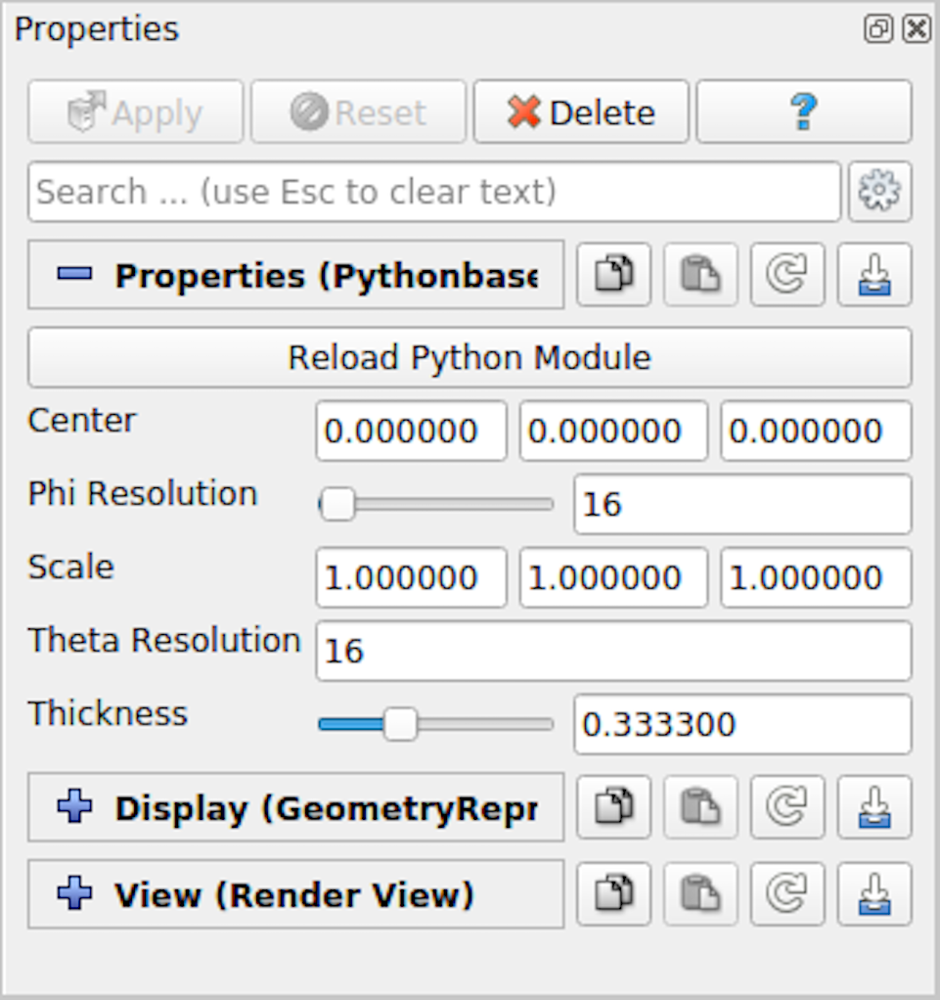

.. include:: ../macros.hrst
.. include:: ../abbreviations.hrst

.. _chapter:PythonProgrammableFilter:

``Programmable Filter``
#######################

A pipeline module in |ParaView| does one of two things:
it either generates data or processes input data. To generate data, the module
may use a mathematical model e.g. :guilabel:`Sources > Sphere` or read a file from
disk. Processing data entails transforming input data by applying defined
operations to generate a new output. |ParaView| provides a large set of readers, data
sources and data filters that cover the needs of many users. For the
cases where the available collection does not satisfy your needs, |ParaView|
provides a mechanism to add new modules via plugins. Conventional plugins,
however, are intended for hardcore developers. They are written in C++, using
the data processing APIs provided by |ParaView| and VTK. The complexity of
building and packaging C++ plugins that work on all distributed versions of
|ParaView| can be daunting and thus a huge barrier for
even advanced |ParaView| users. Python-based programmable filters and sources provide
an easy alternative to this. New modules can be written as Python scripts that
are executed by |ParaView| to generate and/or process data, just like
conventional C++ modules. Since the scripts are standard Python scripts, you
have access to Python packages such as NumPy that provide several numeric
operations useful for data transformation.

In this chapter, we will explore how to use Python to add new data processing
modules to ParaView through examples. For additional explanation of the data
processing API, see Chapter :numref:`chapter:VTKNumPyIntegration`.

.. admonition:: **Common Errors**
   :class: error

   In this guide so far, we have been looking at examples of Python scripts for
   |pvpython|. These scripts are used to script the actions you would
   perform using the |paraview| UI. The scripts you would
   write for  ``Programmable Source`` :index:`\ <Programmable Source>`\  and  ``Programmable Filter`` :index:`\ <Programmable Filter>`\  are entirely
   different. The data processing API executes within the data processing
   pipeline and, thus, has access to the data being processed. In client-server
   mode, this means that such scripts are indeed executed on the server side,
   potentially in parallel, across several MPI ranks. Therefore, attempting to import
   the  ``paraview.simple`` :index:`\ <paraview.simple>`\  Python module in the  ``Programmable Source`` :index:`\ <Programmable Source>`\  script, for
   example, is not supported and will have unexpected consequences.

.. _sec:UnderstandingProgrammableModules:

Understanding the programmable modules
======================================

With programmable modules, you are writing custom code for filters and sources.
You are expected to understand the basics of a VTK (and |ParaView|) data
processing pipeline, including the various stages of the pipeline execution as
well as the data model. Refer to  :numref:`sec:VTKDataModel` for an overview
of the VTK data model. While a detailed discussion of the VTK pipeline execution
model is beyond the scope of this book, the fundamentals covered in this section,
along with the examples in the rest of this chapter, should help you
get started and write useful modules. For a primer on the details of the VTK
pipeline execution stages, see :cite:`VTKPipelinePrimer`.

To create the programmable source or filter in |paraview|,
you use the :guilabel:`Sources > Programmable Source` or :guilabel:`Filters > Programmable Filter`
menus, respectively. Since the  ``Programmable Filter`` :index:`\ <Programmable Filter>`\  is a filter,
like other filters, it gets connected to the currently active source(s), i.e., the
currently active source(s) become the input to this new filter.  ``Programmable
Source`` :index:`\ <Programmable
Source>`\ , on the other hand, does not have any inputs.

    ``Properties`` :index:`\ <Properties>`\  panel for  ``Programmable Filter`` :index:`\ <Programmable Filter>`\  in |paraview|.

One of the first things that you specify after creating any of these programmable
modules is the  ``Output Data Set Type`` :index:`\ <Output Data Set Type>`\ . This option lets you select the type
of dataset this module will produce. The options provided include several of the
data types discussed in  :numref:`sec:VTKDataModel`. Additionally, for the
``Programmable Filter`` :index:`\ <Programmable Filter>`\ , you can select  ``Same as Input`` :index:`\ <Same as Input>`\  to indicate that
the filter preserves the input dataset type.

Next is the primary part: the  ``Script`` :index:`\ <Script>`\ . This is where you enter the Python
script to generate or process from the inputs the dataset that the module will
produce. As with any Python script, you can import other Python packages and
modules in this script. Just be aware that when running in client-server mode,
this script is going to be executed on the server side. Accordingly, any modules or
packages you import must be available on the server side to avoid errors.

The script gets executed in what's called the *RequestData* pass of the
pipeline execution. This is the pipeline pass in which an algorithm is expected
to produce the output dataset.

There are several other passes in a pipeline's execution. The ones for which you
can specify a Python script to execute with these programmable modules are:

* *RequestInformation*: In this pass, the algorithm is expected to
  provide the pipeline with any meta-data available about the data that will be
  produced by it. This includes things like number of timesteps in the dataset
  and their time values for temporal datasets or extents for
  structured datasets. This gets called before *RequestData* pass. In the
  *RequestData* pass, the pipeline could potentially qualify the request
  based on the meta-data provided in this pass. For example, if an algorithm announces
  that the temporal dataset has multiple timesteps, the pipeline could request that
  the algorithm produce data for one of those timesteps in  ``RequestData`` :index:`\ <RequestData>`\ .

* *RequestUpdateExtent*: In this pass, a filter gets the opportunity
  to qualify requests for execution passed on to the upstream pipeline. As an example, if
  an upstream reader announced in its *RequestInformation* script that it can
  produce several timesteps, in *RequestUpdateExtent*, this filter can
  make a request to the upstream reader for a specific timestep. This pass
  gets called after *RequestInformation*, but before  ``RequestData`` :index:`\ <RequestData>`\ .
  It's not very common to provide a script for this pass.

You can specify the script for the *RequestInformation* pass in
``RequestInformation Script`` :index:`\ <RequestInformation Script>`\  and for the *RequestUpdateExtent* pass in
``RequestUpdateExtent Script`` :index:`\ <RequestUpdateExtent Script>`\ . Since the *RequestUpdateExtent* pass does not make
much sense for an algorithm that does not have any inputs,  ``RequestUpdateExtent Script`` :index:`\ <RequestUpdateExtent Script>`\ 
is not available on  ``Programmable Source`` :index:`\ <Programmable Source>`\ .

Recipes for Programmable Source
================================

In this section, we look at several recipes for  ``Programmable Source`` :index:`\ <Programmable Source>`\ . A
common use of ``Programmable Source`` :index:`\ <Programmable Source>`\  is to prototype readers. If your reader
library already provides a Python API, then you can easily import the
appropriate Python package to read your dataset using  ``Programmable Source`` :index:`\ <Programmable Source>`\ .

.. admonition:: **Did you know?**
   :class: tip

   Most of the examples in this chapter use a NumPy-centric API for accessing
   and creating data arrays. Additionally, you can use VTK's
   Python wrapped API for creating and accessing arrays. Given the omnipresence
   of NumPy, there is rarely any need for using VTK's API directly, however.

.. _sec:ReadingACSVFile:

Reading a CSV file
^^^^^^^^^^^^^^^^^^

For this example, we will read in a CSV file to produce a Table
( :numref:`sec:VTKDataModel:Table`) using  ``Programmable Source`` :index:`\ <Programmable Source>`\ . We will
use NumPy to do the parsing of the CSV files and pass the arrays read in
directly to the pipeline. Note that the  ``Output DataSet Type`` :index:`\ <Output DataSet Type>`\  must be set
to  ``vtkTable`` :index:`\ <vtkTable>`\ .

.. code-block:: python

  # Code for 'Script'
  
  # We will use NumPy to read the csv file.
  # Refer to NumPy documentation for genfromtxt() for details on
  # customizing the CSV file parsing.
  
  import numpy as np
  # assuming data.csv is a CSV file with the 1st row being the names names for
  # the columns
  data = np.genfromtxt("data.csv", dtype=None, names=True, delimiter=',', autostrip=True)
  for name in data.dtype.names:
     array = data[name]
  
     # You can directly pass a NumPy array to the pipeline.
     # Since ParaView expects all arrays to be named, you
     # need to assign it a name in the 'append' call.
     output.RowData.append(array, name)

% TODO: Add a did you know or something to indicate how to read only on the root
% node.

.. _sec:ReadingACSVFileSeries:

Reading a CSV file series
^^^^^^^^^^^^^^^^^^^^^^^^^

Building on the example from   :numref:`sec:ReadingACSVFile`,
let's say we have a series of files that we
want to read in as a temporal series. Recall from
:numref:`sec:UnderstandingProgrammableModules` that meta-data about data to
be produced, including timestep information, is announced in
*RequestInformation* pass. Hence, for this example, we will need to specify
the  ``RequestInformation Script`` :index:`\ <RequestInformation Script>`\  as well.

As was true earlier,  ``Output DataSet Type`` :index:`\ <Output DataSet Type>`\  must be set to  ``vtkTable`` :index:`\ <vtkTable>`\ .
Now, to announce the timesteps, we use the following as the
``RequestInformation Script`` :index:`\ <RequestInformation Script>`\ .

.. code-block:: python

  # Code for 'RequestInformation Script'.
  def setOutputTimesteps(algorithm, timesteps):
      "helper routine to set timestep information"
      executive = algorithm.GetExecutive()
      outInfo = executive.GetOutputInformation(0)
  
      outInfo.Remove(executive.TIME_STEPS())
      for timestep in timesteps:
          outInfo.Append(executive.TIME_STEPS(), timestep)
  
      outInfo.Remove(executive.TIME_RANGE())
      outInfo.Append(executive.TIME_RANGE(), timesteps[0])
      outInfo.Append(executive.TIME_RANGE(), timesteps[-1])
  
  # As an example, let's say we have 4 files in the file series that we
  # want to say are producing time 0, 10, 20, and 30.
  setOutputTimesteps(self, (0, 10, 20, 30))

The  ``Script`` :index:`\ <Script>`\  is similar to earlier, except that we will read a specific
CSV file based on which timestep was requested.

.. code-block:: python

  # Code for 'Script'
  def GetUpdateTimestep(algorithm):
      """Returns the requested time value, or None if not present"""
      executive = algorithm.GetExecutive()
      outInfo = executive.GetOutputInformation(0)
      return outInfo.Get(executive.UPDATE_TIME_STEP()) \
                if outInfo.Has(executive.UPDATE_TIME_STEP()) else None
  
  # This is the requested time-step. This may not be exactly equal to the
  # timesteps published in RequestInformation(). Your code must handle that
  # correctly.
  req_time = GetUpdateTimestep(self)
  
  # Now, use req_time to determine which CSV file to read and read it as before.
  # Remember req_time need not match the time values put out in
  # 'RequestInformation Script'. Your code need to pick an appropriate file to
  # read, irrespective.
  
  ...
  # TODO: Generate the data as you want.
  
  # Now mark the timestep produced.
  output.GetInformation().Set(output.DATA_TIME_STEP(), req_time)

.. _sec:ReadingACSVFileWithPoints:

Reading a CSV file with particles
^^^^^^^^^^^^^^^^^^^^^^^^^^^^^^^^^

This is similar to  :numref:`sec:ReadingACSVFile`. Now, however, let's say the CSV has three
columns named ``X``, ``Y`` and ``Z`` that we want to treat as point coordinates and
produce a  ``vtkPolyData`` :index:`\ <vtkPolyData>`\  with points instead of a  ``vtkTable`` :index:`\ <vtkTable>`\ . For that, we first
ensure that  ``Output DataSet Type`` :index:`\ <Output DataSet Type>`\  is set to  ``vtkPolyData`` :index:`\ <vtkPolyData>`\ . Next, we use
the following  ``Script`` :index:`\ <Script>`\ :

.. code-block:: python

  # Code for 'Script'
  
  from vtk.numpy_interface import algorithms as algs
  from vtk.numpy_interface import dataset_adapter as dsa
  import numpy as np
  
  # assuming data.csv is a CSV file with the 1st row being the names names for
  # the columns
  data = np.genfromtxt("/tmp/points.csv", dtype=None, names=True, delimiter=',', autostrip=True)
  
  # convert the 3 arrays into a single 3 component array for
  # use as the coordinates for the points.
  coordinates = algs.make_vector(data["X"], data["Y"], data["Z"])
  
  # create a vtkPoints container to store all the
  # point coordinates.
  pts = vtk.vtkPoints()
  
  # numpyTovtkDataArray is needed to called directly to convert the NumPy
  # to a vtkDataArray which vtkPoints::SetData() expects.
  pts.SetData(dsa.numpyTovtkDataArray(coordinates, "Points"))
  
  # set the pts on the output.
  output.SetPoints(pts)
  
  # next, we define the cells i.e. the connectivity for this mesh.
  # here, we are creating merely a point could, so we'll add
  # that as a single poly vextex cell.
  numPts = pts.GetNumberOfPoints()
  # ptIds is the list of point ids in this cell
  # (which is all the points)
  ptIds = vtk.vtkIdList()
  ptIds.SetNumberOfIds(numPts)
  for a in xrange(numPts):
      ptIds.SetId(a, a)
  
  # Allocate space for 1 cell.
  output.Allocate(1)
  output.InsertNextCell(vtk.VTK_POLY_VERTEX, ptIds)
  
  # We can also pass all the array read from the CSV
  # as point data arrays.
  for name in data.dtype.names:
      array = data[name]
      output.PointData.append(array, name)

The thing to note is that this time, we need to define the geometry and topology for
the output dataset. Each data type has different requirements on how these are
specified. For example, for unstructured datasets like vtkUnstructuredGrid and
vtkPolyData, we need to explicitly specify the geometry and all the
connectivity information. For vtkImageData, the geometry is defined using
origin, spacing, and extents, and connectivity is implicit.

Reading binary 2D image
^^^^^^^^^^^^^^^^^^^^^^^

This recipe shows how to read raw binary data representing a 3D volume. Since
raw binary files don't encode information about the volume extents and data
type, we will assume that the extents and data type are known and fixed.

For producing image volumes, you need to provide the information about the
structured extents in *RequestInformation*. Ensure that the  ``Output
Data Set Type`` :index:`\ <Output Data Set Type>`\  is set to  ``vtkImageData`` :index:`\ <vtkImageData>`\ .

.. code-block:: python

  # Code for 'RequestInformation Script'.
  executive = self.GetExecutive()
  outInfo = executive.GetOutputInformation(0)
  # we assume the dimensions are (48, 62, 42).
  outInfo.Set(executive.WHOLE_EXTENT(), 0, 47, 0, 61, 0, 41)
  outInfo.Set(vtk.vtkDataObject.SPACING(), 1, 1, 1)

The  ``Script`` :index:`\ <Script>`\  to read the data can be written as follows.

.. code-block:: python

  # Code for 'Script'
  import numpy as np
  
  # read raw binary data.
  # ensure 'dtype' is set properly.
  data = np.fromfile("HeadMRVolume.raw", dtype=np.uint8)
  
  dims = [48, 62, 42]
  assert data.shape[0] == dims[0]*dims[1]*dims[2],
          "dimension mismatch"
  
  output.SetExtent(0, dims[0]-1, 0, dims[1]-1, 0, dims[2]-1)
  output.PointData.append(data, "scalars")
  output.PointData.SetActiveScalars("scalars")

.. figure:: ../images/ReadBinaryData.png
    :name: fig:ReadBinaryData
    :width: 80%
    :align: center

    ``Programmable Source`` :index:`\ <Programmable Source>`\  used to read *HeadMRVolume.raw* file available in the VTK data repository.

.. _sec:HelixProgrammableSource:

Helix source
^^^^^^^^^^^^

Here is another polydata source example. This time, we generate the data programmatically.

.. code-block:: python

  # Code for 'Script'
  
  #This script generates a helix curve.
  #This is intended as the script of a 'Programmable Source'
  import math
  import numpy as np
  from vtk.numpy_interface import algorithms as algs
  from vtk.numpy_interface import dataset_adapter as dsa
  
  numPts = 80  # Points along Helix
  length = 8.0 # Length of Helix
  rounds = 3.0 # Number of times around
  
  # Compute the point coordinates for the helix.
  index = np.arange(0, numPts, dtype=np.int32)
  scalars = index * rounds * 2 * math.pi / numPts
  x = index * length / numPts;
  y = np.sin(scalars)
  z = np.cos(scalars)
  
  # Create a (x,y,z) coordinates array and associate that with
  # points to pass to the output dataset.
  coordinates = algs.make_vector(x, y, z)
  pts = vtk.vtkPoints()
  pts.SetData(dsa.numpyTovtkDataArray(coordinates, 'Points'))
  output.SetPoints(pts)
  
  # Add scalars to the output point data.
  output.PointData.append(index, 'Index')
  output.PointData.append(scalars, 'Scalars')
  
  # Next, we need to define the topology i.e.
  # cell information. This helix will be a single
  # polyline connecting all the  points in order.
  ptIds = vtk.vtkIdList()
  ptIds.SetNumberOfIds(numPts)
  for i in xrange(numPts):
     #Add the points to the line. The first value indicates
     #the order of the point on the line. The second value
     #is a reference to a point in a vtkPoints object. Depends
     #on the order that Points were added to vtkPoints object.
     #Note that this will not be associated with actual points
     #until it is added to a vtkPolyData object which holds a
     #vtkPoints object.
     ptIds.SetId(i, i)
  
  # Allocate the number of 'cells' that will be added. We are just
  # adding one vtkPolyLine 'cell' to the vtkPolyData object.
  output.Allocate(1, 1)
  
  # Add the poly line 'cell' to the vtkPolyData object.
  output.InsertNextCell(vtk.VTK_POLY_LINE, ptIds)

    ``Programmable Source`` :index:`\ <Programmable Source>`\  output generated using the script in
    :numref:`sec:HelixProgrammableSource`. This visualization uses  ``Tube`` :index:`\ <Tube>`\ 
    filter to make the output polyline more prominent.

Recipes for Programmable Filter
===============================

One of the differences between the  ``Programmable Source`` :index:`\ <Programmable Source>`\  and the
``Programmable Filter`` :index:`\ <Programmable Filter>`\  is that the latter expects at least 1 input. Of course,
the code in the  ``Programmable Filter`` :index:`\ <Programmable Filter>`\  is free to disregard the input entirely
and work exactly as  ``Programmable Source`` :index:`\ <Programmable Source>`\ .  ``Programmable Filter`` :index:`\ <Programmable Filter>`\  is
designed to customize data transformations. For example, it is useful when you
want to compute derived quantities using expressions not directly possible with
``Python Calculator`` :index:`\ <Python Calculator>`\  and  ``Calculator`` :index:`\ <Calculator>`\  or when you want to use other Python
packages or even VTK filters not exposed in |ParaView| for processing the inputs.

In this section, we look at various recipes for  ``Programmable Filter`` :index:`\ <Programmable Filter>`\ s.

Adding a new point/cell data array based on an input array
^^^^^^^^^^^^^^^^^^^^^^^^^^^^^^^^^^^^^^^^^^^^^^^^^^^^^^^^^^

``Python Calculator`` :index:`\ <Python Calculator>`\  provides an easy mechanism of computing derived
variables. You can also use the  ``Programmable Filter`` :index:`\ <Programmable Filter>`\ .
Typically, for such cases, ensure that the  ``Output DataSet Type`` :index:`\ <Output DataSet Type>`\  is set to
``Same as Input`` :index:`\ <Same as Input>`\ .

.. code-block:: python

  # Code for 'Script'
  
  # 'inputs' is set to an array with data objects produced by inputs to
  # this filter.
  
  # Get the first input.
  input0 = inputs[0]
  
  # compute a value.
  dataArray = input0.PointData["V"] / 2.0
  
  # To access cell data, you can use input0.CellData.
  
  # 'output' is a variable set to the output dataset.
  output.PointData.append(dataArray, "V_half")

The thing to note about this code is that it will work as expected even when
the input dataset is a composite dataset such as a Multiblock dataset
( :numref:`sec:MultiblockDataset`). Refer to Chapter :numref:`chapter:VTKNumPyIntegration`
for details on how this works. There are cases, however, when you may want to
explicitly iterate over blocks in an input multiblock dataset. For that, you can
use the following snippet.

.. code-block:: python

  input0 = inputs[0]
  if input0.IsA("vtkCompositeDataSet"):
      # iterate over all non-empty blocks in the input
      # composite dataset, including multiblock and AMR datasets.
      for block in input0:
          processBlock(block)
  else:
      processBlock(input0)

Computing tetrahedra volume
^^^^^^^^^^^^^^^^^^^^^^^^^^^

This recipe computes the volume for each tetrahedral cell in the input dataset.
You can always simply use the  ``Python Calculator`` :index:`\ <Python Calculator>`\  to compute cell volume
using the expression ``volume(inputs[0])``. This recipe is provided to
illustrate the API.

Ensure that the output type is set to  ``Same as Input`` :index:`\ <Same as Input>`\ , and this filter assumes
the input is an unstructured grid ( :numref:`sec:VTKDataModel:UnstructuredGrid`).

.. code-block:: python

  # Code for 'Script'.
  
  import numpy as np
  
  # This filter computes the volume of the tetrahedra in an unstructured mesh.
  # Note, this is just an illustration and not  the most efficient way for
  # computing cell volume. You should use 'Python Calculator' instead.
  input0 = inputs[0]
  
  numTets = input0.GetNumberOfCells()
  
  volumeArray = np.empty(numTets, dtype=np.float64)
  for i in xrange(numTets):
         cell = input0.GetCell(i)
         p1 = input0.GetPoint(cell.GetPointId(0))
         p2 = input0.GetPoint(cell.GetPointId(1))
         p3 = input0.GetPoint(cell.GetPointId(2))
         p4 = input0.GetPoint(cell.GetPointId(3))
         volumeArray[i] = vtk.vtkTetra.ComputeVolume(p1,p2,p3,p4)
  
  output.CellData.append(volumeArray, "Volume")

Labeling common points between two datasets
^^^^^^^^^^^^^^^^^^^^^^^^^^^^^^^^^^^^^^^^^^^

In this example, the  ``Programmable Filter`` :index:`\ <Programmable Filter>`\  takes two input datasets: A and B. It
outputs dataset B with a new scalar array that labels the points in B that
are also in A. You should select two datasets in the pipeline browser and then
apply the programmable filter.

.. code-block:: python

  # Code for 'Script'
  
  # Get the two inputs
  A = inputs[0]
  B = inputs[1]
  # use len(inputs) to determine now many inputs are connected
  # to this filter.
  
  # We use numpy.in1d to test all which point coordinate components
  # in  B are present in A as well.
  maskX = np.in1d(B.Points[:,0], A.Points[:,0])
  maskY = np.in1d(B.Points[:,1], A.Points[:,1])
  maskZ = np.in1d(B.Points[:,2], A.Points[:,2])
  
  # Combining each component mask, we get the mask for point
  # itself.
  mask = maskX & maskY & maskZ
  
  # Now convert it to uint8, since bool arrays
  # cannot be passed back to the VTK pipeline.
  mask = np.asarray(mask, dtype=np.uint8)
  
  # Initialize the output and add the labels array
  
  # This ShallowCopy is needed since by default the output is
  # initialized to be a shallow copy of the first input (inputs[0]),
  # but we want it to be a description of the second input.
  output.ShallowCopy(B.VTKObject)
  output.PointData.append(mask, "labels")

Note in the script above the two inputs are defined in an  ``inputs`` :index:`\ <inputs>`\  array. The
order of elements in this array is determined by the order the data sources were
selected in the  ``Pipeline Browser`` :index:`\ <Pipeline Browser>`\ . Hence,  ``inputs[0]`` :index:`\ <inputs[0]>`\  is the first data source
selected and  ``inputs[1]`` :index:`\ <inputs[1]>`\  is the second.

Python Algorithm
================

``Programmable Source`` :index:`\ <Programmable Source>`\  and  ``Programmable Filter`` :index:`\ <Programmable Filter>`\  are convenient ways to
prototype a Python-based data processing module. If you want to distribute such
modules, or package them into modules with user interfaces,
for example, then  ``VTKPythonAlgorithmBase`` :index:`\ <VTKPythonAlgorithmBase>`\ -based approach is recommended instead.
Here, you write a Python class by subclassing  ``VTKPythonAlgorithmBase`` :index:`\ <VTKPythonAlgorithmBase>`\  and
implementing methods to do the data processing, just like any other VTK-based
filter or source. Using Python syntactic add-ons called *decorators* to
annotate your class, you can easily expose the class to ParaView as a filter or
a source, and ParaView will automatically add UI widgets to control parameters, etc.

Let's start with the simple script featured in
:numref:`fig:ProgrammableFilterInParaView`. Here's the Python script to
create a  ``VTKPythonAlgorithmBase`` :index:`\ <VTKPythonAlgorithmBase>`\  subclass for the same operation.

.. code-block:: python

  from vtkmodules.vtkCommonDataModel import vtkDataSet
  from vtkmodules.util.vtkAlgorithm import VTKPythonAlgorithmBase
  from vtkmodules.numpy_interface import dataset_adapter as dsa
  
  class HalfVFilter(VTKPythonAlgorithmBase):
      def __init__(self):
          VTKPythonAlgorithmBase.__init__(self)
  
      def RequestData(self, request, inInfo, outInfo):
          # get the first input.
          input0 = dsa.WrapDataObject(vtkDataSet.GetData(inInfo[0]))
  
          # compute a value.
          data = input0.PointData["V"] / 2.0
  
          # add to output
          output = dsa.WrapDataObject(vtkDataSet.GetData(outInfo))
          output.PointData.append(data, "V_half");
          return 1

To expose this filter in ParaView, you have to add decorators to the class
definition as follows:

.. code-block:: python

  # same imports as earlier.
  from vtkmodules.vtkCommonDataModel import vtkDataSet
  from vtkmodules.util.vtkAlgorithm import VTKPythonAlgorithmBase
  from vtkmodules.numpy_interface import dataset_adapter as dsa
  
  # new module for ParaView-specific decorators.
  from paraview.util.vtkAlgorithm import smproxy, smproperty, smdomain
  
  @smproxy.filter(label="Half-V Filter")
  @smproperty.input(name="Input")
  class HalfVFilter(VTKPythonAlgorithmBase):
      # the rest of the code here is unchanged.
      def __init__(self):
          VTKPythonAlgorithmBase.__init__(self)
  
      def RequestData(self, request, inInfo, outInfo):
          # get the first input.
          input0 = dsa.WrapDataObject(vtkDataSet.GetData(inInfo[0]))
  
          # compute a value.
          data = input0.PointData["V"] / 2.0
  
          # add to output
          output = dsa.WrapDataObject(vtkDataSet.GetData(outInfo))
          output.PointData.append(data, "V_half");
          return 1

To use this new filter, save this to a ``*.py`` file, and load it as a plugin using
the  ``Plugin Manager`` :index:`\ <Plugin Manager>`\  from :guilabel:`Tools > Plugin Manager`. On success, you will
see a  ``Half-V Filter`` :index:`\ <Half-V Filter>`\  in the :guilabel:`Filters` menu.

Besides exposing class as filters, or sources, you can use the decorators to add
UI widgets to call methods on the class to set parameters.

The follow examples adds a new source named  ``Python-based Superquadric Source Example`` :index:`\ <Python-based Superquadric Source Example>`\ , with UI to control various parameters.

.. code-block:: python

  # to add a source, instead of a filter, use the `smproxy.source` decorator.
  @smproxy.source(label="Python-based Superquadric Source Example")
  class PythonSuperquadricSource(VTKPythonAlgorithmBase):
      """This is dummy VTKPythonAlgorithmBase subclass that
      simply puts out a Superquadric poly data using a vtkSuperquadricSource
      internally"""
      def __init__(self):
          VTKPythonAlgorithmBase.__init__(self,
                  nInputPorts=0,
                  nOutputPorts=1,
                  outputType='vtkPolyData')
          from vtkmodules.vtkFiltersSources import vtkSuperquadricSource
          self._realAlgorithm = vtkSuperquadricSource()
  
      def RequestData(self, request, inInfo, outInfo):
          from vtkmodules.vtkCommonDataModel import vtkPolyData
          self._realAlgorithm.Update()
          output = vtkPolyData.GetData(outInfo, 0)
          output.ShallowCopy(self._realAlgorithm.GetOutput())
          return 1
  
      # for anything too complex or not yet supported, you can explicitly
      # provide the XML for the method.
      @smproperty.xml("""
          <DoubleVectorProperty name="Center"
              number_of_elements="3"
              default_values="0 0 0"
              command="SetCenter">
              <DoubleRangeDomain name="range" />
              <Documentation>Set center of the superquadric</Documentation>
          </DoubleVectorProperty>""")
      def SetCenter(self, x, y, z):
          self._realAlgorithm.SetCenter(x,y,z)
          self.Modified()
  
      # In most cases, one can simply use available decorators.
      @smproperty.doublevector(name="Scale", default_values=[1, 1, 1])
      @smdomain.doublerange()
      def SetScale(self, x, y, z):
          self._realAlgorithm.SetScale(x,y,z)
          self.Modified()
  
      @smproperty.intvector(name="ThetaResolution", default_values=16)
      def SetThetaResolution(self, x):
          self._realAlgorithm.SetThetaResolution(x)
          self.Modified()
  
      @smproperty.intvector(name="PhiResolution", default_values=16)
      @smdomain.intrange(min=0, max=1000)
      def SetPhiResolution(self, x):
          self._realAlgorithm.SetPhiResolution(x)
          self.Modified()
  
      @smproperty.doublevector(name="Thickness", default_values=0.3333)
      @smdomain.doublerange(min=1e-24, max=1.0)
      def SetThickness(self, x):
          self._realAlgorithm.SetThickness(x)
          self.Modified()

On loading this script as a plugin and creating the  ``Python-based Superquadric Source Example`` :index:`\ <Python-based Superquadric Source Example>`\  
source, the  ``Properties`` :index:`\ <Properties>`\  panel will be populated
as shown in  :numref:`fig:PropertiesForPythonSuperquadricSource`.

    ``Properties`` :index:`\ <Properties>`\  panel automatically generated from a decorated Python
    class,  ``PythonSuperquadricSource`` :index:`\ <PythonSuperquadricSource>`\ .

The decorators also enable us to add new readers and writers. Here is an
example writer that uses NumPy to write tables as compressed binary arrays.

.. code-block:: python

  
  # `smproxy.writer` decorator register the module as writer for the provided file
  # extension.
  @smproxy.writer(extensions="npz", file_description="NumPy Compressed Arrays", support_reload=False)
  @smproperty.input(name="Input", port_index=0)
  # this domain lets ParaView know which types of data this writer can write.
  @smdomain.datatype(dataTypes=["vtkTable"], composite_data_supported=False)
  class NumpyWriter(VTKPythonAlgorithmBase):
      def __init__(self):
          VTKPythonAlgorithmBase.__init__(self, nInputPorts=1, nOutputPorts=0, inputType='vtkTable')
          self._filename = None
  
      @smproperty.stringvector(name="FileName", panel_visibility="never")
      @smdomain.filelist()
      def SetFileName(self, fname):
          """Specify filename for the file to write."""
          if self._filename != fname:
              self._filename = fname
              self.Modified()
  
      def RequestData(self, request, inInfoVec, outInfoVec):
          from vtkmodules.vtkCommonDataModel import vtkTable
          from vtkmodules.numpy_interface import dataset_adapter as dsa
  
          table = dsa.WrapDataObject(vtkTable.GetData(inInfoVec[0], 0))
          kwargs = {}
          for aname in table.RowData.keys():
              kwargs[aname] = table.RowData[aname]
  
          import numpy
          numpy.savez_compressed(self._filename, **kwargs)
          return 1
  
      def Write(self):
          self.Modified()
          self.Update()

