.. include:: ../macros.hrst
.. include:: ../abbreviations.hrst

.. % This chapter is unchanged from the old user's guide. We need to rewrite it
   % entirely in near future. For lack of time, I am leaving this as is for now,
   % since it's not 'wrong' but just 'bad' :).

.. _chapter:Animation:

Animation
#########

In |ParaView|, you can create animations by recording a series of keyframes. At
each keyframe, you set values for the properties of the readers, sources, and
filters that make up the visualization pipeline, as well as the position and
orientation of the camera. Once you have chosen the parameters, you can play
through the animation. When you play the animation, you can cache the geometric
output of the visualization pipeline in memory. When you replay the
animation, playback will be much faster because very little computation must be
done to generate the images. Also, the results of the animation can be saved to
image files (one image per animation frame) or to a movie file. The geometry
rendered at each frame can also be saved in |ParaView|'s PVD file format, which
can be loaded back into |ParaView| as a time varying dataset.

Animation View
==============

``Animation View`` :index:`\ <Animation View>`\  is the user interface used to create animations by adding
keyframes. It is modeled similar to popular animation and keyframe editing
applications with the ability to create tracks for animating multiple parameters. The
``Animation View`` :index:`\ <Animation View>`\  is accessible from the :guilabel:`View` menu.

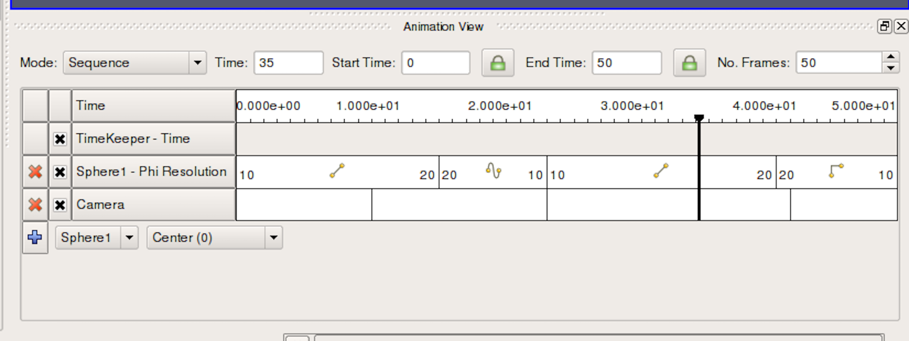

    Animation View.

As seen in :numref:`fig:AnimationView`, this view is presented as a table.
Above the table are controls that administer how time progresses in the
animation. These were discussed briefly in  \ref{sec:DealingWithTime}.
Within the table, the tracks of the
animation appear as rows, and animation time is presented as increasing from
left-to-right. The first row in the table, simply labeled ``Time``, shows
the total span of time that the animation can cover. The current displayed time
is indicated both in the Time field at the top and with a thick, vertical,
draggable line within the table.

Along the left side of the  ``Animation View`` :index:`\ <Animation View>`\  is an expandable list of the
names of the animation tracks (i.e., a particular object and property to
animate). You choose a data source and then a particular property of the data
source in the bottom row. To create an animation track with keyframes for that
property, click the  ``+`` :index:`\ <+>`\  on the left-hand side; this will create a new track.
In the figure, tracks already exist for *SphereSource1*'s  
``Phi Resolution`` :index:`\ <Phi Resolution>`\  property and for the camera's position. To delete a track, press the
``X`` :index:`\ <X>`\  button. You can temporarily disable a track by unchecking the check box
on the right of the track. To enter values for the property, double-click within
the white area to the right of the track name. This will bring up the
``Animation Keyframes`` :index:`\ <Animation Keyframes>`\  dialog. Double-clicking in the camera entry brings up a
dialog like the one in :numref:`fig:EditingCameraTrack`.

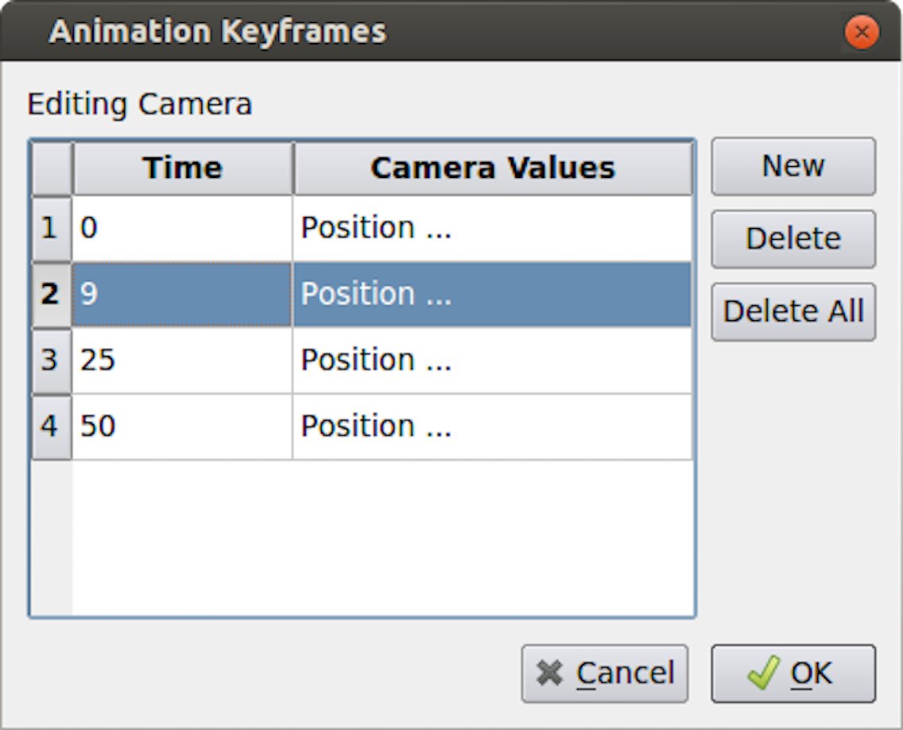

    Editing the camera track.

From the  ``Animation Keyframes`` :index:`\ <Animation Keyframes>`\  dialog, you can press :guilabel:`New` to create new keyframes.
You can also press  ``Delete`` :index:`\ <Delete>`\  or  ``Delete All`` :index:`\ <Delete All>`\  to delete some or all of the keyframes. Clicking  ``New`` :index:`\ <New>`\  will
add a new row to the table. In any row, you can click within the  ``Time`` :index:`\ <Time>`\  column to
choose a particular time for the keyframe, and you can click in the right-hand column to
enter values for the parameter. The exact user interface components that let you
set values for the property at the keyframe time vary. When available, you can
change the interpolation between two keyframes by double-clicking on the central
interpolation column.

Within the tracks of the  ``Animation View`` :index:`\ <Animation View>`\ , the place in time where each keyframe
occurs is shown as a vertical line. The values chosen for the property at that
time and the interpolation function used between that value and the next are
shown as text, when appropriate. In the previous figure, for example, the sphere
resolution begins at 10 and then changes to 20, varying by linear interpolation
between them. The camera values are too lengthy to show as text so they are not
displayed in the track, but we can easily see that there are four keyframes
spaced throughout the animation. The vertical lines in the tracks themselves may
be dragged, so you can easily adjust the time at which each keyframe occurs.

.. admonition:: **Did you know?**
  :class: tip

   You can quickly add a simple animation track and edit the keyframe without using the  
   ``Animation View`` :index:`\ <Animation View>`\  by using  ``Animation Shortcut`` :index:`\ <Animation Shortcut>`\ .
   First, enable  ``Show Animation Shortcut``  :index:`\ <Show Animation Shortcut >`\  from  
   ``Settings`` :index:`\ <Settings>`\  dialog (on the  ``General`` :index:`\ <General>`\  tab, search for the option by name or switch to advanced view).
   Then, several of the animatable properties on the  ``Properties`` :index:`\ <Properties>`\  panel will have a |pqVcrPlay24| icon.
   Click this icon to add a new animation track for this property and edit it.

   .. |pqVcrPlay24| image:: ../images/pqVcrPlay24.png
                    :width: 0.5cm

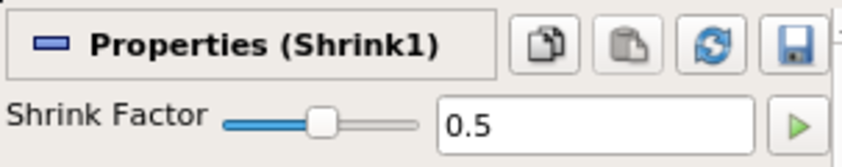

Animation View header
=====================

The  ``Animation View`` :index:`\ <Animation View>`\  has a header-bar that lets you control some properties of the
animation itself, as you can see in :numref:`fig:AnimationViewHeader`.

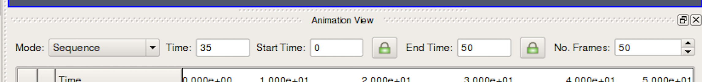

    Animation View Header.

``Mode`` :index:`\ <Mode>`\  controls the animation playback mode. |ParaView| supports three modes for playing
animation. In ``Sequence`` mode, the animation is played as a sequence of images (or
frames) generated one after the other and rendered in immediate succession. The
number of frames is controlled by the  ``No. Frames`` :index:`\ <No. Frames>`\  spinbox at the end of the
header. Note that the frames are rendered as fast as possible. Thus, the viewing
frame rate depends on the time needed to generate and render each frame.

In ``Real Time`` mode, the  ``Duration`` :index:`\ <Duration>`\  spinbox (replacing the  ``No. Frames`` :index:`\ <No. Frames>`\  spinbox)
indicates the time in seconds over which the entire animation should run. Each
frame is rendered using the current wall clock time in seconds, relative to the
start time. The animation runs for nearly the number of seconds specified by the
``Duration (secs)`` :index:`\ <Duration (secs)>`\  spinbox. In turn, the number of frames actually generated (or
rendered) depends on the time to generate (or render) each frame.

In ``Snap To TimeSteps`` mode, the number of frames in the animation is
determined by the number of time values in the dataset being animated. This is
the animation mode used for |ParaView|'s default animations: playing through the
time values in a dataset one after the other. Default animations are created by
|ParaView| when a dataset with time values is loaded; no action is required to
create the animation. Note that using this mode when no time-varying data is
loaded will result in no animation at all.

In ``Sequence`` mode, the final item in the header is the  ``No. Frames`` :index:`\ <No. Frames>`\  spinbox. This
spinbox lets you pick the total number of frames for the animation. Similarly, in
``Real Time`` mode, the final line lets you choose the duration of the animation. In
``Snap To TimeSteps`` mode, the total number of frames is dictated by the dataset
and, therefore, the spinbox is disabled.

The  ``Time`` :index:`\ <Time>`\  entry-box shows the current animation time, which is the same as shown by a
vertical marker in this view. You can change the current animation time by
either entering a value in this box, if available, or by dragging the vertical
marker. The  ``Start Time`` :index:`\ <Start Time>`\  and  ``End Time`` :index:`\ <End Time>`\  entry-boxes display the start and end times
for the animation. By default, when you load time varying datasets, the start
and end times are automatically adjusted to cover the entire time range present
in the data. The lock check-buttons to the right of the  ``Start Time`` :index:`\ <Start Time>`\  and  ``End Time`` :index:`\ <End Time>`\ 
widgets will prevent this from happening, so that you can ensure that your
animation covers a particular time domain of your choosing.

.. admonition:: **Did you know?**
  :class: tip

   You can change the precision (number of significant digits) displayed by the animation clock
   by changing the  ``Animation Time Precision`` :index:`\ <Animation Time Precision>`\  value under
   ``Settings/Properties Panel Options/Advanced`` :index:`\ <Settings/Properties Panel Options/Advanced>`\ .

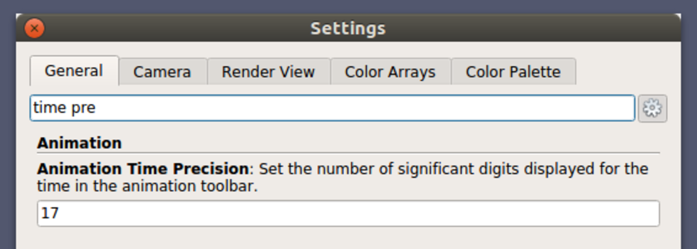

Animating time-varying data
===========================

When you load time-varying data, |ParaView| automatically creates a default
animation that allows you to play through the temporal domain of the data
without manually creating an animation to do so. With the  ``Animation View`` :index:`\ <Animation View>`\ , you
can uncouple the data time from the animation time so that you can create
keyframes that manipulate the data time during animation as well.

If you double-click in the  ``TimeKeeper – Time`` :index:`\ <TimeKeeper – Time>`\  track, the  ``Animation Keyframes`` :index:`\ <Animation Keyframes>`\ 
dialog, an example of which is shown in :numref:`fig:ControllingDataTime`, appears. In this dialog,
you can make data time progress in three fundamentally different ways. If the
``Animation Time`` :index:`\ <Animation Time>`\  radio-button is selected, the data time will be tied to and
scaled with the animation time so that, as the animation progresses, you will see
the data evolve naturally.  If you want to ignore the time varying nature of the data,
you can select  ``Constant Time`` :index:`\ <Constant Time>`\  instead. In this case, you choose a
particular time value at which the data will be displayed for the duration of
the animation. Finally, you can select the  ``Variable Time`` :index:`\ <Variable Time>`\  radio-button to have
full control over data time and to control it as you do any other animatible
property in the visualization pipeline. In the example shown in
:numref:`fig:ControllingDataTime`, time is made to progress forward for the
first 15 frames of the animation, backward for the next 30, and forward
for the final 15.

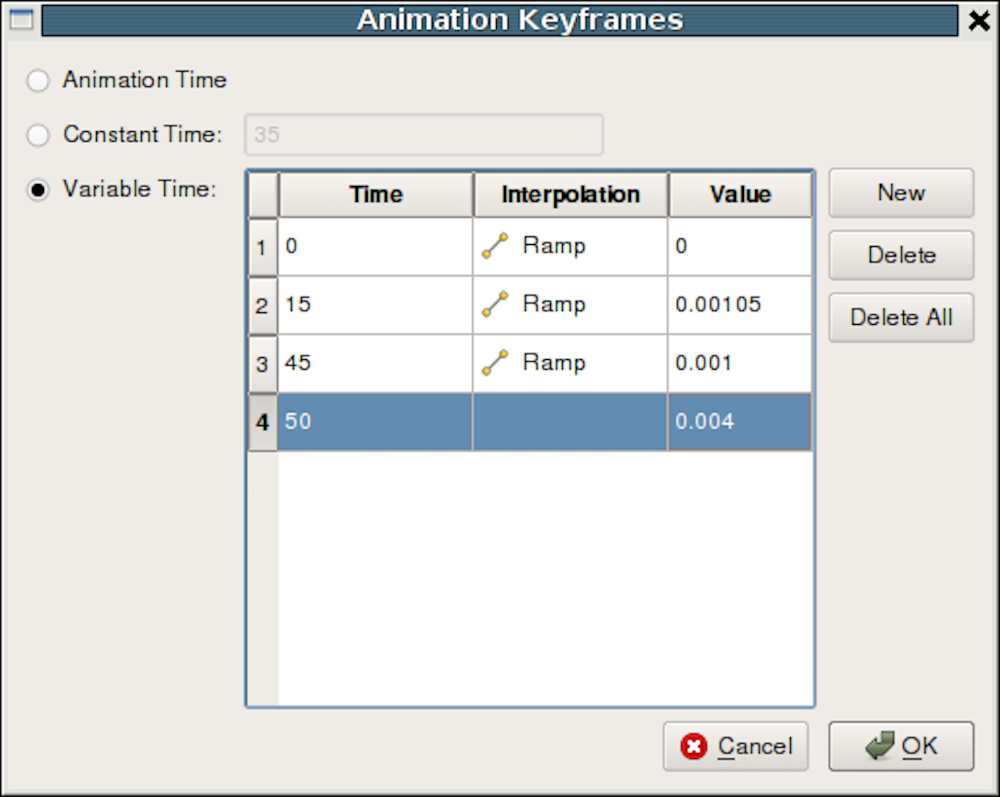

    Controlling Data Time with keyframes.

.. %Animation Settings
   ===================
   %
   %\begin{figure}[htb]
   %\begin{center}
   %\includegraphics[width=0.6\linewidth]{Images/ParaViewUsersGuideAnimationSettings.png}
   %\caption{Animation Settings}
   %.. _fig:AnimationSettings:
   %\end{center}
   %\end{figure}
   %
   %
   %Additional animation properties can be changed using the  ``Animation`` :index:`\ <Animation>`\  page in the
   %:guilabel:`Edit > Settings` dialog. Using these settings seen in
   %:numref:`fig:AnimationSettings`, you can
   %control whether geometry must be cached to improve playback performance during
   %looping, as well as the maximum size of geometry to cache to avoid memory
   %overflows.

Playing an animation
====================

Once you have designed your animation, you can play through it with the VCR
controls toolbar seen in :numref:`fig:VCRControlsToolbar`.

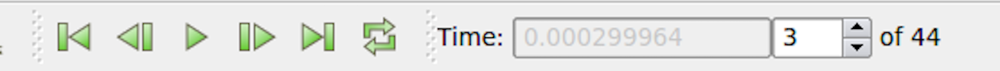
    
    ``VCR Controls`` :index:`\ <VCR Controls>`\  and  ``Current Time Controls`` :index:`\ <Current Time Controls>`\  toolbars in |paraview|.

Animating the camera
====================

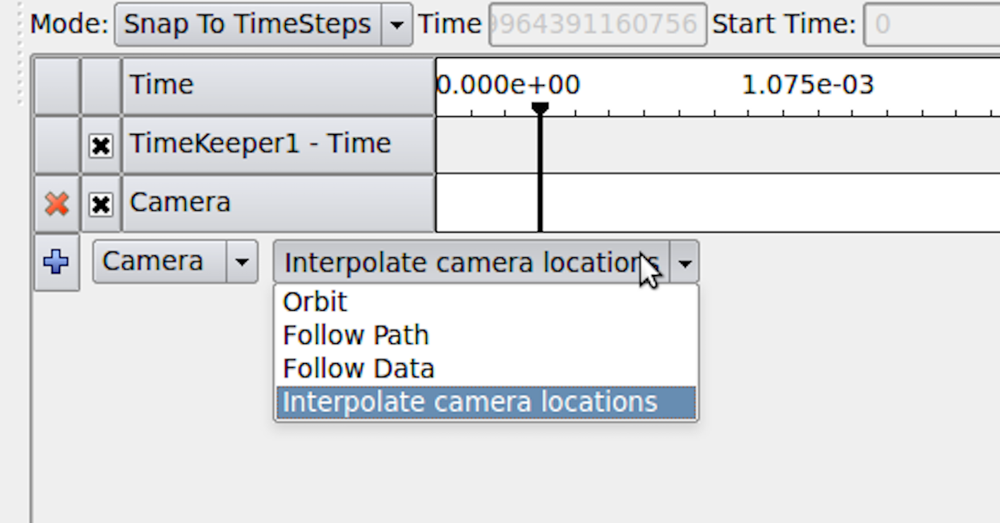

    Add camera track.

Just like you can change parameters on sources and filters in an animation, you
can also change the camera parameters. As seen in
:numref:`fig:AddCameraTrack`, you can add
animation tracks to animate the camera for all the 3D render views in the setup
separately. To add a camera animation track for a view, with the view selected,
click on the  ``+`` :index:`\ <+>`\  button after choosing ``Camera`` from the first drop-down menu. The
second drop-down list allows you to choose how to animate the camera. There are
three possible options, each of which provides different mechanisms to specify
the keyframes. It's not possible to change the mode after the animation track
has been added, but you can simply delete the track and create a new one.

Interpolate camera locations
^^^^^^^^^^^^^^^^^^^^^^^^^^^^

In this mode, you specify camera position, focal point, view angle, and
up direction at each keyframe. The animation player interpolates between these
specified locations. As with other parameters, to edit the keyframes,
double-click on the track. It is also possible to capture the current location
as a keyframe by using the  ``Use Current`` :index:`\ <Use Current>`\  button.

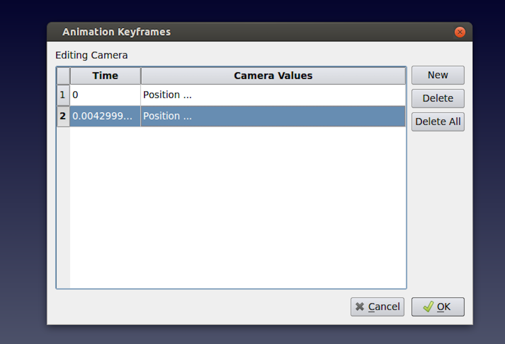

    Setting animation parameters.

It can be quite challenging to add keyframes correctly and frequently to ensure
that the animation results in a smooth visualization using this mode.

Orbit
^^^^^

This mode makes it possible to quickly create a camera animation in which the
camera revolves around objects of interest. Before adding the  ``Camera`` :index:`\ <Camera>`\  track,
select the objects in the pipeline browser that you want to revolve around;
then choose  ``Orbit from the Camera`` :index:`\ <Orbit from the Camera>`\  combo-box in the  ``Animation View`` :index:`\ <Animation View>`\ , and hit  ``+`` :index:`\ <+>`\ .
This will pop up a dialog where you can edit the orbit parameters such as the
center of revolution, the normal for the plane of revolution, and the origin (i.e., a
point on the plane where the revolution begins). By default, the ``Center`` is the
center of the bounds of the selected objects, the ``Normal`` is the current up direction
used by the camera, while the origin is the current camera position.

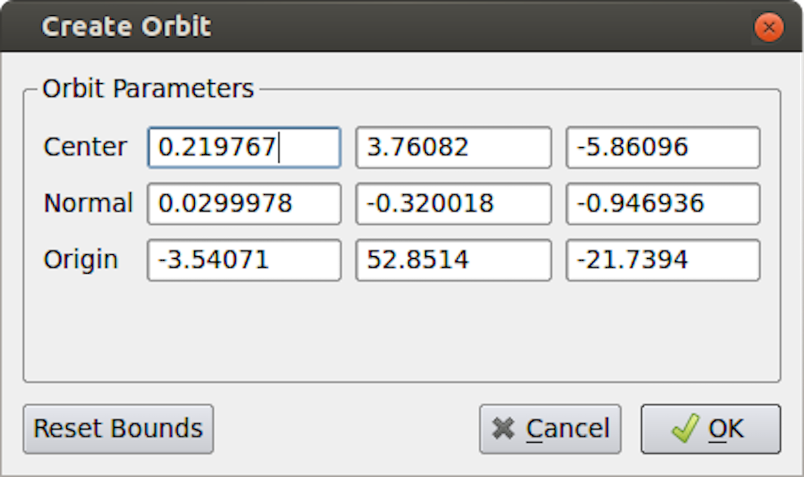

    Creating a camera orbit.

Follow path
^^^^^^^^^^^

In this mode, you get the opportunity to specify the path taken by the camera
position and the camera focal point. By default, the path is set up to orbit around
the selected objects. You can then edit the keyframe to change the paths.

:numref:`fig:CreatingCameraPath` shows the dialog for editing these paths for
a keyframe. When Camera Position or Camera Focus is selected, a widget is shown
in the 3D view that can be used to set the path. Use |CTRL| + :kbd:`Left Click` to
insert new control points, and |SHIFT| + :kbd:`Left Click` to remove control
points. You can also toggle when the path should be closed or not.

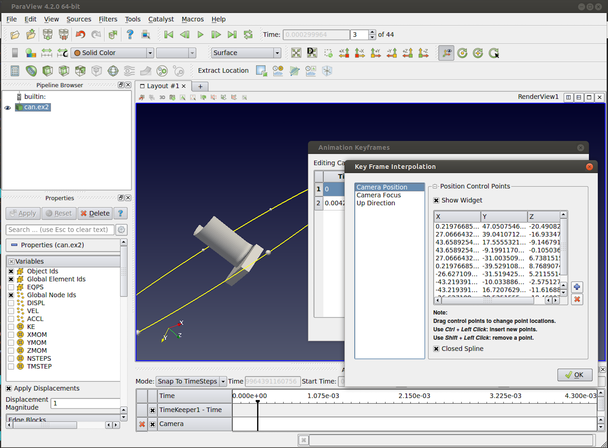

    Creating a camera path.
