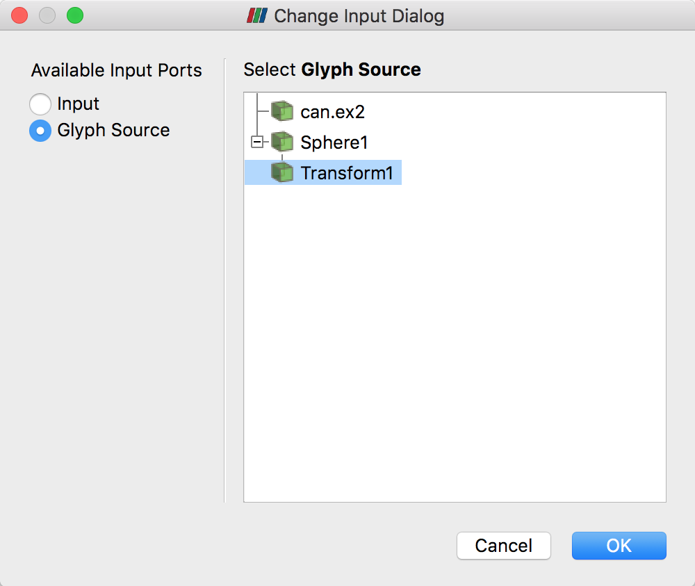
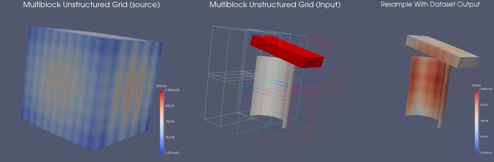

.. include:: ../macros.hrst
.. include:: ../abbreviations.hrst

.. _chapter:FilteringData:
.. _ch:FilteringData:

Filtering Data
##############

Visualization can be characterized as a process of transforming raw data
produced from experiments or simulations until it takes a form in which it can be
interpreted and analysed. The visualization pipeline introduced in
:numref:`sec:BasicsOfVisualization` formalizes this concept as a data flow
paradigm where a pipeline is set up of sources, filters, and sinks
(collectively called pipeline modules or algorithms). Data *flows*
through this pipeline, being transformed at each node until it is in a form where
it can be consumed by the sinks. In previous chapters, we saw how to ingest data
into |ParaView| (:numref:`chapter:LoadingData`) and how to display it in
views (:numref:`chapter:DisplayingData`). If the data ingested into |ParaView|
already has all the relevant attribute data, and it is in the form that can be directly
represented in one the existing views, then that is all you would need.
The true power of the visualization process, however, comes from leveraging the
various visualization techniques such as slicing, contouring, clipping, etc.,
which are available as filters. In this chapter, we look at constructing
pipelines to transform data using such filters.

Understanding filters
=====================

In |ParaView|, filters are pipeline modules or algorithms that have inputs and
outputs. They take in data on their inputs and produce transformed data or
results on their outputs. A filter can have multiple input and output ports.
:index:`\ <Input Port>`\  :index:`\ <Output Port>`\  The
number of input and output ports on a filter is fixed. Each input port accepts
input data for a specific purpose or role within the filter. (E.g., the
``Resample With Dataset`` :index:`\ <Resample With Dataset>`\  filter has two input ports. The one called  ``Input`` :index:`\ <Input>`\ 
is the input port through which the dataset providing the attributes to
interpolate is ingested. The other, called  ``Source`` :index:`\ <Source>`\ , is the input port
through which the dataset used as the mesh on which to re-sample is accepted.)

    A filter is a pipeline module with inputs and outputs.
    Data enters a filter through the inputs. The filter transforms the data and
    produces the resulting data on its outputs. A filter can have one or more input
    and output ports. Each input port can optionally accept multiple input
    connections.

An input port itself can optionally accept multiple input connections, e.g., the
``Append Datasets`` :index:`\ <Append Datasets>`\  filter, which appends multiple datasets to create a single
dataset only has one input port (named  ``Input`` :index:`\ <Input>`\ ). However, that port can accept
multiple connections for each of the datasets to be appended  :index:`\ <Input
Connections>`\ . Filters define
whether a particular input port can accept one or many input connections.

Similar to readers, the properties on the filter allow you to control the
filtering algorithm. The properties available depend on the filter itself.

.. \fixme{talk a little more about how different filters do different or similar things
  and which filter to pick greatly depends on your memory etc etc e.g. difference in Clip
  and Extract Subset and Slice etc.}

Creating filters in ``paraview``
================================

All available filters in |paraview| are listed under the :guilabel:`Filters`
menu. These are organized in various categories. To create a filter to transform
the data produced by a source or a reader, you select the source in the  ``Pipeline
Browser`` :index:`\ <Pipeline Browser>`\  
to make it active, and then click on the corresponding menu item in the
:guilabel:`Filters` menu. If a menu item is disabled, it implies that the active source
does not produce data that can be transformed by this filter.

.. admonition:: **Did you know?**
  :class: tip

    If a menu item in the :guilabel:`Filters` menu is disabled, it implies that the active
    source(s) is not producing data of the expected type or the characteristics needed
    by the filter. On Windows and Linux machines, if you hover over the disabled
    menu item, the status bar will show the reason why the filter is not available.

    .. figure:: ../images/DisabledFilterStatusBar.png
      :width: 70%
      :align: center

Multiple input connections
^^^^^^^^^^^^^^^^^^^^^^^^^^

When you create a filter, the active source is connected to the first input port
of the filter. Filters like  ``Append Datasets`` :index:`\ <Append Datasets>`\  can take multiple input
connections on that input port. In such a case, to pass multiple pipeline
modules as connections on a single input port of a filter, select all the
relevant pipeline modules in the  ``Pipeline Browser`` :index:`\ <Pipeline Browser>`\ . You can select multiple
items by using the |CTRL| (or |CMD|) and |SHIFT| key
modifiers. When multiple pipeline modules are selected, only the filters that
accept multiple connections on their input ports will be enabled in the
:guilabel:`Filters` menu.

.. \fixme{We need a chapter in the Reference Manual on Pipeline
  browser explaining how to interpret pipelines in the Pipeline browser and how to
  use it e.g. right clicking, selections etc.}

    The  ``Pipeline Browser`` :index:`\ <Pipeline Browser>`\  showing a pipeline with multiple input
    connections. The  ``Append Datasets`` :index:`\ <Append Datasets>`\  filter has two input connections on its
    only input port,  ``Sphere0`` :index:`\ <Sphere0>`\  and  ``Cone0`` :index:`\ <Cone0>`\ .

Multiple input ports
^^^^^^^^^^^^^^^^^^^^

Most filters have just one input port. Hence, as soon as you click on the filter
name in the :guilabel:`Filters` menu, it will create a new filter instance and that
will show up in the  ``Pipeline Browser`` :index:`\ <Pipeline Browser>`\ . Certain filters, such as  ``Resample
With Dataset`` :index:`\ <Resample
With Dataset>`\ , have multiple inputs that must be set up before the filter can be
created. In such a case, when you click on the filter name, the  ``Change Input
Dialog`` :index:`\ <Change Input
Dialog>`\  will pop up, as seen in :numref:`fig:ChangeInputDialog`.
This dialog allows you to select the pipeline modules to be
connected to each of the input ports. The active source(s) is connected by
default to the first input port. You are free to change those as well.

    The  ``Change Input Dialog`` :index:`\ <Change Input Dialog>`\  is shown to allow you to pick inputs for
    each of the input ports for a filter with multiple input ports. To use this
    dialog, first select the  ``Input Port`` :index:`\ <Input Port>`\  you want to edit on the left side, and
    select the pipeline module(s) that are to be connected to this input port.
    Repeat the step for the other input port(s). If an input port can accept
    multiple input connections, you can select multiple modules, just like in the
    ``Pipeline Browser`` :index:`\ <Pipeline Browser>`\ .

Changing input connections
^^^^^^^^^^^^^^^^^^^^^^^^^^

|paraview| allows you to change the inputs to a filter after the
filter has been created. To change inputs to a filter, right-click on the filter
in the  ``Pipeline Browser`` :index:`\ <Pipeline Browser>`\  to get the context menu, and then select  ``Change
Input...`` :index:`\ <Change
Input...>`\ . This will pop up the same  ``Change Input Dialog`` :index:`\ <Change Input Dialog>`\  as when creating a
filter with multiple input ports. You can use this dialog to set new inputs
for this filter.

    The context menu in the  ``Pipeline Browser`` :index:`\ <Pipeline Browser>`\  showing the option to
    change inputs for a filter.

.. admonition:: **Did you know?**
  :class: tip

  While the :guilabel:`Filters` menu is a handy way to create new filters, with the long list
  of filters available in |ParaView|, manually finding a particular filter in this
  menu can be very challenging. To make it easier, |ParaView| incorporates a quick
  launch mechanism. When you want to create a new filter (or a source), simply type
  |CTRL| + |SPACE| or |ALT| + |SPACE|. This will pop up
  the quick-launch dialog. Now, start typing the name of the filter you want. As
  you type, the dialog will update to show the filters and sources that match the
  typed text. You can use the arrow keys to navigate and use the |ENTER| key
  to create the selected filter (or source). Note that filters may be disabled,
  as was the case in the :guilabel:`Filters` menu but by default the selected item
  will be the first enabled filter.
  You can use |ESC| to clear the text you have typed so far. Hit the
  |ESC| a second time, and the dialog will close without creating any new
  filter.
  You can also display the quick-launch dialog using
  |CTRL| + |SHIFT| + |SPACE|, |ALT| + |SHIFT| + |SPACE|, or |CMD| + |SHIFT| + |SPACE|.
  In this case, the selected filter will be automatically applied once created i.e. equivalent to
  creating the filter and then clicking the  ``Apply`` :index:`\ <Apply>`\  button.

  .. figure:: ../images/QuickLaunchDialog.png
       :width: 50%
       :align: center

Creating filters in ``pvpython``
================================

To create a filter in |pvpython|, you simply create the object by
using its name as a constructor function.

.. code-block:: python

  >>> from paraview.simple import *
      ...
  >>> filter = Shrink()

Similar to |paraview|, the filter will use the active source(s) as
the input. Additionally, you can explicitly specify the input in the function
arguments.

.. code-block:: python

  >>> reader = OpenDataFile(...)
      ...
  >>> shrink = Shift(Input=reader)

Multiple input connections
^^^^^^^^^^^^^^^^^^^^^^^^^^

To setup multiple input connections, you can specify the connections as follows:

.. code-block:: python

  >>> sphere = Sphere()
  >>> cone = Cone()
  
  # Simply pass the sources as a list to the constructor function.
  >>> appendDatasets = AppendDatasets(Input=[sphere, cone])
  >>> print(appendDatasets.Input)
  [<paraview.servermanager.Sphere object at 0x6d75f90>, <paraview.servermanager.Cone object at 0x6d75c50>]

Multiple input ports
^^^^^^^^^^^^^^^^^^^^

Setting up connections to multiple input ports is similar to the multiple input
connections, except that you need to ensure that you name the input ports properly.

.. code-block:: python

  >>> sphere = Sphere()
  >>> wavelet = Wavelet()
  
  >>> resampleWithDataSet = ResampleWithDataset(Input=sphere, Source=wavelet)

.. _subsection:ChangingInputConnectionsPython:

Changing input connections
^^^^^^^^^^^^^^^^^^^^^^^^^^

Changing inputs in Python is as simple as setting any other property on the
filter.

.. code-block:: python

  # For filter with single input connection
  >>> shrink.Input = cone
  
  # for filters with multiple input connects
  >>> appendDatasets.Input = [reader, cone]
  
  # to add a new input.
  >>> appendDatasets.Input.append(sphere)
  
  # to change multiple ports
  >>> resampleWithDataSet.Input = wavelet2
  >>> resampleWithDataSet.Source = cone
  

Changing filter properties in ``paraview``
==========================================

Filters provide properties that you can change to control the processing
algorithm employed by the filter. Changing and viewing properties on filters is
the same as with any other pipeline module, including readers and sources.
You can view and change these properties, when available, using the
``Properties`` :index:`\ <Properties>`\  panel.
:numref:`chapter:PropertiesPanel` covers how to effectively use the
``Properties`` :index:`\ <Properties>`\  panel. Since this panel only shows the properties present on the
*active source* :index:`\ <Active Source>`\ , you must ensure that the filter
you are interested in is active. To make the filter active, use the  ``Pipeline
Browser`` :index:`\ <Pipeline
Browser>`\  to click on the filter and select it.

Changing filter properties in ``pvpython``
==========================================

With |pvpython|, the available properties are accessible as properties
on the filter object, and you can get or set their values by name (similar to
changing the input connections
(:numref:`subsection:ChangingInputConnectionsPython`)).

.. code-block:: python

  # You can save the object reference when it's created.
  >>> shrink = Shrink()
  
  # Or you can get access to the active source.
  >>> Shrink() # <-- this will make the Shrink the active source.
  >>> shrink = GetActiveSource()
  
  # To figure out available properties, you can always use help.
  >>> help(shrink)
  Help on Shrink in module paraview.servermanager object:
  
  class Shrink(SourceProxy)
   |  The Shrink filter
   |  causes the individual cells of a dataset to break apart
   |  from each other by moving each cell\'s points toward the
   |  centroid of the cell. (The centroid of a cell is the
   |  average position of its points.) This filter operates on
   |  any type of dataset and produces unstructured grid
   |  output.
   |  ----------------------------------------------------------------------
   |  Data descriptors defined here:
   |
   |  Input
   |      This property specifies the input to the Shrink
   |      filter.
   |
   |  ShrinkFactor
   |      The value of this property determines how far the points
   |      will move. A value of 0 positions the points at the centroid of the
   |      cell; a value of 1 leaves them at their original
   |      positions.
   ....
  
  # To get the current value of a property:
  >>> sf = shrink.ShrinkFactor
  >>> print sf
  0.5
  
  # To set the value
  >>> shrink.ShrinkFactor = 0.75

In the rest of this chapter, we will discuss some of the commonly used filters
in detail. They are grouped under categories based on the type of operation that they
perform.

Filters for sub-setting data
============================

These filters are used for extracting subsets from an input dataset. How this
subset is defined and how it is extracted depends on the type of the filter.

Clip
^^^^

``Clip`` :index:`\ <Clip>`\  is used to clip any dataset using either an implicit function (such as
a plane, sphere, or a box) or using values of a scalar data array in the input
dataset. A scalar array is a point or cell attribute array with a single
component. Clipping involves iterating over all cells in the input dataset and then
removing those cells that are considered *outside* of the space defined by
the implicit function or that have an attribute values less than the selected value.
For cells that straddle the clipping surface, these are *clipped* to pass
through the part of the cell that is truly inside the specified implicit
function (or greater than the scalar value).

This filter converts any dataset into an unstructured grid
(:numref:`sec:VTKDataModel:UnstructuredGrid`) or a multi-block of
unstructured grids (:numref:`sec:MultiblockDataset`) in the case of composite
datasets.

Clip in ``paraview``
--------------------

    
    Comparison between results produced by the  ``Clip`` :index:`\ <Clip>`\  filter with
    ``Crinkle Clip`` :index:`\ <Crinkle Clip>`\  unchecked (left) and checked (right) when clipping with an
    implicit plane. The image on the left also shows the 3D widget used to
    interactivly place the implicit plane for the clipping operation.

To create the  ``Clip`` :index:`\ <Clip>`\  filter, you can use the :guilabel:`Filters > Common` or
the :guilabel:`Filters > Alphabetical` menu. This filter is also accessible from the
``Common`` :index:`\ <Common>`\  filters toolbar. You can click the |pqClip24| button to create
this filter.

    The  ``Common`` :index:`\ <Common>`\  filters toolbar in |paraview| for quick
    access to the commonly used filters.

On the  ``Properties`` :index:`\ <Properties>`\  panel, you will see the available properties for this
filter. One of the first things that you should select is the  ``Clip Type`` :index:`\ <Clip Type>`\ .
``Clip Type`` :index:`\ <Clip Type>`\  is used to specify the type of implicit function to use for the
clipping operations. The available options include  ``Plane`` :index:`\ <Plane>`\ ,  ``Box`` :index:`\ <Box>`\ ,
``Sphere`` :index:`\ <Sphere>`\ , and  ``Scalar`` :index:`\ <Scalar>`\ . Selecting any one of these options will update
the panel to show properties that are used to define the implicit function, e.g.,
the  ``Origin`` :index:`\ <Origin>`\  and the  ``Normal`` :index:`\ <Normal>`\  for the  ``Plane`` :index:`\ <Plane>`\  or the  ``Center`` :index:`\ 
`\  and
the  ``Radius`` :index:`\ <Radius>`\  for the  ``Sphere`` :index:`\ <Sphere>`\ . If you select  ``Scalar`` :index:`\ <Scalar>`\ , the panel will let
you pick the data array and the value with which to clip. Remember, cells with the
data value greater than or equal to the selected value are considered *in*
and are passed through the filter.

.. admonition:: **Did you know?**
  :class: tip

  When clipping with implicit functions, |ParaView| renders widgets in the active
  view that you can use to interactively control the implicit function, called
  ``3D widgets`` :index:`\ <3D widgets>`\ . As you interact with the 3D widget, the panel will update to
  reflect the current values. The 3D widget is considered as an aid and not as a part
  of the actual visualization scene. Thus, if you change the active source and the
  ``Properties`` :index:`\ <Properties>`\  panel navigates away from this filter, the 3D widget will
  automatically be hidden.

The  ``Inside Out`` :index:`\ <Inside Out>`\  option can be used to invert the behavior of this filter.
Basically, it flips the notion of what is considered inside and outside of the given
clipping space.

Check  ``Crinkle Clip`` :index:`\ <Crinkle Clip>`\  if you don't want this filter to truly clip cells on the
boundary, but want to preserve the input cell structure and to pass the entire cell on through the
boundary (:numref:`fig:CrinkleClipComparison`).
This option is not available when clipping by  ``Scalar`` :index:`\ <Scalar>`\ .

Clip in ``pvpython``
--------------------

This following script demonstrates various aspects of using the  ``Clip`` :index:`\ <Clip>`\  filter
in |pvpython|.

.. code-block:: python

  # Create the Clip filter.
  >>> clip = Clip(Input=...)
  
  # Specify a 'ClipType' to use.
  >>> clip.ClipType = 'Plane'
  
  # You can also use the SetProperties API instead.
  >>> SetProperties(clip, ClipType='Plane')
  
  >>> print(clip.GetProperty('ClipType').GetAvailable())
  ['Plane', 'Box', 'Sphere', 'Scalar']
  
  # To set the plane origin and normal
  >>> clip.ClipType.Origin = [0, 0, 0]
  >>> clip.ClipType.Normal = [1, 0, 0]
  
  # If you want to change to Sphere and set center and
  # radius, you can do the following.
  >>> clip.ClipType = 'Sphere'
  >>> clip.ClipType.Center = [0, 0, 0]
  >>> clip.ClipType.Radius = 12
  
  # Using SetProperties API, the same looks like
  >>> SetProperties(clip, ClipType='Sphere')
  >>> SetProperties(clip.ClipType, Center=[0, 0, 0],
                                   Radius = 12)
  
  # To set Crinkle clipping.
  >>> clip.Crinkleclip = 1
  
  # For clipping with scalar, you pick the scalar array
  # and then the value as follows:
  >>> clip.ClipType = 'Scalar'
  >>> clip.Scalars = ('POINTS', 'Temp')
  >>> clip.Value = 100
  
.. code-block:: python

  # As always, to get the list of available properties on
  # the clip filter, use help()
  >>> help(clip)
  Help on Clip in module paraview.servermanager object:
  
  class Clip(SourceProxy)
   |  The Clip filter
   |  cuts away a portion of the input dataset using an
   |  implicit plane. This filter operates on all types of data
   |  sets, and it returns unstructured grid data on
   |  output.
   |
   |  ----------------------------------------------------------------------
   |  Data descriptors defined here:
   |
   |  ClipType
   |      This property specifies the parameters of the clip
   |      function (an implicit plane) used to clip the dataset.
   |
   |  Crinkleclip
   |      This parameter controls whether to extract entire cells
   |      in the given region or clip those cells so all of the output one stay
   |      only inside that region.
   |
   |  Input
   |      This property specifies the dataset on which the Clip
   |      filter will operate.
   |
   |  InsideOut
   |      If this property is set to 0, the clip filter will
   |      return that portion of the dataset that lies within the clip function.
   |      If set to 1, the portions of the dataset that lie outside the clip
   |      function will be returned instead.
   ...
  
  # To get help on a specific implicit function type, make it the active
  # ClipType and then use help()
  >>> clip.ClipType = 'Plane'
  >>> help(clip.ClipType)
  Help on Plane in module paraview.servermanager object:
  
  class Plane(Proxy)
    ...

.. \fixme{Missing GetAvailable API on ArraySelectionProperty. Also the API to get the available values is terrible. Need to fix it}

.. admonition:: **Common Errors**
  :class: error

  It is very easy to forget that clipping a structured dataset such as image
  data can dramatically increase the memory requirements, since this filter will
  convert the structured dataset into an unstructured grid due to the nature of
  the clipping operation itself. For structured dataset, think about using
  ``Slice`` :index:`\ <Slice>`\  or  ``Extract Subset`` :index:`\ <Extract Subset>`\  filters instead, whenever appropriate. Those
  are not entirely identical operations, but they are often sufficient.

Slice
^^^^^

    Comparison between results produced by the  ``Slice`` :index:`\ <Slice>`\  filter
    when slicing image data with an implicit plane with different options.
    The lower-left image shows the output produced by the  ``Clip`` :index:`\ <Clip>`\  filter
    when clipping with the same implicit function, for contrast.

The  ``Slice`` :index:`\ <Slice>`\  filter slices through the input dataset with an implicit function
such as a plane, a sphere, or a box. Since this filter returns data elements along
the implicit function boundary, this is a dimensionality reducing filter (except
when crinkle slicing is enabled), i.e., if
the input dataset has 3D elements like tetrahedrons or hexahedrons, the output
will have 2D elements, line triangles, and quads, if any. While slicing through a
dataset with 2D elements, the result will be lines.

The properties available on this filter, as well as the way of setting this
filter up, is very similar to the  ``Clip`` :index:`\ <Clip>`\  filter with a few notable
differences. What remains similar is the set up of the implicit function --
you have similar choices:  ``Plane`` :index:`\ <Plane>`\ ,  ``Box`` :index:`\ <Box>`\ ,  ``Sphere`` :index:`\ <Sphere>`\ , and  ``Cylinder`` :index:`\ <Cylinder>`\ , as well as the
option to toggle  ``Crinkle slice`` :index:`\ <Crinkle slice>`\  (i.e., to avoid cutting through cells,
pass complete cells from the input dataset that intersects the implicit function).

What is different includes the lack of slicing by  ``Scalar`` :index:`\ <Scalar>`\  (for that, you
can use the  ``Contour`` :index:`\ <Contour>`\  filter) and a new option,  ``Triangulate the slice`` :index:`\ <Triangulate the slice>`\ .
:numref:`fig:SliceComparisons`
shows the difference in the generated meshes when various slice properties are
changed.

The  ``Slice`` :index:`\ <Slice>`\  filter is more versatile than the  ``Slice`` :index:`\ <Slice>`\  representation. First,
the  ``Slice`` :index:`\ <Slice>`\  representation is available for image datasets only, whereas the
``Slice`` :index:`\ <Slice>`\  filter can be used on any type of 3D dataset. Second, the representation
extracts a subset of the image consisting of a 2D slice oriented in the XY,
YZ, or XZ planes at the image voxel locations while the plane used by the filter
can be placed arbitrarily. Third, since the  ``Slice`` :index:`\ <Slice>`\  representation always
shows a flat object and lighting may interfere with interpretation of data values
on the slice, lighting is not applied to the  ``Slice`` :index:`\ <Slice>`\  representation. Lighting
is applied, however, to results from the  ``Slice`` :index:`\ <Slice>`\  filter. Lastly, the  ``Slice`` :index:`\ <Slice>`\ 
representation may be faster than the filter to update and scrub through different
slices because it does not need to compute the intersection of a plane with cells
in the dataset.

In |paraview|, this filter can be created using the
|pqSlice24| button on the  ``Common`` :index:`\ <Common>`\  filters toolbar, besides the
:guilabel:`Filters` menu.

Extract Subset
^^^^^^^^^^^^^^

    
    The  ``Properties`` :index:`\ <Properties>`\  panel for the  ``Extract Subset`` :index:`\ <Extract Subset>`\  filter showing all
    available properties (including the advanced properties).

For structured datasets such as
image datasets (:numref:`sec:VTKDataModel:UniformRectilinearGrid`), rectilinear grids
(:numref:`sec:VTKDataModel:RectilinearGrid`), and
curvilinear grids (:numref:`sec:VTKDataModel:CurvilinearGrid`),  ``Extract
Subset`` :index:`\ <Extract
Subset>`\  filter can be used to extract a region of interest or a subgrid. The
region to extract is specified using structured coordinates, i.e., the
:math:`i`, :math:`j`, :math:`k` values. Whenever possible, this filter should be preferred over
``Clip`` :index:`\ <Clip>`\  or  ``Slice`` :index:`\ <Slice>`\  for structured datasets, since it preserves the input
data type. Besides extracting a subset, this filter can also be used to resample
the dataset to a coarser resolution by specifying the sample rate along each of
the structured dimensions.

Extract Subset in ``paraview``
------------------------------

This is one of the filters available on the  ``Common`` :index:`\ <Common>`\  filters toolbar |pqExtractGrid24|
To specify the region of interest, use the  ``VOI`` :index:`\ <VOI>`\  property. The values are
specified as min and max values for each of the structured dimensions (:math:`i`, :math:`j`,
:math:`k`,) in each row.  ``Sample Rate I`` :index:`\ <Sample Rate I>`\ ,  ``Sample Rate J`` :index:`\ <Sample Rate J>`\ , 
and  ``Sample Rate K`` :index:`\ <Sample Rate K>`\  specify the sub-sampling rate. Set it to a value greater than one to sub-sample.
``Include Boundary`` :index:`\ <Include Boundary>`\  is used to determine if the boundary slab should be
included in the extracted result, if the sub-sampling rate along that dimension
is greater than 1, and the boundary slab would otherwise have been skipped.

Threshold
^^^^^^^^^

    
    Results from using the  ``Threshold`` :index:`\ <Threshold>`\  filter on the *iron_protein.vtk* dataset from |ParaView| data.

The  ``Threshold`` :index:`\ <Threshold>`\  filter
extracts the portions of the input dataset whose
scalars lie within the specified range. This filter operates on either
point-centered or cell-centered data. This filter operates on any type of
dataset and produces an unstructured grid output. To use this filter, you select
the  ``Scalars`` :index:`\ <Scalars>`\  with which to threshold, and then specify the data range that
selects which cells are included in the output.
When thresholding with cell data, all cells that have scalars within the
specified range will be passed through the filter. When thresholding with point
data, cells with *all* points with scalar values within the range are passed
through if  ``All Scalars`` :index:`\ <All Scalars>`\  is checked; otherwise, cells with *any* point
that passes the thresholding criteria are passed through.

Threshold in ``paraview``
-------------------------

    The  ``Properties`` :index:`\ <Properties>`\  panel for the  ``Threshold`` :index:`\ <Threshold>`\  filter.

This filter is represented as |pqThreshold24| on the  ``Common`` :index:`\ <Common>`\  filters
toolbar. After selecting the  ``Scalars`` :index:`\ <Scalars>`\  with which to threshold from the combo-box, you
select the  ``Minimum`` :index:`\ <Minimum>`\  and  ``Maximum`` :index:`\ <Maximum>`\  values to specify the range. If the
range shown by the sliders is not sufficient, you can manually type the values
in the input boxes. The values are deliberately not clamped to the current data
range. The  ``Scalars`` :index:`\ <Scalars>`\  combo-box uses icons to help you differentiate between
point data arrays |pqNodalData16| and cell data arrays |pqCellData16|

.. |pqNodalData16| image:: ../images/pqNodalData16.png
                   :width: 0.5cm

.. |pqCellData16| image:: ../images/pqCellData16.png
                  :width: 0.5cm

Threshold in ``pvpython``
-------------------------

.. code-block:: python

  # Create the filter. If Input is not specified, the active source will be
  # used as the input.
  >>> threshold = Threshold(Input=...)
  
  # Here's how to select a scalar array.
  >>> threshold.Scalars = ("POINTS", "scalars")
  
  # The value is a tuple with first value as the association:
  # either "POINTS" or "CELLS" and the second value is the name of the selected
  array.
  
  >>> print(threshold.Scalars)
  ['POINTS', 'scalars']
  
  >>>> print(threshold.Scalars.GetArrayName())
  'scalars'
  
  >>> print(threshold.Scalars.GetAssociation())
  'POINTS'
  
  # The threshold range is specified as:
  >>> threshold.ThresholdRange = [63.75, 252.45]

To determine the types of arrays available in the input dataset, and their
ranges, refer to the discussion on data information in
:numref:`sec:DataInformationInPython`.

Iso Volume
^^^^^^^^^^

The  ``Iso Volume`` :index:`\ <Iso Volume>`\  filter is similar to  ``Threshold`` :index:`\ <Threshold>`\  in that you use this to
create an output dataset from an input where the cells that satisfy the
specified range are scalar values. In fact, the filter is identical to
``Threshold`` :index:`\ <Threshold>`\  when the cell data scalars are selected. For point data scalars,
however, this filter acts similar to the  ``Clip`` :index:`\ <Clip>`\  filters when clipping with
scalars, in that cells are clipped along the iso-surface formed by the scalar range.

.. \fixme{this explanation could be improved.}

Extract Selection
^^^^^^^^^^^^^^^^^

``Extract Selection`` :index:`\ <Extract Selection>`\  is a general-purpose filter to extract selected elements
from a dataset. There are several ways of making selections in |ParaView|. Once
you have made the selection, this filter allows you to extract the selected
elements as a new dataset for further processing. We will cover this filter in
more detail when looking at selections in |ParaView| in
:numref:`sec:ExtractingSelections`.

Filters for geometric manipulation
==================================

These filters are used to transform the geometry of the dataset without affecting its topology or its connectivity.

Transform
^^^^^^^^^

The  ``Transform`` :index:`\ <Transform>`\  can be used to arbitrarily translate, rotate, and scale a
dataset. The transformation is applied by
scaling the dataset, rotating it, and then translating it
based on the values specified.

As this is a geometric manipulation filter, this filter does not affect
connectivity in the input dataset. While it tries to preserve the input dataset
type, whenever possible, there are cases when the transformed dataset can no
longer be represented in the same data type as the input. For example, with
image data (:numref:`sec:VTKDataModel:UniformRectilinearGrid`) and
rectilinear grids (:numref:`sec:VTKDataModel:RectilinearGrid`) that are
transformed by rotation, the output dataset can be non-axis aligned and, hence,
cannot be represented as either data types. In such cases, the dataset is
converted to a structured, or curvilinear, grid
(:numref:`sec:VTKDataModel:CurvilinearGrid`). Since curvilinear grids are
not as compact as the other two, the need to store the results in a more general
data type implies a considerable increase in the memory footprint.

Transform in ``paraview``
^^^^^^^^^^^^^^^^^^^^^^^^^

You can create a new  ``Transform`` :index:`\ <Transform>`\  from the :guilabel:`Filters > Alphabetical` menu.
Once created, you can set the transform as the translation, rotation, and scale
to use utilizing the  ``Properties`` :index:`\ <Properties>`\  panel. Similar to  ``Clip`` :index:`\ <Clip>`\ , this filter also
supports using a 3D widget to interactively set the transformation.

    The  ``Transform`` :index:`\ <Transform>`\  filter showing the 3D widget that can be used to interactively set the transform.

Transform  in ``pvpython``
^^^^^^^^^^^^^^^^^^^^^^^^^^

.. code-block:: python

  # To create the filter(if Input is not specified, the active source will be
  # used as the input).
  >>> transform = Transform(Input=...)
  
  # Set the transformation properties.
  >>> transform.Translate.Scale = [1, 2, 1]
  >>> transform.Transform.Translate = [100, 0, 0]
  >>> transform.Transform.Rotate = [0, 0, 0]

Reflect
^^^^^^^

    The  ``Reflect`` :index:`\ <Reflect>`\  filter can be used to reflect a dataset along a specific axis plane.

``Reflect`` :index:`\ <Reflect>`\  can be used to reflect any dataset across an axis plane. You can
pick the axis plane to be one of the planes formed by the bounding box of the
dataset. For that, set  ``Plane`` :index:`\ <Plane>`\  as  ``X Min`` :index:`\ <X Min>`\ ,  ``X Max`` :index:`\ <X Max>`\ ,  ``Y Min`` :index:`\ <Y Min>`\ ,  ``Y Max`` :index:`\ <Y Max>`\ ,
``Z Min`` :index:`\ <Z Min>`\ , or  ``Z Max`` :index:`\ <Z Max>`\ . To reflect across an arbitrary axis plane,
select  ``X`` :index:`\ <X>`\ ,  ``Y`` :index:`\ <Y>`\ , or  ``Z`` :index:`\ <Z>`\  for the  ``Plane`` :index:`\ <Plane>`\  property, and then set the
``Center`` :index:`\ 
`\  to the plane offset from the origin.

This filter reflects the input dataset and produces an unstructured grid
(:numref:`sec:VTKDataModel:UnstructuredGrid`). Thus, the same caveats for
``Clip`` :index:`\ <Clip>`\  and  ``Threshold`` :index:`\ <Threshold>`\  filter apply here when dealing with structured
datasets.

Warp By Vector
^^^^^^^^^^^^^^

    The  ``Warp By Vector`` :index:`\ <Warp By Vector>`\  filter can be used to
    displace points in original data shown on the left, using the
    *displacement* vectors (indicated by arrow glyphs :numref:`sec:Glyph`) to
    produce the result shown on the right.

``Warp By Vector`` :index:`\ <Warp By Vector>`\  can be used to displace point coordinates in an input mesh
using vectors in the dataset itself. You select the vectors to use utilizing the
``Vectors`` :index:`\ <Vectors>`\  property on the  ``Properties`` :index:`\ <Properties>`\  panel.  ``Scale Factor`` :index:`\ <Scale Factor>`\  can be
used to scale the displacement applied.

Warp By Scalar
^^^^^^^^^^^^^^

``Warp By Scalar`` :index:`\ <Warp By Scalar>`\  is similar to  ``Warp By Vector`` :index:`\ <Warp By Vector>`\  in the sense that it warps
the input mesh. However, it does so using a scalar array in the input dataset. The
direction of displacement can either be explicitly specified using the
``Normal`` :index:`\ <Normal>`\  property, or you can check  ``Use Normal`` :index:`\ <Use Normal>`\  to use normals at the
point locations.

Filters for sampling
====================

These filters compute new datasets that represent some essential features from
the datasets that they take as input.

.. _sec:Glyph:

Glyph
^^^^^

``Glyph`` :index:`\ <Glyph>`\  is used to place markers or glyphs at point locations in the input
dataset. The glyphs can be oriented or scaled based on vector and
scalar attributes on those points.

To create this filter in |paraview|, you can use the :guilabel:`Filters` menu,
as well as the |pqGlyph24|
button on the  ``Common`` :index:`\ <Common>`\  filters toolbar. You first select
the type of glyph using one of the options in  ``Glyph Type`` :index:`\ <Glyph Type>`\ . The choices
include  ``Arrow`` :index:`\ <Arrow>`\ ,  ``Sphere`` :index:`\ <Sphere>`\ ,  ``Cylinder`` :index:`\ <Cylinder>`\ , etc. Next, you select the point
arrays to use as the  ``Orientation Array`` :index:`\ <Orientation Array>`\  (selecting  ``No orientation array`` :index:`\ <No orientation array>`\ 
will result in the glyphs not being oriented). Similarly, you select a point array
to serve as the glyph  ``Scale Array`` :index:`\ <Scale Array>`\  (no scaling is performed if  ``No scale array`` :index:`\ <No scale array>`\ 
is chosen).

If the  ``Scale Array`` :index:`\ <Scale Array>`\  is set to a vector array, the  ``Vector Scale Mode`` :index:`\ <Vector Scale Mode>`\ 
property is available to select which properties of the vector should be used
to transform each glyph. If  ``Scale by Magnitude`` :index:`\ <Scale by Magnitude>`\  is chosen, then the glyph
at a point will be scaled by the magnitude of the vector at that point. If
``Scale by Components`` :index:`\ <Scale by Components>`\  is chosen, glyphs will be scaled separately in each
dimension by the vector component in that dimension.

    The  ``Properties`` :index:`\ <Properties>`\  panel for the  ``Glyph`` :index:`\ <Glyph>`\  filter.

The  ``Scale Factor`` :index:`\ <Scale Factor>`\  is used to apply a constant scaling to all the glyphs,
independent of the  ``Scale Array`` :index:`\ <Scale Array>`\  and  ``Vector Scale Mode`` :index:`\ <Vector Scale Mode>`\  properties.
Choosing a good scale factor depends on
several things including the bounds on the input dataset, the  ``Scale Array`` :index:`\ <Scale Array>`\ 
and  ``Vector Scale Mode`` :index:`\ <Vector Scale Mode>`\  selected, and the range for the array selected as the
``Scale Array`` :index:`\ <Scale Array>`\ . You can use the |ReloadButton|
button next to the  ``Scale Factor`` :index:`\ <Scale Factor>`\  widget to have |paraview|
pick a usually reasonable scale factor value based on the current dataset and
scaling properties.

.. |ReloadButton| image:: ../images/ReloadButton.png
                  :width: 0.5cm

The  ``Masking`` :index:`\ <Masking>`\  properties control which points from the input
dataset get glyphed. The  ``Glyph Mode`` :index:`\ <Glyph Mode>`\  controls how points are selected to be
glyphs (:numref:`fig:GlyphModesComparison`). The available options are as follows:

* ``All Points`` :index:`\ <All Points>`\ : This selects all points in the input dataset for glyphing.
  Use this mode with caution and only when the input dataset has relatively few
  points. Since all points in the input dataset are glyphed, this can not only
  cause visual clutter, but also clog up memory and take a long to time to
  generate and render the glyphs.

* ``Every Nth Points`` :index:`\ <Every Nth Points>`\ : This elects every :math:`n^{th}` point in the input dataset
  for glyphing, where :math:`n` can be specified using  ``Stride`` :index:`\ <Stride>`\ . Setting
  ``Stride`` :index:`\ <Stride>`\  to 1 will have the same effect as  ``All Points`` :index:`\ <All Points>`\ .

* ``Uniform Spatial Distribution`` :index:`\ <Uniform Spatial Distribution>`\ : This selects a random set of points. The
  algorithm works by first computing up to  ``Maximum Number of Sample Points`` :index:`\ <Maximum Number of Sample Points>`\ 
  in the space defined by the bounding box of the input dataset. Then, points
  in the input dataset that are close to the point in this set of sample points
  are glyphed. The  ``Seed`` :index:`\ <Seed>`\  is used to seed the random number generator used to
  generate the sample points. This ensures that the random sample points are
  reproducible and consistent.

.. figure:: ../images/GlyphModesComparison.png
    :name: fig:GlyphModesComparison
    :width: 80%
    :align: center

    Comparison between various  ``Glyph Mode`` :index:`\ <Glyph Mode>`\ s when applied to the same
    dataset generated by the  ``Wavelet`` :index:`\ <Wavelet>`\  source.

.. admonition:: **Did you know?**
  :class: tip

  The  ``Glyph`` :index:`\ <Glyph>`\  representation can be used for many of the same visualizations
  where a  ``Glyph`` :index:`\ <Glyph>`\  filter might be used. It may offer faster rendering and consume
  less memory than the  ``Glyph`` :index:`\ <Glyph>`\  filter with similar capabilities. In circumstances
  where generating a 3D geometry is required, e.g., when exporting glyph geometry
  to a file, the  ``Glyph`` :index:`\ <Glyph>`\  filter is required.

Glyph With Custom Source
^^^^^^^^^^^^^^^^^^^^^^^^

``Glyph With Custom Source`` :index:`\ <Glyph With Custom Source>`\  is the same as  ``Glyph`` :index:`\ <Glyph>`\ , except that instead of a limited
set of  ``Glyph Type`` :index:`\ <Glyph Type>`\ , you can select any data source producing a polygonal
dataset (:numref:`sec:VTKDataModel:PolyData`) available in the  ``Pipeline
Browser`` :index:`\ <Pipeline
Browser>`\ . To use this filter, select the data source you wish to glyph in the
``Pipeline Browser`` :index:`\ <Pipeline Browser>`\  and attach this filter to it. You will be presented a dialog
where you can set the  ``Input`` :index:`\ <Input>`\  (which defaults to the source you selected) and
the  ``Glyph Source`` :index:`\ <Glyph Source>`\ .

    
    Setting the  ``Input`` :index:`\ <Input>`\  and  ``Glyph Source`` :index:`\ <Glyph Source>`\  in the  ``Glyph With Custom Source`` :index:`\ <Glyph With Custom Source>`\ filter.

Stream Tracer
^^^^^^^^^^^^^

.. figure:: ../images/StreamlinesInParaView.png
    :name: fig:StreamlinesInParaView
    :width: 80%
    :align: center

    Streamlines generated from the ``disk_out_ref.ex2`` dataset
    using the  ``Point Source`` :index:`\ <Point Source>`\  (left) and the  ``High Resolution Line Source`` :index:`\ <High Resolution Line Source>`\ 
    (right). On the left, we also added the  ``Tube`` :index:`\ <Tube>`\  filter to the output of the
    ``Stream Tracer`` :index:`\ <Stream Tracer>`\  filter to generate 3D tubes rather than 1D polygonal lines,
    which can be hard to visualize due to lack of shading.

The  ``Stream Tracer`` :index:`\ <Stream Tracer>`\  filter is used to generate streamlines for vector fields.
In visualization, streamlines refer to curves that are instanteneously
tangential to the the vector field in the dataset. They provide an indication of
the direction in which the particles in the dataset would travel at that instant
in time. The algorithm works by taking a set of points, known as *seed*
points, in the dataset and then integrating the streamlines starting at these seed
points.

In |paraview|, you can create this filter using the :guilabel:`Filters`
menu, as well as the |pqStreamTracer24| button on the  ``Common`` :index:`\ <Common>`\ 
filters toolbar. To use
this filter, you first select the attribute array to use as the  ``Vectors`` :index:`\ <Vectors>`\  for
generating the streamline.  ``Integration Parameters`` :index:`\ <Integration Parameters>`\  let you fine tune the
streamline integration by specifying the direction to integrate,
``Integration Direction`` :index:`\ <Integration Direction>`\ , as well as the type of integration algorithm to
use,  ``Integrator Type`` :index:`\ <Integrator Type>`\ . Advanced integration parameters are available in the
advanced view of the  ``Properties`` :index:`\ <Properties>`\  panel that let you further tune the
integration, including specifying the step size and others. You use the
``Maximum Streamline Length`` :index:`\ <Maximum Streamline Length>`\  to limit the maximum length for the streamline --
the longer the length, the longer the generated streamlines.

    
    The  ``Properties`` :index:`\ <Properties>`\  panel showing the default properties for the
    ``Stream Tracer`` :index:`\ <Stream Tracer>`\  filter.

``Seeds`` :index:`\ <Seeds>`\  group lets you set how the seed points for generating the streamlines
are produced. You have two options:  ``Point Source`` :index:`\ <Point Source>`\ , which produces a point
clound around the user-specified  ``Point`` :index:`\ <Point>`\  based on the parameters specified,
and  ``High Resolution Line Source`` :index:`\ <High Resolution Line Source>`\ , which produces seed points along the user-specified
line. You can use the 3D widgets shown in the active  ``Render View`` :index:`\ <Render View>`\ 
to interactively place the center for the point cloud or for defining the line.

.. admonition:: **Did you know?**
  :class: tip
  
  The  ``Stream Tracer`` :index:`\ <Stream Tracer>`\  filter produces a polydata with 1D lines for each of the
  generated streamlines. Since 1D lines cannot be shaded like surfaces in the
  ``Render View`` :index:`\ <Render View>`\ , you can get visualizations where it is hard to follow the
  streamlines. To give the streamlines some 3D structure, you can apply the
  ``Tube`` :index:`\ <Tube>`\  filter to the output of the streamlines. The properties on the
  ``Tube`` :index:`\ <Tube>`\  filter let you control the thickness of the tubes. You can also vary
  the thickness of the tubes based on data array, e.g., the magnitude of the
  vector field at the sample points in the streamline!

A script using the  ``Stream Tracer`` :index:`\ <Stream Tracer>`\  filter in |paraview| typically
looks like this:

.. code-block:: python

  # find source
  >>> disk_out_refex2 = FindSource('disk_out_ref.ex2')
  
  # create a new 'Stream Tracer'
  >>> streamTracer1 = StreamTracer(Input=disk_out_refex2,
                                   SeedType='Point Source')
  >>> streamTracer1.Vectors = ['POINTS', 'V']
  
  # init the 'Point Source' selected for 'SeedType'
  >>> streamTracer1.SeedType.Center = [0.0, 0.0, 0.07999992370605469]
  >>> streamTracer1.SeedType.Radius = 2.015999984741211
  
  # show data in view
  >>> Show()
  
  # create a new 'Tube'
  >>> tube1 = Tube(Input=streamTracer1)
  
  # Properties modified on tube1
  >>> tube1.Radius = 0.1611409378051758
  
  # show the data from tubes in view
  >>> Show()
  

Stream Tracer With Custom Source
^^^^^^^^^^^^^^^^^^^^^^^^^^^^^^^^

``Stream Tracer`` :index:`\ <Stream Tracer>`\  allows you to specify the seed points either as a point cloud
or as a line source. However, if you want to provide your own seed points from
another data producer, use the  ``Stream Tracer With Custom Source`` :index:`\ <Stream Tracer With Custom Source>`\ . Similar to
``Glyph With Custom Source`` :index:`\ <Glyph With Custom Source>`\ , this filter allows you to pick a second input
connection to use as the seed points.

.. figure:: ../images/StreamTracerWithCustomSource.png
    :name: fig:StreamTracerWithCustomSource
    :width: 80%
    :align: center

    Streamlines generated from the ``disk_out_ref.ex2`` dataset using the output of the  ``Slice`` :index:`\ <Slice>`\  filter as the  ``Source`` :index:`\ <Source>`\  for seed points.

Resample With Dataset
^^^^^^^^^^^^^^^^^^^^^

    An example of  ``Resample With Dataset`` :index:`\ <Resample With Dataset>`\ . On the left is
    a multiblock tetrahedra mesh ( ``Input`` :index:`\ <Input>`\ ). The middle shows
    a multiblock unstructured grid ( ``Source`` :index:`\ <Source>`\ ). The outline of  ``Input`` :index:`\ <Input>`\  is
    also shown in this view. The result of applying the filter is shown on
    the right

``Resample With Dataset`` :index:`\ <Resample With Dataset>`\  samples the point and cell attributes of one dataset
on to the points of another dataset. The two datasets are supplied to the
filter using its two input ports:  ``Input`` :index:`\ <Input>`\ , which is the dataset that
provides the attributes to resample, and  ``Source`` :index:`\ <Source>`\ , which is the dataset that
provides the points to sample at. This filter is available under the
:guilabel:`Filters` menu.

Resample To Image
^^^^^^^^^^^^^^^^^

``Resample To Image`` :index:`\ <Resample To Image>`\  is a specialization of  ``Resample With Dataset`` :index:`\ <Resample With Dataset>`\ .
The filter takes one input and samples its point and cell attributes onto a
uniform grid of points. The bounds and extents of the uniform grid can be
specified using the properties panel. By default, the bounds are set to the
bounds of the input dataset. The output of the filter is an Image dataset.

    
    The  ``Properties`` :index:`\ <Properties>`\  panel for  ``Resample To Image`` :index:`\ <Resample To Image>`\  filter.

    An example of  ``Resample To Image`` :index:`\ <Resample To Image>`\ . The left portion shows the input
    (unstructured grid), and the middle displays the output image data.
    On the right is a volume rendering of the resampled data.

Some operations can be performed more efficiently on uniform grid datasets.
Volume rendering is one such operation. The  ``Resample to Image`` :index:`\ <Resample to Image>`\  filter can
be used to convert any dataset to Image data before performing such operations.

Probe
^^^^^

``Probe`` :index:`\ <Probe>`\  samples the input dataset at a specific point location to obtain the
cell data attributes for the cell containing the point as well as the interpolated point
data attributes. You can either use the  ``SpreadSheet View`` :index:`\ <SpreadSheet View>`\  or the
``Information`` :index:`\ <Information>`\  panel to inspect the probed values. The probe location can be
specified using the interactive 3D widget shown in the active  ``Render View`` :index:`\ <Render View>`\ .

Plot over line
^^^^^^^^^^^^^^

.. figure:: ../images/PlotOverLineInParaView.png
    :name: fig:PlotOverLineInParaView
    :width: 80%
    :align: center

    The  ``Plot Over Line`` :index:`\ <Plot Over Line>`\  filter applied to the ``disk_out_ref.ex2``
    dataset to plot values at sampled locations along the line. Gaps in the line correspond
    to the locations in the input dataset where the line falls outside the dataset.

``Plot Over Line`` :index:`\ <Plot Over Line>`\  will sample the input dataset along the specified line and
then plot the results in  ``Line Chart View`` :index:`\ <Line Chart View>`\ . Internally, this filter uses the
same mechanism as the  ``Probe`` :index:`\ <Probe>`\  filter, probing along the points in the
line to get the containing cell attributes and interpolated point attributes.

Using the  ``Resolution`` :index:`\ <Resolution>`\  property on the  ``Properties`` :index:`\ <Properties>`\  panel, you can control
the number of sample points along the line.

Filters for attribute manipulation
==================================

The filters covered in this section are used to add new attribute arrays to the
dataset, which are typically used to add derived quantities to use in pipelines for
further processing.

Calculator
^^^^^^^^^^

The  ``Calculator`` :index:`\ <Calculator>`\  filter computes a new data array or new point coordinates as a
function of existing input arrays. If point-centered arrays are used
in the computation of a new data array, the resulting array will also be
point-centered. Similarly, computations using cell-centered arrays will produce
a new cell-centered array. If the function is computing point coordinates
(requested by checking the  ``Coordinate Results`` :index:`\ <Coordinate Results>`\  property on the
``Properties`` :index:`\ <Properties>`\  panel) , the
result of the function must be a three-component vector. The  ``Calculator`` :index:`\ <Calculator>`\ 
interface operates similarly to a scientific calculator. In creating the
function to evaluate, the standard order of operations applies. Each of the
calculator functions is described below. Unless otherwise noted, enclose the
operand in parentheses using the ``(`` and ``)`` buttons.

*  ``Clear`` :index:`\ <Clear>`\ : Erase the current function.
* ``/``: Divide one scalar by another. The operands for this function are not required to be enclosed in parentheses.
* ``*``: Multiply two scalars, or multiply a vector by a scalar (scalar multiple). The operands for this function are not required to be enclosed in parentheses.
* ``-``: Negate a scalar or vector (unary minus), or subtract one scalar or vector from another. The operands for this function are not required to be enclosed in parentheses.
* ``+``: Add two scalars or two vectors. The operands for this function are not required to be enclosed in parentheses.
*  ``sin`` :index:`\ <sin>`\ : Compute the sine of a scalar.
*  ``cos`` :index:`\ <cos>`\ : Compute the cosine of a scalar.
*  ``tan`` :index:`\ <tan>`\ : Compute the tangent of a scalar.
*  ``asin`` :index:`\ <asin>`\ : Compute the arcsine of a scalar.
*  ``acos`` :index:`\ <acos>`\ : Compute the arccosine of a scalar.
*  ``atan`` :index:`\ <atan>`\ : Compute the arctangent of a scalar.
*  ``sinh`` :index:`\ <sinh>`\ : Compute the hyperbolic sine of a scalar.
*  ``cosh`` :index:`\ <cosh>`\ : Compute the hyperbolic cosine of a scalar.
*  ``tanh`` :index:`\ <tanh>`\ : Compute the hyperbolic tangent of a scalar.
*  ``min`` :index:`\ <min>`\ : Compute minimum of two scalars.
*  ``max`` :index:`\ <max>`\ : Compute maximum of two scalars.
*  ``x^y`` :index:`\ <x^y>`\ : Raise one scalar to the power of another scalar. The operands for this function are not required to be enclosed in parentheses.
*  ``sqrt`` :index:`\ <sqrt>`\ : Compute the square root of a scalar.
*  ``e^x`` :index:`\ <e^x>`\  Raise e to the power of a scalar.
*  ``log10`` :index:`\ <log10>`\ : Compute the logarithm of a scalar to the base 10.
*  ``ln`` :index:`\ <ln>`\ : Compute the logarithm of a scalar to the base :math:`e`.
*  ``ceil`` :index:`\ <ceil>`\ : Compute the ceiling of a scalar.
*  ``floor`` :index:`\ <floor>`\ : Compute the floor of a scalar.
*  ``abs`` :index:`\ <abs>`\ : Compute the absolute value of a scalar.
*  ``v1.v2`` :index:`\ <v1.v2>`\ : Compute the dot product of two vectors. The operands for this function are not required to be enclosed in parentheses.
*  ``cross`` :index:`\ <cross>`\ : Compute cross product of two vectors.
*  ``mag`` :index:`\ <mag>`\ : Compute the magnitude of a vector.
*  ``norm`` :index:`\ <norm>`\ : Normalize a vector. The operands are described below. The digits 0-9 and the decimal point are used to enter constant scalar values.
*  ``iHat`` :index:`\ <iHat>`\ ,  ``jHat`` :index:`\ <jHat>`\ , and  ``kHat`` :index:`\ <kHat>`\  are vector constants representing unit vectors in the X, Y, and Z directions, respectively.

The  ``Scalars`` :index:`\ <Scalars>`\  menu lists the names of the scalar arrays and the components of
the vector arrays of either the point-centered or
cell-centered data. The  ``Vectors`` :index:`\ <Vectors>`\  menu lists the names of the point-centered or
cell-centered vector arrays. The function will be computed for each point (or
cell) using the scalar or vector value of the array at that point (or cell). The
filter operates on any type of dataset, but the input dataset must have at
least one scalar or vector array. The arrays can be either point-centered or
cell-centered. The  ``Calculator`` :index:`\ <Calculator>`\  filter's output is of the same dataset type as
the input.

A common use-case is to convert three input scalars into a vector array. For that,
the  ``Function`` :index:`\ <Function>`\  would look something like:
:math:`scalar_x * iHat + scalar_y * jHat +  scalar_z * kHat`.

    The  ``Properties`` :index:`\ <Properties>`\  panel for the  ``Calculator`` :index:`\ <Calculator>`\  filter showing the advanced properties.

The  ``Properties`` :index:`\ <Properties>`\  panel provides access to several options for this filter.
Checking  ``Coordinate Results`` :index:`\ <Coordinate Results>`\ ,  ``Result Normals`` :index:`\ <Result Normals>`\ , or  ``Result TCoords`` :index:`\ <Result TCoords>`\ 
will set the computed array as the point coordinates, normals, or texture
coordinates, respectively.  ``Result Array Name`` :index:`\ <Result Array Name>`\  is used to specify a name for
the computed array. The default is ``Result``.

Sometimes, the expression can yield invalid values. To replace all invalid
values with a specific value, check the  ``Replace Invalid Results`` :index:`\ <Replace Invalid Results>`\  checkbox and
then enter the value to use to replace invalid values using the
``Replacement Value`` :index:`\ <Replacement Value>`\ . The output array data type is set with the  ``Result Array Type`` :index:`\ <Result Array Type>`\ 
property.

.. _sec:PythonCalculator:

Python calculator
^^^^^^^^^^^^^^^^^

    The Properties Panel for  ``Python Calculator.`` :index:`\ <Python Calculator.>`\ 

The  ``Python Calculator`` :index:`\ <Python Calculator>`\  is similar to  ``Calculator`` :index:`\ <Calculator>`\  in that
it processes one or more input arrays based on an expression provided by the
user to produce a new output array. However, it uses Python (and
*NumPy*) to do the computation. Therefore, it provides more expressive
expression capabilities.

Specify the  ``Expression`` :index:`\ <Expression>`\  to use, the  ``Array Association`` :index:`\ <Array Association>`\  to indicate
the array association ( ``Point Data`` :index:`\ <Point Data>`\  or  ``Cell Data`` :index:`\ <Cell Data>`\ ),
the name of output array ( ``Array Name`` :index:`\ <Array Name>`\ ), and a toggle
that controls whether the input arrays are copied to the output ( ``Copy
Array`` :index:`\ <Copy
Array>`\ ).

.. Note that the  ``Python Calculator`` :index:`\ <Python Calculator>`\  depends on Python and NumPy. All |ParaView|
  binaries distributed by Kitware are built with these to enable the calculator.
  If you have built |ParaView| yourself, you have to make sure that NumPy is
  installed and that ``PARAVIEW_ENABLE_PYTHON`` is turned on when
  configuring the |ParaView| build.

Basic tutorial
--------------

Start by creating a Sphere source and applying the  ``Python Calculator`` :index:`\ <Python Calculator>`\  to it. As
the first expression, use the following and apply:

.. code-block:: python

  5

This should create an array name *result* in the output point data. Note
that this is an array that has a value of 5 for each point. When the expression
results in a single value, the calculator will automatically make a constant
array. Next, try the following:

.. code-block:: python

  Normals

Now, the *result* array should be the same as the input array Normals. As
described in detail later, various functions are available through the
calculator. For example, the following is a valid expression:

.. code-block:: python

  sin(Normals) + 5

It is very important to note that the  ``Python Calculator`` :index:`\ <Python Calculator>`\  has to produce one value
per point or cell depending on the Array Association parameter. Most of the
functions described here apply individually to all point or cell values and
produce an array the same dimensions as the input. However, some of them, such
as  ``min()`` :index:`\ <min()>`\  and  ``max()`` :index:`\ <max()>`\ , produce single values.

.. admonition:: **Common Errors** 
  :class: error

  In the  ``Programmable Filter`` :index:`\ <Programmable Filter>`\ , all the functions in
  ``vtk.numpy_interface.algorithms`` :index:`\ <vtk.numpy_interface.algorithms>`\  are imported prior to executing the script.
  As a result, some built-in functions, such as  ``min`` :index:`\ <min>`\  and  ``max`` :index:`\ <max>`\ , are
  clobbered by that import. To use the built-in functions, import the  ``import __builtin__`` :index:`\ <import __builtin__>`\  
  module and access those functions with, e.g.,
  ``__builtin__.min`` :index:`\ <__builtin__.min>`\  and  ``__builtin__.max`` :index:`\ <__builtin__.max>`\ 

Accessing data
--------------

There are several ways of accessing input arrays within expressions. The
simplest way is to access it by name:

.. code-block:: python

  sin(Normals) + 5

This is equivalent to:

.. code-block:: python

  sin(inputs[0].PointData['Normals']) + 5

The example above requires some explanation. Here,  ``inputs[0]`` :index:`\ <inputs[0]>`\  refer to the
first input (dataset) to the filter.  ``Python Calculator`` :index:`\ <Python Calculator>`\  can accept multiple
inputs. Each input can be accessed as  ``inputs[0]`` :index:`\ <inputs[0]>`\ ,  ``inputs[1]`` :index:`\ <inputs[1]>`\ , ... You
can access the point or cell data of an input using the  ``.PointData`` :index:`\ <.PointData>`\  or
``.CellData`` :index:`\ <.CellData>`\  qualifiers. You can then access individual arrays within the
point or cell data containers using the  ``[]`` :index:`\ <[]>`\  operator. Make sure to use
quotes or double-quotes around the array name. Arrays that have names with
certain characters (such as space, +, -, \*, /) can only be accessed using this
method.

Certain functions apply directly on the input mesh. These filters expect an
input dataset as argument. For example,

.. code-block:: python

  area(inputs[0])

For data types that explicitly define the point coordinates, you can access the
coordinates array using the  ``.Points`` :index:`\ <.Points>`\  qualifier. The following extracts the
first component of the coordinates array:

.. code-block:: python

  inputs[0].Points[:,0]

Note that for certain data types, mainly image data (uniform rectilinear grids)
and rectilinear grids, point coordinates are defined implicitly and cannot be
accessed as an array.

Comparing multiple datasets
---------------------------

The  ``Python Calculator`` :index:`\ <Python Calculator>`\  can be used to compare multiple datasets, as shown by
the following example.

* Go to the Menu Bar, and select :guilabel:`File > Disconnect` to
  clear the Pipeline. 
  
* Select :guilabel:`Source > Mandelbrot`, and then click
  Apply, which will set up a default version of the Mandelbrot Set. The data for
  this set are stored in a :math:`251 \times 251` scalar array. 

* Select :guilabel:`Source > Mandelbrot` again, and then go to the  ``Properties`` :index:`\ <Properties>`\  panel and
  set the Maximum Number of Iterations to 50. Click  ``Apply`` :index:`\ <Apply>`\ , which will set up
  a different version of the Mandelbrot Set, represented by the same size array.

* Hold the Shift key down and select both of the Mandelbrot entries in the
  Pipeline Inspector, and then go to the Menu Bar, and select :guilabel:`Filter >
  Python Calculator`. The two Mandelbrot entries will now be shown as linked, as
  inputs, to the  ``Python Calculator`` :index:`\ <Python Calculator>`\ . 
  
* In the Properties panel for the Python
  Calculator filter, enter the following into the Expression box:

  .. code-block:: python

    inputs[1].PointData['Iterations'] - inputs[0].PointData['Iterations']

  This expression specifies the  difference between the second and the first
  Mandelbrot arrays. The result is saved in a new array called  ``results`` :index:`\ <results>`\ . The
  prefixes in the names for the array variables,  ``inputs[1]`` :index:`\ <inputs[1]>`\  and
  ``inputs[0]`` :index:`\ <inputs[0]>`\ , refer to the first and second Mandelbrot entries, respectively,
  in the Pipeline.  ``PointData`` :index:`\ <PointData>`\  specifies that the inputs contain point values.
  The quoted label  ``'Iterations'`` :index:`\ <'Iterations'>`\  is the local name for these arrays. Click
  ``Apply`` :index:`\ <Apply>`\  to initiate the calculation.

Click the  ``Display`` :index:`\ <Display>`\  tab in the  ``Properties Panel`` :index:`\ <Properties Panel>`\  for the  ``Python Calculator`` :index:`\ <Python Calculator>`\ ,
and go to the first tab to the right of the *Color by* label. Select the
item results in that tab, which will cause the display window to the right to
show the results of the expression we entered in the  ``Python Calculator`` :index:`\ <Python Calculator>`\ . The
scalar values representing the difference between the two Mandelbrot arrays are
represented by colors that are set by the current color map (see Edit Color
Map... for details).

There are a few things to note:

* ``Python Calculator`` :index:`\ <Python Calculator>`\  will always copy the mesh from the first input to its output.
* All operations are applied point-by-point. In most cases, this requires
  that the input meshes (topology and geometry) are the same. At the least, it
  requires that the inputs have the same number of points and cells.
* In parallel execution mode, the inputs have to be distributed exactly the
  same way across processes.

Basic Operations
----------------

The  ``Python Calculator`` :index:`\ <Python Calculator>`\  supports all of the basic arithmetic operations using the
:math:`+`, :math:`-`, :math:`*` and :math:`/` operators. These are always applied element-by-element to
point and cell data including scalars, vectors, and tensors. These operations
also work with single values. For example, the following adds 5 to all
components of all Normals.

.. code-block:: python

  Normals + 5

The following adds 1 to the first component, 2 to the second component, and 3 to
the third component:

.. code-block:: python

  Normals + [1,2,3]

This is specially useful when mixing functions that return single values. For
example, the following normalizes the Normals array:

.. code-block:: python

  (Normals - min(Normals))/(max(Normals) - min(Normals))

A common use case in a calculator is to work on one component of an array. This
can be accomplished with the following:

.. code-block:: python

  Normals[:, 0]

The expression above extracts the first component of the Normals vector. Here,
``:`` is a placeholder for "all elements". One element can be extracted by replacing
``:`` with an index. For example, the following creates a constant array from the
first component of the normal of the first point:

.. code-block:: python

  Normals[0, 0]

Alternatively, the following assigns the normal of the first point to all points:

.. code-block:: python

  Normals[0, :]

It is also possible to create a vector array from two or three scalar arrays using the  ``make_vector()`` :index:`\ <make_vector()>`\  function:

.. code-block:: python

  make_vector(velocity_x, velocity_y, velocity_z)

For temporal datasets, you also have access to the dataset timestep index or time value
in the expression as  ``t_index`` :index:`\ <t_index>`\  or  ``time_index`` :index:`\ <time_index>`\ , and  ``t_value`` :index:`\ <t_value>`\  or  ``time_value`` :index:`\ <time_value>`\ 
respectively. When dealing with multiple inputs, you can specify the same variable names scoped on the
appropriate input e.g.  ``inputs[0].t_index`` :index:`\ <inputs[0].t_index>`\ .

In some datasets, field data is used to store global data values not associated with cells or points.
To use field data in a  ``Python Calculator`` :index:`\ <Python Calculator>`\  expression, access it with the  ``FieldData`` :index:`\ <FieldData>`\  dictionary
available in the input as in the following example:

.. code-block:: python

  VolumeOfCell * inputs[0].FieldData['MaterialData'][time_index]

.. admonition:: **Did you know?**
  :class: tip

  Under the cover, the  ``Python Calculator`` :index:`\ <Python Calculator>`\  uses NumPy. All arrays in the
  expression are compatible with NumPy arrays and can be used where NumPy arrays
  can be used. For more information on what you can do with these arrays, consult
  with the NumPy references:cite:`numpy`.

Functions
---------

The following is a list of functions available in the  ``Python Calculator`` :index:`\ <Python Calculator>`\ .
Note that this is a partial list, since most of the NumPy and SciPy functions
can be used in the  ``Python Calculator`` :index:`\ <Python Calculator>`\ . Many of these functions can take
single values or arrays as argument.

* ``abs(x)`` :index:`\ <abs(x)>`\ : Returns the absolute value(s) of :math:`x`.

* ``add(x, y)`` :index:`\ <add(x y)>`\ : Returns the sum of two values. :math:`x` and :math:`y` can be single values or arrays. This is the same as :math:`x+y`.

* ``area(dataset)`` :index:`\ <area(dataset)>`\ : Returns the surface area of each cell in a mesh.

* ``aspect(dataset)`` :index:`\ <aspect(dataset)>`\ : Returns the aspect ratio of each cell in a mesh.

* ``aspect_gamma(dataset)`` :index:`\ <aspect_gamma(dataset)>`\ : Returns the aspect ratio gamma of each cell in a mesh.

* ``condition(dataset)`` :index:`\ <condition(dataset)>`\ : Returns the condition number of each cell in a mesh.

* ``cross(x, y)`` :index:`\ <cross(x y)>`\ : Returns the cross product for two 3D vectors from two arrays of 3D vectors.

* ``curl(array)`` :index:`\ <curl(array)>`\ : Returns the curl of an array of 3D vectors.

* ``divergence(array)`` :index:`\ <divergence(array)>`\ : Returns the divergence of an array of 3D vectors.

* ``divide(x, y)`` :index:`\ <divide(x y)>`\ : Element-by-element division. :math:`x` and :math:`y` can be single
  values or arrays. This is the same as math:`\frac{x}{y}`.

* ``det(array)`` :index:`\ <det(array)>`\ : Returns the determinant of an array of 2D square matrices.

* ``determinant(array)`` :index:`\ <determinant(array)>`\ : Returns the determinant of an array of 2D square matrices.

* ``diagonal(dataset)`` :index:`\ <diagonal(dataset)>`\ : Returns the diagonal length of each cell in a dataset.

* ``dot(a1, a2)`` :index:`\ <dot(a1 a2)>`\ : Returns the dot product of two scalars/vectors of two array of scalars/vectors.

* ``eigenvalue(array)`` :index:`\ <eigenvalue(array)>`\ : Returns the eigenvalue of an array of 2D square matrices.

* ``eigenvector(array)`` :index:`\ <eigenvector(array)>`\ : Returns the eigenvector of an array of 2D square matrices.

* ``exp(x)`` :index:`\ <exp(x)>`\ : Returns :math:`e^x`.

* ``global_max(array)`` :index:`\ <global_max(array)>`\ : Returns the maximum value of an array of
  scalars, vectors, or tensors among all process. This is not yet supported for multi-block and
  AMR datasets.

* ``global_mean (array)`` :index:`\ <global_mean (array)>`\ : Returns the mean value of an array of
  scalars, vectors, or tensors among all processes. This is not yet supported for multi-block and
  AMR datasets.

* ``global_min(array)`` :index:`\ <global_min(array)>`\ : Returns the minimum value of an array of
  scalars/vectors/tensors among all process. This is not yet supported for multi-block and
  AMR datasets.

* ``gradient(array)`` :index:`\ <gradient(array)>`\ : Returns the gradient of an array of
  scalars or vectors.

* ``inv(array)`` :index:`\ <inv(array)>`\ : Returns the inverse an array of 2D square matrices.

* ``inverse(array)`` :index:`\ <inverse(array)>`\ : Returns the inverse of an array of 2D square matrices.

* ``jacobian(dataset)`` :index:`\ <jacobian(dataset)>`\ : Returns the jacobian of an array of 2D square matrices.

* ``laplacian(array)`` :index:`\ <laplacian(array)>`\ : Returns the jacobian of an array of scalars.

* ``ln(array)`` :index:`\ <ln(array)>`\ : Returns the natural logarithm of an array of scalars/vectors/tensors.

* ``log(array)`` :index:`\ <log(array)>`\ : Returns the natural logarithm of an array of scalars/vectors/tensors.

* ``log10(array)`` :index:`\ <log10(array)>`\ : Returns the base 10 logarithm of an array of scalars/vectors/tensors.

* ``make_point_mask_from_NaNs(dataset, array)`` :index:`\ <make_point_mask_from_NaNs(dataset array)>`\ : This function will create a ghost array corresponding to an input with NaN values. For each NaN value, the output array will have a corresponding value of  ``vtk.vtkDataSetAttributes.HIDDENPOINT`` :index:`\ <vtk.vtkDataSetAttributes.HIDDENPOINT>`\ . These values are also combined with any ghost values that the dataset may have.

* ``make_cell_mask_from_NaNs(dataset, array)`` :index:`\ <make_cell_mask_from_NaNs(dataset array)>`\ : This function will create a ghost array corresponding to an input with NaN values. For each NaN value, the output array will have a corresponding value of  ``vtk.vtkDataSetAttributes.HIDDENCELL`` :index:`\ <vtk.vtkDataSetAttributes.HIDDENCELL>`\ . These values are also combined with any ghost values that the dataset may have.

* ``max(array)`` :index:`\ <max(array)>`\ : Returns the maximum value of the array as a single value. Note that this function returns the maximum within a block for AMR and multi-block datasets, not across blocks/grids. Also, this returns the maximum within each process when running in parallel.

* ``max_angle(dataset)`` :index:`\ <max_angle(dataset)>`\ : Returns the maximum angle of each cell in a dataset.

* ``mag(a)`` :index:`\ <mag(a)>`\ : Returns the magnitude of an array of scalars/vectors.

* ``mean(array)`` :index:`\ <mean(array)>`\ : Returns the mean value of an array of scalars/vectors/tensors.

* ``min(array)`` :index:`\ <min(array)>`\ : Returns the minimum value of the array as a single value. Note that this function returns the minimum within a block for AMR and multi-block datasets, not across blocks/grids. Also, this returns the minimum within each process when running in parallel.

* ``min_angle(dataset)`` :index:`\ <min_angle(dataset)>`\ : Returns the minimum angle of each cell in a dataset.

* ``mod(x, y)`` :index:`\ <mod(x y)>`\ : Same as remainder :math:`(x, y)`.

* ``multiply(x, y)`` :index:`\ <multiply(x y)>`\ : Returns the product of :math:`x` and :math:`y`. :math:`x` and :math:`y` can be
  single values or arrays. Note that this is an element-by-element operation when
  :math:`x` and :math:`y` are both arrays. This is the same as :math:`x \times y`.

* ``negative(x)`` :index:`\ <negative(x)>`\ : Same as :math:`-x`.

* ``norm(a)`` :index:`\ <norm(a)>`\ : Returns the normalized values of an array of scalars/vectors.

* ``power(x, a)`` :index:`\ <power(x a)>`\ : Exponentiation of :math:`x` with :math:`a`. Here, both :math:`x` and :math:`a` can
  either be a single value or an array. If :math:`x` and :math:`y` are both arrays, a one-by-one
  mapping is used between two arrays.

* ``reciprocal(x)`` :index:`\ <reciprocal(x)>`\ : Returns :math:`\frac{1}{x}`.

* ``remainder(x, y)`` :index:`\ <remainder(x y)>`\ : Returns :math:`x - y \times floor(\frac{x}{y})`. :math:`x` and :math:`y` can be single values or arrays.

* ``rint(x)`` :index:`\ <rint(x)>`\ : Rounds :math:`x` to the nearest integer(s).

* ``shear(dataset)`` :index:`\ <shear(dataset)>`\ : Returns the shear of each cell in a dataset.

* ``skew(dataset)`` :index:`\ <skew(dataset)>`\ : Returns the skew of each cell in a dataset.

* ``square(x)`` :index:`\ <square(x)>`\ : Returns :math:`x*x`.

* ``sqrt(x)`` :index:`\ <sqrt(x)>`\ : Returns :math:`\sqrt[2]{x}`.

* ``strain(array)`` :index:`\ <strain(array)>`\ : Returns the strain of an array of 3D vectors.

* ``subtract(x, y)`` :index:`\ <subtract(x y)>`\ : Returns the difference between two values. :math:`x` and
  `y` can be single values or arrays. This is the same as :math:`x - y`.

* ``surface_normal(dataset)`` :index:`\ <surface_normal(dataset)>`\ : Returns the surface normal of each cell in a dataset.

* ``trace(array)`` :index:`\ <trace(array)>`\ : Returns the trace of an array of 2D square matrices.

* ``volume(dataset)`` :index:`\ <volume(dataset)>`\ : Returns the volume normal of each cell in a dataset.

* ``vorticity(array)`` :index:`\ <vorticity(array)>`\ : Returns the vorticity/curl of an array of 3D vectors.

* ``vertex_normal(dataset)`` :index:`\ <vertex_normal(dataset)>`\ : Returns the vertex normal of each point in a dataset.

Trigonometric Functions
-----------------------

Below is a list of supported trigonometric functions:

+---------------------------------------+-----------------------------------------------++----------------------------------------+-----------------------------------------+
| ``sin(x)`` :index:`\ <sin(x)>`\       | ``arccos(x)`` :index:`\ <arccos(x)>`\         | ``cosh(x)`` :index:`\ <cosh(x)>`\       | ``arctanh(x)`` :index:`\ <arctanh(x)>`\ |
+---------------------------------------+-----------------------------------------------++----------------------------------------+-----------------------------------------+
| ``cos(x)`` :index:`\ <cos(x)>`\       | ``arctan(x)`` :index:`\ <arctan(x)>`\         | ``tanh(x)`` :index:`\ <tanh(x)>`\       |                                         |
+---------------------------------------+-----------------------------------------------++----------------------------------------+-----------------------------------------+
| ``tan(x)`` :index:`\ <tan(x)>`\       | ``hypot(x1, x2)`` :index:`\ <hypot(x1 x2)>`\ | ``arcsinh(x)`` :index:`\ <arcsinh(x)>`\ |                                         |
+---------------------------------------+-----------------------------------------------++----------------------------------------+-----------------------------------------+
| ``arcsin(x)`` :index:`\ <arcsin(x)>`\ | ``sinh(x)`` :index:`\ <sinh(x)>`\             | ``arccosh(x)`` :index:`\ <arccosh(x)>`\ |                                         |
+---------------------------------------+-----------------------------------------------++----------------------------------------+-----------------------------------------+

Gradient
^^^^^^^^

There are two filters that can compute gradients:

* ``Gradient`` :index:`\ <Gradient>`\ : This is designed for efficiently computing gradients of point data arrays
  on a uniform rectilinear grid (:numref:`sec:VTKDataModel:UniformRectilinearGrid`).

* ``Gradient of Unstructured DataSet`` :index:`\ <Gradient of Unstructured DataSet>`\ : This computes gradient quantities
  for a cell or point data array for
  any type of dataset. This filter optionally computes the gradient, divergence, vorticity which
  is also known as the curl, and Q-criterion. By default only the gradient computation is enabled.
  A 3-component array is required in order to compute divergence, vorticity or Q-criterion.

Mesh Quality
^^^^^^^^^^^^

The  ``Mesh Quality`` :index:`\ <Mesh Quality>`\  filter creates a new cell array containing a geometric
measure of each cell's fitness. Different quality measures can be chosen for
different cell shapes.

``Triangle Quality`` :index:`\ <Triangle Quality>`\  indicates which quality measure will be used to evaluate
triangle quality. The  ``Radius Ratio`` :index:`\ <Radius Ratio>`\  is the size of a circle circumscribed by a
triangle's three vertices divided by the size of a circle tangent to a triangle's three
edges. The  ``Edge Ratio`` :index:`\ <Edge Ratio>`\  is the ratio of the longest edge length to the shortest
edge length.

``Quad Quality`` :index:`\ <Quad Quality>`\  indicates which quality measure will be used to evaluate
quad cells.

``Tet Quality`` :index:`\ <Tet Quality>`\  indicates which quality measure will be used to evaluate
tetrahedral quality. The  ``Radius Ratio`` :index:`\ <Radius Ratio>`\  is the size of a sphere circumscribed by a
tetrahedron's four vertices divided by the size of a circle tangent to a
tetrahedron's four faces. The  ``Edge Ratio`` :index:`\ <Edge Ratio>`\  is the ratio of the longest edge length to
the shortest edge length. The  ``Collapse Ratio`` :index:`\ <Collapse Ratio>`\  is the minimum ratio of height of a
vertex above the triangle opposite it, divided by the longest edge of the
opposing triangle across all vertex/triangle pairs.

``HexQualityMeasure`` :index:`\ <HexQualityMeasure>`\  indicates which quality measure will be used to evaluate
quality of hexahedral cells.

White-box filters
=================

This includes the  ``Programmable Filter`` :index:`\ <Programmable Filter>`\  and  ``Programmable Source`` :index:`\ <Programmable Source>`\ . For
these filters/sources, you can add Python code to do the data generation or
processing. We'll cover writing Python code for these in
:numref:`chapter:PythonProgrammableFilter`.

Favorite filters
================

If you use some filters more than others, you can organize them in the :guilabel:`Filters > Favorites` menu.
This can be done from the context menu in the pipeline or through the :guilabel:`Filters > Manage Favorites`
menu as shown in :numref:`fig:FavoritesManager`. In this dialog you can create categories and
subcategories. It supports drag'n'drop operation to sort and move filters and categories.
Moreover,  ``Favorites`` :index:`\ <Favorites>`\  are highlighted in the other filter submenus on supported platforms.
Favorites are saved in user settings so they can be used in other subsequent ParaView sessions.

    The Favorites Manager dialog. Left: the list of available filters. Right: the favorites, organized into categories.

Best practices
==============

Avoiding data explosion
^^^^^^^^^^^^^^^^^^^^^^^

The pipeline model that |ParaView| presents is very convenient for exploratory
visualization. The loose coupling between components provides a very flexible
framework for building unique visualizations, and the pipeline structure allows
you to tweak parameters quickly and easily.

The downside of this coupling is that it can have a larger memory footprint.
Each stage of this pipeline maintains its own copy of the data. Whenever
possible, |ParaView| performs shallow copies of the data so that different stages
of the pipeline point to the same block of data in memory. However, any filter
that creates new data or changes the values or topology of the data must
allocate new memory for the result. If |ParaView| is filtering a very large mesh,
inappropriate use of filters can quickly deplete all available memory.
Therefore, when visualizing large datasets, it is important to understand the
memory requirements of filters.

Please keep in mind that the following advice is intended only for when dealing
with very large amounts of data and the remaining available memory is low. When
you are not in danger of running out of memory, the following advice is not
relevant.

When dealing with structured data, it is absolutely important to know what
filters will change the data to unstructured. Unstructured data has a much
higher memory footprint, per cell, than structured data because the topology
must be explicitly written out. There are many filters in |ParaView| that will
change the topology in some way, and these filters will write out the data as an
unstructured grid, because that is the only dataset that will handle any type of
topology that is generated. The following list of filters will write out a new
unstructured topology in its output that is roughly equivalent to the input.
These filters should never be used with structured data and should be used with
caution on unstructured data.

+-------------------+-------------------------+--------------------+
| *Append Datasets* |  *Extract Edges*        |  *Subdivide*       |
+-------------------+-------------------------+--------------------+
| *Append Geometry* |  *Linear Extrusion*     |  *Tessellate*      |
+-------------------+-------------------------+--------------------+
| *Clean*           |  *Loop Subdivision*     |  *Tetrahedralize*  |
+-------------------+-------------------------+--------------------+
| *Clean to Grid*   |  *Reflect*              |  *Triangle Strips* |
+-------------------+-------------------------+--------------------+
| *Connectivity*    |  *Rotational Extrusion* |  *Triangulate*     |
+-------------------+-------------------------+--------------------+
| *D3*              |  *Shrink*               |                    |
+-------------------+-------------------------+--------------------+
| *Delaunay 2D/3D*  |  *Smooth*               |                    |
+-------------------+-------------------------+--------------------+

Technically, the  ``Ribbon`` :index:`\ <Ribbon>`\  and  ``Tube`` :index:`\ <Tube>`\  filters should fall into this list.
However, as they only work on 1D cells in poly data, the input data is usually
small and of little concern.

This similar set of filters also outputs unstructured grids, but also tends to
reduce some of this data. Be aware though that this data reduction is often
smaller than the overhead of converting to unstructured data. Also note that the
reduction is often not well balanced. It is possible (often likely) that a
single process may not lose any cells. Thus, these filters should be used with
caution on unstructured data and extreme caution on structured data.

+---------------------------+----------------------+
| *Clip*                    | *Extract Selection*  |
+---------------------------+----------------------+
| *Decimate*                | *Quadric Clustering* |
+---------------------------+----------------------+
| *Extract Cells by Region* | *Threshold*          |
+---------------------------+----------------------+

Similar to the items in the preceding list,  ``Extract Subset`` :index:`\ <Extract Subset>`\  performs data
reduction on a structured dataset, but also outputs a structured dataset. So the
warning about creating new data still applies, but you do not have to worry
about converting to an unstructured grid.

This next set of filters also outputs unstructured data, but it also performs a
reduction on the dimension of the data (for example 3D to 2D), which results in
a much smaller output. Thus, these filters are usually safe to use with
unstructured data and require only mild caution with structured data.

+-------------------------+-------------------------+
| *Cell Centers*          | *Feature Edges*         |
+-------------------------+-------------------------+
| *Contour*               | *Mask Points*           |
+-------------------------+-------------------------+
| *Extract CTH Fragments* | *Outline (curvilinear)* |
+-------------------------+-------------------------+
| *Extract CTH Parts*     | *Slice*                 |
+-------------------------+-------------------------+
| *Extract Surface*       | *Stream Tracer*         |
+-------------------------+-------------------------+

The filters below do not change the connectivity of the data at all. Instead,
they only add field arrays to the data. All the existing data is shallow copied.
These filters are usually safe to use on all data.

+----------------------------+---------------------------+
| *Block Scalars*            | *Octree Depth Scalars*    |
+----------------------------+---------------------------+
| *Calculator*               | *Point Data to Cell Data* |
+----------------------------+---------------------------+
| *Cell Data to Point Data*  | *Process Id Scalars*      |
+----------------------------+---------------------------+
| *Curvature*                | *Random Vectors*          |
+----------------------------+---------------------------+
| *Elevation*                | *Resample with dataset*   |
+----------------------------+---------------------------+
| *Generate Surface Normals* | *Surface Flow*            |
+----------------------------+---------------------------+
| *Gradient*                 | *Surface Vectors*         |
+----------------------------+---------------------------+
| *Level Scalars*            | *Texture Map to...*       |
+----------------------------+---------------------------+
| *Median*                   | *Transform*               |
+----------------------------+---------------------------+
| *Mesh Quality*             | *Warp (scalar)*           |
+----------------------------+---------------------------+
| *Octree Depth Limit*       | *Warp (vector)*           |
+----------------------------+---------------------------+

This final set of filters either add no data to the output (all data of
consequence is shallow copied) or the data they add is generally independent of
the size of the input. These are almost always safe to add under any
circumstances (although they may take a lot of time).

+-----------------------+-----------------------------------+
| *Annotate Time*       | *Outline*                         |
+-----------------------+-----------------------------------+
| *Append Attributes*   | *Outline Corners*                 |
+-----------------------+-----------------------------------+
| *Extract Block*       | *Plot Global Variables Over Time* |
+-----------------------+-----------------------------------+
| *Extract Datasets*    | *Plot Over Line*                  |
+-----------------------+-----------------------------------+
| *Extract Level*       | *Plot Selection Over Time*        |
+-----------------------+-----------------------------------+
| *Glyph*               | *Probe Location*                  |
+-----------------------+-----------------------------------+
| *Group Datasets*      | *Temporal Shift Scale*            |
+-----------------------+-----------------------------------+
| *Histogram*           | *Temporal Snap-to-Time-Steps*     |
+-----------------------+-----------------------------------+
| *Integrate Variables* | *Temporal Statistics*             |
+-----------------------+-----------------------------------+
| *Normal Glyphs*       |                                   |
+-----------------------+-----------------------------------+

There are a few special case filters that do not fit well into any of the
previous classes. Some of the filters, currently  ``Temporal Interpolator`` :index:`\ <Temporal Interpolator>`\  and
``Particle Tracer`` :index:`\ <Particle Tracer>`\ , perform calculations based on how data changes over time.
Thus, these filters may need to load data for two or more instances of time,
which can double or more the amount of data needed in memory. The  ``Temporal
Cache`` :index:`\ <Temporal
Cache>`\  filter will also hold data for multiple instances of time. Keep in mind
that some of the temporal filters such as the Temporal Statistics and the
filters that plot over time may need to iteratively load all data from disk.
Thus, it may take an impractically long amount of time even if does not require
any extra memory.

The  ``Programmable Filter`` :index:`\ <Programmable Filter>`\  is also a special case that is impossible to
classify. Since this filter does whatever it is programmed to do, it can fall
into any one of these categories.

Culling data
^^^^^^^^^^^^

When dealing with large data, it is best to cull out data whenever possible and
do so as early as possible. Most large data starts as 3D geometry and the
desired geometry is often a surface. As surfaces usually have a much smaller
memory footprint than the volumes that they are derived from, it is best to
convert to a surface early on. Once you do that, you can apply other filters in
relative safety.

A very common visualization operation is to extract isosurfaces from a volume
using the Contour filter. The  ``Contour`` :index:`\ <Contour>`\  filter usually outputs geometry much
smaller than its input. Thus, the  ``Contour`` :index:`\ <Contour>`\  filter should be applied early if
it is to be used at all. Be careful when setting up the parameters to the
``Contour`` :index:`\ <Contour>`\  filter because it still is possible for it to generate a lot of
data which can happen if you specify many isosurface values. High frequencies
such as noise around an isosurface value can also cause a large, irregular
surface to form.

Another way to peer inside of a volume is to perform a  ``Slice`` :index:`\ <Slice>`\  on it. The
``Slice`` :index:`\ <Slice>`\  filter will intersect a volume with a plane and allow you to see the
data in the volume where the plane intersects. If you know the relative location
of an interesting feature in your large dataset, slicing is a good way to view
it.

If you have little *a priori* knowledge of your data and would like to
explore the data without the long memory and processing time for the full
dataset, you can use the  ``Extract Subset`` :index:`\ <Extract Subset>`\  filter to subsample the data. The
subsampled data can be dramatically smaller than the original data and should
still be well load balanced. Of course, be aware that you may miss small
features if the subsampling steps over them and that once you find a feature you
should go back and visualize it with the full dataset.

There are also several features that can pull out a subset of a volume:
``Clip`` :index:`\ <Clip>`\ ,  ``Threshold`` :index:`\ <Threshold>`\ ,  ``Extract Selection`` :index:`\ <Extract Selection>`\ , and  ``Extract Subset`` :index:`\ <Extract Subset>`\  can
all extract cells based on some criterion. Be aware, however, that the extracted
cells are almost never well balanced; expect some processes to have no cells
removed. All of these filters, with the exception of  ``Extract Subset`` :index:`\ <Extract Subset>`\ , will
convert structured data types to unstructured grids. Therefore, they should not
be used unless the extracted cells are of at least an order of magnitude less
than the source data.

When possible, replace the use of a filter that extracts 3D data with one that
will extract 2D surfaces. For example, if you are interested in a plane through
the data, use the  ``Slice`` :index:`\ <Slice>`\  filter rather than the  ``Clip`` :index:`\ <Clip>`\  filter. If you are
interested in knowing the location of a region of cells containing a particular
range of values, consider using the  ``Contour`` :index:`\ <Contour>`\  filter to generate surfaces at
the ends of the range rather than extract all of the cells with the
``Threshold`` :index:`\ <Threshold>`\  filter. Be aware that substituting filters can have an effect on
downstream filters. For example, running the  ``Histogram`` :index:`\ <Histogram>`\  filter after
``Threshold`` :index:`\ <Threshold>`\  will have an entirely different effect than running it after the
roughly equivalent  ``Contour`` :index:`\ <Contour>`\  filter.
