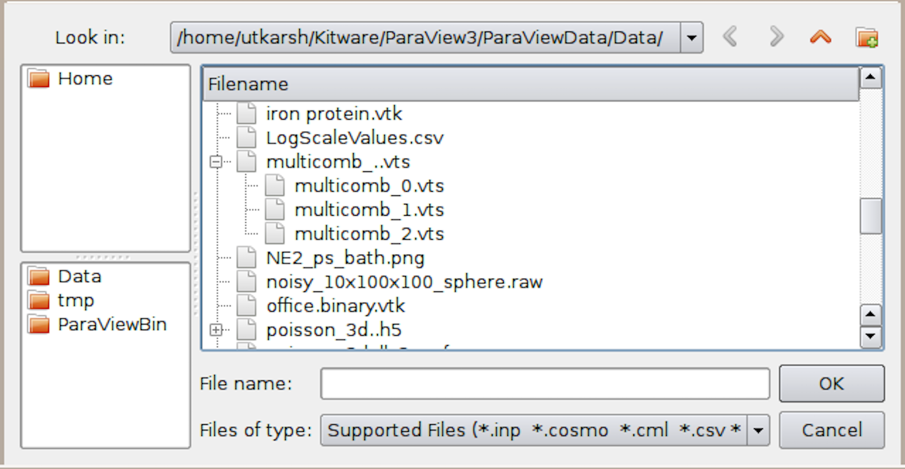
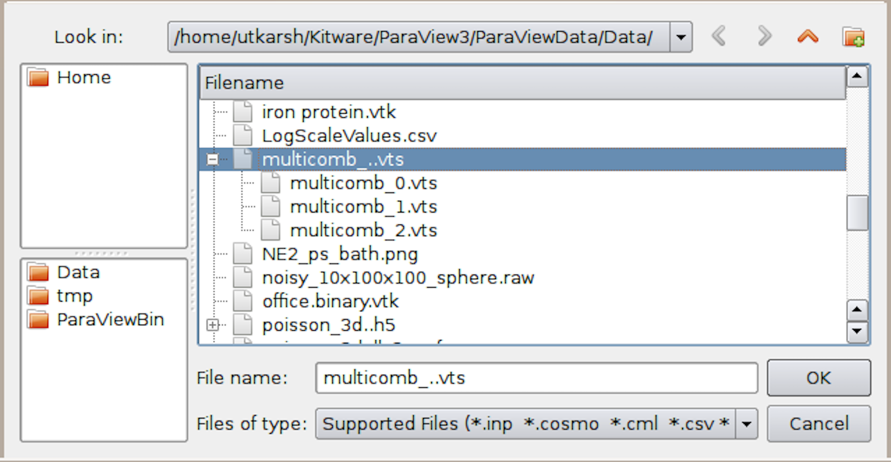
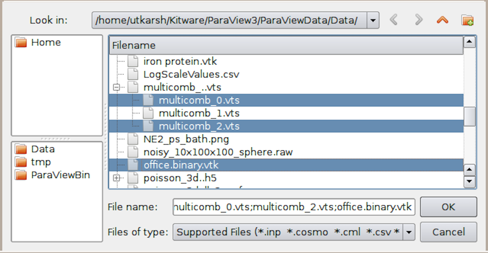
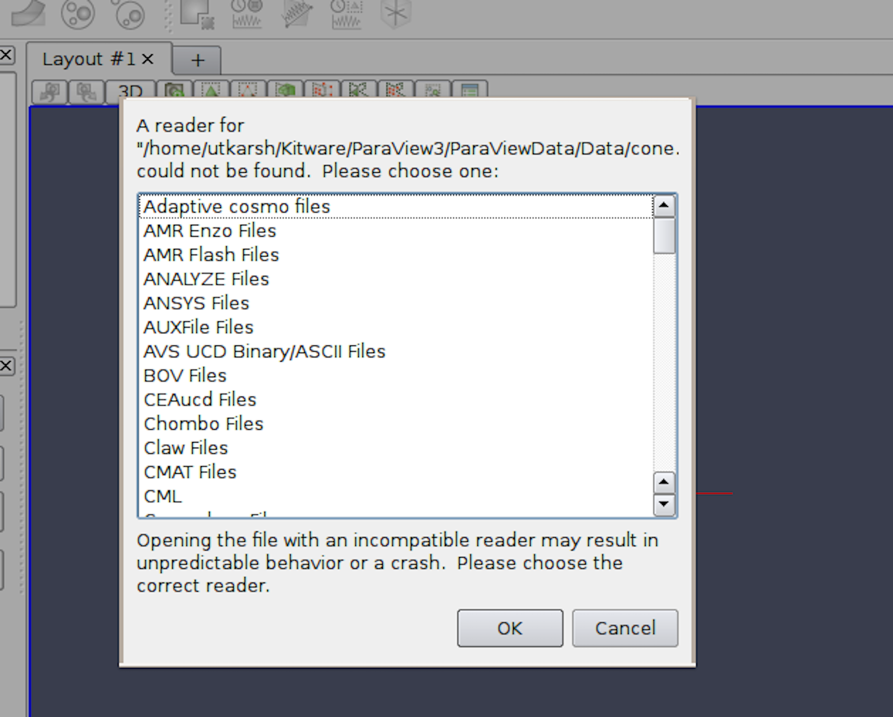
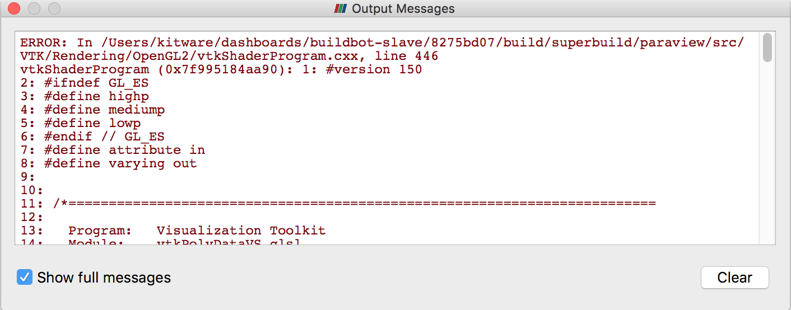
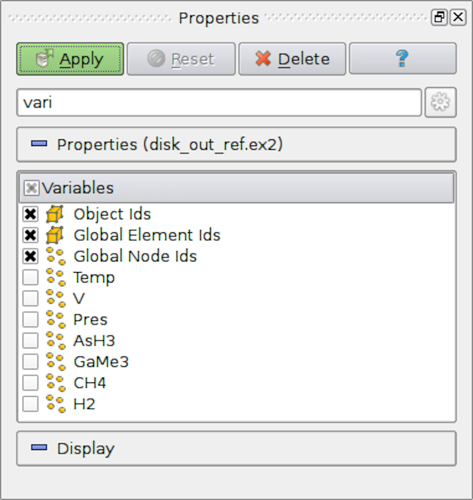
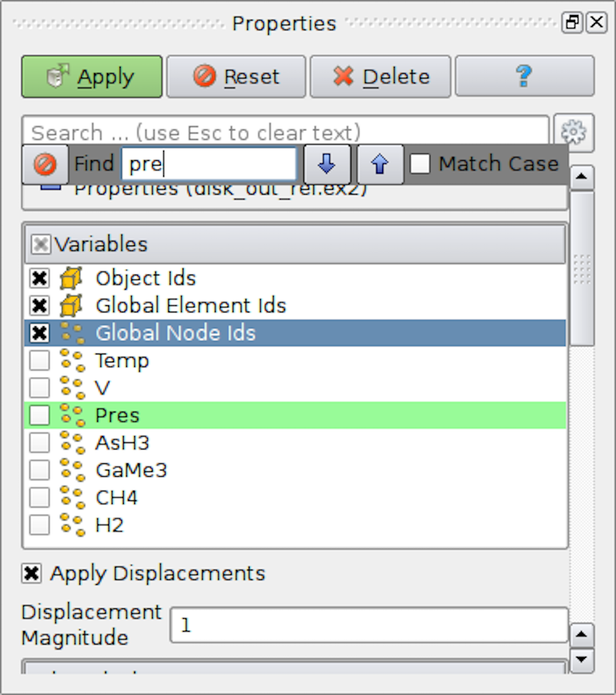
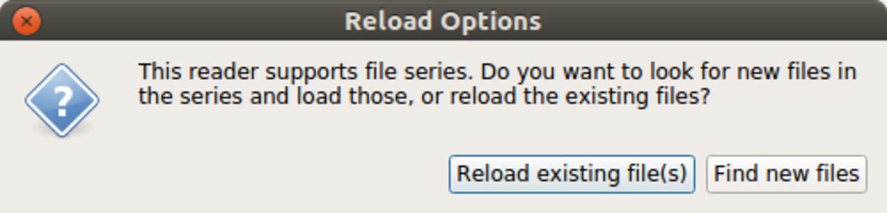

.. include:: macros.hrst
.. include:: abbreviations.hrst

.. _chapter:LoadingData:

Loading Data
############

In a visualization pipeline, data sources bring data into the system for
processing and visualization. Sources, such as the  ``Sphere`` :index:`\ <Sphere>`\  source
(accessible from the  ``Sources`` :index:`\ <Sources>`\  menu in |paraview|),
programmatically create datasets for
processing. Another type of data sources are readers. Readers can read data
written out in disk files or other databases and bring it into |ParaView| for
processing. |ParaView| includes readers that can read several of the
commonly used scientific data formats. It's also possible to write plugins that
add support for new or proprietary file formats.

|ParaView| provides several sample datasets for you to get started. You can
download an archive with several types of data files from the download page at
https://www.paraview.org/download under the Data section.

Opening data files in |paraview|
==================================

To open a data file in |paraview|, you use the  ``Open File`` :index:`\ <Open File>`\  dialog.
This dialog can be accessed from the :guilabel:`File > Open` menu or by using the
|OpenFileIcon| button in the  ``Main Controls`` :index:`\ <Main Controls>`\  toolbar. You can
also use the keyboard shortcut |CTRL| + :kbd:`O` (or |CMD| + :kbd:`O`) to open this dialog.

    ``Open File`` :index:`\ <Open File>`\  dialog in |paraview| for opening data (and other) files.

The  ``Open File`` :index:`\ <Open File>`\ dialog 
allows you to browse the file system on the data
processing nodes. This will become clear when we look at using |ParaView| for
remote visualization. While several of the UI elements in this dialog are
obvious such as navigating up the current directory, creating a new
directory, and navigating back and forth between directories, there are a few things
to note.

* The  ``Favorites`` :index:`\ <Favorites>`\  pane shows some platform-specific common locations such as your home directory and desktop.
*  The  ``Recent Directories`` :index:`\ <Recent Directories>`\  pane shows a few of the most recently used directories.

You can browse to the directory containing your datasets and either select the
file and hit  ``Ok`` :index:`\ <Ok>`\  or simply double click on the file to open it. You can also
select multiple files using the |CTRL| (or |CMD|) key. This will open
each of the selected files separately.

When a file is opened, |paraview| will create a reader instance of
the type suitable for the selected file based on its extension. The reader will
simply be another pipeline module, similar to the source we created in
:numref:`chapter:Introduction`. From this point forward, the workflow will be
the same as we discussed in :numref:`sec:UnderstandingVisualizationGUI` :
You adjust the reader properties, if needed, and hit  ``Apply`` :index:`\ <Apply>`\ .
|paraview| will then read the data from the file and render it in the
view.

If you selected multiple files using the |CTRL| (or |CMD|) key,
|paraview| will create multiple reader modules. When you hit
``Apply`` :index:`\ <Apply>`\ , all of the readers will be executed, and their data will be shown in the view.

    The  ``Open File`` :index:`\ <Open File>`\  dialog can be used to select a
    temporal file series (top) or select multiple files to open separately (bottom).

.. admonition:: **Did you know?**
  :class: tip

  This ability to hit the  ``Apply`` :index:`\ <Apply>`\  button once to accept changes on multiple
  readers applies to other pipeline modules, including sources and filters.
  In general, you can change properties for multiple modules in a pipeline, and
  hit  ``Apply`` :index:`\ <Apply>`\  to accept all of the changes at once. It is possible to
  override this behavior from the  ``Settings`` :index:`\ <Settings>`\  dialog.

Dealing with unknown extensions
^^^^^^^^^^^^^^^^^^^^^^^^^^^^^^^

On occasion, you will run into situations where a file has an unusual name and,
despite the fact that |ParaView| supports reading the file format,
|paraview| does not recognize the file because its extension does not
match the expected extension. In this case, |paraview| will pop
up the  ``Open Data With...`` :index:`\ <Open Data With...>`\  dialog, which lists several readers
(:numref:`fig:OpenDataWithDialog`).
You can then pick the reader for the correct file format from this list
and continue. If you picked an incorrect reader, however, you'll get error
messages either when the reader module is instantiated or after you hit
``Apply`` :index:`\ <Apply>`\ . In either case, you can simply  ``Delete`` :index:`\ <Delete>`\  the reader module and try
opening the file again, this time choosing a different reader.

    ``Open Data With...`` :index:`\ <Open Data With...>`\  dialog shown to manually choose the reader to use for a file with an unknown extension.} 
    
.. FIXME: The filename in the dialog in the image is cut off

Error messages in |paraview| are shown in the  ``Output Messages`` :index:`\ <Output Messages>`\ 
window (:numref:`fig:OutputMessagesWindow`).
It is accessible from the :guilabel:`View > Output Messages` menu.
Whenever there's a new error message, |paraview| will
automatically pop open this window and raise it to the top. This window can
be attached, or docked, in the main window so that it is visible with the
other user interface elements without covering them up.
:index:`\ <Output Messages>`\  :index:`\ <Error Messages>`\ 

    The  ``Output Messages`` :index:`\ <Output Messages>`\  window is used to show errors, warnings, and other messages raised by the application.

Handling temporal file series
^^^^^^^^^^^^^^^^^^^^^^^^^^^^^

Most datasets produced by scientific simulation runs are temporal in nature.
File formats differ in how this information is saved in the file.
While several file formats support saving multiple timesteps in the same file,
others save them out as a sequence of files, known as a file series :index:`\ <File series>`\

The  ``Open File`` :index:`\ <Open File>`\  dialog automatically detects file series and shows them as a
grouped element, as shown in :numref:`fig:OpenFileSelectingMultipleFiles`. To load the file series,
simply select the group, and hit  ``Ok`` :index:`\ <Ok>`\ . You can also open a single file in the
series as a regular file. To do so, open the file group and select the file
you want to open.

|paraview| automatically detects several of the commonly-known file
naming patterns used for indicating a file series. These include:

+--------------+--------------+-------------+-------------+
|``fooN.vtk``  |``fooN.vtk``  |``Nfoo.vtk`` |``foo.vtk.N``|
+--------------+--------------+-------------+-------------+
|``foo_N.vtk`` |``foo.N.vtk`` |``N.foo.vtk``|``foo.vtksN``|
+--------------+--------------+-------------+-------------+

where *foo* could be any filename, *N* is a numeral sequence (with
any number of leading zeros), and *vtk* could be any extension.

.. _sec:DealingWithTime:

Dealing with time
^^^^^^^^^^^^^^^^^

When you open a dataset with time, either as a file series or in a file format
that natively supports time, |paraview| will automatically setup an
animation for you so that you can play through each of the time steps in the
dataset by using the |pqVcrPlay32| button
on the  ``VCR Controls`` :index:`\ <VCR Controls>`\  toolbar (:numref:`fig:VCRControlsToolbar`).
You can change or modify this animation and
further customize it, as discussed in Chapter :numref:`chapter:Animation`.

.. |pqVcrPlay32| image:: images/pqVcrPlay32.png
                  :width: 0.5cm

    ``VCR Controls`` :index:`\ <VCR Controls>`\  toolbar for interacting with an animation.

Reopening previously opened files
^^^^^^^^^^^^^^^^^^^^^^^^^^^^^^^^^

|paraview| remembers most recently opened files (or file series).
Simply use the :guilabel:`File > Recent Files` menu. |paraview| also
remembers the reader type selected for files with unknown extensions or for occasions when
multiple reader choices were available.

Opening files using command line options
^^^^^^^^^^^^^^^^^^^^^^^^^^^^^^^^^^^^^^^^

|paraview| provides a command line option that can be used to open
datasets on startup.

.. code-block:: shell

  > paraview --data=.../ParaViewData/Data/can.ex2

This is equivalent to opening a can.ex2 data file from the  ``Open File`` :index:`\ <Open File>`\  dialog.
The same set of follow-up actions happen. For example, |paraview| will try to
locate a reader for the file, create that reader, and wait for you to hit
``Apply`` :index:`\ <Apply>`\ .

To open a file series, simply replace the numbers in the file name sequence by
a ``.`` For example, to open a file series named  ``my0.vtk``, ``my1.vtk`` ... ``myN.vtk``, use ``my..vtk``.

.. code-block:: shell

  > paraview --data=.../ParaViewData/Data/my..vtk

Common properties for readers
^^^^^^^^^^^^^^^^^^^^^^^^^^^^^

|ParaView| uses different reader implementations for different file formats. Each
of these have different properties available to you to customize how the data is
read and can vary greatly depending on the capabilities of the file format
itself or the particular reader implementation. Let's look at some of the
properties commonly available in readers.

.. _sec:SelectingDataArrays:

Selecting data arrays
---------------------

    Array selection widget for selecting array to load from a data file.

One of the most common properties on readers is one that allows you to select
the data arrays (cell centered, point centered, or otherwise, if
applicable) to be loaded. Often times, loading only the data arrays you know you
are going to use in the visualization will save memory, as well as processing
time, since the reader does not have to read in those data arrays, and
the filters in the pipeline do not have to process them.

.. admonition:: **Did you know?**
  :class: tip

  You can change |paraview|'s default behavior to load all available data arrays by
  selecting the  ``Load All Variables`` :index:`\ <Load All Variables>`\  checkbox under
  ``Settings/Properties Panel Options/Advanced`` :index:`\ <Settings/Properties Panel Options/Advanced>`\ .

  .. figure:: images/AdvancedSettings.png
    :name: fig-AdvancedSettings
    :width: 80%
    :align: center

The user interface for selecting the arrays to load is simply a list with the names of the
arrays and a checkbox indicating whether that array is to be loaded or not
(:numref:`fig:ArrayStatusWidget`). Icons, such as |CellDataIcon| and |NodalDataIcon| 
are often
used in this widget to give you an indication of whether the array is
cell-centered or point-centered, respectively.

.. |CellDataIcon| image:: images/pqCellData16.png
                  :width: 0.5cm

.. |NodalDataIcon| image:: images/pqNodalData16.png
                   :width: 0.5cm

If you initially de-select an array, but then as you're setting up your visualization pipeline
realize that you need that data array, you can always go back to the
``Properties`` :index:`\ <Properties>`\  page for the reader by making the reader active in the
``Pipeline Browser`` :index:`\ <Pipeline Browser>`\  and then changing the array selection. |ParaView| will
automatically re-execute any processing pipeline set up on the reader with this
new data array.

.. admonition:: **Common Errors**
  :class: error

  Remember to hit  ``Apply`` :index:`\ <Apply>`\  (or use  ``Auto Apply`` :index:`\ <Auto Apply>`\ ) after changing the array
  selection for the change to take effect.

Sometimes the list of data arrays can get quite large, and it can
become cumbersome to find the array for which you are looking. To help
with such situations, |paraview| provides a mechanism to search lists. Click inside the
widget to make it get the *focus*. Then type |CTRL| + :kbd:`F` (or
|CMD| + :kbd:`F`) to get a search widget. Now you can type in the text to
search. Matching rows will be highlighted (:numref:`fig:SearchInLists`).

    To search through large lists in |paraview|, you can use |CTRL| + :kbd:`F`.

.. admonition:: **Did you know?**
  :class: tip

  The ability to search for items in an array selection widget also applies to
  other list and tree widgets in the |paraview| UI. Whenever
  you see a widget with a large number of entries in a list, table, or tree fashion,
  try using |CTRL| + :kbd:`F` (or |CMD| + :kbd:`F`).

.. % Maybe this is too advanced at this point in the guide? -- UDA
   %Selecting blocks
   -----------------
   %
   %Just like selecting of arrays, certain readers such as those for Exodus or Xdmf
   %files, allow users to the data blocks.

.. _sec:OpeningDataFilesInPython:

Opening data files in |pvpython|
==================================

To open data files using the scripting interface, |ParaView| provides the
``OpenDataFile`` :index:`\ <OpenDataFile>`\  function.

.. code-block:: python

  >>> reader = OpenDataFile(".../ParaViewData/Data/can.ex2")
  >>> if reader:
  ...   print("Success")
  ... else:
  ...   print("Failed")
  ...

``OpenDataFile`` :index:`\ <OpenDataFile>`\  will try to determine an appropriate reader based on the file
extension, just like |paraview|. If no reader is determined,
``None`` :index:`\ <None>`\  is returned. If multiple readers can open the
file, however,  ``OpenDataFile`` :index:`\ <OpenDataFile>`\  simply picks the first reader. If you
explicitly want to create a specific reader, you can always create the reader by
its name, similar to other sources and filters.

.. code-block:: python

  >>> reader = ExodusIIReader(FileName=".../ParaViewData/Data/can.ex2")

To find out information about the reader created and the properties available on it,
you can use the  ``help`` :index:`\ <help>`\  function.

.. code-block:: python

  >>> reader = ExodusIIReader(FileName=".../ParaViewData/Data/can.ex2")
  >>> help(reader)
  Help on ExodusIIReader in module paraview.servermanager object:
  
  class ExodusIIReader(ExodusIIReaderProxy)
   |  The Exodus reader loads
   |  Exodus II files and produces an unstructured grid output.
   |  The default file extensions are .g, .e, .ex2, .ex2v2,
   |  .exo, .gen, .exoII, .exii, .0, .00, .000, and .0000. The
   |  file format is described fully at:
   |  http://endo.sandia.gov/SEACAS/Documentation/exodusII.pdf.
   |  ...
   |
   |  -----------------------------------------------------------------
   |  Data descriptors defined here:
   |
   |  AnimateVibrations
   |      If this flag is on and HasModeShapes is also on, then
   |      this reader will report a continuous time range [0,1] and
   |      animate the displacements in a periodic sinusoid. If this
   |      flag is off and HasModeShapes is on, this reader ignores
   |      time. This flag has no effect if HasModeShapes is off.
   |
   |  ApplyDisplacements
   |      Geometric locations can include displacements. When this
   |      option is on, the nodal positions are 'displaced' by the
   |      standard exodus displacement vector. If displacements are
   |      turned 'off', the user can explicitly add them by applying
   |      a warp filter.
   |  ...

.. admonition:: **Did you know?**
   :class: tip

  The  ``help`` :index:`\ <help>`\  function can be used to get information about properties available on
  any source or filter instance. It not only lists the properties, but also
  provides information about how they affect the pipeline module.  ``help`` :index:`\ <help>`\  can
  also be used on functions. For example:

  .. code-block:: python

    >>> help(OpenDataFile)
    
    Help on function OpenDataFile in module paraview.simple:
    
    OpenDataFile(filename, \*\*extraArgs)
        Creates a reader to read the given file, if possible.
        This uses extension matching to determine the best reader
        possible. If a reader cannot be identified, then this
        returns None.

Handling temporal file series
^^^^^^^^^^^^^^^^^^^^^^^^^^^^^

Unlike |paraview|, |pvpython| does not automatically
detect and load file series :index:`\ <File series>`\ . You have to explicitly list the filenames in the
series and pass that to the  ``OpenDataFile`` :index:`\ <OpenDataFile>`\  call.

.. code-block:: python

  # Create a list with the names of all the files in the file series in
  # correct order.
  >>> files = [".../Data/multicomb_0.vts",
               ".../Data/multicomb_1.vts",
               ".../Data/multicomb_2.vts"]
  >>> reader = OpenDataFile(files)

Dealing with time
^^^^^^^^^^^^^^^^^

Similar to |paraview|, if you open a time series or a file with
multiple timesteps, |pvpython| will automatically set up an animation
for you to play through the timesteps.

.. code-block:: python

  >>> files = [".../Data/multicomb_0.vts",
               ".../Data/multicomb_1.vts",
               ".../Data/multicomb_2.vts"]
  >>> reader = OpenDataFile(files)
  >>> Show()
  >>> Render()
  
  # Get access to the animation scene.
  >>> scene = GetAnimationScene()
  # Now you use the API on the scene when doing things such as playing
  # the animation, stepping through it, etc.
  
  # This will simply play through the animation once and stop. Watch
  # the rendered view after you hit `Enter.'
  >>> scene.Play()

Common properties on readers
^^^^^^^^^^^^^^^^^^^^^^^^^^^^

Selecting data arrays
---------------------

For those properties on readers that allow you to control what to read in from
the file such as point data arrays, cell data arrays, or data blocks,
|paraview| uses a selection widget, as seen in
:numref:`sec:SelectingDataArrays`. Likewise, |pvpython| provides
an API that allows you to determine the available options and then
select/deselect them.

The name of the property that allows you to make such selections depends on the
reader itself. When in doubt, use the tracing capabilities in
|paraview| (:numref:`sec:PythonTracing`) to figure it out. You can also use
``help`` :index:`\ <help>`\  (:numref:`sec:OpeningDataFilesInPython`).

``ExodusIIReader`` :index:`\ <ExodusIIReader>`\  has a  ``PointVariables`` :index:`\ <PointVariables>`\  property that can be used to
select the point data arrays to load. Let's use this as an example.

.. code-block:: python 

  # Open an ExodusII data file.
  >>> reader = OpenDataFile(".../Data/can.ex2")
  
  # Alternatively, you can explicitly create the reader instance as:
  >>> reader = ExodusIIReader(FileName = ".../Data/can.ex2")
  
  # To query/print the current status for `PointVariables' property,
  # we do what we would have done for any other property:
  >>> print(GetProperty("PointVariables"))
  ['DISPL', 'VEL', 'ACCL']
  
  # An alternative way of doing the same is as follows:
  >>> print(reader.PointVariables)
  ['DISPL', 'VEL', 'ACCL']
  
  # To set the property, simply set it to list containing the names to
  # enable, e.g., if we want to read only the 'DISPL' array, we do
  # the following:
  >>> SetProperties(PointVariables=['DISPL'])
  
  # Or using the alternative way for doing the same:
  >>> reader.PointVariables = ['DISPL']
  
  # Now, the new value for PointVariables is:
  >>> print(reader.PointVariables)
  ['DISPL']
  
  # To determine the array available, use:
  >>> print(reader.PointVariables.Available)
  ['DISPL', 'VEL', 'ACCL']
  # These are the arrays available in the file.

Changing  ``PointVariables`` :index:`\ <PointVariables>`\  only changes the value on the property. The reader
does not re-execute until a re-execution is requested either by calling
``Render`` :index:`\ <Render>`\  or by explicitly updating the pipeline using  ``UpdatePipeline`` :index:`\ <UpdatePipeline>`\ .

.. code-block:: python

  >>> reader.PointVariables = ['DISPL', 'VEL', 'ACCL']
  
  # Assuming that the reader is indeed the active source, let's update
  # the pipeline:
  >>> UpdatePipeline()
  
  # Or you can use the following form if you're unsure of the active
  # source or just do not want to worry about it.
  >>> UpdatePipeline(proxy=reader)
  
  # Print the list of point arrays read in.
  >>> print(reader.PointData[:])
  [Array: ACCL, Array: DISPL, Array: GlobalNodeId, Array: PedigreeNodeId, Array: VEL]
  
  # Change the selection.
  >>> reader.PointVariables = ['DISPL']
  
  # Print the list of point arrays read in, nothing changes!
  >>> print(reader.PointData[:])
  [Array: ACCL, Array: DISPL, Array: GlobalNodeId, Array: PedigreeNodeId, Array: VEL]
  
  # Update the pipeline.
  >>> UpdatePipeline()
  
  # Now the arrays read in has indeed changed as we expected.
  >>> print(reader.PointData[:])
  [Array: DISPL, Array: GlobalNodeId, Array: PedigreeNodeId]

We will cover the  ``reader.PointData`` :index:`\ <reader.PointData>`\  API in more details in :numref:`sec:DataInformationInPython`.

Reloading files
===============

While ParaView is often used after the simulation has generated all the data,
it is not uncommon to use ParaView to inspect data files as they are being
written out by the simulation. In such cases, the simulation may either be
modifying existing file(s) with new timesteps or creating
new files for each timestep. In such cases, you may want to *refresh*
ParaView to make it aware of the changes. In |paraview|, this can be done using
``Reload Files`` :index:`\ <Reload Files>`\ .
When the reader is active, you can use the :guilabel:`File > Reload Files` menu to
request the reader to refresh. |paraview| will prompt you to choose whether to
reload the existing file(s) or look for new files in the file series, as shown in
:numref:`fig:ReloadOptions`. Click on  ``Reload existing file(s)`` :index:`\ <Reload existing file(s)>`\ , to force
the reader to re-read the files already opened. This is useful in cases
where the simulation may have modified existing file(s).
Use  ``Find new files`` :index:`\ <Find new files>`\  to make the reader aware of any new files in the
file series.

    The  ``Reload Options`` :index:`\ <Reload Options>`\  dialog allows you to choose how to refresh the reader.

Similar to |paraview|, in |pvpython|, you use  ``ReloadFiles`` :index:`\ <ReloadFiles>`\  to reload existing files, and
``ExtendFilesSeries`` :index:`\ <ExtendFilesSeries>`\  to look for new files in a file series.

.. code-block:: python

  # For file being modified in place per timestep
  >>> reader = OpenDataFile(file)
  ...
  >>> ReloadFiles(reader)
  
  # For files being generated per timestep
  >>> reader = OpenDataFile(file)
  ...
  >>> ExtendFilesSeries(reader)
