.. include:: macros.hrst
.. include:: abbreviations.hrst

.. _chapter:DisplayingData:
.. _ch:DisplayingData:

Displaying data
###############

The goal of any visualization process is to produce visual representations of
the data. The visual representations are shown in modules called views.
*Views* :index:`\ <Views>`\  provide the canvas on which to display such visual representations,
as well as to dictate how these representations are generated from the raw data.
The role of the visualization pipeline is often to transform the data so that
relevant information can be represented in these views.

Referring back to the visualization pipeline from
:numref:`sec:BasicsOfVisualization`, views are sinks that take in input data
but do not produce any data output (i.e., one cannot connect other pipeline
modules such as filters to process the results in a view). However,
views often provide mechanisms to save the results as images or in other formats
including PDF, VRML, and X3D.

Different types of views provide different ways of visualizing data. These can
be broadly grouped as follows:

* *Rendering Views* are views that render geometries or volumes in a graphical context. The  ``Render View`` :index:`\ <Render View>`\  is one such view. Other Render View-based views, such as  ``Slice View`` :index:`\ <Slice View>`\  and  ``Quad View`` :index:`\ <Quad View>`\ , extend the basic render view to add the ability to add mechanisms to easily inspect slices or generate orthogonal views. 
  
* *Chart Views* cover a wide array of graphs and plots used for visualizing non-geometric data. These include views such as line charts ( ``Line Chart View`` :index:`\ <Line Chart View>`\ ), bar charts ( ``Bar Chart View`` :index:`\ <Bar Chart View>`\ ), bag charts ( ``Bag Chart View`` :index:`\ <Bag Chart View>`\ ), parallel coordinates ( ``Parallel Coordinates View`` :index:`\ <Parallel Coordinates View>`\ ), etc.
  
* *Comparative Views* are used to quickly generate side-by-side views for parameter study, i.e., to visualize the effects of parameter changes. Comparative variants of  ``Render View`` :index:`\ <Render View>`\  and several types of the  ``Chart Views`` :index:`\ <Chart Views>`\  are available in |ParaView|.

In this chapter, we take a close look at the various views available in |ParaView|
and how to use these views for displaying data.

Multiple views
==============

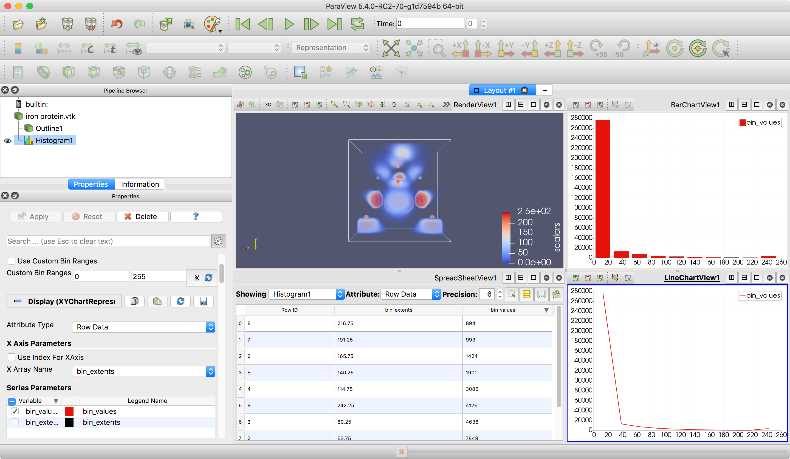

    Using multiple views in |paraview| to generate different types of visualizations from a dataset.

With multiple types of views comes the need for creating and viewing multiple
views at the same time. In this section, we look at how you can create multiple
views and lay them out.

.. admonition:: **Did you know?**
  :class: tip

  Multiple views were first supported in |ParaView| 3.0. Before that, all data was
  shown in a single 3D render view, including line plots!

Multiple views in ``paraview``
^^^^^^^^^^^^^^^^^^^^^^^^^^^^^^

|paraview| shows all views in the central part of the application
window. When |paraview| starts up, the  ``Render View`` :index:`\ <Render View>`\  is created
and shown in the application window by default.\fixme{add image with the
viewport window with components labeled}

New views can be created by splitting the
view frame using the  ``Split View`` :index:`\ <Split View>`\  controls at the top-right corner of the
view frame. Splitting a view splits the view into two equal parts, either
vertically or horizontally, based on the button used for the split.
On splitting a view, an empty frame with buttons for all known types
of views is shown. Simply click on one of those buttons to create a new view of
a chosen type.

You can move views by clicking and dragging the title bar for the view (or
empty view frame) and dropping it on the title bar on another view (or empty
view frame). This will swap the positions of the two views.

Similar to the notion of active source, there is a notion of *active
view* :index:`\ <Active View>`\ .
Several panels, toolbars, and menus will update based on the active view. The
``Display`` :index:`\ <Display>`\  properties section on the  ``Properties`` :index:`\ <Properties>`\  panel, for example,
reflects the display properties of the active source in the active view.
Similarly, the eyeball icons in the  ``Pipeline Browser`` :index:`\ <Pipeline Browser>`\  show the visibility
status of the pipeline module in the active view. Active view is marked in the
UI by a blue border around the view frame. Only one view can be active at any time
in the application.

Besides being able to create multiple views and laying them out in a pane,
|paraview| also supports placing views in multiple layouts under
separate tabs. To create new tabs, use the |TabWidgetPlus|
button in the tab bar. You can close a tab, which will destroy all views laid out
in that tab,
by clicking on the |SP_TitleBarCloseButton| button.
To pop out an entire tab as a
separate window, use the |SP_TitleBarMaxButton| button on the
tab bar.

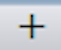

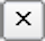

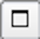

The active view is always present in the active tab. Thus, if you change the
active tab, the active view will also be changed to be a view in the active tab
layout. Conversely, if the active view is changed (by using the  ``Python
Shell`` :index:`\ <Python
Shell>`\ , for example), the active tab will automatically be updated to be the tab
that contains the active view.

.. admonition:: **Did you know?**
  :class: tip
  
  You can make the views fullscreen by using :guilabel:`View > Fullscreen`. To return
  back to the normal mode, use the |ESC| key.

Multiple views in ``pvpython``
^^^^^^^^^^^^^^^^^^^^^^^^^^^^^^

In |pvpython|, one can create new views using the  ``CreateView`` :index:`\ <CreateView>`\ 
function or its variants, e.g., ``CreateRenderView`` :index:`\ <CreateRenderView>`\ .

.. code-block:: python

  >>> from paraview.simple import *
  >>> view = CreateRenderView()
  # Alternatively, use CreateView.
  >>> view = CreateView("RenderView")

When a new view is created, it is automatically made active. You can manually
make a view active by using the  ``SetActiveView`` :index:`\ <SetActiveView>`\  function. Several of the
functions available in |pvpython| will use the active view when no
view is passed as an argument to the function.

.. code-block:: python

  # Create a view
  >>> view1 = CreateRenderView()
  # Create a second view
  >>> view2 = CreateRenderView()
  
  # Check if view2 is the active view
  >>> view2 == GetActiveView()
  True
  
  # Make view1 active
  >>> SetActiveView(view1)
  >>> view1 == GetActiveView()
  True

When using  ``Python Shell`` :index:`\ <Python Shell>`\  in |paraview|, if you create a new view,
it will automatically be placed in the active tab by splitting the active view.
You can manually control the layout and placement of views from Python too, using
the layout API.

In Python, each tab corresponds to a layout.

.. \fixme{this can be expanded to cover more details about view layouting.}

.. code-block:: python

  # To get exisiting tabs/layouts
  >>> layouts = GetLayouts()
  >>> print(layouts)
  {('ViewLayout1', '264'): <paraview.servermanager.ViewLayout object at 0x2e5b7d0>}
  
  # To get layout corresponding to a particular view
  >>> print(GetLayout(view))
  <paraview.servermanager.ViewLayout object at 0x2e5b7d0>
  
  # If view is not specified, active view is used
  >>> print(GetLayout())
  <paraview.servermanager.ViewLayout object at 0x2e5b7d0>
  
  # To create a new tab
  >>> new_layout = servermanager.misc.ViewLayout(registrationGroup="layouts")
  
  # To split the cell containing the view, either horizontally or vertically
  >>> view = GetActiveView()
  >>> layout = GetLayout(view)
  >>> locationId = layout.SplitViewVertical(view=view,
                                            fraction=0.5)
  # fraction is optional, if not specified the frame is split evenly.
  
  # To assign a view to a particular cell.
  >>> view2 = CreateRenderView()
  >>> layout.AssignView(locationId, view2)

View properties
===============

Just like parameters on pipeline modules, such as
readers and filters, views provide parameters that can be used for customizing
the visualization such as changing the background color for rendering views and
adding title texts for chart views. These parameters are referred to as  ``View
Properties`` :index:`\ <View
Properties>`\  and are accessible from the  ``Properties`` :index:`\ <Properties>`\  panel in |paraview|.

View properties in ``paraview``
^^^^^^^^^^^^^^^^^^^^^^^^^^^^^^^

Similar to properties on pipeline modules like sources and readers, view
properties are accessible from the  ``Properties`` :index:`\ <Properties>`\  panel. These
are grouped under the  ``View`` :index:`\ <View>`\  section. When the active view is changed, the
``Properties`` :index:`\ <Properties>`\  panel updates to show the view properties for the active view.
Unlike pipeline modules, however, when you change the view properties, they
affect the visualization immediately, without use of the  ``Apply`` :index:`\ <Apply>`\ 
button.

.. admonition:: **Did you know?**
  :class: tip

  It may seem odd that  ``View`` :index:`\ <View>`\  and  ``Display`` :index:`\ <Display>`\  properties on the
  ``Properties`` :index:`\ <Properties>`\  panel don't need to be  ``Apply`` :index:`\ <Apply>`\ -ed to take effect, while
  properties on pipeline modules like sources, readers and filter require you to
  hit the  ``Apply`` :index:`\ <Apply>`\  button.
  
  To understand the reasoning behind that, we need to understand why the
  ``Apply`` :index:`\ <Apply>`\  action is needed in the first place. Generally, executing a data
  processing filter or reader is time consuming on large datasets. If the pipeline
  module keeps on executing as you are changing the parameter, the user experience
  will quickly deteriorate, since the pipeline will keep on executing with
  intermediate (and potentially invalid) property values. To avoid this, we have
  the  ``Apply`` :index:`\ <Apply>`\  action. This way, you can set up the pipeline properties to your
  liking and then trigger the potentially time consuming execution.
  
  Since the visualization process in general focuses on *reducing* data to
  generate visual representations, the rendering (broadly speaking) is less time-
  intensive than the actual data processing. Thus, changing properties that affect
  rendering are not as compute-intensive as transforming the data itself. For example,
  changing the color on a surface mesh is not as expensive as generating the mesh
  in the first place. Hence, the need to  ``Apply`` :index:`\ <Apply>`\  such properties becomes less
  relevant. At the same time, when changing display properties such as opacity,
  you may want to see the result as you change the property to decide on the final
  value. Hence, it is desirable to see the updates immediately.
  
  Of course, you can always enable  ``Auto Apply`` :index:`\ <Auto Apply>`\  to have the same immediate
  update behavior for all properties on the  ``Properties`` :index:`\ <Properties>`\  panel.

View properties in ``pvpython``
^^^^^^^^^^^^^^^^^^^^^^^^^^^^^^^

In |pvpython|, once you have access to the view, you can directly change view
properties on the view object. There are several ways to get access to the view
object.

.. code-block:: python

  # 1. Save reference when a view is created
  >>> view = CreateView("RenderView")
  
  # 2. Get reference to the active view.
  >>> view = GetActiveView()
  
The properties available on the view will change based on the type of the view.
You can use the  ``help`` :index:`\ <help>`\  function to discover available properties.

.. code-block:: python
  
  >>> view = CreateRenderView()
  >>> help(view)
  
    Help on RenderView in module paraview.servermanager object:
  
  class RenderView(Proxy)
   |  View proxy for a 3D interactive render
   |  view.
   |
   |  ----------------------------------------------------------------------
   |  Data descriptors defined here:
   |
   |  CenterAxesVisibility
   |      Toggle the visibility of the axes showing the center of
   |      rotation in the scene.
   |
   |  CenterOfRotation
   |      Center of rotation for the interactor.
   |
   ...
  
  # Once you have a reference to the view, you can then get/set the properties.
  
  # Get the current value
  >>> print(view.CenterAxesVisibility)
  1
  
  # Change the value
  >>> view.CenterAxesVisibility = 0

.. _sec:DisplayingData:DisplayProperties:

Display properties
==================

Display properties refers to available parameters that control how data from a
pipeline module is displayed in a view, e.g., choosing to view the output mesh as a
wireframe, coloring the mesh using a data attribute, and selecting which attributes
to plot in chart view. A set of display properties is associated with a
particular pipeline module and view. Thus, if the data output from a source is
shown in two views, there will be two sets of display properties used to control
the appearance of the data in each of the two views.

Display properties in ``paraview``
^^^^^^^^^^^^^^^^^^^^^^^^^^^^^^^^^^

Display properties are accessible from the  ``Display`` :index:`\ <Display>`\  section on the
``Properties`` :index:`\ <Properties>`\  panel. When the active source or active view changes, this
section updates to show the display properties for the active source in the
active view, if available. If the active source produces data that cannot be
shown (or has never been shown) in the view, then the  ``Display`` :index:`\ <Display>`\  properties
section may be empty.

Similar to view properties, display property changes are immediately applied,
without requiring the use of the  ``Apply`` :index:`\ <Apply>`\  button.

Display properties in ``pvpython``
^^^^^^^^^^^^^^^^^^^^^^^^^^^^^^^^^^

To access display properties in |pvpython|, you can use ``SetDisplayProperties`` :index:`\ <SetDisplayProperties>`\  and  ``GetDisplayProperty`` :index:`\ <GetDisplayProperty>`\  methods.

.. code-block:: python

  # Using SetDisplayProperties/GetDisplayProperties to access the display
  # properties for the active source in the active view.
  
  >>> print(GetDisplayProperties("Opacity"))
  1.0
  
  >>> SetDisplayProperties(Opacity=0.5)

Alternatively, you
can get access to the display properties object using  ``GetDisplayProperties`` :index:`\ <GetDisplayProperties>`\ 
and then changing properties directly on the object.

.. code-block:: python

  # Get display properties object for the active source in the active view.
  >>> disp = GetDisplayProperties()
  
  # You can also save the object returned by Show.
  >>> disp = Show()
  
  # Now, you can directly access the properties.
  >>> print(disp.Opacity)
  0.5
  
  >>> disp.Opacity = 0.75

As always, you can use the  ``help`` :index:`\ <help>`\  method to discover available properties on a
display object.

.. code-block:: python

  >>> disp = Show()
  
  >>> help(disp)
  >>> help(a)
  Help on GeometryRepresentation in module paraview.servermanager object:
  
  class GeometryRepresentation(SourceProxy)
   |  ParaView`s default representation for showing any type of
   |  dataset in the render view.
   |
   |  Method resolution order:
   |      GeometryRepresentation
   |      SourceProxy
   |      Proxy
   |      __builtin__.object
   |
   |  ----------------------------------------------------------------------
   |  Data descriptors defined here:
   |
   |  ...
   |
   |  CenterStickyAxes
   |      Keep the sticky axes centered in the view window.
   |
   |  ColorArrayName
   |      Set the array name to color by. Set it to empty string
   |      to use solid color.
   |
   |  ColorAttributeType
   |  ...

Render View
===========

``Render View`` :index:`\ <Render View>`\  is the most commonly used view in |ParaView|. It is used to render
geometries and volumes in a 3D scene. This is the view that you typically think
of when referring to 3D visualization. The view relies on techniques to map data
to graphics primitives such as triangles, polygons, and voxels, and it renders
them in a scene.

Most of the scientific datasets discussed in :numref:`sec:VTKDataModel`
are comprised of meshes. These meshes can be mapped to graphics primitives using
several of the established visualization techniques. (E.g., you can compute the
outer surface of these meshes and then render that surface as filled polygons, you can
just render the edges, or you can render the data as a nebulous blob to get a better
understanding of the internal structure in the dataset.) Plugins, like
``Surface LIC`` :index:`\ <Surface LIC>`\ , can provide additional ways of rendering data using advanced
techniques that provide more insight into the data.

If the dataset doesn't represent a mesh, e.g., a table
(:numref:`sec:VTKDataModel:Table`), you cannot directly show that data in
this view. However, in such cases, it may be possible to construct a mesh by
mapping columns in the table to positions to construct a point cloud, for
example.

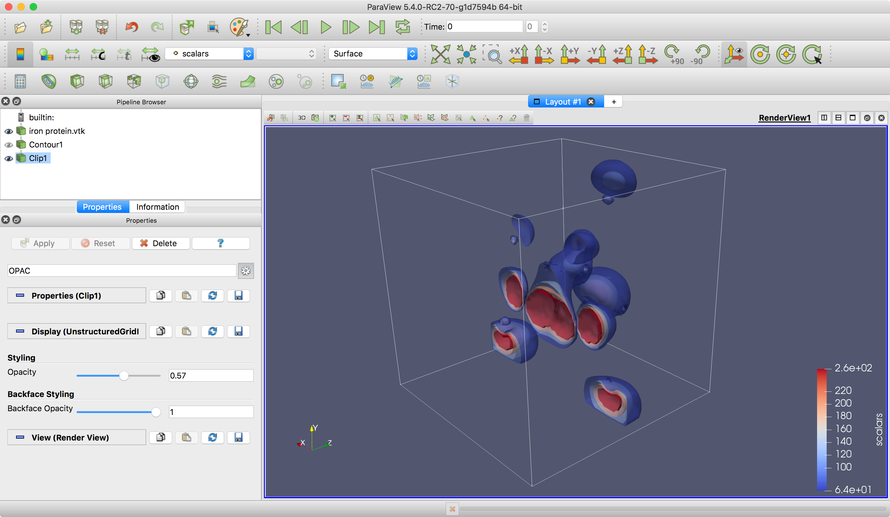

    |paraview| using  ``Render View`` :index:`\ <Render View>`\  to generate 3D visualizations from a dataset.

Understanding the rendering process
^^^^^^^^^^^^^^^^^^^^^^^^^^^^^^^^^^^

``Render View`` :index:`\ <Render View>`\  uses data processing techniques to map raw data to graphics
primitives, which can then be rendered in a 3D scene. These mapping techniques
can be classified as follows:

* *Surface rendering* methods provide general rendering by rendering a surface mesh for the dataset. For polygonal datasets (:numref:`sec:VTKDataModel:PolyData`), this is simply the raw data. In cases of other datasets including structured (:numref:`sec:VTKDataModel:UniformRectilinearGrid`, :numref:`sec:VTKDataModel:RectilinearGrid`, :numref:`sec:VTKDataModel:CurvilinearGrid`) and unstructured (:numref:`sec:VTKDataModel:UnstructuredGrid`) grids, this implies extracting a surface mesh for all external faces in the dataset and then rendering that mesh. The surface mesh itself can then be rendered as a filled surface or as a wireframe simply showing the edges, etc.

* *Slice* rendering is available for uniform rectilinear grid datasets (:numref:`sec:VTKDataModel:UniformRectilinearGrid`) where the visualization is generated by simply rendering an orthogonal slice through the dataset. The slice position and alignment can be selected using the display properties.

* *Volume* rendering generates rendering by tracing a ray through the dataset and accumulating intensities based on the color and opacity transfer functions set.

Each of these techniques are referred to as
*representations*. When
available, you can change the representation type from the display properties on the
``Properties`` :index:`\ <Properties>`\  panel or using the  ``Representation Toolbar`` :index:`\ <Representation Toolbar>`\ .

Render View in ``paraview``
^^^^^^^^^^^^^^^^^^^^^^^^^^^

Creating a Render View
----------------------

Unless you changed the default setting, a new  ``Render View`` :index:`\ <Render View>`\  will be created
when |paraview| starts up or connects to a new server. To create a
``Render View`` :index:`\ <Render View>`\  in |paraview|, split or close a view, and select the
``Render View`` :index:`\ <Render View>`\  button. You can also convert a view to a Render View (or any other
type) by right-clicking on the view's title bar and picking from the  ``Convert To`` :index:`\ <Convert
To>`\  sub-menu. It simply closes the chosen view and creates a selected view type
in its place.

You can use the  ``Pipeline Browser`` :index:`\ <Pipeline Browser>`\  to control the visibility of datasets
produced by pipeline modules in this view. The eyeball icons reflect the
visibility state. Clicking on the eyeball icon will toggle the visibility state.
If no eyeball icon is shown, it implies that the pipeline module doesn't produce
a data type that can be directly shown in the active view, e.g., if the module
produced a table, then when  ``Render View`` :index:`\ <Render View>`\  is active, there will not be any
eyeball icon next to that module.

.. _sec:RenderView:Interactions:

Interactions
------------

You can interact with the Render View to move the camera in the scene for
exploring the visualization and setting up optimal viewing angles.
Each of the three mouse buttons, combined with keyboard modifier keys
(|CTRL| or |CMD| , and |SHIFT| ), move the camera differently.
The interaction mode can be changed from the  ``Camera`` :index:`\ <Camera>`\  tab in the  ``Settings`` :index:`\ <Settings>`\ 
dialog, which is accessible from :guilabel:`Tools > Settings` (or :guilabel:`ParaView > Preferences`
on macOS).
There are six interaction modes available in ParaView:

* *Pan* for translating the camera in the view plane.
* *Zoom* for zooming in or out of the center of the view.
* *Roll* for rolling the camera.
* *Rotate* for rotating the camera around the center of rotation.
* *Zoom To Mouse* for zooming in or out of the projected point under the mouse position.
* *Multi Rotate* for allowing azimuth and elevation rotations by dragging from the middle of the view and rolls by dragging from the edges.

The default interactions options are as follows:

+-----------------+--------------+----------------+---------------+
| Modifier        | Left Button  | Middle Button  |  Right Button |
+=================+==============+================+===============+
|                 |   Rotate     |    Pan         |    Zoom       |
+-----------------+--------------+----------------+---------------+
| |SHIFT|         |   Roll       |    Rotate      |     Pan       |
+-----------------+--------------+----------------+---------------+
| |CTRL| or |CMD| |   Zoom       |    Rotate      | Zoom To Mouse |
+-----------------+--------------+----------------+---------------+

Usually in ParaView, you are interacting with a 3D scene. However, there are cases when
you are working with a 2D dataset such as a slice plane or a 2D image. In such
cases, |paraview| provides a separate set of interaction options
suitable for 2D interactions. You can toggle between the default 3D interaction
options and 2D interaction options by clicking the  ``2D`` :index:`\ <2D>`\  or  ``3D`` :index:`\ <3D>`\  button in
the view toolbar. The default interaction options for 2D interactions are as
follows:

+-----------------+--------------+----------------+---------------+
| Modifier        | Left Button  | Middle Button  |  Right Button |
+=================+==============+================+===============+
|                 |   Pan        |      Roll      |    Zoom       |
+-----------------+--------------+----------------+---------------+
| |SHIFT|         |    Zoom      |    Zoom        | Zoom To Mouse |
+-----------------+--------------+----------------+---------------+
| |CTRL| or |CMD| |   Roll       |    Pan         |  Rotate       |
+-----------------+--------------+----------------+---------------+

By default, ParaView will determine whether your data is 2D or 3D when
loading the data and will set the interaction mode accordingly. This
behavior can be changed in the  ``Settings`` :index:`\ <Settings>`\  dialog by changing the
``Default Interaction Mode`` :index:`\ <Default Interaction Mode>`\  setting under the  ``Render View`` :index:`\ <Render View>`\  tab.
The default setting is "Automatic, based on the first time step", but
the setting can be changed to "Always 2D" or "Always 3D" in case you
wish to force the interaction mode.

View properties
---------------

Several of the view properties in  ``Render View`` :index:`\ <Render View>`\  control the annotations shown
in the view (:numref:`fig:RenderViewPropertiesPanel`).

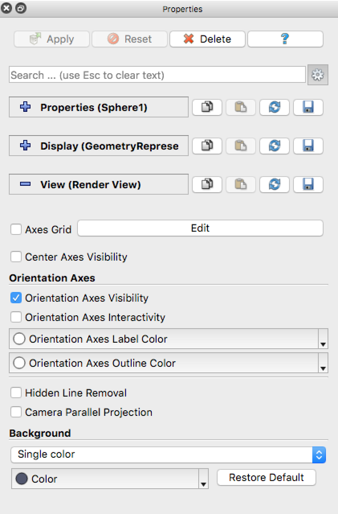
  
    The  ``Properties`` :index:`\ <Properties>`\  panel showing view properties for  ``Render View`` :index:`\ <Render View>`\ .

``Axes Grid`` :index:`\ <Axes Grid>`\  refers to an annotation axis rendered around all
datasets in the view (:numref:`fig:RenderViewAxesGrid`). You use
the checkbox next to the  ``Edit Axis Grid`` :index:`\ <Edit Axis Grid>`\  button to show or hide
this annotation. To control the annotation formatting, labels, etc.,
click on the  ``Edit Axes Grid...`` :index:`\ <Edit Axes Grid...>`\  button. The  ``Axes Grid`` :index:`\ <Axes Grid>`\  is
described in Chapter :numref:`chapter:AxesGrid`.

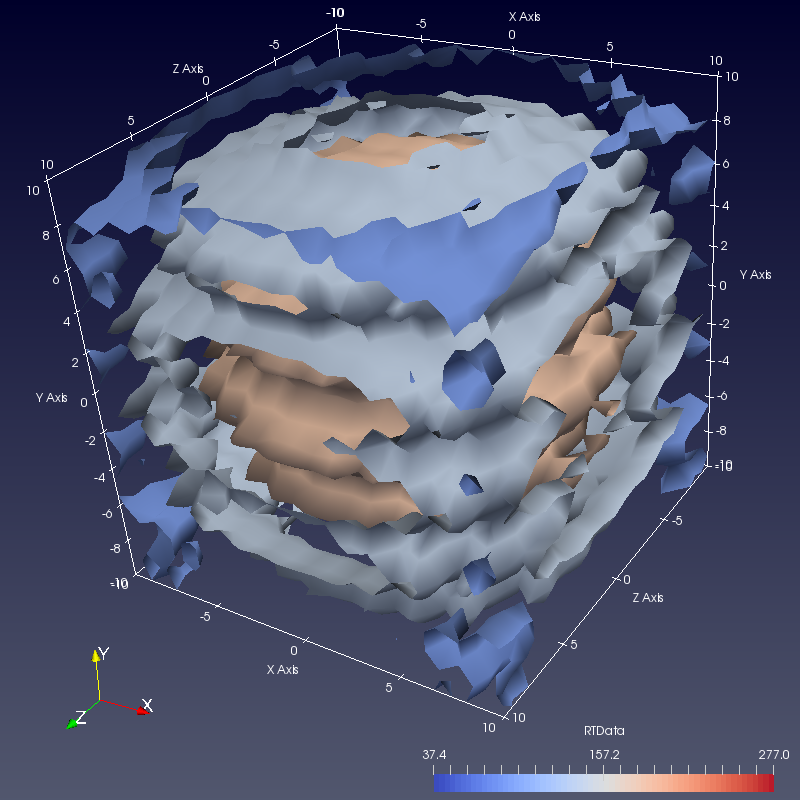
    
    ``Axes Grid`` :index:`\ <Axes Grid>`\  is used to annotate data bounds in  ``Render View`` :index:`\ <Render View>`\ .

The *Center axes* refers to axes rendered in the scene positioned as the
center of rotation, i.e., the location is space around which the camera revolves
during  ``Rotate`` :index:`\ <Rotate>`\  camera interaction.
``Center Axes Visibility`` :index:`\ 
`\  controls the visibility of the center axes.

The *Orientation axes* is the widget shown at the lower-left corner by
default, which is used to get a sense for the orientation of the scene. The properties
grouped under the  ``Orientation Axes`` :index:`\ <Orientation Axes>`\  group allow you to toggle the visibility and
the interactivity of this widget. When interactivity is enabled, you can click and
drag this widget to the location of your choosing in the scene.

You can also change the  ``Background`` :index:`\ <Background>`\  used for this view. You can either set it as a
``Single`` :index:`\ <Single>`\  color or as a  ``Gradient`` :index:`\ <Gradient>`\  comprised of two colors, or you can select an
``Image`` :index:`\ <Image>`\  (or texture) to use as the background.

There are two advanced properties you may wish to set: hidden line removal
and camera parallel projection. The  ``Hidden Line Removal`` :index:`\ <Hidden Line Removal>`\  option
can be enabled to hide lines that would be occluded by a solid object
when drawing objects in a  ``Wireframe`` :index:`\ <Wireframe>`\  representation.
If you want to render your data using parallel projection instead of
the default perspective projection you can check the
``Camera Parallel Projection`` :index:`\ <Camera Parallel Projection>`\  checkbox.

Display properties
------------------

.. _sec:RenderView:DisplayProperties:

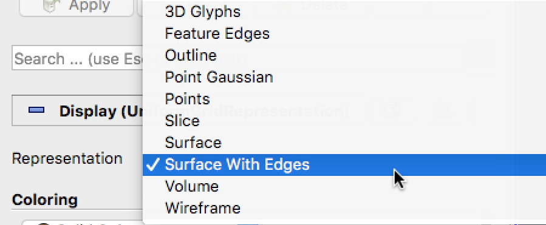

One of the first (and probably the most often used) display properties is
``Representation`` :index:`\ <Representation>`\ .  ``Representation`` :index:`\ <Representation>`\  allows you to pick one of the
*mapping* modes. The options available depend on the data type, as well as
the plugins loaded. While all display properties are accessible from the
advanced view for the  ``Properties`` :index:`\ <Properties>`\  panel, certain properties may be
shown/hidden from the default view based on the chosen representation type.

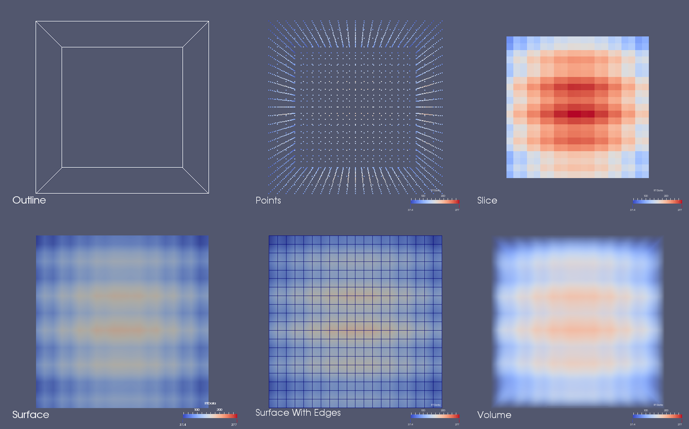
  
    Different renderings generated by rendering data produced by the  ``Wavelet`` :index:`\ <Wavelet>`\ source as outline, points, slice, surface, surface with edges, and volume.

The  ``Outline`` :index:`\ <Outline>`\  representation can be used to render an outline for the
dataset. This is arguably the fastest way of rendering the dataset since only
the bounding box is rendered. Scalar coloring options, i.e., selecting an array
with which to color, has no effect on this representation type. You can still,
however, change the  ``Solid Color`` :index:`\ <Solid Color>`\  to use as well as the  ``Opacity`` :index:`\ <Opacity>`\ . To change
the color, select  ``Solid Color`` :index:`\ <Solid Color>`\  in the combo-box under  ``Coloring`` :index:`\ <Coloring>`\ , and then
click  ``Edit`` :index:`\ <Edit>`\  to pick the color to use. To change the opacity, simply change
the  ``Opacity`` :index:`\ <Opacity>`\  slider. 0 implies total transparency and, hence, invisiblity, while 1
implies totally opacity.

.. admonition:: **Did you know?**
  :class: tip

  Rendering translucent data generally adds computational
  costs to the rendering process. Thus, when rendering large datasets, you may
  want to leave changing opacities to anything less than 1 to the very end,
  after having set up the visualization. In doing so, you avoid translucent geometries
  during exploration, but use them for generating images or screenshots for
  presentations and publications.

``Points`` :index:`\ <Points>`\ ,  ``Surface`` :index:`\ <Surface>`\ ,  ``Surface With Edges`` :index:`\ <Surface With Edges>`\ , and  ``Wireframe`` :index:`\ <Wireframe>`\  rely on
extracting the surface mesh from the dataset and then rendering that either as a
collection of points, as solid surface, as solid surface with cell boundaries
highlighted, or as a wireframe of cell boundaries only.  ``Feature Edges`` :index:`\ <Feature Edges>`\ 
is a subset of  ``Wireframe`` :index:`\ <Wireframe>`\  consisting of prominent edges on the surface such
as edges between cells that form a sharp angle or edges with only one adjacent cell.
For these representations, you can either set a single solid color to use,
as with  ``Outline`` :index:`\ <Outline>`\ , or select a data array to use for scalar coloring (also
known as pseudocoloring).

Two other representations are available for most datasets.  ``3D Glyphs`` :index:`\ <3D Glyphs>`\  draws
a copy of a 3D geometry (e.g., arrow, cone, or sphere, etc.), or glyph, at a subset
of points in the dataset. These glyphs can be set to a single color or
pseudocolored by a data array. The  ``Point Gaussian`` :index:`\ <Point Gaussian>`\  representation is similar,
but instead of drawing 3D geometry at every point, it draws a 2D image sprite
that may have transparency. The image drawn can be one of several predefined
image sprites such as  ``Gaussian Blur`` :index:`\ <Gaussian Blur>`\ ,  ``Sphere`` :index:`\ <Sphere>`\ ,  ``Black-edged circle`` :index:`\ <Black-edged circle>`\ ,
``Plain cirlce`` :index:`\ <Plain cirlce>`\ ,  ``Triangle`` :index:`\ <Triangle>`\ , or  ``Square outline`` :index:`\ <Square outline>`\ , or a custom sprite
can be defined with custom GLSL shader code.

.. admonition:: **Did you know?**
  :class: tip

  For visualizations that feature 3D glyphs, it is typically much faster to
  use the  ``3D Glyph`` :index:`\ <3D Glyph>`\  representation rather than the  ``Glyph`` :index:`\ <Glyph>`\  filter. This is because
  the glyph representation draws the same geometry at many different locations (a graphics
  technique called geometry instancing) while the  ``Glyph`` :index:`\ <Glyph>`\  filter makes many copies of the
  same source geometry and renders the resulting mesh in its entirety. Generating all the glyphs and
  rendering them takes potentially a lot of memory and is typically slower to render, so
  you should use the  ``3D Glyph`` :index:`\ <3D Glyph>`\  representation when possible.

Next, we will cover each of the property groups available under  ``Display`` :index:`\ <Display>`\ 
properties. Several of these are marked as advanced. Accordingly, you may need to
either toggle the panel to show advanced properties using the
|pqAdvanced26| button or search for it by name using the search
box.

.. |pqAdvanced26| image:: images/pqAdvanced26.png
                  :width: 0.5cm

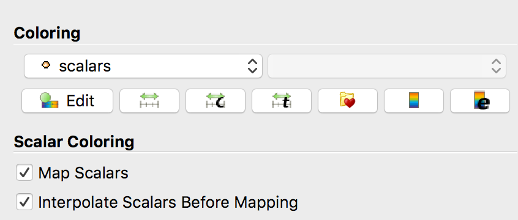

Display properties under  ``Coloring`` :index:`\ <Coloring>`\  :index:`\ <Coloring>`\  allow you to set
how the dataset is
colored. To select a single solid color to use to fill the surface or color the
wireframe or points, select  ``Solid Color`` :index:`\ <Solid Color>`\  in the combo-box, and then
click  ``Edit`` :index:`\ <Edit>`\ . That will pop up the standard color chooser dialog from which you
can pick a color to use.

If instead you want to pseudocolor using an attribute array
available on the dataset, select that array name from the combo-box. For
multi-component arrays, you can pick a particular component or  ``Magnitude`` :index:`\ <Magnitude>`\  to
use for scalar coloring. |ParaView| will automatically setup a color transfer
function it will use to map the data array to colors. The default range for the
transfer function is set up based on the  ``Transfer Function Reset Mode`` :index:`\ <Transfer Function Reset Mode>`\  general
setting in the  ``Settings`` :index:`\ <Settings>`\  dialog when the transfer function is first created.
If another dataset is later colored by a data array with the same name, the range
of the transfer function will be updated according to the  ``Automatic Rescale Range Mode`` :index:`\ <Automatic Rescale Range Mode>`\ 
property in the  ``Color Map Editor`` :index:`\ <Color Map Editor>`\ . To reset the transfer function range to the
range of the data array in the selected dataset, you can use the  ``Rescale`` :index:`\ <Rescale>`\ 
button. Remember that, despite the fact that you can set the scalar array with
which to color when rendering as  ``Outline`` :index:`\ <Outline>`\ , the outline itself continues to use
the specified solid color.

``Scalar Coloring`` :index:`\ <Scalar Coloring>`\  properties are only relevant when you have selected a data
array with which to pseudocolor. The  ``Map Scalars`` :index:`\ <Map Scalars>`\  checkbox affects whether a color
transfer function should be used (:numref:`fig:UnderstandingMapScalars`).
If unchecked, and the data array can directly
be interpreted as colors, then those colors are used directly. If not, the color
transfer function will be used. A data array can be interpreted as colors if, and
only if, it is an unsigned char, float, or double array with two, three, or four
components. If the data array is unsigned char, the color values are defined between
0 and 255 while if the data array is float or double, the color values are expected
to be between 0 and 1.  ``Interpolate Scalars Before Mapping`` :index:`\ <Interpolate Scalars Before Mapping>`\  controls how color
interpolation happens across rendered polygons. If
on, scalars will be interpolated within polygons, and color mapping will occur
on a per-pixel basis. If off, color mapping occurs at polygon points, and colors
are interpolated, which is generally less accurate. Refer to the Kitware blog
:cite:`ColorInterpolationBlogPost` for a detailed explanation of this option.

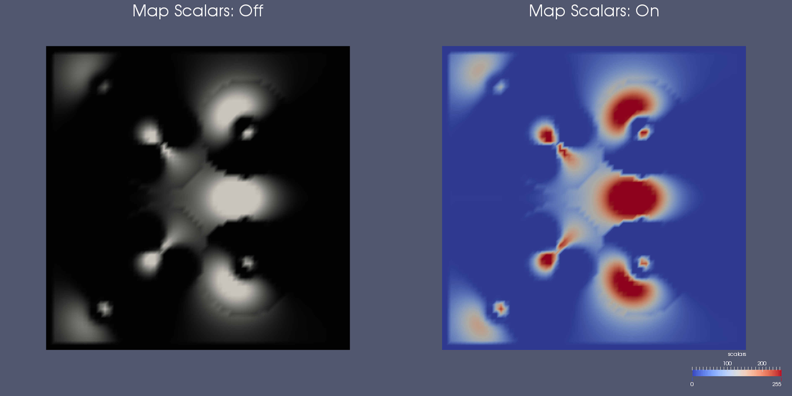
    
    The  ``Map Scalars`` :index:`\ <Map Scalars>`\  property can be used to avoid using a transfer function and directly interpreting the array values as colors, if possible.

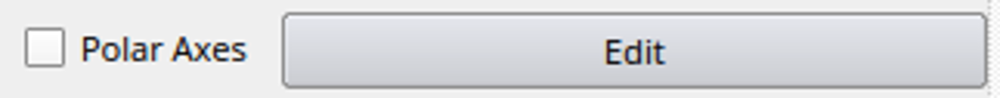

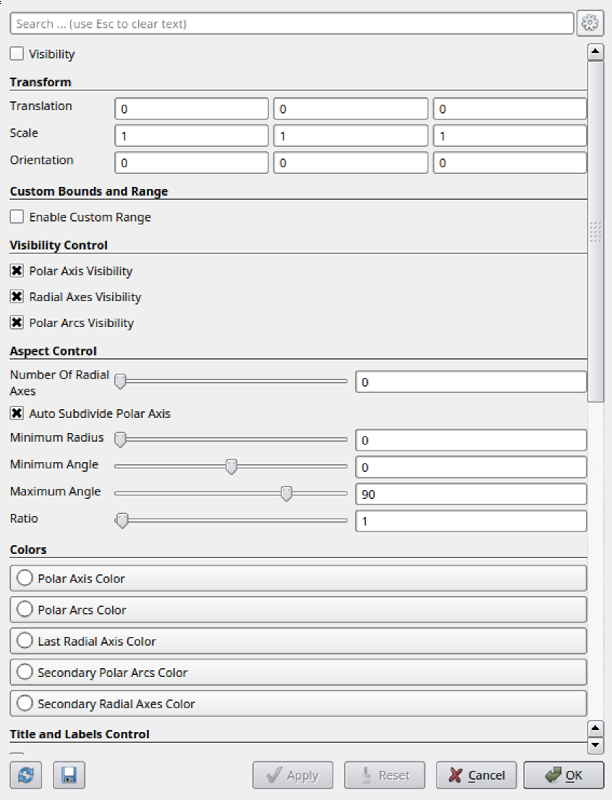

The  ``Polar Axes`` :index:`\ <Polar Axes>`\  checkbox toggles polar axes shown around the data.
Many parameters can be accessed via an  ``Edit button`` :index:`\ <Edit button>`\  alongside it.
The parameters include angles, tick range, labels, logarithmic mode,
ellipse ratio and more.

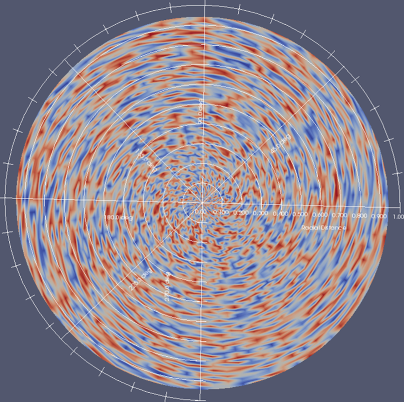

    A  ``Polar Axes`` :index:`\ <Polar Axes>`\  usage example.

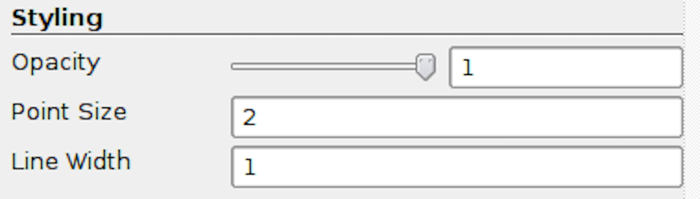

``Styling`` :index:`\ <Styling>`\  properties include  ``Opacity`` :index:`\ <Opacity>`\  (useful when rendering translucent
geometries),  ``Point Size`` :index:`\ <Point Size>`\  (used to control size of points rendered with using
``Points`` :index:`\ <Points>`\  representation), and  ``Line Width`` :index:`\ <Line Width>`\  (used to control the thickness
of lines when rendering as  ``Wireframe`` :index:`\ <Wireframe>`\  or that of the edges when rendering as
``Surface With Edges`` :index:`\ <Surface With Edges>`\ .

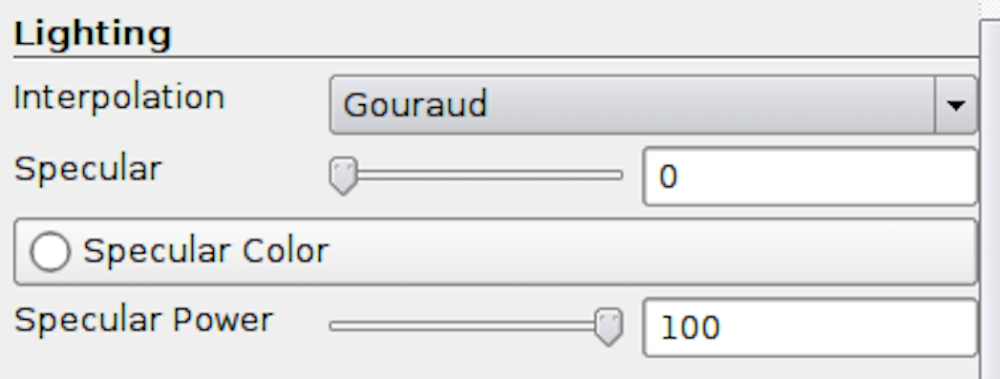

``Lighting`` :index:`\ <Lighting>`\  properties affect the shading for rendered surfaces.
``Interpolation`` :index:`\ <Interpolation>`\  allows you to pick between  ``Flat`` :index:`\ <Flat>`\  and  ``Gouraud`` :index:`\ <Gouraud>`\ 
shading.  ``Specular`` :index:`\ <Specular>`\ , together with  ``Specular Color`` :index:`\ <Specular Color>`\  and  ``Specular
Power`` :index:`\ <Specular
Power>`\ , affects the shininess of the surface. Set this to a non-zero value to
render shiny, metallic surfaces.

.. admonition:: **Common Errors** 
  :class: error

  ``Specular`` :index:`\ <Specular>`\  highlights can lead to misinterpretation of scalar values when
  using scalar coloring, since the color shown on the shiny part of the surface
  will not correspond to any color on the color transfer function. Hence, it is
  generally advisable to use specular highlights on surfaces colored with a single
  solid color and not on those using scalar coloring (or
  pseduocoloring).

  .. figure:: images/ScalarColoringAndSpecularHighlights.png
      :width: 70%
      :align: center

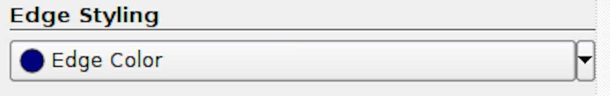

``Edge Styling`` :index:`\ <Edge Styling>`\  allows you to set the  ``Edge Color`` :index:`\ <Edge Color>`\  with which to color the edges
when using  ``Surface With Edges`` :index:`\ <Surface With Edges>`\  representation.

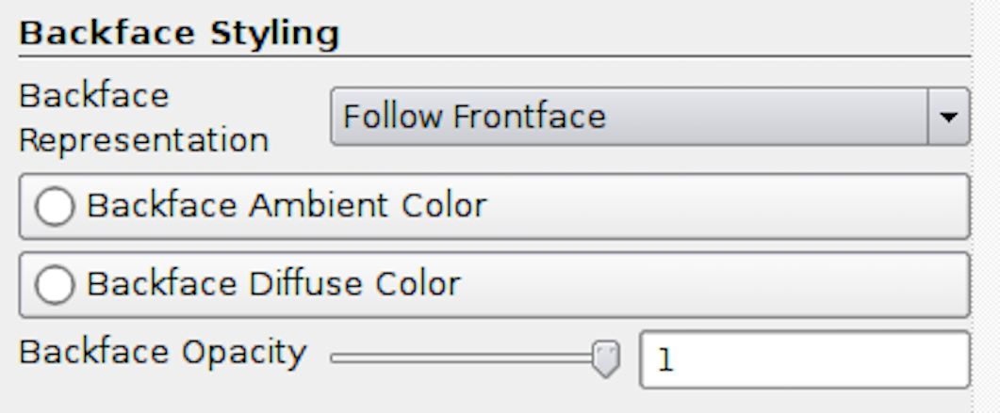

``Backface Styling`` :index:`\ <Backface Styling>`\  provides advanced controls to fine-tune the rendering by
controlling front and back faces. A front face is any mesh face facing the
camera, while a back face is the one facing away from the camera. By choosing to
``Cull Frontface`` :index:`\ <Cull Frontface>`\  or  ``Cull Backface`` :index:`\ <Cull Backface>`\ , or by selecting a specific representation
type to use for the backface, you can customize your visualizations.

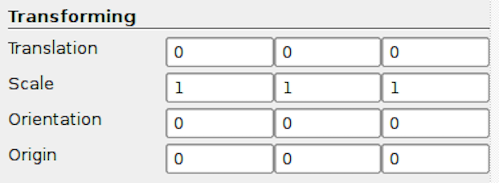

``Transforming`` :index:`\ <Transforming>`\  properties can be used to transform the rendered data in the
scene without affecting the raw data itself. Thus, if you apply filters on the
data source, it will indeed be working with the untransformed data. To transform
the data itself, you should use the  ``Transform`` :index:`\ <Transform>`\  filter.

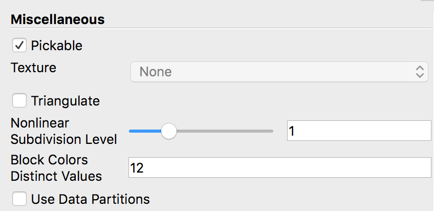

Several properties are available under the  ``Miscellaneous`` :index:`\ <Miscellaneous>`\  group. Uncheck the  ``Pickable`` :index:`\ <Pickable>`\ 
option if you want the dataset to be ignored when making selections. If the
dataset has a texture coordinates array, you can apply a texture to the dataset
surface using the  ``Texture`` :index:`\ <Texture>`\  combo-box. Choose  ``Load`` :index:`\ <Load>`\  to load a texture or
apply a previously loaded texture listed in the combo-box. If your dataset
doesn't have texture coordinates, you can create them by applying one of
``Texture Map to Cylinder`` :index:`\ <Texture Map to Cylinder>`\ ,  ``Texture Map to Sphere`` :index:`\ <Texture Map to Sphere>`\ , or  ``Texture Map To
Plane`` :index:`\ <Texture Map To
Plane>`\  filters, or using the filters  ``Calculator`` :index:`\ <Calculator>`\  or  ``Programmable Filter`` :index:`\ <Programmable Filter>`\ .
\fixme{Add section on Use Shader Replacements property}

The  ``Triangulate`` :index:`\ <Triangulate>`\  option is useful for rendering objects with
non-convex polygons. It comes with some additional processing cost for
converting polygons to triangles, so it should be used only when necessary.

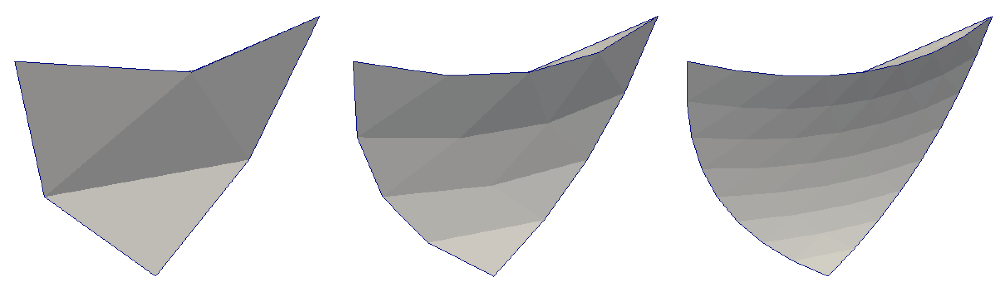

    A dataset made of quadratic tetra hedra displayed with 1, 2, and 3 levels of nonlinear subdivision.

The  ``Nonlinear Subdivision Level`` :index:`\ <Nonlinear Subdivision Level>`\  is used when rendering datasets with higher-
order elements. Use this to set the subdivision level for triangulating higher
order elements. The higher the value, the smoother the edges. This comes at the
cost of more triangles and, hence, potentially, increased rendering time.

The  ``Block Colors Distinct Values`` :index:`\ <Block Colors Distinct Values>`\  sets the number
of unique colors to use when coloring multi-block datasets by block ID. Finally,
``Use Data Partitions`` :index:`\ <Use Data Partitions>`\  controls whether data is redistributed when it is
rendered translucently. When off (default value), data is repartitioned by the
compositing algorithm prior to rendering. This is typically an expensive
operation that slows down rendering. When this option is off, the existing data
partitions are used, and the cost of data restribution is avoided. However, if
the partitions are not sortable in back-to-front order, rendering artifacts may
occur.

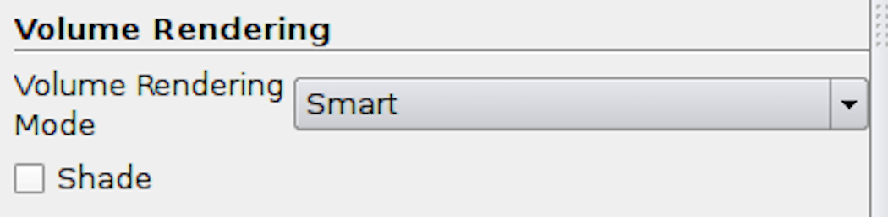

``Volume Rendering`` :index:`\ <Volume Rendering>`\  options are available if the data can be volume rendered.
You can pick a specific type of  ``Volume Rendering Mode`` :index:`\ <Volume Rendering Mode>`\ , although the
default ( ``Smart`` :index:`\ <Smart>`\ ) should work in most cases, since it attempts to pick a
volume rendering mode suitable for your data and graphics setup. To enable
gradient-based shading, check  ``Shade`` :index:`\ <Shade>`\ , if available.

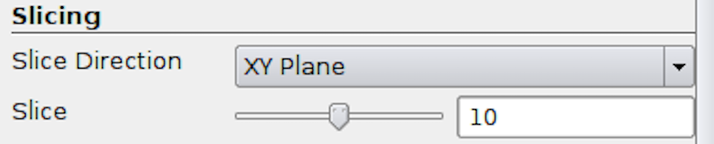

``Slicing`` :index:`\ <Slicing>`\  properties are available when the  ``Slice`` :index:`\ <Slice>`\  representation type is
present. These allow you to pick the orthogonal slice plane orientation and
slice offset using  ``Slice Direction`` :index:`\ <Slice Direction>`\  and the  ``Slice`` :index:`\ <Slice>`\  slider.

Render View in ``pvpython``
^^^^^^^^^^^^^^^^^^^^^^^^^^^

Creating a Render View
----------------------

You use  ``CreateRenderView`` :index:`\ <CreateRenderView>`\  or  ``CreateView`` :index:`\ <CreateView>`\  functions to create a new
instance of a render view.

.. code-block:: python

  >>> from paraview.simple import *
  >>> view = CreateRenderView()
  # Alternatively, use CreateView.
  >>> view = CreateView("RenderView")

\noindent
You use  ``Show`` :index:`\ <Show>`\  and  ``Hide`` :index:`\ <Hide>`\  to show or hide data produced by a pipeline
module in the view.

.. code-block:: python

  >>> source = Sphere()
  >>> view = CreateRenderView()
  
  # Show active source in active view.
  >>> Show()
  
  # Or specify source and view explicitly.
  >>> Show(source, view)
  
  # Hide source in active view.
  >>> Hide(source)

Interactions
------------

Since |pvpython| is designed for scripting and batch processing,
it has limited support for direct interaction with the view.
To interact with a scene, invoke the  ``Interact`` :index:`\ <Interact>`\  function in Python.

.. code-block:: python

  Interact()

More often, you will programmatically change the camera as follows:

.. code-block:: python

  # Get camera from the active view, if possible.
  >>> camera = GetActiveCamera()
  
  # or, get the camera from a specific render view.
  >>> camera = view.GetActiveCamera()
  
  # Now, you can use methods on camera to move it around the scene.
  
  # Divide the camera's distance from the focal point by the given dolly value.
  # Use a value greater than one to dolly-in toward the focal point, and use a
  # value less than one to dolly-out away from the focal point.
  >>> camera.Dolly(10)
  
  # Set the roll angle of the camera about the direction of projection.
  >>> camera.Roll(30)
  
  # Rotate the camera about the view up vector centered at the focal point. Note
  # that the view up vector is whatever was set via SetViewUp, and is not
  # necessarily perpendicular to the direction of projection. The result is a
  # horizontal rotation of the camera.
  >>> camera.Azimuth(30)
  
  # Rotate the focal point about the view up vector, using the camera's position
  # as the center of rotation. Note that the view up vector is whatever was set
  # via SetViewUp, and is not necessarily perpendicular to the direction of
  # projection. The result is a horizontal rotation of the scene.
  >>> camera.Yaw(10)
  
  # Rotate the camera about the cross product of the negative of the direction
  # of projection and the view up vector, using the focal point as the center
  # of rotation. The result is a vertical rotation of the scene.
  >>> camera.Elevation(10)
  
  # Rotate the focal point about the cross product of the view up vector and the
  # direction of projection, using the camera's position as the center of
  # rotation. The result is a vertical rotation of the camera.
  >>> camera.Pitch(10)
  
Alternatively, you can explicitly set the camera position, focal point, view up,
etc,. to explicitly place the camera in the scene.
  
.. code-block:: python

  >>> camera.SetFocalPoint(0, 0, 0)
  >>> camera.SetPosition(0, 0, -10)
  >>> camera.SetViewUp(0, 1, 0)
  >>> camera.SetViewAngle(30)
  >>> camera.SetParallelProjection(False)
  
  # If ParallelProjection is set to True, then you'll need
  # to specify parallel scalar as well i.e. the height of the viewport in
  # world-coordinate distances. The default is 1. Note that the `scale'
  # parameter works as an `inverse scale' where larger numbers produce smaller
  # images. This method has no effect in perspective projection mode.
  >>> camera.SetParallelScale(1)

View properties
---------------

In |pvpython|, view properties are directly accessible on the view
object returned by  ``CreateRenderView`` :index:`\ <CreateRenderView>`\  or  ``GetActiveView`` :index:`\ <GetActiveView>`\ .

Once you get access to the view properties objects, you can then set properties
on it similar to properties on pipeline modules such as sources, filters, and
readers.

.. code-block:: python

  >>> view = GetActiveView()
  
  # Set center axis visibility
  >>> view.CenterAxesVisibility = 0
  
  # Or you can use this variant to set the property on the active view.
  >>> SetViewProperties(CenterAxesVisibility=0)
  
  # Another way of doing the same
  >>> SetViewProperties(view, CenterAxesVisibility=0)
  
  # Similarly, you can change orientation axes related properties
  >>> view.OrientationAxesVisibility = 0
  >>> view.OrientationAxesLabelColor = (1, 1, 1)

Display properties
------------------

Similar to view properties, display properties are accessible from the display
properties object or using the  ``SetDisplayProperties`` :index:`\ <SetDisplayProperties>`\  function.

.. code-block:: python

  >>> displayProperties = GetDisplayProperties(source, view)
  # Both source and view are optional. If not specified, the active source
  # and active view will be used.
  
  # Now one can change properties on this object
  >>> displayProperties.Representation = "Outline"
  
  # Or use the SetDisplayProperties API.
  >>> SetDisplayProperties(source, view, Representation=Outline)
  
  # Here too, source and view are optional and when not specified,
  # active source and active view will be used.

You can always use the  ``help`` :index:`\ <help>`\  function to get information about available
properties on a display properties object.

Line Chart View
===============

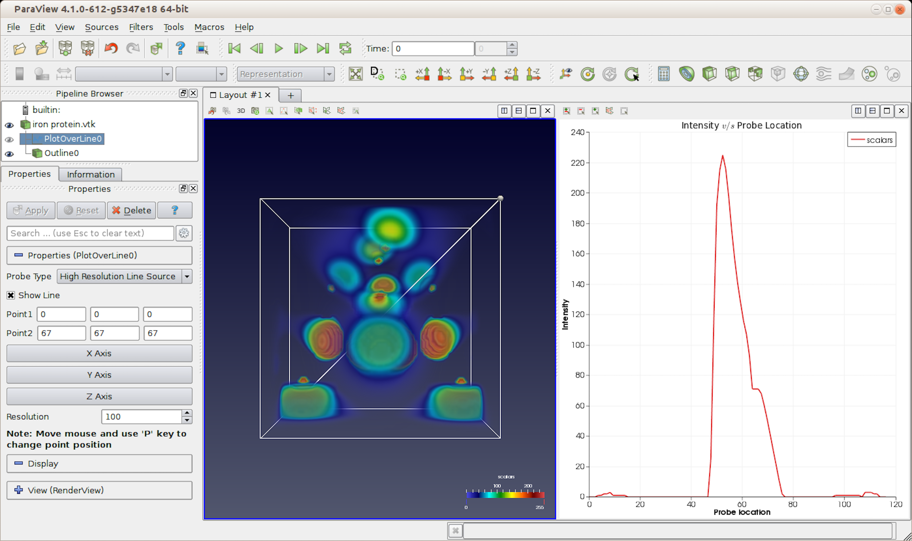

    |paraview| using  ``Line Chart View`` :index:`\ <Line Chart View>`\  to plot data values probed along a line through the dataset using  ``Plot Over Line`` :index:`\ <Plot Over Line>`\  filter.

``Line Chart View`` :index:`\ <Line Chart View>`\  can be used to plot data as a line plot representing
changes in dependent variables against an independent variable. Using display
properties, you can also show scatter plots in this view. This view and other
charting views in |ParaView| follow a similar design, where you pick attribute
arrays to plot using display properties, and they are plotted in the view. How
those values get plotted depends on the type of the view:  ``Line Chart View`` :index:`\ <Line Chart View>`\ 
draws a line connecting sample points,  ``Bar Chart View`` :index:`\ <Bar Chart View>`\  renders bars at each
sample point, etc.

One of the most common ways of showing a line plot is to apply the  ``Plot Over
Line`` :index:`\ <Plot Over
Line>`\  filter to any dataset. This will probe the dataset along the probe line
specified. You then plot the sampled values in the  ``Line Chart View`` :index:`\ <Line Chart View>`\ .
Alternatively, if you have a tabular dataset (i.e.  ``vtkTable`` :index:`\ <vtkTable>`\ ), then you can
directly show the data in this view.

.. admonition:: **Did you know?**
  :class: tip

  You can plot any arbitrary dataset, even those not producing  ``vtkTable`` :index:`\ <vtkTable>`\  outputs,
  by using the  ``Plot Data`` :index:`\ <Plot Data>`\  filter. Remember, however, that for
  extremely large datasets, while  ``Render View`` :index:`\ <Render View>`\  may use parallel rendering
  strategies to improve performance and reduce memory requirements, chart views
  rarely, if ever, support such parallel strategies.

Understanding plotting
^^^^^^^^^^^^^^^^^^^^^^

``Line Chart View`` :index:`\ <Line Chart View>`\  plots data arrays. For any dataset being shown in the view,
you first select which data array is to be treated as the independent variable
and plotted along the x-axis. Then, you select which arrays to plot along the
Y-axis. You can select multiple of these and setup properties for each of the
series so they are rendered with different colors and line styles. Since data
arrays in VTK datasets are associated with cells or points, and the two are not
directly comparable to one another, you can only pick arrays associated with
one type of attribute at any time.

Line Chart View in ``paraview``
^^^^^^^^^^^^^^^^^^^^^^^^^^^^^^^

Creating a Line Chart View
--------------------------

Similar to creating  ``Render View`` :index:`\ <Render View>`\ , you can split the viewport or convert
an existing view to  ``Line Chart View`` :index:`\ <Line Chart View>`\ .  ``Line Chart View`` :index:`\ <Line Chart View>`\  will also be
automatically created if you apply a filter that needs this view, e.g., the
``Plot Over Line`` :index:`\ <Plot Over Line>`\  filter.

.. admonition:: **Did you know?**
  :class: tip

  If you generate lengthy data for the  ``Line Chart View`` :index:`\ <Line Chart View>`\ , the default variables
  that are selected may be slow to adjust. You can change |paraview|'s default
  behavior to initially load no variables at all by selecting the
  ``Load No Chart Variables`` :index:`\ <Load No Chart Variables>`\  checkbox under
  ``Settings/General/Properties Panel Options`` :index:`\ <Settings/General/Properties Panel Options>`\ .

  \begin{center}
  \includegraphics[width=0.4\linewidth]{Images/ChartNoVarSetting.png}
  \end{center}

Interactions
------------

Interactions with the chart view result in changing the plotted axes ranges.
You can left-click and drag to pan, i.e., change the origin. To change the range
on either of the axes, you can right-click and drag vertically and/or horizontally
to change the scale on the vertical axes and/or horizontal axes, respectively.

You can also explicitly specify the axes range using view properties.

View properties
---------------

The view properties for  ``Line Chart View`` :index:`\ <Line Chart View>`\  are grouped as properties that
affect the view and those that affect each of the potential four axes.

\begin{center}
\includegraphics[width=0.5\linewidth]{Images/LineChartViewPropertiesTitleGroup.png}
\end{center}

To set a title, use  ``Chart Title`` :index:`\ <Chart Title>`\ . Title text properties such as font, size,
style, and alignment with respect to the chart can be set under  ``Chart Title
Properties`` :index:`\ <Chart Title
Properties>`\ . To toggle the visibility of the legend, use  ``Show Legend`` :index:`\ <Show Legend>`\ . While
you cannot interactively place the legend in this view, you can use  ``Legend
Location`` :index:`\ <Legend
Location>`\  to place it at one of the corners.

\begin{center}
\includegraphics[width=0.5\linewidth]{Images/LineChartViewPropertiesLeftAxisGroup.png}
\end{center}

There are four axes possible in this view: left, bottom, top, and right. The top
and right axes are shown only when some series is set to use those. (We will
cover this in the *Display properties* subsection.) For each of the axes,
you can set a title (e.g.,  ``Left Axis Title`` :index:`\ <Left Axis Title>`\ ,  ``Bottom Axis Title`` :index:`\ <Bottom Axis Title>`\ , etc.)
and adjust the title font properties. You can turn on a grid with a customizable
color by checking the  ``Show Left Axis Grid`` :index:`\ <Show Left Axis Grid>`\ , for example.

Next, you can customize the axes ranges. You can always simply interact with the
mouse to set the axes ranges. To precisely set the range, check the
``Axis Use Custom Range`` :index:`\ <Axis Use Custom Range>`\  for the appropriate axis, e.g.,  ``Bottom Axis Use
Custom Range`` :index:`\ <Bottom Axis Use
Custom Range>`\  for fixing the bottom axis range, and then specify the data values to
use for the min and the max.

The labels on the axes are, by default, automatically determined to avoid visual
clutter. By default, the axis labels are arranged on a linear scale, but by
enabling the  ``Axis Log Scale`` :index:`\ <Axis Log Scale>`\  option you can use log scaling instead. In
addition, you can override the default labelling strategy for any of the axes
separately and, instead, specify the locations to label explicitly. This can be
done by checking  ``Axis Use Custom Labels`` :index:`\ <Axis Use Custom Labels>`\  for a particular axis, e.g.,
``Bottom Axis Use Custom Labels`` :index:`\ <Bottom Axis Use Custom Labels>`\ . When checked, a list widget will be shown
where you can manually add values at which labels will be placed.

For generating log plots, simply check the corresponding  ``Axis Use Log Scale`` :index:`\ <Axis Use Log Scale>`\ ,
e.g.,  ``Left Axis Use Log Scale`` :index:`\ <Left Axis Use Log Scale>`\  to use log scale for Y-axis
(:numref:`fig:LineChartViewUsingLogScale`). Note that log
scale should only be used for an axis with a non-zero positive range, since the log of a
number less than or equal to 0 is undefined.

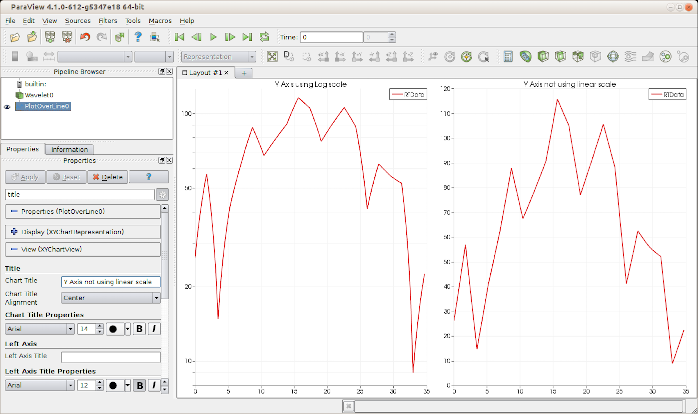
      
    Differences between line charts when using log scale for the Y-axis.

Display properties
------------------

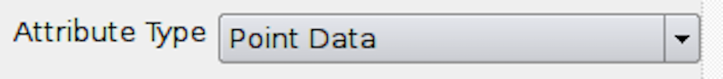

Display properties allow you to setup which series or data arrays are plotted in
this view. You start by picking the  ``Attribute Type`` :index:`\ <Attribute Type>`\ . Select the attribute
type that has the arrays of interest. For example, if you are plotting arrays
associated with points, then you should pick  ``Point Data`` :index:`\ <Point Data>`\ .) Arrays with
different associations cannot be plotted together. You may need to apply filters
such as  ``Cell Data to Point Data`` :index:`\ <Cell Data to Point Data>`\  or  ``Point Data to Cell Data`` :index:`\ <Point Data to Cell Data>`\  to convert
arrays between different associations for that.

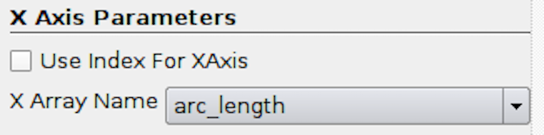

Properties under  ``X Axis Parameters`` :index:`\ <X Axis Parameters>`\  allow you to select the independent
variable plotted on the X axis by choosing the  ``X Array Name`` :index:`\ <X Array Name>`\ . If none of the
arrays are appropriate, you can choose to use the element index in the array as
the X axis by checking  ``Use Index for XAxis`` :index:`\ <Use Index for XAxis>`\ .

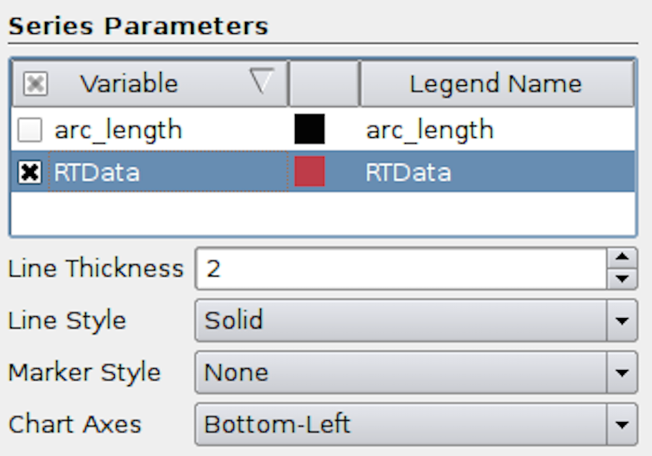

``Series Parameters`` :index:`\ <Series Parameters>`\  control series or data arrays plotted on the Y-axis. All
available data arrays are lists in the table widget that allows you to
check/uncheck a series to plot in the first column. The second column in the
table shows the associated color used to plot that series. You can double-click
the color swatch to change the color to use. By default, |ParaView| will try to
pick a palette of discrete colors. The third column shows the label to use for
that series in the legend. By default, it is set to be the same as the array
name. You can double-click to change the name to your choice, e.g., to add units.

Other series parameters include  ``Line Thickness`` :index:`\ <Line Thickness>`\ ,  ``Line Style`` :index:`\ <Line Style>`\ , and  ``Marker
Style`` :index:`\ <Marker
Style>`\ . To change any of these, highlight a row in the  ``Series Parameters`` :index:`\ <Series Parameters>`\ 
widget, and then change the associated parameter to affect the highlighted
series. You can change properties for multiple series and can select multiple of
them by using the |CTRL| (or |CMD|) and |SHIFT| keys.

Using  ``Chart Axes`` :index:`\ <Chart Axes>`\ , you can change which axes on which a series is shown. The
default is  ``Bottom-Left`` :index:`\ <Bottom-Left>`\ , but you can change it to be  ``Bottom-Right`` :index:`\ <Bottom-Right>`\ ,
``Top-Left`` :index:`\ <Top-Left>`\ , or  ``Top-Right`` :index:`\ <Top-Right>`\  to accommodate series with widely different
ranges in the same plot.

Line Chart View in ``pvpython``
^^^^^^^^^^^^^^^^^^^^^^^^^^^^^^^

The principles involved in accessing  ``Line Chart View`` :index:`\ <Line Chart View>`\  from
|pvpython| are similar to those with  ``Render View`` :index:`\ <Render View>`\ . You work with
the view properties and display properties objects to change views and display
properties, respectively. The thing that changes is the set of available
properties.

The following script demonstrates the typical usage:

.. code-block:: python

  >>> from paraview.simple import *
  
  # Create a data source to probe into.
  >>> Wavelet()
  <paraview.servermanager.Wavelet object at 0x1156fd810>
  
  # We update the source so that when we create PlotOverLine filter
  # it has input data available to determine good defaults. Otherwise,
  # we will have to manually set up the defaults.
  >>> UpdatePipeline()
  
  # Now, create the PlotOverLine filter. It will be initialized using
  # defaults based on the input data.
  >>> PlotOverLine()
  <paraview.servermanager.PlotOverLine object at 0x1156fd490>
  
  # Show the result.
  >>> Show()
  <paraview.servermanager.XYChartRepresentation object at 0x1160a6a10>
  
  # This will automatically create a new Line Chart View if the
  # the active view is no a Line Chart View since PlotOverLine
  # filter indicates it as the preferred view. You can also explicitly
  # create it by using CreateView() function.
  
  # Display the result.
  >>> Render()
  
  # Access display properties object.
  >>> dp = GetDisplayProperties()
  >>> print(dp.SeriesVisibility)
  ['arc_length', '0', 'RTData', '1']
  
  # This is  list with key-value pairs where the first item is the name
  # of the series, then its visibility and so on.
  # To toggle visibility, change this list e.g.
  >>> dp.SeriesVisibility = ['arc_length', '1', 'RTData', '1']
  
  # Same is true for other series parameters including series color,
  # line thickness etc.
  
  # For series color, the value consists of 3 values: red, green, and blue
  # color components.
  >>> print(dp.SeriesColor)
  ['arc_length', '0', '0', '0', 'RTData', '0.89', '0.1', '0.11']
  
  # For series labels, value is the label to use.
  >>> print(dp.SeriesLabel)
  ['arc_length', 'arc_length', 'RTData', 'RTData']
  
  # e.g. to change RTData's legend label, we can do something as follows:
  >>> dp.SeriesLabel[3] = 'RTData -- new label'
  
  # Access view properties object.
  >>> view = GetActiveView()
  # or
  >>> view = GetViewProperties()
  
  # To change titles
  >>> view.ChartTitle = "My Title"
  >>> view.BottomAxisTitle = "X Axis"
  >>> view.LeftAxisTitle = "Y Axis"

Bar Chart View
==============

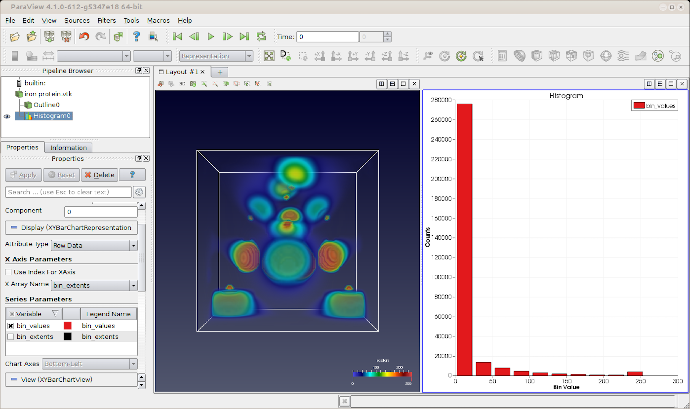

    |paraview| using  ``Bar Chart View`` :index:`\ <Bar Chart View>`\  to plot the histogram for a dataset using the  ``Histogram`` :index:`\ <Histogram>`\  filter.

``Bar Chart View`` :index:`\ <Bar Chart View>`\  is very similar to  ``Line Chart View`` :index:`\ <Line Chart View>`\  when it comes to
creating the view, view properties, and display properties. One difference is
that, instead of rendering lines for each series, this view renders bars. In addition,
under the display properties, the  ``Series Parameters`` :index:`\ <Series Parameters>`\  like  ``Line Style`` :index:`\ <Line Style>`\  and
``Line Thickness`` :index:`\ <Line Thickness>`\  are not available, since they are not applicable to bars.

Box Chart View
==============

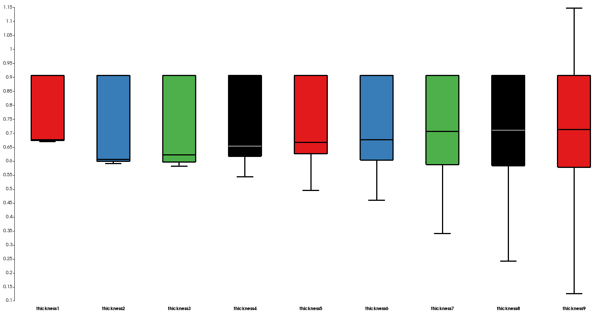

    |paraview| using  ``Box Chart View`` :index:`\ <Box Chart View>`\  to plot the box chart for a dataset using the  ``Compute Quartiles`` :index:`\ <Compute Quartiles>`\  filter.

Box plot is a standard method for graphically depicting groups of statistical
data based on their quartiles. A box plot is represented by a box with the
following properties: the bottom of the rectangle corresponds to the first
quartile, a horizontal line inside the rectangle indicates the median and the
top of the rectangle corresponds to the third quartile. The maximum and minimum
values are depicted using vertical lines that extend from the top and the bottom
of the rectangle.

In ParaView, the  ``Box Chart View`` :index:`\ <Box Chart View>`\  can be used to display such box plots through
the  ``Compute Quartiles`` :index:`\ <Compute Quartiles>`\  filter which computes the statistical data needed by
the view to draw the box plots.

Plot Matrix View
================

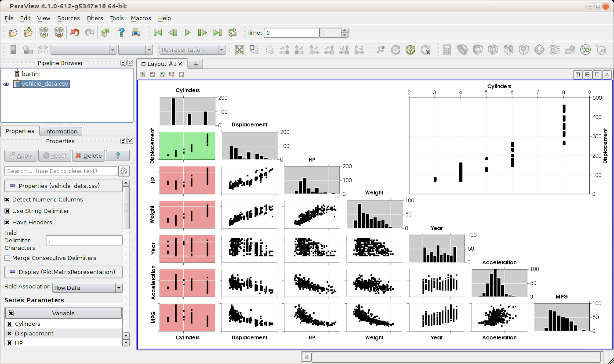

    |paraview| using  ``Plot Matrix View`` :index:`\ <Plot Matrix View>`\  to generate a scatter plot matrix to understand correlations between pairs of variables.

``Plot Matrix View`` :index:`\ <Plot Matrix View>`\  is a chart view that renders a scatter plot matrix. It
allows you to spot patterns in the small scatter plots, change focus to those
plots of interest, and perform basic selection. The principle is that, for all
selected arrays or series to be plotted, the view generates a scatter plot for
each pair. You can activate a particular scatter plot, in which case the active
plot is re-drawn at a bigger scale to make it easier to inspect.
Additionally, the view shows a histogram for each plotted variable or series.

The view properties allow you to set colors to use for active plot, histograms,
etc., while the display properties allow you to pick which series are plotted.

Interactions
^^^^^^^^^^^^

You can click on any of the plots (except the histograms) in the matrix to make
it active. Once actived, the active plot will show that plot. You can then
interact with the active plot exactly like  ``Line Chart View`` :index:`\ <Line Chart View>`\  or  ``Bar Chart
View`` :index:`\ <Bar Chart
View>`\  for panning and zoom.

View properties
^^^^^^^^^^^^^^^

View properties on this view allow you to pick styling parameters for the
rendering ranging from title ( ``Chart Title`` :index:`\ <Chart Title>`\ ) to axis colors ( ``Active Plot
Axis Color`` :index:`\ <Active Plot
Axis Color>`\ ,  ``Active Plot Grid Color`` :index:`\ <Active Plot Grid Color>`\ ). You can also control the visibility
of the histrogram plots, the active plot, the axes labels, the grids, and so on.

Display properties
^^^^^^^^^^^^^^^^^^

Similar to  ``Line Chart View`` :index:`\ <Line Chart View>`\ , you select the  ``Attribute Type`` :index:`\ <Attribute Type>`\  and then the
arrays to plot. Since, in a scatter plot matrix, the order in which the selected
series are rendered can make it easier to understand correlations, you can
change the order by clicking and dragging the rows in the  ``Series Parameters`` :index:`\ <Series Parameters>`\ 
table. \fixme{add images}

Parallel Coordinates View
=========================

.. figure:: images/ParallelCoordinatesViewInParaView.png
    :name: fig:ParallelCoordinatesViewInParaView
    :width: 80%
    :align: center

    |paraview| using  ``Parallel Coordinates View`` :index:`\ <Parallel Coordinates View>`\  to plot correlations between columns in a table.

Like  ``Plot Matrix View`` :index:`\ <Plot Matrix View>`\ ,  ``Parallel Coordinates View`` :index:`\ <Parallel Coordinates View>`\  is also used to
visualize correlations between data arrays.

One of the main features of this view is the ability to select specific data in order to analyse
the factors influencing the data. e.g., with a table of three variables, one being the "output" variable
the other two being the potential factor influencing the first, selecting only the output will enable you
to see if none, one, or both of the factors are actually influencing the output.

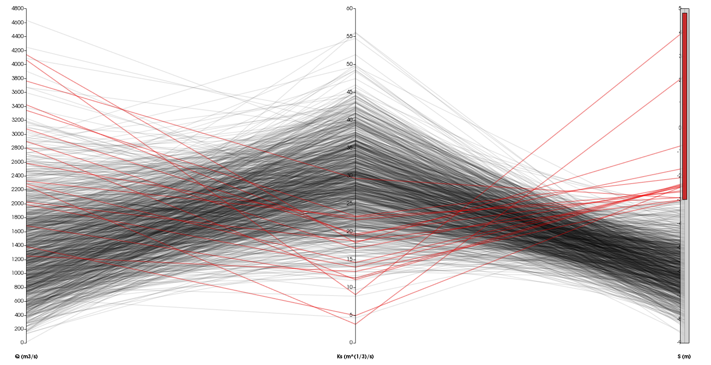

    High "S" data point are influenced more by low "Ks" than high "Q"

Spreadsheet View
================

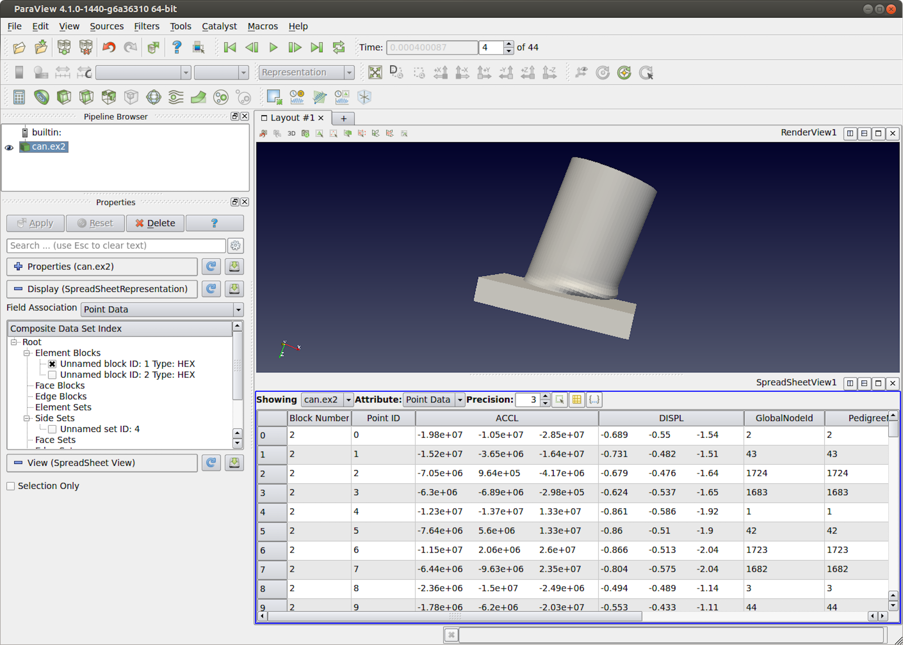

    |paraview| using  ``SpreadSheet View`` :index:`\ <SpreadSheet View>`\  to plot raw data values for the $can.ex2$ dataset.

``SpreadSheet View`` :index:`\ <SpreadSheet View>`\  is used to inspect raw data values in a tabular form.
Unlike most other views, this view is primarily intended to be used in the
|paraview| user interface and, hence, is not available in
|pvpython|.

To use this view, simply create this view and show the dataset produced by any
pipeline module in it by using the  ``Pipeline Browser`` :index:`\ <Pipeline Browser>`\ .  ``SpreadSheet View`` :index:`\ <SpreadSheet View>`\ 
can only show one dataset at a time. Therefore, showing a new dataset will
automatically hide the previously shown dataset.

The view's toolbar provides quick access to several of this view's capabilities.
Use the  ``Showing`` :index:`\ <Showing>`\  widget on the view toolbar to view as well as to change the
dataset being shown. The  ``Attribute`` :index:`\ <Attribute>`\  field allows you to pick which types of
elements to show, e.g.,  ``Cell Data`` :index:`\ <Cell Data>`\ ,  ``Point Data`` :index:`\ <Point Data>`\ ,  ``Field Data`` :index:`\ <Field Data>`\ , etc.
``Precision`` :index:`\ <Precision>`\  can be utilized to change the precision used when displaying floating
point numbers.
The |pqRectilinearGrid16| button enables you to select columns to
show. Click on the button to get a popup menu in which you check/uncheck the
columns to show/hide.
If showing  ``Cell Data`` :index:`\ <Cell Data>`\ , the |pqProgrammableFilter24| button, when
checked, enables you to see the point ids that form each of the cells.

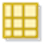

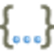

:numref:`sec:UnderstandingSelection` discusses how selections can be made in
views to select elements of interest. Use the |pqSelectChart16|
button to make the view show only selected elements. Now, as you make selections
in other views, this  ``SpreadSheet View`` :index:`\ <SpreadSheet View>`\  will update to only show the values
of the selected elements (as long as the dataset selected in are indeed being shown
in the view).

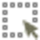

.. admonition:: **Did you know?**
  :class: tip

  Some filters and readers produce ``vtkTable``, and they are automatically displayed
  in a spreadsheet view. Thus, one can very easily read the contents of a .csv file
  with ParaView.

Slice View
==========

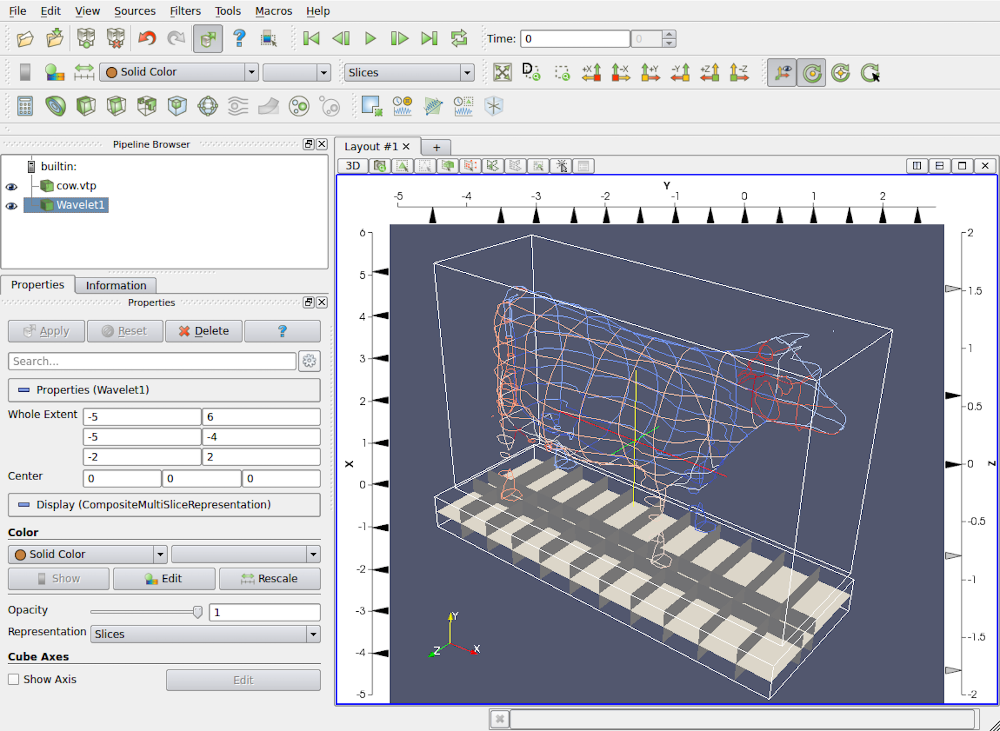

    ``Slice View`` :index:`\ <Slice View>`\  can be used to show orthogonal slices from datasets.

``Slice View`` :index:`\ <Slice View>`\  is special type of  ``Render View`` :index:`\ <Render View>`\  that can be used to view
orthogonal slices from any dataset. Any dataset shown in the view will be sliced
in axis-aligned slices based on the locations specified on the view. The
slice locations along the three orthogonal axis planes can be specified by using
the frame decoration around the view window.

Interactions
^^^^^^^^^^^^

Since this view is a type of  ``Render View`` :index:`\ <Render View>`\ , the camera interactions are same as
that of  ``Render View`` :index:`\ <Render View>`\ . Additionally, you can interact with the frame
decoration to manipulate slice locations along the three axis planes.

* Double-click the left mouse button in the region between the axis border and the view to add a new slice.

* You can click-and-drag a marker to move the slice location.

* To remove a slice, double-click with the left mouse button on the marker corresponding to that slice.

* To toggle visibility of the slice, you can right-click on the marker.

Slice View in ``pvpython``
^^^^^^^^^^^^^^^^^^^^^^^^^^

.. code-block:: python

  # To create a slice view in use:
  >>> view = CreateView("MultiSlice")
  
  # Use properties on view to set/get the slice offsets.
  >>> view.XSliceValues = [-10, 0, 10]
  >>> print(view.XSliceValues)
  [-10, 0, 10]
  
  # Similar to XSliceValues, you have YSliceValues and ZSliceValues.
  >>> view.YSliceValues = [0]
  >>> view.ZSliceValues = []

Python View
===========

Some Python libraries, such as matplotlib, are widely used for making
publication-quality plots of data. The  ``Python View`` :index:`\ <Python View>`\  provides a way
to display plots made in a Python script right
within |paraview|.

The  ``Python View`` :index:`\ <Python View>`\  has a single property, a Python script that
generates the image to be displayed in the viewport. All the Python
bindings for |ParaView| and VTK that are available in the Python
scripting module are available from within this script, making it
possible to plot any array from just about any dataset that can be
loaded into |ParaView|. The Python script for the view is evaluated in a
unique Python environment so that global variables defined in the
script do not clobber global variables in other Python scripts (either
in other instances of the  ``Python View`` :index:`\ <Python View>`\  or in the Python
interpreter). This environment is reset each time the script is
evaluated, so data cannot be saved between evaluations.

The  ``Python View`` :index:`\ <Python View>`\  requires that the Python script where the
plotting occurs define two functions. In the first function, you
request which arrays you would like to transfer to the client for
rendering. At present, all rendering in this view takes place on the
client, even in client-server mode. These arrays can be point data,
cell data, field data, and table row data. This function runs only on
data-server processes. It provides access to the underlying data
object on the server so that you can query any aspect of the data
using the Python-wrapped parts of VTK and |ParaView|.

The second function is where you put Python plotting or rendering
commands. This function runs only on the |ParaView| client. It has
access to the complete data object gathered from the data server
nodes, but only has access to the arrays requested in the first function. This
function will typically set up objects from a plotting library,
convert data from VTK to a form that can be passed to the plotting
library, plot the data, and convert the plot to an image
(a  ``vtkImageData`` :index:`\ <vtkImageData>`\  object) that can be displayed in the viewport.

Selecting data arrays to plot
^^^^^^^^^^^^^^^^^^^^^^^^^^^^^

All the rendering in the  ``Python View`` :index:`\ <Python View>`\  occurs in the client, so the
client must get the data from the server. Because the dataset residing
on the |ParaView| server may be large, transferring all the data to the
client may not be possible or practical. For that reason, we have
provided a mechanism to select which data arrays in a data object on
the server to transfer to the client. The overall structure of the
data object, however, (including cell connectivity, point positions,
and hierarchical block structure) is always transferred to the client.
By default, no data arrays are selected for transfer from the server.

The Python script for the view must define a function called
``setup_data(view)`` :index:`\ <setup_data(view)>`\ . The  ``view`` :index:`\ <view>`\  argument is the VTK object for the  ``Python
View`` :index:`\ <Python
View>`\ . The current datasets loaded into |ParaView| may be accessed
through the view object.

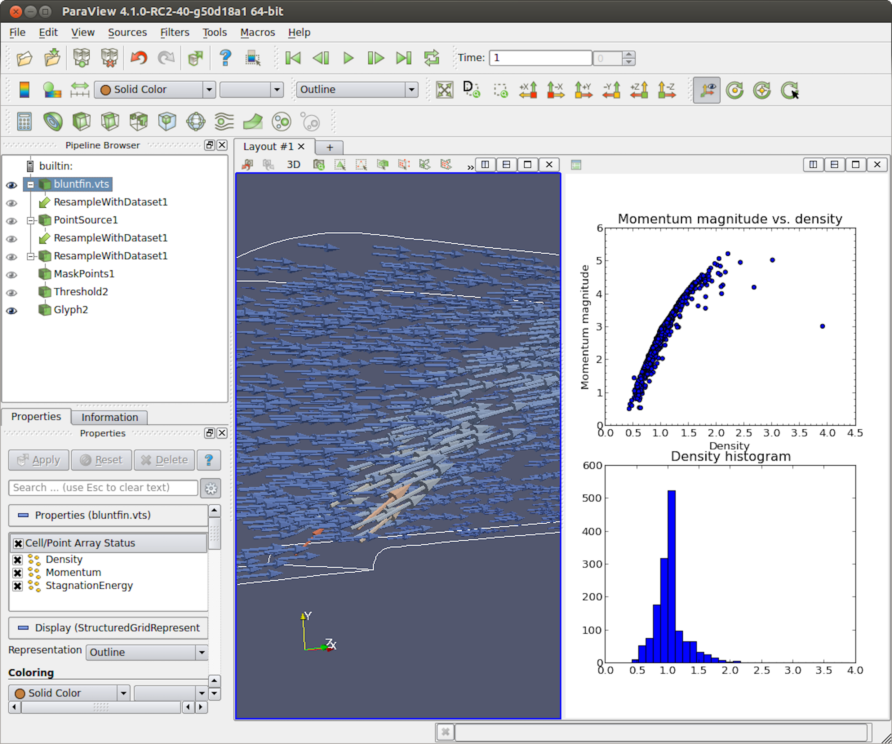

    |paraview| using  ``Python View`` :index:`\ <Python View>`\  with matplotlib to display a scatterplot of momentum magnitude versus density (upper right) and a histogram of density (lower right) in the bluntfin.vts dataset.

Here's an example of this function that was used to generate the image
in :numref:`fig:PythonViewInParaView`:

.. code-block:: python

  def setup_data(view):
    # Iterate over visible data objects
    for i in xrange(view.GetNumberOfVisibleDataObjects()):
      # You need to use GetVisibleDataObjectForSetup(i)
      # in setup_data to access the data object.
      dataObject = view.GetVisibleDataObjectForSetup(i)
  
      # The data object has the same data type and structure
      # as the data object that sits on the server. You can
      # query the size of the data, for instance, or do anything
      # else you can do through the Python wrapping.
      print('Memory size: {0} kilobytes'.format(dataObject.GetActualMemorySize()))
  
      # Clean up from previous calls here. We want to unset
      # any of the arrays requested in previous calls to this function.
      view.DisableAllAttributeArrays()
  
      # By default, no arrays will be passed to the client.
      # You need to explicitly request the arrays you want.
      # Here, we'll request the Density point data array
      view.SetAttributeArrayStatus(i, vtkDataObject.POINT, "Density", 1)
      view.SetAttributeArrayStatus(i, vtkDataObject.POINT, "Momentum", 1)
  
      # Other attribute arrays can be set similarly
      view.SetAttributeArrayStatus(i, vtkDataObject.FIELD, "fieldData", 1)

The  ``vtkPythonView`` :index:`\ <vtkPythonView>`\  class passed in as the  ``view`` :index:`\ <view>`\  argument to
``setup_data(view)`` :index:`\ <setup_data(view)>`\  defines several methods useful for specifying which
data arrays to copy:

* ``GetNumberOfVisibleDataObjects()`` :index:`\ <GetNumberOfVisibleDataObjects()>`\  -
  This returns the number of visible data objects in the view. If an object
  is not visible, it should not show up in the rendering, so all the
  methods provided by the view deal only with visible objects.

* ``GetVisibleDataObjectForSetup(visibleObjectIndex)`` :index:`\ <GetVisibleDataObjectForSetup(visibleObjectIndex)>`\  -
  This returns the ``visibleObjectIndex'th`` :index:`\ <visibleObjectIndex'th>`\  visible data object in
  the view. (The data object will have an open eye next to it in the
  pipeline browser.)

* ``GetNumberOfAttributeArrays(visibleObjectIndex, attributeType)`` :index:`\ <GetNumberOfAttributeArrays(visibleObjectIndex, attributeType)>`\  -
  This returns the number of attribute arrays for
  the  ``visibleObjectIndex'th`` :index:`\ <visibleObjectIndex'th>`\  visible object and the
  given ``attributeType`` :index:`\ <attributeType>`\ 
  (e.g.,  ``vtkDataObject.POINT`` :index:`\ <vtkDataObject.POINT>`\ ,  ``vtkDataObject.CELL`` :index:`\ <vtkDataObject.CELL>`\ , etc.).
 
* ``GetAttributeArrayName(visibleObjectIndex, attributeType, arrayIndex)`` :index:`\ <GetAttributeArrayName(visibleObjectIndex, attributeType, arrayIndex)>`\  -
  This returns the name of the array of the given attribute type at the
  given array index for the ``visibleObjectIndex'th`` :index:`\ <visibleObjectIndex'th>`\  object.

* ``SetAttributeArrayStatus(visibleObjectIndex, vtkDataObject.POINT, "Density", 1)`` :index:`\ <SetAttributeArrayStatus(visibleObjectIndex, vtkDataObject.POINT, "Density", 1)>`\  -
  This sets the array status of an attribute array. The first argument is
  the visible object index, the second object is the attribute
  association of the array, the third argument is the name of the
  array, and the last argument specifies if the array is to be copied
  (1) or not (0).

* ``GetAttributeArrayStatus(visibleObjectIndex, vtkDataObject.POINT, "Density")`` :index:`\ <GetAttributeArrayStatus(visibleObjectIndex, vtkDataObject.POINT, "Density")>`\  -
  This retrieves the array status for the object with the given visible
  index with a given attribute association (second argument) and a name
  (last argument).

* ``EnableAllAttributeArrays()`` :index:`\ <EnableAllAttributeArrays()>`\  -
  This sets all arrays to be copied.

* ``DisableAllAttributeArrays()`` :index:`\ <DisableAllAttributeArrays()>`\  -
  This sets all arrays to not be copied.

The methods  ``GetNumberOfVisibleDataObjects()`` :index:`\ <GetNumberOfVisibleDataObjects()>`\ ,
``GetVisibleDataObjectForSetup(...)`` :index:`\ <GetVisibleDataObjectForSetup(...)>`\ ,  ``GetNumberOfAttributeArrays(...)`` :index:`\ <GetNumberOfAttributeArrays(...)>`\ ,
and  ``GetAttributeArrayName(...)`` :index:`\ <GetAttributeArrayName(...)>`\  are all convenient methods for
obtaining information about visible data objects in the view that
could otherwise be accessed with existing view and representation
methods. The last four methods are valid only from within
the  ``setup_data(view)`` :index:`\ <setup_data(view)>`\  function.

Plotting data in Python
^^^^^^^^^^^^^^^^^^^^^^^

After the  ``setup_data(view)`` :index:`\ <setup_data(view)>`\  function has been called, |ParaView|
will transfer the data object and selected arrays to the client. When
that is done, it will call the  ``render(view, width, height)`` :index:`\ <render(view, width, height)>`\ 
function you have defined in your script.

The  ``view`` :index:`\ <view>`\  argument to the  ``render(view, width, height)`` :index:`\ <render(view, width, height)>`\ 
function is the  ``vtkPythonView`` :index:`\ <vtkPythonView>`\  object on the
client. The  ``width`` :index:`\ <width>`\  and  ``height`` :index:`\ <height>`\  arguments are the width and
height of the viewport, respectively. The  ``render(view, width,
height)`` :index:`\ <render(view, width,
height)>`\  function uses the data available through the view, along with
the width and height, to generate a  ``vtkImageData`` :index:`\ <vtkImageData>`\  object that will
be displayed in the viewport. This  ``vtkImageData`` :index:`\ <vtkImageData>`\  object must be
returned from the  ``render(view, width, height)`` :index:`\ <render(view, width, height)>`\  function. If no
``vtkImageData`` :index:`\ <vtkImageData>`\  is returned, the viewport will be black. If the size of the
image does not match the size of the viewport, the image will be
stretched to fit the viewport.

Putting it all together, here is a simple example that generates a
solid red image to display in the viewport.

.. code-block:: python

  def render(view, width, height):
    from paraview.vtk import vtkImageData
    image = vtkImageData()
    image.SetDimensions(width, height, 1)
    from paraview.numeric import VTK_UNSIGNED_CHAR
    image.AllocateScalars(VTK_UNSIGNED_CHAR, 4)
    pixel_array = image.GetPointData().GetArray(0)
    pixel_array.FillComponent(0, 255.0)
    pixel_array.FillComponent(1, 0.0)
    pixel_array.FillComponent(2, 0.0)
    pixel_array.FillComponent(3, 0.0)
  
    return image

This example does not produce an interesting visualization, but serves
as a minimal example of how the  ``render(view, width, height)`` :index:`\ <render(view, width, height)>`\ 
function should be implemented. Typically, we expect that the Python
plotting library you use has some utilities to expose the generated
plot image pixel data. You need to copy that pixel data to
the  ``vtkImageData`` :index:`\ <vtkImageData>`\  object returned by the  ``render(view, width,
height)`` :index:`\ <render(view, width,
height)>`\  function. Exactly how you do this is up to you, but |ParaView|
comes with some utilities to make this task easier for matplotlib.

Set up a matplotlib Figure
--------------------------

The  ``Python View`` :index:`\ <Python View>`\  comes with a Python module,
called  ``python_view`` :index:`\ <python_view>`\ , that has some utility functions you can
use. To import it, use:

.. code-block:: python

  from paraview import python_view

This module has a function, called  ``matplotlib_figure(view, width,
height)`` :index:`\ <matplotlib_figure(view, width,
height)>`\ , that returns a  ``matplotlib.figure.Figure`` :index:`\ <matplotlib.figure.Figure>`\  given  ``width`` :index:`\ <width>`\ 
and  ``height`` :index:`\ <height>`\  arguments. This figure can be used with matplotlib
plotting commands to plot data as in the following:

.. code-block:: python

  def render(view, width, height):
    figure = python_view.matplotlib_figure(width, height)
  
    ax = figure.add_subplot(1,1,1)
    ax.minorticks_on()
    ax.set_title('Plot title')
    ax.set_xlabel('X label')
    ax.set_ylabel('Y label')
  
    # Process only the first visible object in the pipeline browser
    dataObject = view.GetVisibleDataObjectForRendering(0)
  
    x = dataObject.GetPointData().GetArray('X')
  
    # Convert VTK data array to numpy array for plotting
    from paraview.numpy_support import vtk_to_numpy
    np_x = vtk_to_numpy(x)
  
    ax.hist(np_x, bins=10)
  
    return python_view.figure_to_image(figure)

This definition of the  ``render(view, width, height)`` :index:`\ <render(view, width, height)>`\  function
creates a histogram of a point data array named  ``X`` :index:`\ <X>`\  from the first
visible object in the pipeline browser. Note the conversion
function,  ``python_view.figure_to_image(figure)`` :index:`\ <python_view.figure_to_image(figure)>`\ , in the last line.
This converts the matplotlib  ``Figure`` :index:`\ <Figure>`\  object created
with  ``python_view.matplotlib_figure(width, height)`` :index:`\ <python_view.matplotlib_figure(width, height)>`\  into a
``vtkImageData`` :index:`\ <vtkImageData>`\  object suitable for display in the viewport.

Comparative Views
=================

``Comparative Views`` :index:`\ <Comparative Views>`\ , including  ``Render View (Comparative)`` :index:`\ <Render View (Comparative)>`\ ,  ``Line Chart
View (Comparative)`` :index:`\ <Line Chart View (Comparative)>`\ , and  ``Bar Chart View (Comparative)`` :index:`\ <Bar Chart View (Comparative)>`\ , are used
for generating comparative visualization from parameter studies. We
will cover these views in Chapter :numref:`chapter:ComparativeVisualization`.

.. \begin{TODO}
  \begin{itemize}
    \item Several advanced views remain including Histogram View, Bag Chart, etc.
  \end{itemize}
  \end{TODO}
