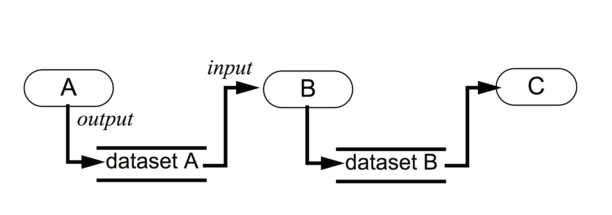
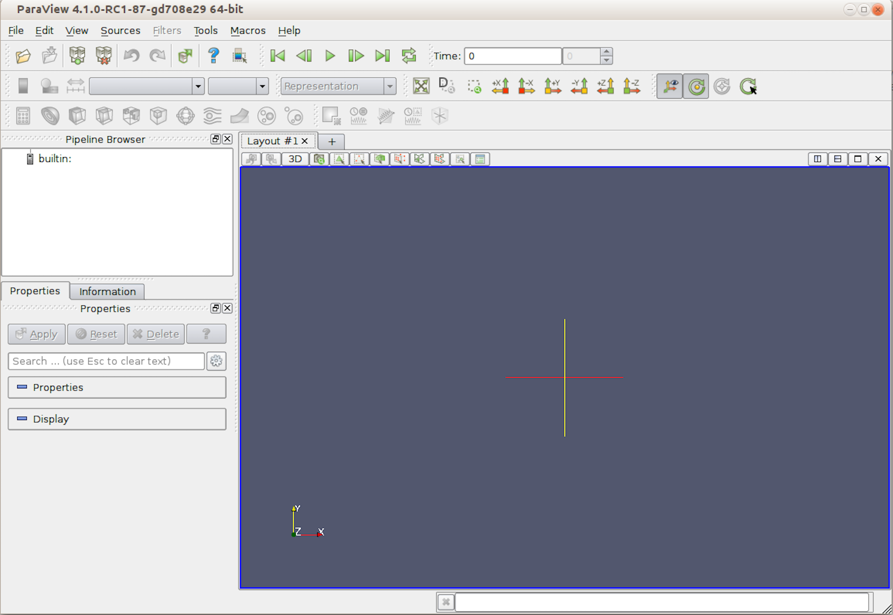
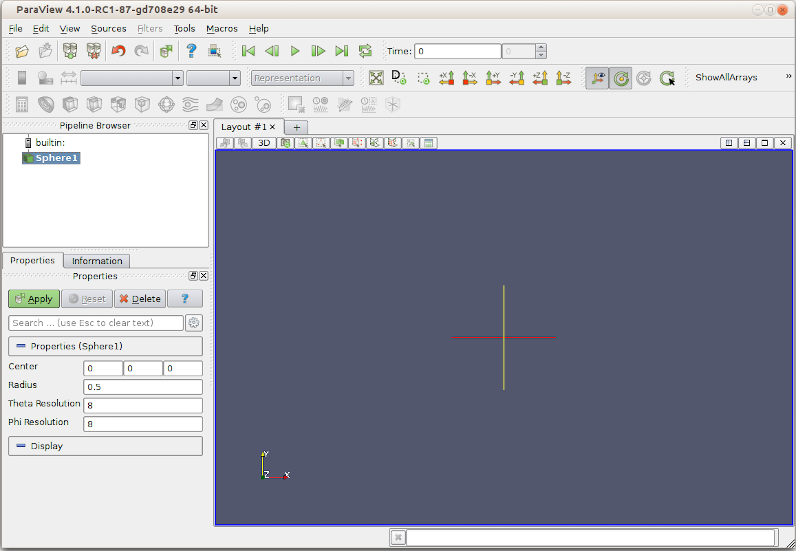
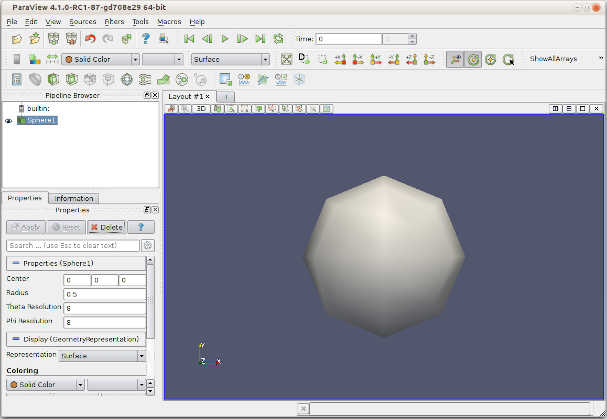
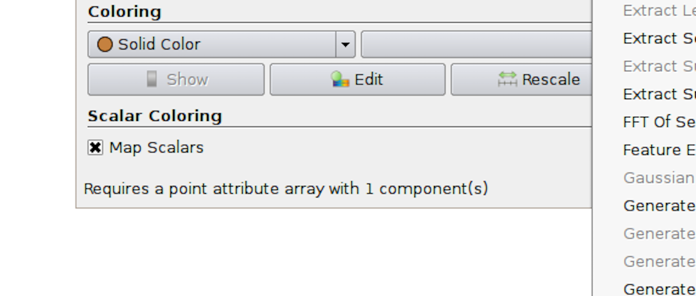
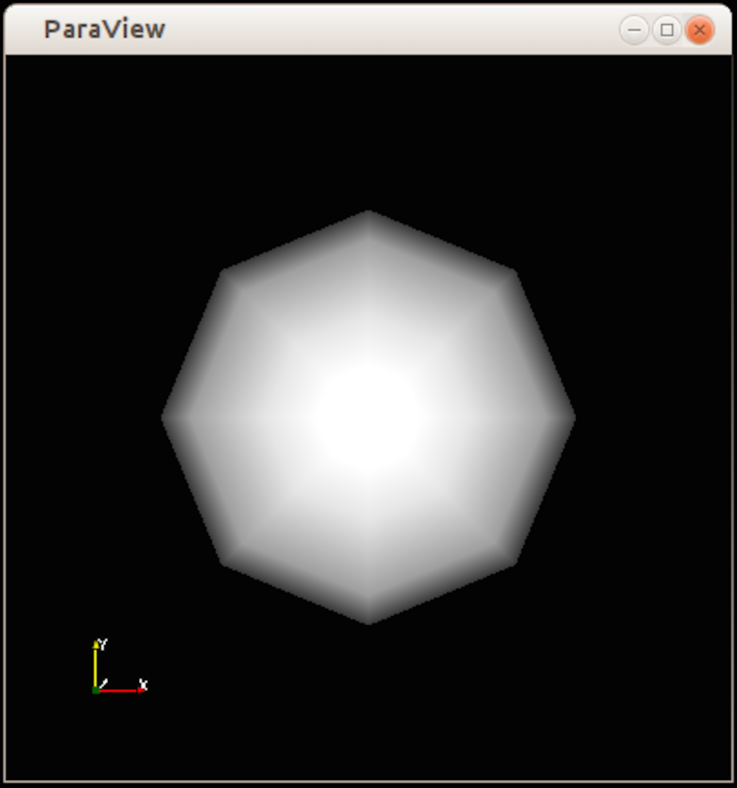
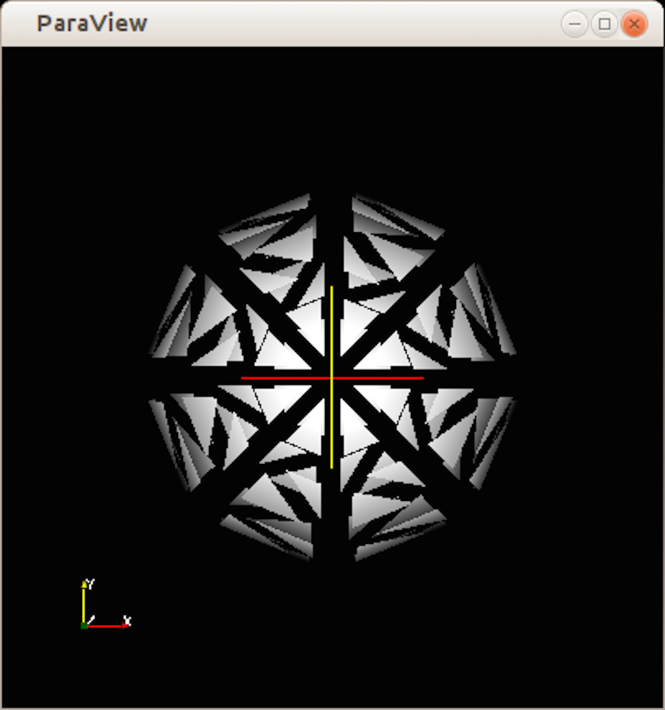
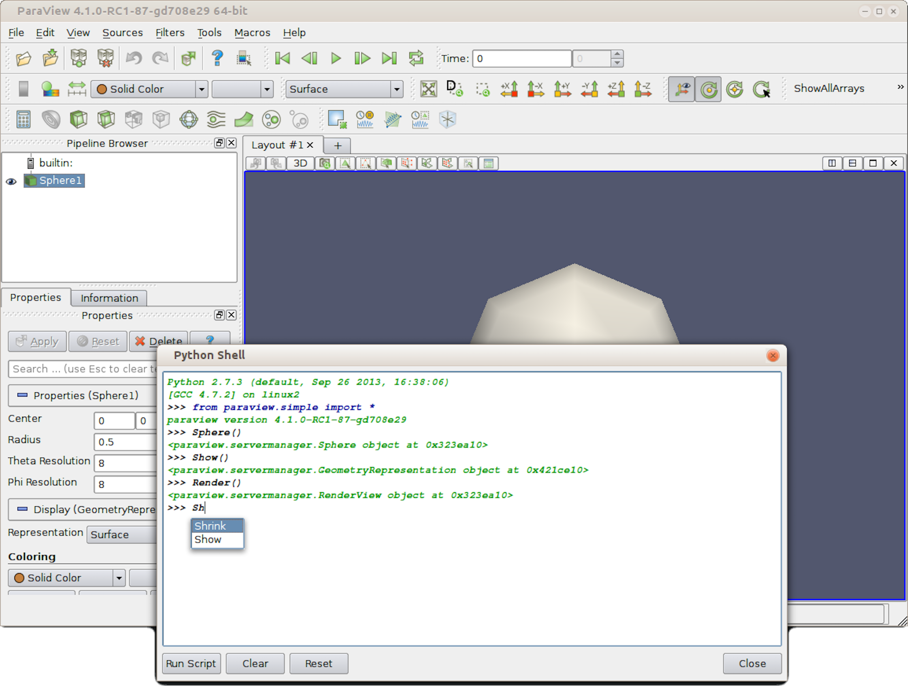

Introduction to ParaView
========================
.. include:: macros.hrst

Introduction
------------

|ParaView| is an open-source, multi-platform scientific data analysis and
visualization tool that enables analysis and visualization of extremely large
datasets. |ParaView| is both a general purpose, end-user application with a
distributed architecture that can be seamlessly leveraged by your desktop or other
remote parallel computing resources and an extensible framework with a
collection of tools and libraries for various applications including scripting
(using Python), web visualization (through ParaViewWeb), or in-situ analysis
(with Catalyst).

|ParaView| leverages parallel data processing and rendering to enable interactive
visualization for extremely large datasets. It also includes support for large
displays including tiled displays and immersive 3D displays with head tracking
and wand control capabilities.

|ParaView| also supports scripting and batch processing using Python. Using
included Python modules, you can write scripts that can perform almost all the
functionality exposed by the interactive application and much more.

|ParaView| is open-source (BSD licensed, commercial software friendly). As with
any successful open-source project, |ParaView| is supported by an active user
and developer community. Contributions to both the code and this user's manual
that help make the tool and the documentation better are always welcome.

.. admonition:: **Did you know?**

   The |ParaView| project started in 2000 as a collaborative effort between Kitware
   Inc. and \LANL. The initial funding was provided by a
   three year contract with the US Department of Energy ASCI Views program. The
   first public release, |ParaView| 0.6, was announced in October 2002.

   Independent of |ParaView|, Kitware started developing a web-based visualization
   system in December 2001. This project was funded by Phase I and II SBIRs from
   the US \ARL and eventually became the \PVEE.
   \PVEE significantly contributed to the development of |ParaView|'s
   client/server architecture. \PVEE was the precursor to ParaViewWeb, a modern
   web visualization solution based on |ParaView|.

   Since the project began, Kitware has successfully collaborated with
   Sandia, \LANL, the \ARL, and
   various other academic and government institutions to continue development. Today, the
   project is still going strong!

   In September 2005, Kitware, Sandia National Labs and CSimSoft started the
   development of |ParaView| 3.0. This was a major effort focused on rewriting the
   user interface to be more user friendly and on developing a quantitative
   analysis framework. |ParaView| 3.0 was released in May 2007.

In this guide
.............

This user's manual is designed as a guide for using the |ParaView| application. It is
geared toward users who have a general understanding of common data
visualization techniques. For scripting, a working knowledge of the Python
language is assumed. If you are new to Python, there are several tutorials and
guides for getting started that are available on the Internet.

.. admonition:: **Did you know?**

   In this guide, we will periodically use these **Did you know?** boxes to provide
   additional information related to the topic at hand.

.. error::

  **Error** blocks are used to highlight some of the common problems or
  complications you may run into when dealing with the topic of discussion.

This guide can be split into two volumes. Chapter~\ref{chapter:Introduction} to
Chapter~\ref{chapter:SavingResults} can be considered the user's guide, where various
aspects of data analysis and visualization with |ParaView| are covered.
Chapter~\ref{chapter:PropertiesPanel} to Chapter~\ref{chapter:LastChapterPartII} are the
user's manual sections, which provide details on various components in the UI and the
scripting API.

Getting help
............

This guide tries to cover most of the commonly used functionality in |ParaView|.
|ParaView|'s flexible, pipeline-based architecture opens up numerous possibilities.
If you find yourself looking for some feature not covered in this guide,
feel free to ask about it on the `ParaView forum <https://discourse.paraview.org/>`_.

Getting the software
....................

|ParaView| is open source. The complete source code for all the functionality
discussed in this guide can be downloaded from the `ParaView website
<http://www.paraview.org/>`_. We also provide binaries for the major platforms:
Linux, Mac OS X, and Windows. You can get the binaries and source files for the
official releases, as well as follow ParaView's active development, by downloading the
nightly builds.

Providing details of how to build |ParaView| using the source files is beyond the scope
of this guide. Refer to the `ParaView Wiki <http://paraview.org/Wiki/ParaView/>`_
for more information.

Basics of visualization in |ParaView|
-------------------------------------

   Visualization model: Process objects A, B, and C input
   and/or output one or more data objects. Data objects
   represent and provide access to data; process objects
   operate on the data. Objects A, B, and C are source, filter, and mapper objects,
   respectively.\cite{Schroeder:1996:DIO:244979.245018}}

.. \label{fig:VTKPipeline}

Visualization is the process of converting raw data into images and renderings
to gain a better cognitive understanding of the data. |ParaView| uses VTK, the
Visualization Toolkit, to provide the backbone for visualization and data processing.

The VTK model is based on the data-flow paradigm. In this paradigm,
data flows through the system being transformed at each step by modules known as
algorithms. Algorithms could be common operations such as clipping, slicing,
or generating contours from the data, or they could be computing derived
quantities, etc. Algorithms have input ports through which they take in data and
output ports through which they produce output. You need producers that ingest
data into the system. These are simply algorithms that do not have an input port but have one or
more output ports. They are called \emph{sources}\keyword{Source}. Readers that read data
from files are examples of such sources. Additionally, there are algorithms that
transform the data into graphics primitives so that they can be rendered on a
computer screen or saved to disk in another file. These algorithms, which have one
or more input ports but do not have output ports, are called
*sinks*. Intermediate algorithms with input ports and output ports are called
*filters*. Together, sources,
filters, and sinks provide a flexible infrastructure wherein you can
create complex processing pipelines by simply connecting algorithms to
perform arbitrarily complex tasks.

.. Should we add an example or two showing a VTK pipeline? -Utkarsh

For more information on VTK's programming model, refer
to~\cite{Schroeder:1996:DIO:244979.245018}.

This way of looking at the visualization pipeline is at the core of |ParaView|'s
work flow: You bring your data into the system by creating a reader -- the
source. You then apply filters to either extract information
(e.g., iso-contours) and render the results in a view or to save the data to disk using
writers -- the sinks.

|ParaView| includes readers for a multitude of file formats typically used in the
computational science world. To efficiently represent data from various fields
with varying characteristics, VTK provides a rich data model that |ParaView| uses.
The data model can be thought of simply as ways of representing data in memory.
We will cover the different data types in more detail in
Section~\ref{sec:VTKDataModel}. Readers produce a data type suitable for
representing the information the files contain. Based on the data type, |ParaView|
allows you to create and apply filters to transform the data. You can also show the data
in a view to produce images or renderings. Just as there are several types of
filters, each perfoming different operations and types of processing, there are several kinds
of views for generating various types of renderings including 3D surface views,
2D bar and line views, parallel coordinate views, etc.

.. admonition:: **Did you know?**

  The Visualization Toolkit (VTK) is an open-source, freely available software
  system for 3D computer graphics, modeling, image processing, volume rendering,
  scientific visualization, and information visualization. VTK also includes
  ancillary support for 3D interaction widgets, two and three-dimensional
  annotation, and parallel computing.

  At its core, VTK is implemented as a C++ toolkit, requiring users to build
  applications by combining various objects into an application. The system also
  supports automated wrapping of the C++ core into Python, Java, and Tcl so that
  VTK applications may also be written using these interpreted programming
  languages. VTK is used world-wide in commercial applications, research and
  development, and as the basis of many advanced visualization applications such
  as |ParaView|, VisIt, VisTrails, Slicer, MayaVi, and OsiriX.

|ParaView| executables
----------------------

|ParaView| comes with several executables that serve different purposes.

*paraview*
...........

This is the main |ParaView| graphical user interface
(GUI). In most cases, when we refer to |ParaView|, we are indeed talking about
this application. It is a Qt-based, cross-platform UI that provides access to the
|ParaView| computing capabilities. Major parts of this guide are dedicated to
understanding and using this application.

*pvpython*
..........

**pvpython** is the Python interpreter that
runs |ParaView|'s Python scripts. You can think of this as the equivalent of the
**paraview** for scripting.

*pvbatch*
.........

Similar to **pvpython**, **pvbatch** is also a Python
interpreter that runs Python scripts for |ParaView|. The one difference is that, while
**pvpython** is meant to run interactive scripts, **pvbatch**
is designed for batch processing. Additionally, when running on computing
resources with MPI capabilities, **pvbatch** can be run in parallel. We
will cover this in more detail in Section \fixme{reference}.

*pvserver*
..........

For remote visualization, this executable represents the server that does all
of the data processing and, potentially, the rendering.
You can make **paraview** connect to
\pvserver running remotely on an HPC resource. This allows you to
build and control visualization and analysis on the HPC resource from your
desktop as if you were simply processing it locally on your desktop!

*pvdataserver* and *pvrenderserver*
...................................

These can be thought of as the \pvserver split into two separate
executables: one for the data processing part, \pvdataserver, and
one for the rendering part, \pvrenderserver. Splitting these into
separate processes makes it possible to perform data processing and rendering on
separate sets of nodes with appropriate computing capabilities suitable for the
two tasks. Just as with \pvserver, **paraview** can
connect to a \pvdataserver-\pvrenderserver pair for
remote visualization. Unless otherwise noted, all discussion of remote visualization or
client-server visualization in this guide is applicable to both
\pvserver and
\pvdataserver-\pvrenderserver configurations.

Getting started with **paraview**
---------------------------------

*paraview* graphical user interface
...................................

**paraview** is the graphical front-end to the |ParaView| application. The
UI is designed to allow you to easily create pipelines for data processing with
arbitrary complexity. The UI provides panels for you to inspect and modify
the pipelines, to change parameters that in turn affect the processing pipelines,
to perform various data selection and inspection actions to introspect the data,
and to generate renderings. We will cover various aspects of the UI
for the better part of this guide.

Let's start by looking at the various components of the UI. If you run
**paraview** for the first time, you will see something similar to the
Figure~\ref{fig:GUIOverview}. The UI is comprised of menus,
dockable panels, toolbars, and the viewport -- the central portion of the
application window.

   **paraview** application window.
.. \label{fig:GUIOverview}

Menus provide the standard set of options typical with a desktop application
including options for opening/saving files (\menu{File}
menu), for undo/redo (\menu{Edit} menu), for the toggle panel, and for toolbar visibilities
(\menu{View} menu). Additionally, the menus provide ways to create sources that
generate test datasets of various types (\menu{Sources} menu), as well new
filters for processing data (\menu{Filters} menu). The \menu{Tools} menu
provides access to some of the advanced features in **paraview** such as
managing plugins and accessing the embedded Python shell.

Panels provide you with the ability to peek into the application's state. For example, you can
inspect the visualization pipeline that has been set up (\ui{Pipeline
Browser}), as well as the memory that is being used (\ui{Memory Inspector}) and the parameters or properties
for a processing module (\ui{Properties} panel). Several of the panels also
allow you to change the values that are displayed, e.g., the \ui{Properties} panel not only
shows the processing module parameters, but it also allows you to change them.
Several of the panels are context sensitive. For example, the \ui{Properties}
panel changes to show the parameters from the selected module as you change the
active module in the \ui{Pipeline Browser}.

Toolbars are designed to provide quick access to common functionality. Several
of the actions in the toolbar are accessible from other locations,
including menus or panels. Similar to panels, some of the toolbar buttons are
context sensitive and will become enabled or disabled based on the selected
module or view.

The viewport or the central portion of the **paraview** window is the
area where |ParaView| renders results generated from the data. The containers in
which data can be rendered or shown are called \emph{views}. You can create
several different types of views, all of which are laid out in this viewport
area. By default, a 3D view is created, which is one of the most commonly used
views in |ParaView|.

Understanding the visualization process
.......................................
\label{sec:UnderstandingVisualizationGUI}

To gain a better understanding of how to use the application interface, let's
consider a simple example: creating a data source and applying a filter to it.

Creating a source
^^^^^^^^^^^^^^^^^^^^^^^^^^^^^^^^^

The visualization process in |ParaView| begins by bringing your data into the
application. Chapter~\ref{chapter:LoadingData} explains how to read data from
various file formats. Besides reading files to bring in data into the
application, |ParaView| also provides a collection of data sources that can
produce sample datasets. These are available under the \menu{Sources} menu. To
create a source, simply click on any item in the \menu{Source} menu.

.. admonition:: **Did you know?**

  As you move your cursor over the items in any menu, on most platforms (except
  Mac OS X), you'll see a brief description of the item in the status bar on the
  lower-left corner in the application window.

If you click on \menu{Sources > Sphere}, for example,
you'll create a producer algorithm that generates a spherical surface, as shown in
Figure~\ref{fig:CreateSphere1}.

   Visualization in **paraview**: Step 1.
.. \label{fig:CreateSphere1}

A few of things to note:

* A pipeline module is added in the \ui{Pipeline Browser} panel with a name
  derived from the menu item, as is highlighted.
* The \ui{Properties} panel fills up with text to indicate that it's showing
  properties for the highlighted item (which, in this case, is \ui{Sphere1}), as well as to display
  some widgets for parameters such as \ui{Center}, \ui{Radius}, etc.
* On the \ui{Properties} panel, the \ui{Apply} button becomes enabled and
  highlighted.
* The 3D view remains unaffected, as nothing new is shown or rendered in this
  view as of yet.

Let's take a closer look at what has happened. When we clicked on
\menu{Sources > Sphere}, referring to
Section~\ref{sec:BasicsOfVisualization}, we created an instance of a source that
can produce a spherical surface mesh -- that's what is reflected in the
\ui{Pipeline Browser}.
This instance receives a name, which is used by the \ui{Sphere1} and the \ui{Pipeline Browser}, as well as other
components of the UI, to refer to this instance of the source. Pipeline
modules such as sources and filters have parameters on them that you can change
that affect that module's behavior. We call them \emph{properties}. The
\ui{Properties} panel shows these properties and allows you to change them.
Since the ingestion of data into the system can be a time-consuming process,
**paraview** allows you to change the properties before the module
executes or performs the actual processing to ingest the data. Hence, the
\ui{Apply} button is highlighted to indicate that you need to accept the
properties before the application will proceed. Since no data has entered the
system yet, there's nothing to show. Therefore, the 3D view remains unaffected.

Let's assume we are okay with the default values for all of the properties on the
\ui{Sphere1}. Next, click on the \ui{Apply} button.

   Visualization in **paraview**: Step 2.
.. \label{fig:CreateSphere2}

The following will ensue (Figure~\ref{fig:CreateSphere2}):

* The \ui{Apply} button goes back to its old disabled/un-highlighted state.
* A spherical surface is rendered in the 3D view.
* The \ui{Display} section on the \ui{Properties} panel now shows new
  parameters or properties.
* Certain toolbars update, and you can see that toolbars with text, such as
  \ui{Solid Color} and \ui{Surface}, now become enabled. \fixme{Need to add
  labels to the image to show what's changed}

By clicking \ui{Apply}, we told **paraview** to apply the properties
shown on the \ui{Properties} panel. When a new source (or filter) is
applied for the first time, **paraview** will automatically show
the data that the pipeline module produces in the current view, if possible.
In this case, the sphere source produces a surface mesh, which is then shown or
displayed in the 3D view.

The properties that allow you to control how
the data is displayed in the view are now shown on the \ui{Properties} panel in
the \ui{Display} section. Things such as the surface color, rendering type or
representation, shading parameters, etc., are shown under this newly updated
section. We will look at display properties in more detail in
Chapter~\ref{ch:DisplayingData}.

Some of the properties that are commonly used are also duplicated in the
toolbar. These properties include the data array with which the surface is colored and the representation
type. These are the changes in the toolbar that allow you to quickly change some
display properties.

Changing properties
^^^^^^^^^^^^^^^^^^^

If you change any of the properties on the sphere source, such as the properties
under the \ui{Properties}\fixme{should we rename this section to Module or
something like that?} section on the \ui{Properties} panel, including the \ui{Radius}
for the spherical mesh or its \ui{Center}, the \ui{Apply} button will be
highlighted again. Once you are finished with all of the property changes, you can
hit \ui{Apply} to apply the changes. Once the changes are applied,
**paraview** will re-execute the sphere source to produce a new mesh,
as requested. It will then automatically update the view, and you will see the
new result rendered.

If you change any of the display properties for the sphere source, such as the
properties under the \ui{Display} section of the \ui{Properties} panel (including
\ui{Representation} or \ui{Opacity}), the \ui{Apply} button is not affected, the
changes are immediately applied, and the view is updated.

The rationale behind this is that, typically, the execution of the source (or
filter) is more computationally intensive than the rendering. Changing source (or
filter) properties causes that algorithm to re-execute, while changing display
properties, in most cases, only triggers a fresh render with an updated graphics
state.

.. admonition:: **Did you know?**

   For some workflows with smaller data sizes, it may be more convenient
   if the \ui{Apply} button was automatically applied even after changes are made to the
   pipeline module properties. You can change this from the application settings dialog, which is
   accessible from the \menu{Edit > Settings} menu. The setting is called \ui{Auto
   Apply}. You can also change the \ui{Auto Apply} state using the
   |AutoApplyIcon| button from the toolbar.

Applying filters
^^^^^^^^^^^^^^^^

As per the data-flow paradigm, one creates pipelines with
filters to transform data. Similar to the \menu{Sources} menu, which allows us to
create new data sources, there's a \menu{Filters} menu that provides access to
the large set of filters that are available in |ParaView|. If you peruse through the
items in this menu, some of them will be enabled, and some of them will be
disabled. Filters that can work with the data type being produced by the sphere
source are enabled, while others are disabled. You can click on any of the
enabled filters to create a new instance of that filter type.

.. admonition:: **Did you know?**

   To figure out why a particular filter doesn't work with the current source,
   simply move your mouse over the disabled item in the \menu{Filters} menu. On
   Linux and Windows (not OS X, however), the status bar will provide a brief
   explanation of why that filter is not available.

   |StatusBarFilterInfo|

For example, if you click on \menu{Filters > Shrink}, it will create a filter
that shrinks each of the mesh cells by a fixed factor. Exactly as before, when we
created the sphere source, we see that the newly-created filter is given a new
name, \ui{Shrink1}, and is highlighted in the \ui{Pipeline Browser}. The
\ui{Properties} panel is also updated to show the properties for this new
filter, and the \ui{Apply} button is highlighted to request that we accept the
properties for the filter so that it can be executed and the result can be rendered. If you
click back and forth between the \ui{Sphere1} and \ui{Shrink1} in the
\ui{Pipeline Browser}, you'll see the \ui{Properties} panel and toolbars update,
reflecting the state of the selected pipeline module. This is an important
concept in |ParaView|. There's a notion of active pipeline module, called the
\emph{active source}\keyword{Active Source}.
Several panels, toolbars, and menus will update based on
the active source. \fixme{add an image showing the result}

If you click \ui{Apply}, as was the case before, the shrink filter will be executed and the
resulting dataset will be generated and shown in the 3D view. **paraview**
will also automatically hide the result from the \ui{Sphere1} so that it is not shown
in the view. Otherwise, the two datasets will overlap. This is reflected by
the change of state for the \emph{eyeball} icons in the \ui{Pipeline Browser}
next to each of the pipeline modules. You can show or hide results from any
pipeline module by clicking on the eyeballs.

This simple workflow forms the basis of all the data analysis and visualization
in |ParaView|. The process involves creating sources and filters, changing their
parameters, and showing the generated result in one or more views. In the rest of
this guide, we will cover various types of filters and data processing that you
can do. We will also cover different types of views that can help you produce a wide array of 2D
and 3D visualizations, as well as inspect your data and drill down into it.

.. error::

   Beginners often forget to hit the \ui{Apply} button after creating sources or
   filters or after changing properties. This is one of the most common pitfalls for
   users new to the |ParaView| workflow.

Getting started with **pvpython**
---------------------------------

While this section refers to **pvpython**, everything that we discuss
here is applicable to \pvbatch as well. Until we start looking into
parallel processing, the only difference between the two executables is that
**pvpython** provides an interactive shell wherein you can type your
commands, while \pvbatch expects the Python script to be specified
on the command line argument.

**pvpython** scripting interface
................................

|ParaView| provides a scripting interface to write scripts for performing the
tasks that you could do using the GUI. The scripting interface can be
accessed through Python, which is an interpreted programming language popular
among the scientific community for its simplicity and its capabilities. While a
working knowledge of Python will be useful for writing scripts with advanced
capabilities, you should be able to follow most of the discussion in this book
about |ParaView| scripting even without much Python exposure.

|ParaView| provides a \ui{paraview} package with several Python modules that expose
various functionalities. The primary scripting interface is provided by the
\py{simple} module.

When you start **pvpython**, you should see a prompt in a terminal
window as follows (with some platform specific differences).

.. code-block:: python

   Python 2.7.5 (default, Sep  2 2013, 05:24:04)
   [GCC 4.2.1 Compatible Apple LLVM 5.0 (clang-500.0.68)] on darwin
   Type "help", "copyright", "credits" or "license" for more information
   >>>

You can now type commands at this prompt, and |ParaView| will execute them. To
bring in the |ParaView| scripting API, you first need to import the \py{simple}
module from the \ui{paraview} package as follows:

.. code-block:: python

   >>> from paraview.simple import *

.. error::

   Remember to hit the \ui{Enter} or \ui{Return} key after every command to execute
   it. Any Python interpreter will not execute the command until \ui{Enter} is hit.

If the module is loaded correctly, **pvpython** will present a prompt for the next
command.

.. code-block:: python

   >>> from paraview.simple import *
   >>>

You can consider this as in the same state as when **paraview** was
started (with some differences that we can ignore for now). The application is
ready to ingest data and start processing.

Understanding the visualization process
.......................................

Let's try to understand the workflow by looking at the same use-case as we did
in Section~\ref{sec:UnderstandingVisualizationGUI}.

Creating a source
^^^^^^^^^^^^^^^^^

In **paraview**, we created the data source by using the \menu{Sources}
menu. In the scripting environment, this maps to simply typing the name of the
source to create.

.. code-block:: python

   >>> Sphere()

This will create the sphere source with a default set of properties. Just like
with **paraview**, as soon as a new pipeline module is created, it
becomes the \emph{active source}.

Now, to show the active source in a view, try:

.. code-block:: python

   >>> Show()
   >>> Render()

The \py{Show} call will prepare the display, while the \py{Render} call will
cause the rendering to occur. In addition, a new window will popup, showing the following
result which is similar to the state after hitting \ui{Apply} in the UI.

   Window showing result from the Python code.

Changing properties
^^^^^^^^^^^^^^^^^^^

To change the properties on the sphere source, you can use the \py{SetProperties}
function.

.. code-block:: python

   # Set a single property on the active source.
   >>> SetProperties(Radius=1.0)

   # You can also set multiple properties.
   >>> SetProperties(Center=[1, 0, 0], StartTheta=100)

Similar to the \ui{Properties} panel, \py{SetProperties} affects the active
source. To query the current value of any property on the active source, use
\py{GetProperty}.

.. code-block:: python

   >>> radius = GetProperty("Radius")
   >>> print(radius)
   1.0
   >>> center = GetProperty("Center")
   >>> print(center)
   [1.0, 0.0, 0.0]

\py{SetProperties} and \py{GetProperty} functions serve the same function as the
\ui{Properties} section of the \ui{Properties} panel -- they allow you to set
and introspect the pipeline module properties for the active source.
Likewise, for the \ui{Display} section of the panel, or the display properties,
we have the \py{SetDisplayProperties} and
\py{GetDisplayProperty}\fixme{inconsistency in API. Need to add
GetDisplayProperty API. No such method exists right now :p} functions.

.. code-block:: python

   >>> SetDisplayProperties(Opacity=0.5)

   # FIXME: this function is not available yet, but here for completeness.
   >>> GetDisplayProperty("Opacity")
   0.5

.. error::

   Note how the property names for the \py{SetProperties} and
   \py{SetDisplayProperties} functions are not enclosed in double-quotes, while
   those for the \py{GetProperty} and \py{GetDisplayProperty} methods are.

In **paraview**, every time you hit \ui{Apply} or change a display
property, the UI automatically re-renders the view. In the scripting environment,
you have to do this manually by calling the \py{Render} function every time you want
to re-render and look at the updated result.

\fixme{we're missing blurb about reset camera}.

Applying filters
^^^^^^^^^^^^^^^^

Similar to creating a source, to apply a filter, you can simply create the filter by
name.

.. code-block:: python

   # Create the `Shrink' filter and connect it to the active source
   # which is the `Sphere' instance.
   >>> Shrink()
   # As soon as the Shrink filter is created, it will now become the new active
   # source. All methods acting on active source now act on this filter instance
   # and not the Sphere instance created earlier.

   # Show the resulting data and render it.
   >>> Show()
   >>> Render()

If you tried the above script, you'll notice the result isn't exactly what we
expected. For some reason, the shrank cells are not visible. This is because we
missed one stage: In **paraview**, the UI was smart enough to
automatically hide the input dataset for the newly created filter after we hit
apply. In the scripting interface, such operations are the user's responsibility. We
should have hidden the sphere source from the view. We can use the \py{Hide}
method, the counter part of \py{Show}, to hide the active source. But, now we have
a problem -- when we created the shrink filter, we changed the active source to
be the shrink instance. Luckily, all the functions we discussed so far can take
an optional first argument, which is the source or filter instance on which to operate.
If provided, that instance is used instead of the active source.
The solution is as follows:

.. code-block:: python

   # Get the input property for the active source, i.e. the input for the shrink.
   >>> shrinksInput = GetProperty("Input")

   # This is indeed the sphere instance we created earlier.
   >>> print shrinksInput
   <paraview.servermanager.Sphere object at 0x11d731e90>

   # Hide the sphere instance explicitly.
   >>> Hide(shrinksInput)

   # Re-render the result.
   >>> Render()

Alternatively, you could also get/set the active source using the
\py{GetActiveSource} and \\* \py{SetActiveSource} functions.

.. code-block:: python

   >>> shrinkInstance = GetActiveSource()
   >>> print shrinkInstance
   <paraview.servermanager.Shrink object at 0x11d731ed0>

   # Get the input property for the active source, i.e. the input
   # for the shrink.
   >>> sphereInstance = GetProperty("Input")

   # This is indeed the sphere instance we created earlier.
   >>> print sphereInstance
   <paraview.servermanager.Sphere object at 0x11d731e90>

   # Change active source to sphere and hide it.
   >>> SetActiveSource(sphereInstance)
   >>> Hide()

   # Now restore the active source back to the shrink instance.
   >>> SetActiveSource(shrinkInstance)

   # Re-render the result
   >>> Render()

The result is shown below:

   Window showing result from the Python code after applying the shrink filter.

\py{SetActiveSource} has same effect as changing the pipeline module, highlighted
in the \py{Pipeline Browser}, by clicking on a different module.

Alternative approach
^^^^^^^^^^^^^^^^^^^^

Here's another way of doing something similar to what we did in the previous
section for those familiar with Python and/or object-oriented programming.
It's totally okay to stick with the previous approach.

.. code-block:: python

   >>> from paraview.simple import *
   >>> sphereInstance = Sphere()
   >>> sphereInstance.Radius = 1.0
   >>> sphereInstance.Center[1] = 1.0
   >>> print sphereInstance.Center
   [0.0, 1.0, 0.0]

   >>> sphereDisplay = Show(sphereInstance)
   >>> view = Render()
   >>> sphereDisplay.Opacity = 0.5

   # Render function can take in an optional view argument, otherwise it
   # will simply use the active view.
   >>> Render(view)

   >>> shrinkInstance = Shrink(Input=sphereInstance,
                               ShrinkFactor=1.0)
   >>> print shrinkInstance.ShrinkFactor
   1.0
   >>> Hide(sphereInstance)
   >>> shrinkDisplay = Show(shrinkInstance)
   >>> Render()

Updating the pipeline
^^^^^^^^^^^^^^^^^^^^^^

When changing properties on the \ui{Properties} panel in
**paraview**, we noticed that the algorithm doesn't re-execute until
you hit \ui{Apply}. In reality, \ui{Apply} isn't what's actually triggering
the execution or the updating of the processing pipeline. What happens is that
\ui{Apply} updates the parameters on the pipeline module and causes the view to
render. If the output of the pipeline module is visible in the view, or if the output of
any filter connected to it downstream is visible in the view, |ParaView| will
determine that the data rendered is obsolete and request the pipeline to
re-execute. It implies that if that pipeline module (or any of the filters
downstream from it) is not visible in the view, |ParaView| will have no reason to
re-execute the pipeline, and the pipeline module will not be be updated. If, later
on, you do make this module visible in the view, |ParaView| will automatically
update and execute the pipeline. This is often referred to as
\emph{demand-driven pipeline execution}\keyword{Demand Driven Pipeline}. It makes it possible to avoid
unnecessary module executions.

In **paraview**, you can get by without ever noticing this since the
application manages pipeline updates automatically. In **pvpython**
too, if your scripts are producing renderings in views, you'd never
notice this as long as you remember to call \py{Render}. However, you may want
to write scripts to produce transformed datasets or to determine data
characteristics. In such cases, since you may never create a view, you'll never
be seeing the pipeline update, no matter how many times you change the
properties.

Accordingly, you must use the \py{UpdatePipeline} function.
\py{UpdatePipeline} updates the pipeline connected to the active source (or only
until the active source, i.e., anything downstream from it, won't be updated).

.. code-block:: python

   >>> from paraview.simple import *
   >>> sphere = Sphere()

   # Print the bounds for the data produced by sphere.
   >>> print sphere.GetDataInformation().GetBounds()
   (1e+299, -1e+299, 1e+299, -1e+299, 1e+299, -1e+299)
   # The bounds are invalid -- no data has been produced yet.

   # Update the pipeline explicitly on the active source.
   >>> UpdatePipeline()

   # Alternative way of doing the same but specifying the source
   # to update explicitly.
   >>> UpdatePipeline(proxy=sphere)

   # Let's check the bounds again.
   >>> sphere.GetDataInformation().GetBounds()
   (-0.48746395111083984, 0.48746395111083984, -0.48746395111083984, 0.48746395111083984, -0.5, 0.5)

   # If we call UpdatePipeline() again, this will have no effect since
   # the pipeline hasn't been modified, so there's no need to re-execute.
   >>> UpdatePipeline()
   >>> sphere.GetDataInformation().GetBounds()
   (-0.48746395111083984, 0.48746395111083984, -0.48746395111083984, 0.48746395111083984, -0.5, 0.5)

   # Now let's change a property.
   >>> sphere.Radius = 10

   # The bounds won't change since the pipeline hasn't re-executed.
   >>> sphere.GetDataInformation().GetBounds()
   (-0.48746395111083984, 0.48746395111083984, -0.48746395111083984, 0.48746395111083984, -0.5, 0.5)

   # Let's update and see:
   >>> UpdatePipeline()
   >>> sphere.GetDataInformation().GetBounds()
   (-9.749279022216797, 9.749279022216797, -9.749279022216797, 9.749279022216797, -10.0, 10.0)

We will look at the \py{sphere.GetDataInformation} API in
Section~\ref{sec:DataInformationInPython} in more detail.

For temporal datasets, \py{UpdatePipeline} takes in a time argument, which is the
time for which the pipeline must be updated.

.. code-block:: python

   # To update to time 10.0:
   >>> UpdatePipeline(10.0)

   # Alternative way of doing the same:
   >>> UpdatePipeline(time=10.0)

   # If not using the active source:
   >>> UpdatePipeline(10.0, source)
   >>> UpdatePipeline(time=10.0, proxy=source)

Scripting in **paraview**
-------------------------

**Python shell**
................

The **paraview** application also provides access to an internal shell, in which
you can enter Python commands and scripts exactly as with
**pvpython**. To access the Python shell in the GUI, use the
\menu{Tools > Python Shell} menu option. A dialog will pop up with a
prompt exactly like **pvpython**. You can try inputting commands from
the earlier section into this shell. As you type each of the commands, you will
see the user interface update after each command, e.g., when you create the
sphere source instance, it will be shown in the \ui{Pipeline Browser}. If you
change the active source, the \ui{Pipeline Browser} and other UI components will
update to reflect the change. If you change any properties or display properties, the
\ui{Properties} panel will update to reflect the change as well!

   Python shell in **paraview** provides access to the scripting
   interface in the GUI.

.. admonition:: **Did you know?**

   The Python shell in **paraview** supports auto-completion for functions
   and instance methods. Try hitting the \ui{Tab} key after partially typing any
   command (as shown in Figure~\ref{fig:PythonShell}).

Tracing actions for scripting
.............................

This guide provides a fair overview of |ParaView|'s Python API. However, there
will be cases when you just want to know how to complete a particular action or
sequence of actions that you can do with the GUI using a Python script instead. To
accomplish this, **paraview** supports tracing your actions in
the UI as a Python script. Simply start tracing by clicking on
\menu{Tools > Start Trace}. **paraview** now enters a mode where all
your actions (or at least those relevant for scripting) are monitored. Any time
you create a source or filter, open data files,
change properties and hit \ui{Apply}, interact with the 3D scene, or save
screenshots, etc., your actions will be monitored. Once you are done with the series of
actions that you want to script, click
\menu{Tools > Stop Trace}. **paraview** will then pop up an editor
window with the generated trace. This will be the Python script equivalent for
the actions you performed. You can now save this as a script to use for batch
processing.

.. \begin{TODO}
.. \begin{itemize}
.. \item put a ``did you know'' blurb about undo-redo, save-restore window layout.
.. \item we could add information about state/saving restore in this chapter
.. itself.
.. \item we are missing a place to document arbitrary UI features like copy/paste
.. in panels, search in tree widgets. Maybe we do that in didyouknow blurbs the
.. first time we discuss the UI widget.
.. \item After discussing the use-case, we may want to add a section about
..   terminology explaining what the terminology we use in this guide -- notions
..   like active, view, representation/display, property, maybe even proxy and
..   vtkobject. Add a note to the contributors section to read the terminology
..   section before adding new text.
.. \item What about saving/loading state? Suppose we should cover that here too.
.. \end{itemize}
.. \end{TODO}
