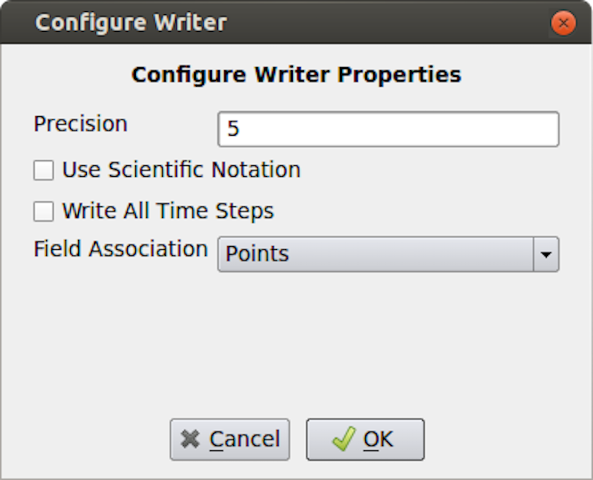
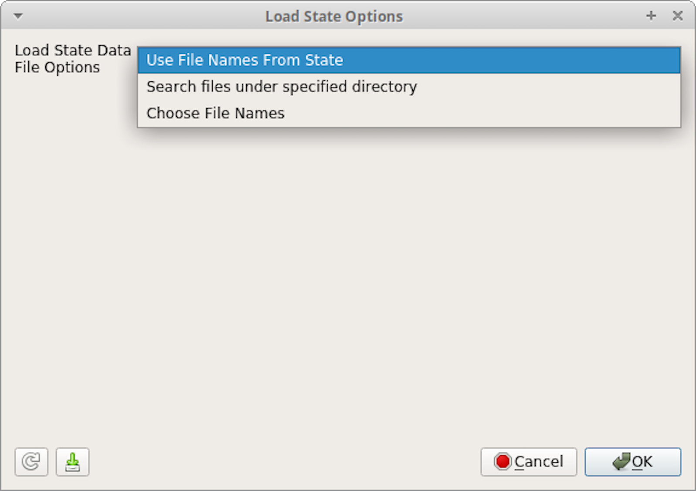

.. include:: macros.hrst
.. include:: abbreviations.hrst

.. _chapter:SavingResults:

Saving Results
##############

In this chapter, we will introduce various ways of saving visualization results
in |ParaView|. Results generated throughout the visualization process not
only include the images and the rendering results, but also include the datasets generated by filters,
the scene representations that will be imported into other rendering applications, and
the movies generated from animations.

.. _sec:SavingDatasets:

Saving datasets
===============

You can save the dataset produced by any pipeline module in |ParaView|, including
sources, readers, and filters. To save the dataset in |paraview|, begin
by selecting the pipeline module in the  ``Pipeline`` :index:`\ <Pipeline>`\  browser to make it the
active source. For modules with multiple output ports, select the output port
producing the dataset of interest. To save the dataset, use the :guilabel:`File > Save Data`
menu or the |pqSave32| button in the  ``Main Controls`` :index:`\ <Main Controls>`\ 
toolbar. You can also use the keyboard shortcut |CTRL| + :kbd:`S` (or |CMD| + :kbd:`S`).
The  ``Save File`` :index:`\ <Save File>`\  dialog (:numref:`fig:SaveFileDialog`)
will allow you to select the filename and the file format.
The available list of file formats depends on the type of the dataset you are
trying to save.

    ``Save File`` :index:`\ <Save File>`\  dialog in |paraview|.

On accepting a filename and file format to use, |paraview| may show
the  ``Configure Writer`` :index:`\ <Configure Writer>`\  dialog (:numref:`fig:ConfigureWriterDialogCSV`).
This dialog allows you to further customize the
writing process. The properties shown in this dialog depend on the selected file
format and range from enabling you to  ``Write All Time Steps`` :index:`\ <Write All Time Steps>`\ , to selecting
the attributes to write in the output file.

  
    ``Configure Writer`` :index:`\ <Configure Writer>`\  dialog in |paraview| shown when saving a dataset as a csv file.

In |pvpython| too, you can save the datasets as follows:

.. code-block:: python
  
  # Saving the data using the default properties for
  # the used writer, if any.
  >>> SaveData("sample.csv", source)
  
  # the second argument is optional, and refers to the pipeline module
  # to write the data from. If none is specified the active source is used.
  
  # To pass parameters to configure the writer
  >>> SaveData("sample.csv", source,
               Precision=2,
               FieldAssociation='Cells')

|pvpython| will pick a writer based on the file extension and the dataset type
selected for writing, similar to what it does in |paraview|.
Admittedly, it can be tricky to figure out what options are available for the
writer. The best way is to use the *Python tracing* capabilities in
|paraview| and to use the generated sample script as a
reference ( :numref:`sec:PythonTracing`).
Make sure you use a similar type of dataset and the same file format as
you want to use in your Python script, when tracing, to avoid runtime issues.

Saving rendered results
=======================

Views that render results (this includes almost all of the views, except
``SpreadSheet View`` :index:`\ <SpreadSheet View>`\ ) support saving images (or screenshots) in one of the
standard image formats (PNG, JPEG, TIFF, BMP, PPM).
Certain views also support exportings the results in several formats such as
PDF, X3D, and VRML.

Saving screenshots
^^^^^^^^^^^^^^^^^^

To save the render image from a view in |paraview|,
use the :guilabel:`File > Save Screenshot` menu
option. When selected, a file dialog will appear where you can select the file path
and format to which the screenshot should be saved. After selecting the image file, the
``Save Screenshot Options`` :index:`\ <Save Screenshot Options>`\  dialog (:numref:`fig:SaveScreenshotOptions`) will
be shown. This dialog allows you to select various parameters that controls what
image is saved out and how.

    The  ``Save Screenshot Options`` :index:`\ <Save Screenshot Options>`\  dialog, which is used to customize saving screenshots in |paraview|.

If your visualization setup only has 1 view the active tab, then you'll be
presented with options shown in
(:numref:`fig:SaveScreenshotOptions`). The available options
are as follows.

* ``Image Resolution`` :index:`\ <Image Resolution>`\ : This is the target image resolution in pixels. By
  default, it is set to the current view dimensions. You can change it as
  needed. If the resolution larger than the current resolution, then ParaView
  will use *tiling* to render the full image in multiple stages. For
  reliable results, you may want to present the current aspect ratio. You can
  use :guilabel:`Tools > Lock View Size Custom` to lock the view size to a suitable
  aspect ratio.
* ``Font Scaling`` :index:`\ `\ : When a resolution larger than the current resolution
  is specified, this allows you to control how the fonts are to be scaled.
  Default  ``Scale fonts proportionally`` :index:`\ <Scale fonts proportionally>`\  tries to achieve WYSIWYG as long as
  the aspect ratio is maintained. This is suitable for saving images targeted
  for higher DPI (or PPI) display than your screen.  ``Do not scale fonts`` :index:`\ <Do not scale fonts>`\ 
  may be used to avoid font scaling and keep their size in pixels the same as
  what is currently on the screen. This is suitable for saving images targeted
  for a larger display with the same pixel resolution.
* ``Override Color Palette`` :index:`\ <Override Color Palette>`\ : Optionally change the color palette just for
  saving the screenshot using this drop-down.
* ``Stereo Mode`` :index:`\ <Stereo Mode>`\ : This option lets you save the image using one of the
  supported stereo modes.
* ``Transparent Background`` :index:`\ <Transparent Background>`\ : If the file format supports it, you can
  check this option to save the images with a transparent background rather
  than the current background color.
* ``Format`` :index:`\ <Format>`\ : This shows the file format selected in the file save dialog.

For formats that have different options like compression levels, format-specific
options are presented in the  ``Save Screenshot Options`` :index:`\ <Save Screenshot Options>`\  dialog. The PNG format has
a  ``Compression Level`` :index:`\ <Compression Level>`\  option that ranges from 0 (no compression) to 9 (maximum
compression). The JPEG format options are  ``Quality`` :index:`\ <Quality>`\ , which ranges from 0 to 100,
and  ``Progressive`` :index:`\ <Progressive>`\ , which enables saving the file as a progressive JPEG. The TIFF
file format has a  ``Compression`` :index:`\ <Compression>`\  option with possible values  ``None`` :index:`\ <None>`\ ,  ``PackBits`` :index:`\ <PackBits>`\ ,
and  ``Deflate`` :index:`\ <Deflate>`\ . The BMP file format has no options.

If the active tab has more than one view, then the  ``Save
Screenshot Options`` :index:`\ <Save
Screenshot Options>`\  dialog has a few more options as shown in
:numref:`fig:SaveScreenshotOptionsMultiView`.

    Extra options in  ``Save Screenshot Options`` :index:`\ <Save Screenshot Options>`\  dialog available when the active tab has more than 1 view.

* ``Save All Views`` :index:`\ <Save All Views>`\ : Check this to save all the views in the active tab laid
  out exactly as in the UI. If unchecked, only the active view will be saved.
* ``Separator Options`` :index:`\ <Separator Options>`\ : These control the separator drawn between the views in the
  generated image. You can specify the  ``Separator Width`` :index:`\ <Separator Width>`\  in approximate pixels
  as well as the  ``Separator Color`` :index:`\ <Separator Color>`\ .

To save a screenshot in |pvpython|, you use  ``SaveScreenshot`` :index:`\ <SaveScreenshot>`\ .

.. code-block:: python

  # Save a screenshot from a specific view.
  >>> myview = GetActiveView()
  >>> SaveScreenshot("aview.png", myview)
  
  # Save all views in a tab
  >>> layout = GetLayout()
  >>> SaveScreenshot("allviews.png", layout)
  
  # To save a specific target resolution, rather than using the
  # the current view (or layout) size, and override the color palette.
  >>> SaveScreenshot("aviewResolution.png", myview,
          ImageResolution=[1500, 1500],
          OverrideColorPalette="Black Background")

As always, you can use *Python tracing* in |paraview| to trace
the exact form of the method to use to save a specific screenshot image.

Exporting scenes
^^^^^^^^^^^^^^^^

When available, you can export a visualization in a view in several of the
supported formats using the :guilabel:`File > Export View` menu option in
|paraview|. For a
``Render View`` :index:`\ <Render View>`\  (or similar), the available formats include Cinema Database,
EPS, PDF, PS, SVG, POV, VRML, WebGL, X3D, and X3DB. On selecting a file
as which to export, |paraview| may pop up an  ``Export Options`` :index:`\ <Export Options>`\  dialog that
allows you to set up parameters for the exporter, similar to saving datasets
( :numref:`sec:SavingDatasets`).

In addition, from |pvpython|, exporting takes the following form (again,
just use *Python trace* to figure out the proper form -- that's the
easiest way).

.. code-block:: python

  >>> myview = GetActiveView()
  >>> ExportView('/tmp/sample.svg', view=myview,
                 Plottitle='ParaView GL2PS Export',
                 Compressoutputfile=1)
  # the arguments after 'view' depend on the exporter selected.

.. % \begin{didyouknow}
   %  To save images to be included in publications, you have two options, save a
   %  high resolution rasterized images as png, bmp, etc. or export the image in one
   %  of the vector formats such as pdf, eps. For details on how this works and how
   %  to fine tune it, refer to  :numref:``.\fixme{fix reference}
   % \end{didyouknow}

Saving animation
================

    The ``Save Animation Options`` :index:`\ <Save Animation Options>`\  dialog in |paraview|, which is used to customize saving of animation.

To save an animation as a series of images or a video file, you use the
:guilabel:`File > Save Animation` menu option. This pops up a file save dialog where you choose
where to save the file and which format to use. After selecting the file and format, the  ``Save Animation Options`` :index:`\ <Save Animation Options>`\ 
dialog (:numref:`fig:SaveAnimationOptions`) is display. This dialog is nearly a clone of the
``Save Screenshot Options`` :index:`\ <Save Screenshot Options>`\  dialog (:numref:`fig:SaveScreenshotOptions`), including,
optionally, the extra multiview options from :numref:`fig:SaveScreenshotOptionsMultiView`,
with additional format-specific compression options and a few animation-specific parameters.
These are as follows:

* ``Frame Rate`` :index:`\ <Frame Rate>`\ : When saving the animation as a video file (AVI or Ogg) rather than
  a series of images, this lets you specify the frame rate for the generated video. It has
  no effect when saving as a series of images.
* ``Frame Window`` :index:`\ <Frame Window>`\ : If you didn't want to save out the full animation, instead limit to
  a specific window, you can use this to specify the range of frames to save. If you are generating
  a animation from a temporal dataset with timesteps, the frame generally corresponds to the
  timestep number.

On accepting this dialog, you will be able to choose the output file location
and format. The available file formats include AVI and Ogg (when available)
video formats, as well as image formats such PNG, JPEG, and TIFF. If saving as
images, |ParaView| will generate a series of image files sequentially numbered
using the frame number as a suffix to the specified filename.

To save animations in |pvpython|, you use  ``SaveAnimation`` :index:`\ <SaveAnimation>`\ . The arguments to this function are
same as the  ``SaveScreenshot`` :index:`\ <SaveScreenshot>`\  with additional parameters for the animation specific options.

.. code-block:: python

  >>> SaveAnimation('animation.avi', GetActiveView(),
        FrameWindow = [1, 100],
        FrameRate = 1)

.. % Saving animation geometries
   % ^^^^^^^^^^^^^^^^^^^^^^^^^^^^^
   % We should add documentation about saving animation geometries, but that's not
   % that critical, so we'll leave it for later.

Saving state
============

Besides saving the results produced by your visualization setup, you can save
the state of the visualization pipeline itself, including all the pipeline
modules, views, their layout, and their properties. This is referred to as the
``Application State`` :index:`\ <Application State>`\ , or just
``State`` :index:`\ <State>`\ .  In |paraview|, you can save the
state using the :guilabel:`File > Save State...` menu option. Conversely, to load a saved
state file, you can use :guilabel:`File > Load State...`.

There are two types of state files that you can save in |paraview|:
*ParaView state file (\*.pvsm)* and *Python state file (\*.py)*. The
PVSM files are XML-based text files that are human and machine readable,
although not necessarily human friendly for a novice user. However, if you don't
plan to read and make sense of the state files, PVSM is the most robust and
reliable way to save the application state. For those who want to save the state and then
modify it manually, using Python state files may be better, as using
Python trace simply traces the actions that you perform in the UI as a
Python script. Python state files, on the other hand, save the entire current state of the
application as a Python script that you can use in |paraview| or the
``Python Shell`` :index:`\ <Python Shell>`\ .

    The  ``Save State File`` :index:`\ <Save State File>`\  dialog in |paraview|.

To load a state file, you use the :guilabel:`File > Load State...` menu.
Note that loading a state file will affect the current visualization state.

    The  ``Load State Options`` :index:`\ <Load State Options>`\  dialog in |paraview| showing the options for where to find data files.

If you load a PVSM file this way you will be asked where
to search for the data files. There are three available options:  ``Use File Names From State`` :index:`\ <Use File Names From State>`\ ,  ``Search files under
specified directory`` :index:`\ <Search files under
specified directory>`\  and  ``Choose File Names`` :index:`\ <Choose File Names>`\ .  If you select  ``Use File Names From State`` :index:`\ <Use File Names From State>`\  then |ParaView| will
look for the data at the absolute paths saved in the state file.  If you select  ``Search files under specified
directory`` :index:`\ <Search files under specified
directory>`\  then you will see an option to browse for a directory that ParaView will search for the files before
looking for them in the absolute path in the state file. This defaults to the
location of the state file to make sharing state files between computers easier. If you select
``Choose File Names`` :index:`\ <Choose File Names>`\  then you will be given a list of file names in the state file and can override
each one individually.

    The  ``Load State Options`` :index:`\ <Load State Options>`\  dialog in |paraview| showing the  ``Search files under specified directory`` :index:`\ <Search files under specified directory>`\  option.

You can save/load the PVSM state file in |pvpython| as follows:

.. code-block:: python

  >>> from paraview.simple import *
  
  # Save the PVSM state file. Currently, this doesn't support
  # saving Python state files.
  >>> SaveState("sample.pvsm")
  
  # To load a PVSM state file.
  >>> LoadState("sample.pvsm")

You can also use the options to specify file locations when loading PVSM files from |pvpython| as follows:

.. code-block:: python

  # To load a PVSM state file and specify the directory to search for data files.
  >>> LoadState("sample.pvsm", LoadStateDataFileOptions='Search files under specified directory', DataDirectory='/home/user/sampledata')

You can use  ``LoadStateDataFileOptions='Choose File Names'`` :index:`\ <LoadStateDataFileOptions='Choose File Names'>`\  too, but you may need to use the Python trace function in |paraview|
(see  :numref:`sec:PythonTracing`) to determine the names of the parameters to pass in to  ``LoadState`` :index:`\ <LoadState>`\ . They differ among readers.
