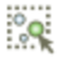
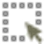
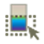

.. include:: macros.hrst
.. include:: abbreviations.hrst

.. _chapter:SelectingData:

Selecting Data
##############


A typical visualization process has two components: setting up the
visualization scene and performing the analysis of the results to gain insight.
It is not uncommon for this process to be iterative. Often, what you are looking
for drives from what filters you should use to extract the relevant information from
the input datasets and what views will best represent that data. One of the
ways of evaluating the results is inspecting the data or probing into it by
identifying elements of interest. |ParaView| data selection mechanisms are
designed specifically for such use-cases. In this chapter, we take a closer look
at various ways of selecting data in |ParaView| and making use of these selections
for data analysis.

.. _sec:UnderstandingSelection:

Understanding selection
=======================

Broadly speaking, selection refers to selecting elements (either cells, points,
rows (in case of tabular datasets), etc.) from datasets. Since data is ingested
into |ParaView| using readers or sources and transformed using filters, when you
create a selection, you are selecting elements from the dataset produced as the
output of source, filter, or any such pipeline module.

There are many ways to create selections. Several views provide means to
create specific selections. For example, in the  ``SpreadSheet View`` :index:`\ <SpreadSheet View>`\ , which
shows the data attributes as a spreadsheet, you can simply click on any row to
*select* that row. You can, of course, use the |SHIFT| and |CTRL| (or
|CMD|) keys to select multiple rows, as in typical spreadsheet-based
applications.

While this seems like an exercise in futility, you are hardly achieving anything
by highlighting rows in a spreadsheet. What transforms this into a key tool is the
fact that selections are *linked* among views (whenever possible). Linked
selection means that you select an element from a dataset in a specific view.
All other views that are showing the *same* dataset will also highlight the
selected elements.


    Linked selection between views allows you to select elements in a view
    and view them in all other views showing the selected data. In this demo, as we
    select rows in the  ``SpreadSheet View`` :index:`\ <SpreadSheet View>`\ , 
    the corresponding points in the  ``3D View`` :index:`\ <3D View>`\  get highlighted.

To make this easier, let's try a quick demo:

Starting with a fresh |paraview| session, create a sample dataset
using the :guilabel:`Sources > Wavelet` menu, and then click the  ``Apply`` :index:`\ <Apply>`\  button. If you
are using |paraview| with a default setup, that should result in a
dataset outline being shown in the default  ``Render View`` :index:`\ <Render View>`\ . Next, let's split
the view and create  ``SpreadSheet View`` :index:`\ <SpreadSheet View>`\ . The  ``SpreadSheet View`` :index:`\ <SpreadSheet View>`\  will
automatically show the data produced by the  ``Wavelet`` :index:`\ <Wavelet>`\  source. Upon closer
inspection of the header in the  ``SpreadSheet View`` :index:`\ <SpreadSheet View>`\ , we see that the view
is showing the  ``Point Data`` :index:`\ <Point Data>`\  or point attributes associated with the dataset.
Now we have the same dataset, the data produced by the  ``Wavelet`` :index:`\ <Wavelet>`\  source,
shown in two views. Now, highlight a few rows in the  ``SpreadSheet View`` :index:`\ <SpreadSheet View>`\  
by clicking on them. As soon as you start selecting rows, the  ``Render View`` :index:`\ <Render View>`\  
will start highlighting some points in space as tiny magenta specks
( :numref:`fig:UnderstandingLinkedSelections`). That's linked selection in
action! What is happening is that, as you highlight rows in the  ``SpreadSheet View`` :index:`\ <SpreadSheet View>`\ , 
you are creating a selection for selecting points (since the view is
showing  ``Point Data`` :index:`\ <Point Data>`\ ) corresponding to the rows. Due to the linking of
selections between views, any other view that is showing the dataset (in this
case, the  ``Render View`` :index:`\ <Render View>`\ ) will also highlight the selected points.

Of course, if you want to select cells instead of points, switch the
``SpreadSheet View`` :index:`\ <SpreadSheet View>`\  to show cells by flipping the  ``Attribute`` :index:`\ <Attribute>`\  combo-box to
``Cell Data`` :index:`\ <Cell Data>`\  and then highlight rows. The  ``Render View`` :index:`\ <Render View>`\  will show the
selected cells as a wireframe, rather than points.

Conversely, you could have created the selection in the  ``Render View`` :index:`\ <Render View>`\ , and the
``SpreadSheet View`` :index:`\ <SpreadSheet View>`\  will also highlight the selected elements. We will see how
to create such selection later in this chapter.

The first thing to note is that, when you create a new selection, the existing selection
is cleared. Thus, there is at most one active selection in the application at any
given time. As we shall see, certain views provide ways of expanding on the
existing selection.

The second thing to note is that selections are *transient*, i.e., they cannot
be undone/redone or saved in state files and loaded back. Nor can you apply
filters or other transformation to the selections themselves. There are cases,
however, where you may want to subset your dataset using the selection defined
interactively and then apply filters and other analysis to that extracted
subset. For that, there are filters available, namely  ``Extract Selection`` :index:`\ <Extract Selection>`\ 
and  ``Plot Selection Over Time`` :index:`\ <Plot Selection Over Time>`\ , that can capture the active selection in as
the filter parameters and then produce a new dataset that is comprised of the
selected elements.

The third thing to note is that there are different types of selections, e.g.,
id-based selections, where the selected elements are identified by their
indices; frustum-based selections, where the selected elements are those that
intersect a frustum defined in 3D space; query-based selections, where the
selected elements are those that match the specified query string; and so on.

.. admonition:: **Did you know?**
  :class: tip

  While, technically, selection is possible using a Python-based API, that API is
  currently cumbersome and requires understanding of some of |ParaView| internals.
  There are plans to simplify that API in future releases. As a result, we do
  not cover Python API for selection in this chapter. Once this new API
  is available, it will be included in this chapter.

Creating selections using views
===============================

Views provide a convenient mechanism for creating selections interactively.
Views like  ``Render View`` :index:`\ <Render View>`\  can create multiple types of selection (id- or
frustum-based selections for selecting points and cells), while others like the
``SpreadSheet View`` :index:`\ <SpreadSheet View>`\  and  ``Line Chart View`` :index:`\ <Line Chart View>`\  only support one type (id-based
selections for points or cells).

.. _sec:SelectingInRenderView:

Selecting in Render View
^^^^^^^^^^^^^^^^^^^^^^^^

To create a selection in the  ``Render View`` :index:`\ <Render View>`\ , you use the toolbar at
the top of the view frame. There are two ways of selecting cells,
points or blocks in |ParaView|: interactive and non-interactive.

|ParaView| enters a *non-interactive selection mode* when the user
clicks one of the non-interactive selection buttons:
|pqSurfaceSelectionCell24|
|pqSurfaceSelectionPoint24|
|pqFrustumSelectionCell24|
|pqFrustumSelectionPoint24|
|pqPolygonSelectSurfaceCell24|
|pqPolygonSelectSurfacePoint24|
|pqSelectBlock24|
The type of selection you are
creating will depend on the button you clicked. Once in
non-interactive selection mode, the cursor will switch to cross-hair
and you can click and drag to create a selection region. Once you
release the mouse,
|ParaView| will attempt to create a selection for any elements in the selection
region and will go back to default interaction mode.





.. |pqPolygonSelectSurfacePoint24| image:: images/pqPolygonSelectSurfacePoint24.png
                                   :width: 0.5cm


To create a selection for cells visible in the view, use the
|pqSurfaceSelectionCell24| button. For selecting
visible points, use the |pqSurfaceSelectionPoint24|
button instead. Visible cells (and points) are only those cells (or
points) that are currently rendered on the screen. Thus, elements that
are occluded or are too small to be rendered on the screen will not be
selected. If you want to select all data elements that intersect the
view frustum formed by the selection rectangle you drew on the screen,
use the |pqFrustumSelectionCell24| button (or
|pqFrustumSelectionPoint24| for points).  In this
case, all elements, visible or otherwise, that are within the 3D space
defined by the selection frustum are selected.

To create a selection for blocks visible in the view use the
|pqSelectBlock24| button. Note that there is no frustum
selection for blocks.

While most selection modes allow you to define the selection region as a rectangle,
|pqPolygonSelectSurfaceCell24| (and |pqPolygonSelectSurfacePoint24| for points) enables you to
define the selection region as a closed polygon. However, this is limited to
surface elements (i.e., no frustum-based selection).

|ParaView| enters an *interactive selection mode* when the user
clicks on one of the interactive selection buttons:
|pqSurfaceSelectionCellInteractive|
|pqSurfaceSelectionPointInteractive|. In interactive
selection mode, the user acts on visible elements (cells or
points). |ParaView| highlights elements of the dataset as a user moves
the cursor over them. An element can be selected by clicking on
it. Clicking repeatedly on different elements adds them to the
selection.  A user ends the interactive selection mode by clicking on
the interactive selection button pushed in or by pressing the
|ESC| key. This mode is also ended when the user enters a
non-interactive selection mode. You can use
|pqSurfaceSelectionCellInteractive| button to
interactively select cells of the dataset and use
|pqSurfaceSelectionPointInteractive| button to
interactively select points.


When there are selected elements, the |ClearSelection|
button can be used to clear the selection.

Several of these buttons have hotkeys too, such as :kbd:`S` for visible
cell selection, :kbd:`D` for visible points selection, :kbd:`F` for
frustum-based cell selection, and :kbd:`G` for frustum-based point selection. If
you notice, these are keys are right next to each other on the keyboard,
starting with :kbd:`S`, and are in the same order as the toolbar buttons themselves.


    Result of a frustum cell selection on disk_out_ref.ex2 dataset
    showing the frustum used to identify selected cells. All cells that fall in
    that frustum or that intersect it are selected, irrespective of whether they were visible from
    the view angle when the selection was made.

.. admonition:: **Did you know?**
  :class: tip

  For id-based visible cell (or point) selection, you can expand the
  current selection by  keeping the |CTRL| (or |CMD|) key pressed when
  clicking and dragging in selection mode. |paraview| will then try
  to add to the current selection by adding the newly selected elements to the
  existing one. You can also subtract from the current selection using the
  |SHIFT|, or even toggle using |CTRL| (or |CMD|) + |SHIFT|.
  Selection modifier buttons, in the toolbar, can be used for the same effect.
  Add : |pqSelectChartPlus16| , remove : |pqSelectChartMinus16|, toggle : |pqSelectChartToggle16|.
  These modifiers do not work, however, if the selection type (or the selected
  data) is different from the current selection. If so, the current selection
  will be cleared (as is the norm) and then the new selection will be created.

Selecting in SpreadSheet View
^^^^^^^^^^^^^^^^^^^^^^^^^^^^^

To create a selection in the  ``SpreadSheet View`` :index:`\ <SpreadSheet View>`\ , you simply click on the
corresponding rows in the spreadsheet. You can use the |CTRL| (or
|CMD|) and |SHIFT| keys to add to the selection.
Based on which data attribute the view is currently showing, i.e.,  ``Point
Data`` :index:`\ <Point
Data>`\ ,  ``Cell Data`` :index:`\ <Cell Data>`\ , or  ``Row Data`` :index:`\ <Row Data>`\ , the selection will select points,
cells, or rows, respectively.

Selecting in Line Chart View
^^^^^^^^^^^^^^^^^^^^^^^^^^^^

``Line Chart View`` :index:`\ <Line Chart View>`\  enables you to select the elements corresponding to the
plotted data values. The selection interaction is similar to  ``Render View`` :index:`\ <Render View>`\ .
By default, you are in the interaction mode. You enter selection mode to create a
selection by using the buttons in the view toolbar for creating a rectangular
selection |pqSelectChart16| or a polygonal selection
|pqSelectChartPolygon16|. Once in selection mode, you
can click and drag to define the selection region. The selection is created once
you release the mouse press.

When a new selection is created, by default, it
will clear any existing selection in the view.
The selection modifier buttons in the view toolbar
can be used to control whether a new selection adds to selected elements
|pqSelectChartPlus16|, removes
points from the selected elements |pqSelectChartMinus16|, or
toggles it |pqSelectChartToggle16|. These modifier
buttons are mutually exclusive and modal, i.e., they remain pressed until you
click to unpress them or until you press another modifier button.
|CTRL| (or |CMD|) and |SHIFT| can also be used to
add to/subtract from the selection.




    Selection in  ``Line Chart View`` :index:`\ <Line Chart View>`\  can be used to locate elements
    matching attribute criteria. In this visualization, by generating a scatter
    plot plotting Pres against Temp in the disk_out_ref.ex2 dataset by
    selecting the top-left corner of the  ``Line Chart View`` :index:`\ <Line Chart View>`\ , we can easily locate
    elements in the high Pres, low Temp regions in the dataset.

Creating selections using the *Find Data* dialog
================================================

Views provide mechanisms to create selections interactively. Selections in chart
views and  ``SpreadSheet View`` :index:`\ <SpreadSheet View>`\  can be used to select elements with certain data
properties, rather than spatial locations
( :numref:`fig:SelectingInLineChartView`). For a richer data-based selection
for selecting elements matching certain criteria, you can use the  ``Find Data`` :index:`\ <Find Data>`\ 
mechanism in |paraview|.

The  ``Find Data`` :index:`\ <Find Data>`\  dialog can be accessed from the :guilabel:`Edit` menu or by using the
keyboard shortcut :kbd:`V` or the |pqFindData32|
button on the  ``Main Controls`` :index:`\ <Main Controls>`\  toolbar.



The  ``Find Data`` :index:`\ <Find Data>`\  dialog can be split into three components,
reflecting how you would use this dialog. The  ``Create Selection`` :index:`\ <Create Selection>`\  component
includes UI elements to help you define the selection criteria or the query for
defining the data elements to find. The  ``Current Selection`` :index:`\ <Current Selection>`\  component shows the
results from the most recent selection results in a spreadsheet. Finally, the
``Selection Display Properties`` :index:`\ <Selection Display Properties>`\  component allows you to control how the
selected elements are shown in the active view.


    The  ``Find Data`` :index:`\ <Find Data>`\  dialog in |paraview| can be used to find
    data elements matching specific conditions. In this example, we are selecting
    all *Points* in *disk_out_ref.ex2* dataset where *Pres*
    is :math:`>= 0.02`.

You can create selections or define queries in the  ``Find Data`` :index:`\ <Find Data>`\  dialog using
the widgets under the  ``Create Selection`` :index:`\ <Create Selection>`\  group. The UI is designed to be read
left-to-right. Thus, you start by specifying which data attributes you are
interested in selecting: cells, points, or rows. Then select which pipeline
module is producing the dataset of interest. Once that's done, the next
step is to specify the selection criteria. The left-most combo-box is used to
select the array of interest. The available options reflect the data array
currently available on the dataset. The next combo-box is used to select the
operator. Options include the following:

* ``is`` :index:`\ <is>`\  matches a single value
* ``is between`` :index:`\ <is between>`\  matches a range of values specified by min and max
* ``is one of`` :index:`\ <is one of>`\  matches a list of comma-separated values
* ``is :math:`>=``` :index:`\ <is :math:`>=`>`\  matches all values greater than or equal to the specified value
* ``is :math:`<=``` :index:`\ <is :math:`<=`>`\  matches all values lesser than or equal to the specified value
* ``is min`` :index:`\ <is min>`\  matches the minimum value for the array for the current time step
* ``is max`` :index:`\ <is max>`\  matches the maximum value for the array for the current time step
* ``is less than mean`` :index:`\ <is less than mean>`\  matches values lesser than or equal to the mean
* ``is greater than mean`` :index:`\ <is greater than mean>`\  matches values greater than or equal to the mean
* ``is equal to mean with tolerance`` :index:`\ <is equal to mean with tolerance>`\  matches values equal to the mean
  within the specified tolerance

Based on your selection of the operator, input widgets will be shown next to
this combo-box, where you enter the corresponding values. For example, for  ``is
between`` :index:`\ <is
between>`\ , you enter the min and max values for defining the range in the two
text entry widgets.


Once you are satisfied with the selection criteria, hit the  ``Run Selection
Query`` :index:`\ <Run Selection
Query>`\  button to execute the query. On success, the  ``Current Selection`` :index:`\ <Current Selection>`\ 
spreadsheet will update to show the selected elements. You switch which element
attributes you are viewing in the spreadsheet using the  ``Show`` :index:`\ <Show>`\  combo-box.
Additionally, you can invert the selection by checking  ``Invert selection`` :index:`\ <Invert selection>`\ .

Similar to selecting in views, once you create a selection, any view showing the
selected data will also highlight the selected elements, if possible. For example, the
``Render View`` :index:`\ <Render View>`\  will show a colored wireframe marking the selected elements,
``SpreadSheet View`` :index:`\ <SpreadSheet View>`\  will highlight the rows, etc. The  ``Selection Display
Properties`` :index:`\ <Selection Display
Properties>`\  group allows you to change the selection that is shown in the active
view. Currently, it is primarily designed for  ``Render View`` :index:`\ <Render View>`\ . In the
future, however, it could support changing selection attributes for other views as well.
The available options  allow you select the color to use to show the selected
elements, as well as the data attributes to use to label the cells/points. For finer
control on the label formatting, color, font, etc., use the
|pqAdvanced26|. That will pop up the  
``Advanced Selection Display Properties`` :index:`\ <Advanced Selection Display Properties>`\  dialog
( :numref:`fig:AdvancedSelectionDisplayPropertiesDialog`).

.. |pqAdvanced26| image:: ./images/pqAdvanced26.png
                  :width: 0.5cm


    ``Advanced Selection Display Properties`` :index:`\ <Advanced Selection Display Properties>`\  dialog for controlling
    selection labelling parameters.

.. admonition:: **Did you know?**
  :class: tip

  Besides creating new selections, the  ``Find Data`` :index:`\ <Find Data>`\  dialog can also be used
  to inspect the current selection made from outside the dialog. For
  example, if you select elements in the  ``Render View`` :index:`\ <Render View>`\  using the options
  described in Section :numref:`sec:SelectingInRenderView`, the  ``Current
  Selection`` :index:`\ <Current
  Selection>`\  component in the  ``Find Data`` :index:`\ <Find Data>`\  dialog will indeed update to
  reflect the newly selected elements. Furthermore, you can change its display
  properties and extract this selection using the extraction buttons
  (which we will cover in Section :numref:`sec:ExtractingSelections`).

Creating selections in Python
=============================

Another way to create selections is through ParaView's Python scripting interface.
Python functions exist that are analogous to the selection operations available in the ParaView
``Render View`` :index:`\ <Render View>`\  and  ``Find Data`` :index:`\ <Find Data>`\  dialog. Let's take a look at an example.

.. code-block:: python

  # import the selection module
  from paraview.selection import *
  
  renderView1 = GetActiveView()
  
  # Create an initial rectangular selection in the render view
  SelectSurfacePoints(Rectangle=[200, 321, 600, 744], View=renderView1)
  
  # Add points within a polygon in the active view
  SelectSurfacePoints(Polygon=[180, 200, 190, 400, 322, 300], Modifier='ADD')
  
  # Subtract points with another rectangle
  SelectSurfacePoints(Rectangle=[300, 400, 500, 700], Modifier='SUBTRACT')
  
  # Now extract and show the selected points into another dataset
  ExtractSelection()
  Show()
  
  # Clear the selection
  ClearSelection()

The script starts out by importing functions from the  ``paraview.selection`` :index:`\ <paraview.selection>`\ 
module. Next, it creates a reference to the active render view and
passes it into the selection functions. The first selection function selects points
visible in the render view within a rectangular region. The rectangle is defined
by bottom left and upper right points, (200, 321) and (600, 744), given in pixel coordinates.

The second selection is of visible points within a polygon defined by the points
(180, 200), (190, 400), and (322, 300). In this call, the selection function
modifies the existing selection so that newly selected points are added to the selection.
This is controlled with the  ``Modifier`` :index:`\ <Modifier>`\  named function parameter.
Other options for the  ``Modifier`` :index:`\ <Modifier>`\  parameter are  ``'SUBTRACT'`` :index:`\ <'SUBTRACT'>`\ ,  ``'TOGGLE'`` :index:`\ <'TOGGLE'>`\ ,
and  ``None`` :index:`\ <None>`\ . When the  ``Modifier`` :index:`\ <Modifier>`\  is set to  ``None`` :index:`\ <None>`\ , the previous selection
gets replaced with the new selection. The last call to  ``SelectSurfacePoints`` :index:`\ <SelectSurfacePoints>`\ 
subtracts points from the current selection, which is the combination of the first
two selections.

The last lines in this example script extract the currently selected points from
the currently active source and shows them on the screen. Lastly, the selection
is cleared with the  ``ClearSelection`` :index:`\ <ClearSelection>`\  function.

Selections by point or cell ID numbers are also possible, as shown in this example:

.. code-block:: python

  from paraview.selection import *
  
  # Select cell 1 from all blocks in a multiblock data set on process 0
  SelectIDs(IDs=[0, 1], FieldType='CELL')
  
  # Add cell 3 from block 4 on process 0 and cell 5 from block 6 on process 1
  # to the selection
  SelectCompositeDataIDs(IDs=[4, 0, 3, 6, 1, 5], Modifier='ADD')

Finally, selections by query expressions are also possible via the Python selection API.
As an example, the following selects cells that have the maximum value for
a cell variable named  ``EQPS`` :index:`\ <EQPS>`\  in the currently active source:

.. code-block:: python

  from paraview.selection import *
  
  QuerySelect(QueryString='EQPS == max(EQPS)', FieldType='CELL')

The complete list of selection functions are briefly
described below. For full documentation on these functions, you can invoke the
``help`` :index:`\ <help>`\  function on any of the functions, e.g.,  ``help(SelectSurfaceCells)`` :index:`\ <help(SelectSurfaceCells)>`\ .


* ``SelectSurfacePoints`` :index:`\ <SelectSurfacePoints>`\  - Select visible points within a rectangular or polygon region.

* ``SelectSurfaceCells`` :index:`\ <SelectSurfaceCells>`\  - Select visible cells within a rectangular or polygon region.

* ``SelectSurfaceBlocks`` :index:`\ <SelectSurfaceBlocks>`\  - Select visible blocks within a rectangular region.

* ``SelectPointsThrough`` :index:`\ <SelectPointsThrough>`\  - Select all points within a rectangular region regardless of their visibility.

* ``SelectCellsThrough`` :index:`\ <SelectCellsThrough>`\  - Select all cells within a rectangular region regardless of their visibility.

* ``SelectGlobalIDs`` :index:`\ <SelectGlobalIDs>`\  - Select attributes by global IDs.

* ``SelectPedigreeIDs`` :index:`\ <SelectPedigreeIDs>`\  - Select attributes by Pedigree IDs.

* ``SelectIDs`` :index:`\ <SelectIDs>`\  - Select attributes by attribute IDs.

* ``SelectCompositeDataIDs`` :index:`\ <SelectCompositeDataIDs>`\  - Select attributes by composite attribute IDs.

* ``SelectHierarchicalDataIDs`` :index:`\ <SelectHierarchicalDataIDs>`\  - Select attributes by hierarchical data IDs.

* ``SelectThresholds`` :index:`\ <SelectThresholds>`\  - Select attributes in a source by thresholding on values in an associated array.

* ``SelectLocation`` :index:`\ <SelectLocation>`\  - Select points by location.

* ``QuerySelect`` :index:`\ <QuerySelect>`\  - Selection by query expression.

* ``ClearSelection`` :index:`\ <ClearSelection>`\  - Clears the selection on the source passed in as a parameter.


Displaying selections
=====================

The  ``Find Data`` :index:`\ <Find Data>`\  dialog provides easy access to changing the  ``Selection
Display Properties`` :index:`\ <Selection
Display Properties>`\  for the selection in the active view. The same functionality
can also be accessed using the  ``Selection Display Inspector`` :index:`\ <Selection Display Inspector>`\  panel, which is a
dockable panel that can be shown/hidden using the :guilabel:`View > Selection Display Inspector`
menu. Currently, selection display properties apply to  ``Render View`` :index:`\ <Render View>`\ s alone. 
In the future, this will be expanded to other view types, as
appropriate.

The  ``Current Selection`` :index:`\ <Current Selection>`\  section in the  ``Find Data`` :index:`\ <Find Data>`\  dialog shows the
selected elements in a spreadsheet view. You can also make a regular
``SpreadSheet View`` :index:`\ <SpreadSheet View>`\  do the same by checking the |pqSelect32|
button in the view toolbar to show only selected elements.


Extracting selections
=====================
.. _sec:ExtractingSelections:

All the types of selections created through mechanisms discussed so far are
transient and primarily used for highlighting data. If you want to do further
operations on the selected subset, such as extract the selected elements and
then save the result out as a new dataset or apply other filters only on the
selected elements, then you need to use one of the extract selection filters.
The  ``Extract Selection`` :index:`\ <Extract Selection>`\  and  ``Plot Selection Over Time`` :index:`\ <Plot Selection Over Time>`\  filters fall in
this category of filters.

.. %Using these filters not only enables further
   %processing for the extraction result, but also makes the selection concrete i.e.
   %the filter will get saved in state files.

Extract selection
^^^^^^^^^^^^^^^^^


    
    ``Properties`` :index:`\ <Properties>`\  panel showing the properties for the
    ``Extract Selection`` :index:`\ <Extract Selection>`\  filter.}

The ``Extract Selection`` :index:`\ <Extract Selection>`\  filter is used to extract the selected elements as a
new dataset for further filtering. There are multiple ways of creating this
filter. You can use the conventional method for creating filters, i.e., using the
:guilabel:`Filters` menu. When the filter is created, if there is any active
selection, the filter will automatically copy that selection for convenience.
Another way to extract the active selection is using the  ``Extract
Selection`` :index:`\ <Extract
Selection>`\  button in the  ``Find Data`` :index:`\ <Find Data>`\  dialog
( :numref:`fig:FindDataDialog`).

The  ``Properties`` :index:`\ <Properties>`\  panel shows what defines the selection. You can update the
selection by making a new active selection using any of the mechanisms described
earlier in this chapter and then clicking on the  ``Copy Active Selection`` :index:`\ <Copy Active Selection>`\ 
button on the  ``Properties`` :index:`\ <Properties>`\  panel for the  ``Extract Selection`` :index:`\ <Extract Selection>`\  filter.

By default, the filter is set up to extract the selected elements alone. This
filter also supports passing the entire input dataset through by simply
marking which elements are selected. For that, check the  ``Preserve Topology`` :index:`\ <Preserve Topology>`\ 
check box on the  ``Properties`` :index:`\ <Properties>`\  panel.

.. _sec:PlotSelectionOverTime:

Plot selection over time
^^^^^^^^^^^^^^^^^^^^^^^^


    ``Plot Selection Over Time`` :index:`\ <Plot Selection Over Time>`\  in action in |paraview|. The
    filter provides a convenient way to plot changes in attributes over time for the
    selected set of cells or for points in a temporal dataset.

``Plot Selection Over Time`` :index:`\ <Plot Selection Over Time>`\  is similar to  ``Extract Selection`` :index:`\ <Extract Selection>`\  in the sense
that it too extracts the selected elements from the input dataset. However,
instead of simply extracting the result, the goal here is to plot attributes at the
selected elements over time.

:numref:`fig:PlotSelectionOverTime` shows an example use of this filter. In
this case, we wanted to see how the strain (or *EQPS*) cell attribute
changes over time for two specific cells that we selected in the  ``Render
View`` :index:`\ <Render
View>`\  using the view-based selection mechanism. The selected cells are the
highlighted elements in the left view. After having selected the cells, we
create the  ``Plot Selection Over Time`` :index:`\ <Plot Selection Over Time>`\  filter using the :guilabel:`Filters > Data Analysis`
menu. (You could also use the |pqPlotSelectionOverTime24|
from the  ``Data Analysis`` :index:`\ <Data Analysis>`\  toolbar.) Similar to the  ``Extract Selection`` :index:`\ <Extract Selection>`\ 
filter, when this filter is created, it copies the active selection. You can
change it afterwards using the  ``Copy Active Selection`` :index:`\ <Copy Active Selection>`\  button on the filter's
``Properties`` :index:`\ <Properties>`\  panel. On hitting  ``Apply`` :index:`\ <Apply>`\ , |paraview| will show a
visualization similar to the one shown here.


Instead of using the view for defining the selection, you could have used the
``Find Data`` :index:`\ <Find Data>`\  dialog. In that case, instead of being able to plot each element
over time, you will be plotting summaries for the selected subset over time.
This is essential since the selected subset can have a varying number of
elements over time. The summaries include quantities like mininum, maximum, and
median of available variables. You can make the filter always produce these
statics alone (even when the selection is created by selecting specific elements
in a view) by checking the  ``Only Report Selection Statistics`` :index:`\ <Only Report Selection Statistics>`\  property on the
``Properties`` :index:`\ <Properties>`\  panel for the  ``Plot Selection Over Time`` :index:`\ <Plot Selection Over Time>`\  filter.

Freezing selections
===================

When extracting selections, you can use views or the  ``Find Data`` :index:`\ <Find Data>`\  dialog to
define the selection. Since the extraction filters are indeed like any other
filters in |ParaView|, they are re-executed any time the input dataset changes,
properties on the filter change, or the current time changes. Every time the
filter re-executes, it performs the *selection* and *extraction*
operations. Thus, if you created the selection using  ``Render View`` :index:`\ <Render View>`\  to create
an id-based selection, the filter will identify which of the elements are of the
requested ids and then pass those. For frustum-based selection, it will
determine what elements fall within the frustum and extract those. Similarly,
with query-based selections created using the  ``Find Data`` :index:`\ <Find Data>`\  dialog, the query
is re-evaluated. This can result in the selection of different elements with changes
in timestep. For example, if you are selecting the cells where the strain is
maximum, the selected cell(s) will potentially be different for each time step. Suppose
you want to plot the changes in a cell that has maximum strain at the last
time step -- how can we do that? The answer is using the  ``Freeze
Selection`` :index:`\ <Freeze
Selection>`\  button on the  ``Find Data`` :index:`\ <Find Data>`\  dialog. What that does is convert any
type of selection (frustum, query-based) to an id-based selection matching the
currently selected element ids. Now you can use this frozen, id-based selection
for  ``Extract Selection`` :index:`\ <Extract Selection>`\  or  ``Plot Selection Over Time`` :index:`\ <Plot Selection Over Time>`\ .
