.. include:: macros.hrst
.. include:: abbreviations.hrst

Understanding Data
##################

.. _sec:VTKDataModel:

VTK data model
==============

To use |ParaView| effectively, you need to understand the |ParaView| data model.
|ParaView| uses VTK, the Visualization Toolkit, to provide the visualization
and data processing model. This chapter briefly introduces the VTK
data model used by |ParaView|. For more details, refer to one of the VTK books.

The most fundamental data structure in VTK is a data object. Data objects can
either be scientific datasets, such as rectilinear grids or finite elements meshes
(see below), or more abstract data structures, such as graphs or trees. These
datasets are formed from smaller building blocks: mesh (topology and geometry) and
attributes.

.. _sec:VTKDataModel:Mesh:

Mesh
^^^^

Even though the actual data structure used to store the mesh in memory depends
on the type of the dataset, some abstractions are common to all types. In
general, a mesh consists of vertices (points :index:`\ <Points>`\ ) and
cells :index:`\ <Cells>`\  (elements, zones). Cells
are used to discretize a region and can have various types such as tetrahedra,
hexahedra, etc. Each cell contains a set of vertices. The mapping from cells to
vertices is called the connectivity. Note that even though it is possible to
define data elements such as faces and edges, VTK does not represent these
explicitly. Rather, they are implied by a cell's type and by its connectivity. One
exception to this rule is the arbitrary polyhedron, which explicitly stores its
faces. :numref:`fig:ExampleMesh` is an example mesh that consists of two cells.
The first cell is defined by vertices :math:`(0, 1, 3, 4)`, and the second cell is
defined by vertices :math:`(1, 2, 4, 5)`. These cells are neighbors because they share
the edge defined by the points :math:`(1, 4)`.

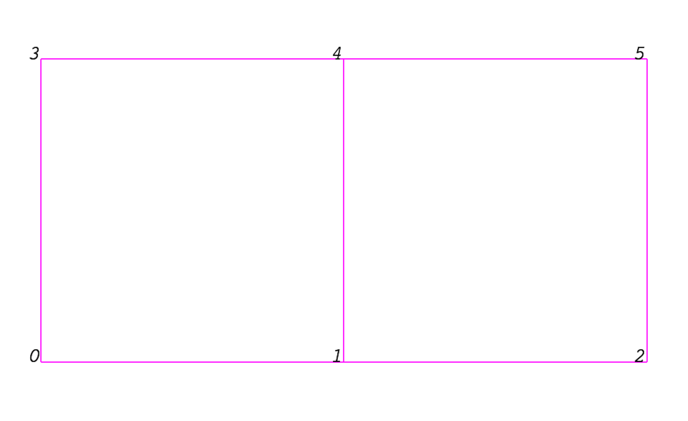

    Example of a mesh.

A mesh is fully defined by its topology and the spatial coordinates of its
vertices. In VTK, the point coordinates may be implicit, or they may be explicitly defined by
a data array of dimensions :math:`(number\_of\_points \times 3)`.

.. _sec:VTKDataModel:Attributes:

Attributes (fields, arrays)
^^^^^^^^^^^^^^^^^^^^^^^^^^^

.. \fixme{Attribute \& data array are in the UI index, but are defined here. Remove one or both keyword tags?} 

An attribute  :index:`\ <Attribute>`\  :index:`\ <Data Array>`\ (or a data array or field)
defines the discrete values of a field
over the mesh. Examples of attributes include pressure, temperature, velocity,
and stress tensor. Note that VTK does not specifically define different types of
attributes. All attributes are stored as data arrays, which can have an arbitrary
number of components. |ParaView| makes some assumptions in regards to the number
of components. For example, a 3-component array is assumed to be an array of
vectors. Attributes can be associated with points or cells. It is also possible
to have attributes that are not associated with either.
:numref:`fig:PointCenteredAttributes` demonstrates the use of a point-centered
attribute. Note that the attribute is only defined on the vertices.
Interpolation is used to obtain the values everywhere else. The interpolation
functions used depend on the cell type. See the VTK documentation for details.

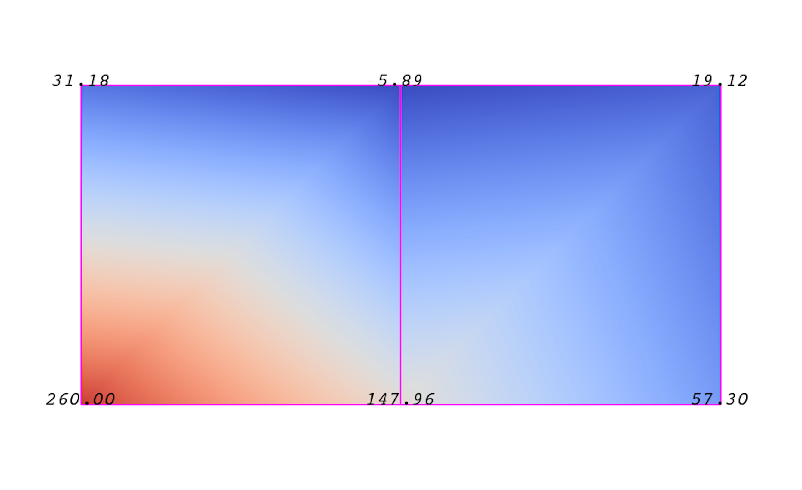

    Point-centered attribute in a data array or field.

:numref:`fig:CellCenteredAttributes` demonstrates the use of a cell-centered
attribute. Note that cell-centered attributes are assumed to be constant over
each cell. Due to this property, many filters in VTK cannot be directly applied
to cell-centered attributes. It is normally required to apply a  ``Cell Data to
Point Data`` :index:`\ <Cell Data to
Point Data>`\  filter. In |ParaView|, this filter is applied automatically, when
necessary.

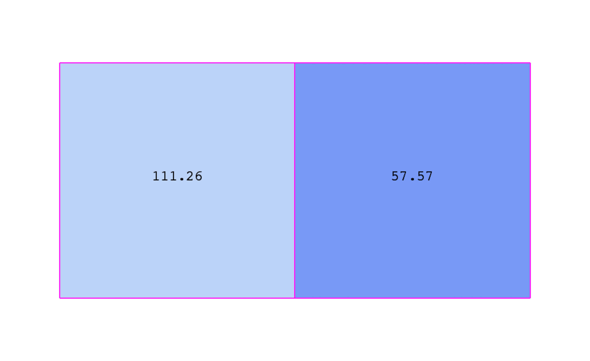

    Cell-centered attribute.

.. _sec:VTKDataModel:UniformRectilinearGrid:

Uniform rectilinear grid (image data)
^^^^^^^^^^^^^^^^^^^^^^^^^^^^^^^^^^^^^

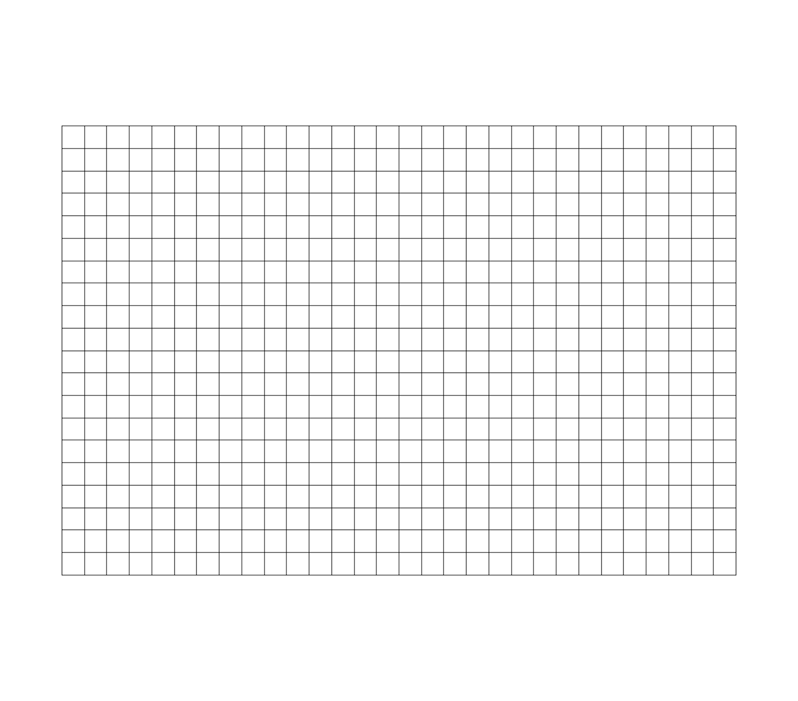

    Sample uniform rectilinear grid.

A uniform rectilinear grid, or image data, defines its topology and point
coordinates implicitly (:numref:`fig:UniformRectilinearGrid`). To fully define
the mesh for an image data, VTK uses the following:

*  *Extents* - These define the minimum and maximum indices in each direction. For example, an image data of extents :math:`(0, 9)`, :math:`(0, 19)`, :math:`(0, 29)` has 10 points in the x-direction, 20 points in the y-direction, and 30 points in the z-direction. The total number of points is :math:`10 \times 20 \times 30`.

* *Origin* - This is the position of a point defined with indices :math:`(0, 0, 0)`.

* *Spacing* - This is the distance between each point. Spacing for each direction can defined independently.

The coordinate of each point is defined as follows: :math:`coordinate = origin +
index \times spacing` where :math:`coordinate`, :math:`origin`, :math:`index`, and :math:`spacing` are vectors of
length 3.

Note that the generic VTK interface for all datasets uses a flat index. The
:math:`(i,j,k)` index can be converted to this flat index as follows:
:math:`idx\_flat = k \times (npts_x \times npts_y) + j \times nptr_x + i`.

A uniform rectilinear grid consists of cells of the same type. This type is determined by the dimensionality of the dataset (based on the extents) and can either be vertex (0D), line (1D), pixel (2D), or voxel (3D).

Due to its regular nature, image data requires less storage than other datasets.
Furthermore, many algorithms in VTK have been optimized to take advantage of
this property and are more efficient for image data.

.. _sec:VTKDataModel:RectilinearGrid:

Rectilinear grid
^^^^^^^^^^^^^^^^

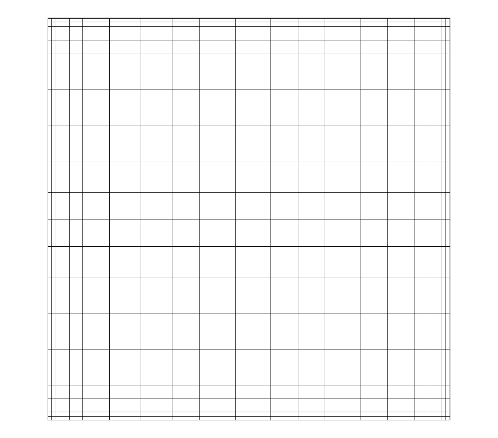

    Rectilinear grid.

A rectilinear grid, such as :numref:`fig:ExampleMesh`, defines its topology
implicitly and point coordinates semi-implicitly. To fully define the mesh for a
rectilinear grid, VTK uses the following:

* *Extents* - These define the minimum and maximum indices in each direction. For example, a rectilinear grid of extents :math:`(0, 9)`, :math:`(0, 19)`, :math:`(0, 29)` has 10 points in the x-direction, 20 points in the y-direction, and 30 points in the z-direction. The total number of points is :math:`10 \times 20 \times 30`.
*  *Three arrays defining coordinates in the x-, y- and z-directions* - These arrays are of length :math:`npts_x`, :math:`npts_y`, and :math:`npts_z`. This is a significant savings in memory, as the total memory used by these arrays is :math:`npts_x+npts_y+npts_z` rather than :math:`npts_x \times npts_y \times npts_z`.

The coordinate of each point is defined as follows:

:math:`coordinate = (coordinate\_array_x(i), coordinate\_array_y(j), coordinate\_array_z(k))`.

Note that the generic VTK interface for all datasets uses a flat index. The
:math:`(i,j,k)` index can be converted to this flat index as follows:
:math:`idx\_flat = k \times (npts_x \times npts_y) + j \times nptr_x + i`.

A rectilinear grid consists of cells of the same type. This type is determined
by the dimensionality of the dataset (based on the extents) and can either be
vertex (0D), line (1D), pixel (2D), or voxel (3D).

.. _sec:VTKDataModel:CurvilinearGrid:

Curvilinear grid (structured grid)
^^^^^^^^^^^^^^^^^^^^^^^^^^^^^^^^^^

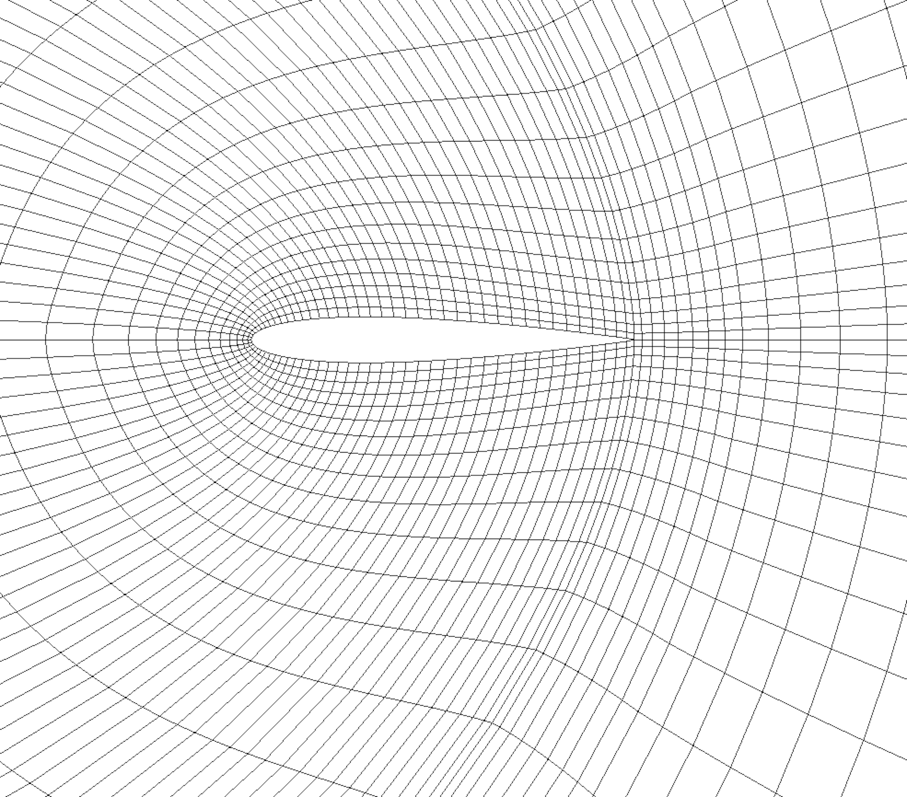

    Curvilinear or structured grid.

A curvilinear grid, such as  :numref:`fig:CurvilinearGrid`, defines its
topology implicitly and point coordinates explicitly. To fully define the mesh
for a curvilinear grid, VTK uses the following:

* *Extents* - These define the minimum and maximum indices in each direction. For example, a curvilinear grid of extents :math:`(0, 9)`, :math:`(0, 19)`, :math:`(0, 29)` has :math:`10 \times 20 \times 30` points regularly defined over a curvilinear mesh.
* *An array of point coordinates* - This array stores the position of each vertex explicitly.

The coordinate of each point is defined as follows:
:math:`coordinate = coordinate\_array(idx\_flat)`.
The :math:`(i,j,k)` index can be converted to this flat index as follows:
:math:`idx\_flat = k \times (npts_x \times npts_y) + j \times npts_x + i`.

A curvilinear grid consists of cells of the same type. This type is determined
by the dimensionality of the dataset (based on the extents) and can either be
vertex (0D), line (1D), quad (2D), or hexahedron (3D).

.. _sec:VTKDataModel:AMRDataset:

AMR dataset
^^^^^^^^^^^

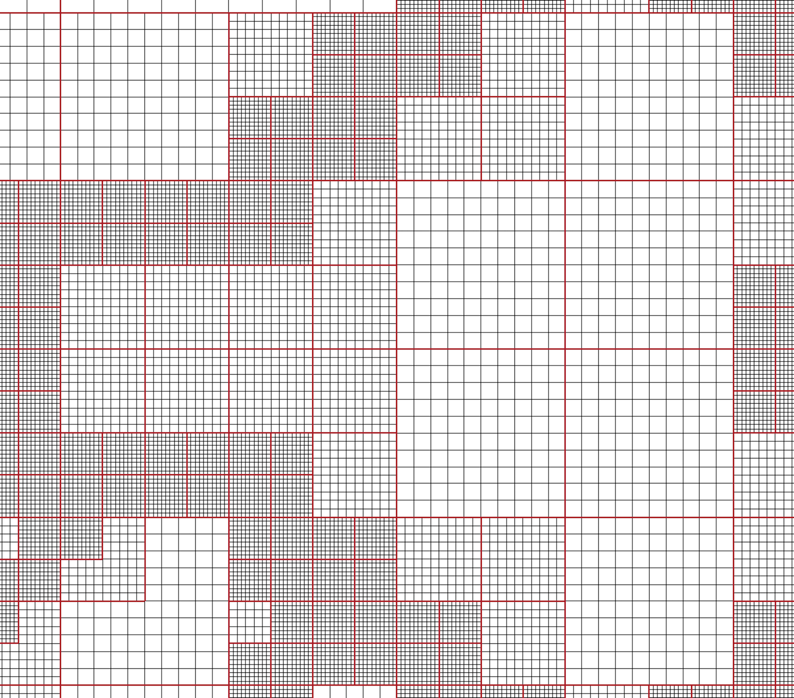

    AMR dataset.

VTK natively supports Berger-Oliger type |AMR| datasets,
as shown in :numref:`fig:AMRDataset`. An |AMR| dataset is essentially a
collection of uniform rectilinear grids grouped under increasing refinement
ratios (decreasing spacing). VTK's |AMR| dataset does not force any constraint on
whether and how these grids should overlap. However, it provides support for
masking (blanking) sub-regions of the rectilinear grids using an array of bytes.
This allows VTK to process overlapping grids with minimal artifacts. VTK can
automatically generate the masking arrays for Berger-Oliger compliant meshes.

.. _sec:VTKDataModel:UnstructuredGrid:

Unstructured grid
^^^^^^^^^^^^^^^^^

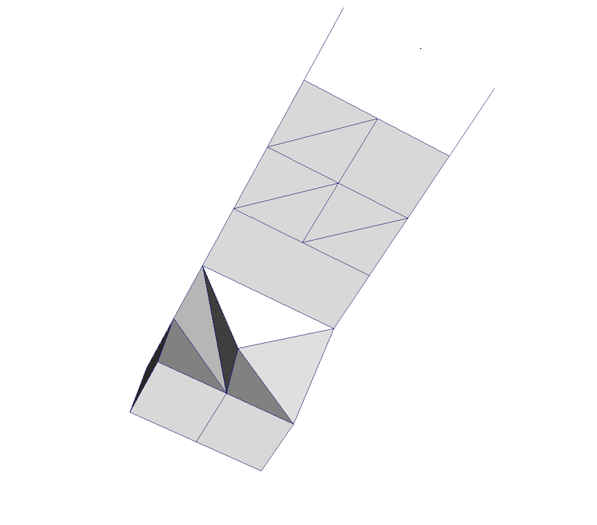

    Unstructured grid.

An unstructured grid, such as :numref:`fig:UnstructuredGrid`, is the most
general primitive dataset type. It stores topology and point coordinates
explicitly. Even though VTK uses a memory-efficient data structure to store the
topology, an unstructured grid uses significantly more memory to represent its
mesh. Therefore, use an unstructured grid only when you cannot represent your
dataset as one of the above datasets. VTK supports a large number of cell types,
all of which can exist (heterogeneously) within one unstructured grid. The full
list of all cell types supported by VTK can be found in the file  ``vtkCellType.h`` :index:`\ <vtkCellType.h>`\ 
in the VTK source code. Here is the list of cell types as of when this document was written:

+--------------------------------------+--------------------------------------+
|VTK\_EMPTY\_CELL                      |VTK\_POLYGON                          |
+--------------------------------------+--------------------------------------+
|VTK\_VERTEX                           |VTK\_PIXEL                            |
+--------------------------------------+--------------------------------------+
|VTK\_POLY\_VERTEX                     |VTK\_QUAD                             |
+--------------------------------------+--------------------------------------+
|VTK\_LINE                             |VTK\_TETRA                            |
+--------------------------------------+--------------------------------------+
|VTK\_POLY\_LINE                       |VTK\_VOXEL                            |
+--------------------------------------+--------------------------------------+
|VTK\_TRIANGLE                         |VTK\_HEXAHEDRON                       |
+--------------------------------------+--------------------------------------+
|VTK\_TRIANGLE\_STRIP                  |VTK\_WEDGE                            |
+--------------------------------------+--------------------------------------+
|VTK\_PYRAMID                          |VTK\_PARAMETRIC\_CURVE                |
+--------------------------------------+--------------------------------------+
|VTK\_PENTAGONAL\_PRISM                |VTK\_PARAMETRIC\_SURFACE              |
+--------------------------------------+--------------------------------------+
|VTK\_HEXAGONAL\_PRISM                 |VTK\_PARAMETRIC\_TRI\_SURFACE         |
+--------------------------------------+--------------------------------------+
|VTK\_QUADRATIC\_EDGE                  |VTK\_PARAMETRIC\_QUAD\_SURFACE        |
+--------------------------------------+--------------------------------------+
|VTK\_QUADRATIC\_TRIANGLE              |VTK\_PARAMETRIC\_TETRA\_REGION        |
+--------------------------------------+--------------------------------------+
|VTK\_QUADRATIC\_QUAD                  |VTK\_PARAMETRIC\_HEX\_REGION          |
+--------------------------------------+--------------------------------------+
|VTK\_QUADRATIC\_POLYGON               |VTK\_HIGHER\_ORDER\_EDGE              |
+--------------------------------------+--------------------------------------+
|VTK\_QUADRATIC\_TETRA                 |VTK\_HIGHER\_ORDER\_TRIANGLE          |
+--------------------------------------+--------------------------------------+
|VTK\_QUADRATIC\_HEXAHEDRON            |VTK\_HIGHER\_ORDER\_QUAD              |
+--------------------------------------+--------------------------------------+
|VTK\_QUADRATIC\_WEDGE                 |VTK\_HIGHER\_ORDER\_POLYGON           |
+--------------------------------------+--------------------------------------+
|VTK\_QUADRATIC\_PYRAMID               |VTK\_HIGHER\_ORDER\_TETRAHEDRON       |
+--------------------------------------+--------------------------------------+
|VTK\_BIQUADRATIC\_QUAD                |VTK\_HIGHER\_ORDER\_WEDGE             |
+--------------------------------------+--------------------------------------+
|VTK\_TRIQUADRATIC\_HEXAHEDRON         |VTK\_HIGHER\_ORDER\_PYRAMID           |
+--------------------------------------+--------------------------------------+
|VTK\_QUADRATIC\_LINEAR\_QUAD          |VTK\_HIGHER\_ORDER\_HEXAHEDRON        |
+--------------------------------------+--------------------------------------+
|VTK\_QUADRATIC\_LINEAR\_WEDGE         |VTK\_LAGRANGE\_CURVE                  |
+--------------------------------------+--------------------------------------+
|VTK\_BIQUADRATIC\_QUADRATIC\_WEDGE    |VTK\_LAGRANGE\_TRIANGLE               |
+--------------------------------------+--------------------------------------+
|VTK\_BIQUADRATIC\_QUADRATIC_HEXAHEDRON|VTK\_LAGRANGE\_QUADRILATERAL          |
+--------------------------------------+--------------------------------------+
|VTK\_BIQUADRATIC\_TRIANGLE            |VTK\_LAGRANGE\_TETRAHEDRON            |
+--------------------------------------+--------------------------------------+
|VTK\_CUBIC\_LINE                      |VTK\_LAGRANGE\_HEXAHEDRON             |
+--------------------------------------+--------------------------------------+
|VTK\_CONVEX\_POINT\_SET               |VTK\_LAGRANGE\_WEDGE                  |
+--------------------------------------+--------------------------------------+
|VTK\_POLYHEDRON                       |VTK\_LAGRANGE\_PYRAMID                |
+--------------------------------------+--------------------------------------+

Many of these cell types are straightforward. For details, see the VTK
documentation.

.. _sec:VTKDataModel:PolyData:

Polygonal grid (polydata)
^^^^^^^^^^^^^^^^^^^^^^^^^

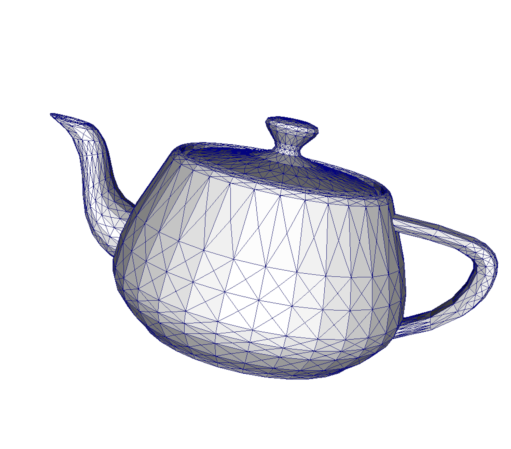

    Polygonal grid.

A polydata, such as :numref:`fig:PolyData`, is a specialized version of an
unstructured grid designed for efficient rendering. It consists of 0D cells
(vertices and polyvertices), 1D cells (lines and polylines), and 2D cells
(polygons and triangle strips). Certain filters that generate only these cell
types will generate a polydata. Examples include the Contour and Slice filters.
An unstructured grid, as long as it has only 2D cells supported by polydata, can
be converted to a polydata using the  ``Extract Surface Filter`` :index:`\ <Extract Surface Filter>`\ . A polydata can be
converted to an unstructured grid using  ``Clean to Grid`` :index:`\ <Clean to Grid>`\ .

.. _sec:VTKDataModel:Table:

Table
^^^^^

.. figure:: images/ParaView_UG_Table.png
    :name: fig:Table
    :width: 80%
    :align: center

    Table

A table, such as :numref:`fig:Table`, is a tabular dataset that consists of rows
and columns. All chart views have been designed to work with tables. Therefore,
all filters that can be shown within the chart views generate tables. Also,
tables can be directly loaded using various file formats such as the comma-separated
values format. Tables can be converted to other datasets as long as
they are of the right format. Filters that convert tables include  ``Table to
Points`` :index:`\ <Table to
Points>`\  and  ``Table to Structured Grid`` :index:`\ <Table to Structured Grid>`\ .

.. _sec:MultiblockDataset:

Multiblock dataset
^^^^^^^^^^^^^^^^^^

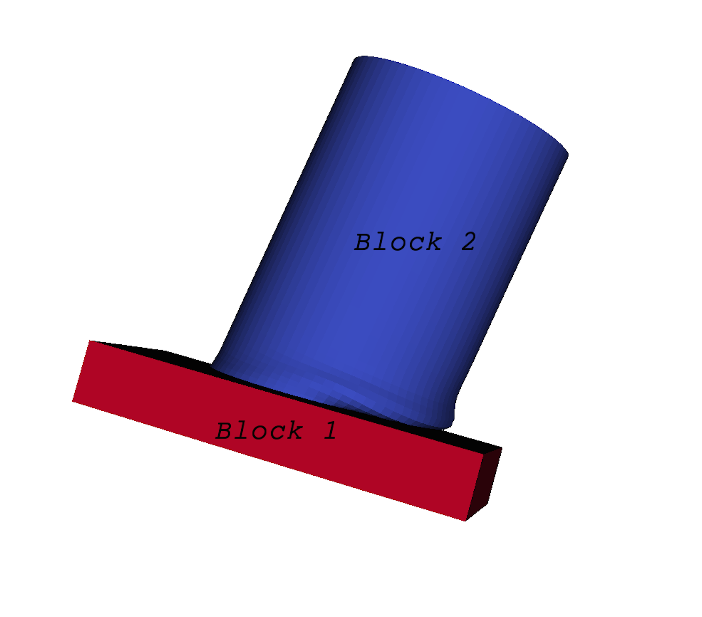

    Multiblock dataset.

You can think of a multi-block dataset (:numref:`fig:MultiblockDataset`) as a
tree of datasets where the leaf nodes are *simple* datasets. All of the
data types described above, except |AMR|, are *simple* datasets. Multi-block
datasets are used to group together datasets that are related. The relation
between these datasets is not necessarily defined by |ParaView|. A multi-block
dataset can represent an assembly of parts or a collection of meshes of
different types from a coupled simulation. Multi-block datasets can be loaded or
created within |ParaView| using the  ``Group`` :index:`\ <Group>`\  filter. Note that the leaf nodes of a
multi-block dataset do not all have to have the same attributes. If you apply a
filter that requires an attribute, it will be applied only to blocks that have
that attribute.

.. _sec:MultipieceDataset:

Multipiece dataset
^^^^^^^^^^^^^^^^^^

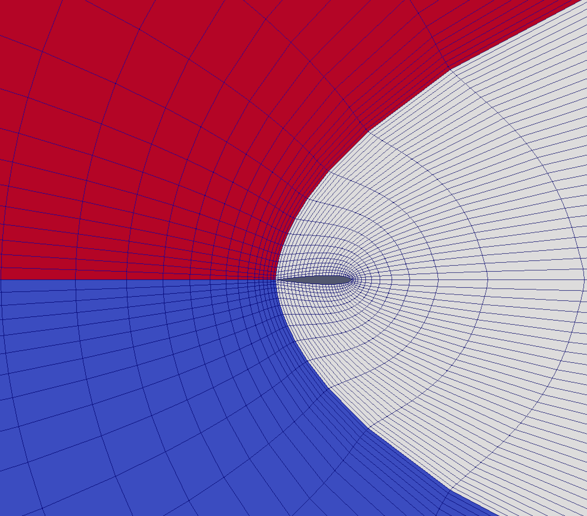

    Multipiece dataset.

Multi-piece datasets, such as :numref:`fig:MultipieceDataset`, are similar to
multi-block datasets in that they group together simple datasets. There is one key
difference. Multi-piece datasets group together datasets that are part of a
whole mesh - datasets of the same type and with the same attributes. This data
structure is used to collect datasets produced by a parallel simulation without
having to append the meshes together. Note that there is no way to create a
multi-piece dataset within |ParaView|. It can only be created by using certain readers.
Furthermore, multi-piece datasets act, for the most part, as simple datasets.
For example, it is not possible to extract individual pieces or to obtain
information about them.

Getting data information in ``paraview``
========================================

In the visualization pipeline (:numref:`sec:BasicsOfVisualization`),
sources, readers, and filters are all producing data. In a VTK-based pipeline,
this data is one of the types discussed. Thus, when you create a source or open
a data file in |paraview| and hit  ``Apply`` :index:`\ <Apply>`\ , data is being produced.
The  ``Information`` :index:`\ <Information>`\  panel and the  ``Statistics Inspector`` :index:`\ <Statistics Inspector>`\  panel can be used
to inspect the characteristics of the data produced by any pipeline module.

The ``Information`` panel
^^^^^^^^^^^^^^^^^^^^^^^^^
 :index:`\ <Information Panel>`\ 

The  ``Information`` :index:`\ <Information>`\  panel provides summary information about the data produced by
the active source. By default, this panel is tucked under a tab below the
``Properties`` :index:`\ <Properties>`\  panel. You can toggle its visibility using :guilabel:`View > Information`.

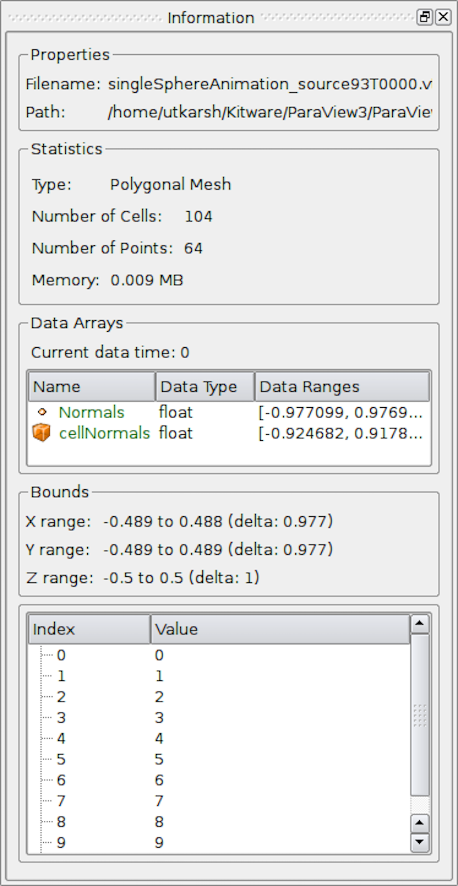

    The  ``Information`` :index:`\ <Information>`\  panel in |paraview| showing data summaries for the active source.

The  ``Information`` :index:`\ <Information>`\  panel shows the data information for the active source. Thus,
similar to the  ``Properties`` :index:`\ <Properties>`\  panel, it changes when the active source is
changed (e.g., by changing the selection in the  ``Pipeline Browser`` :index:`\ <Pipeline Browser>`\ ). One way
to think of this panel is as a panel showing a summary for the data *currently*
produced by the active source. Remember that a newly-created pipeline
module does not produce any data until you hit  ``Apply`` :index:`\ <Apply>`\ . Thus, valid
information for a newly-created source will be shown on this panel only after
that  ``Apply`` :index:`\ <Apply>`\ . Similarly, if you change properties on the source and hit
``Apply`` :index:`\ <Apply>`\ , this panel will
reflect any changes in data characteristics. Additionally, for temporal pipelines, this panel shows
information for the current timestep alone (except as noted). Thus, as you step
through timesteps in a temporal dataset, the information displayed
will potentially change, and the panel will reflect those changes.

.. admonition:: **Did you know?**
  :class: tip

  Any text on this panel is *copy*-able. For example, if want to copy the
  number of points value to use it as a property value on the  ``Properties`` :index:`\ <Properties>`\ 
  panel, simply double-click on the number or click-and-drag to select the
  number and use the common keyboard shortcut :kbd:`\ctrl+C` (or
  :kbd:`\cmdmac+C`) to copy that value to the clipboard. Now, you can paste it
  in an input widget in |paraview| or any other application, such as an
  editor, by using :kbd:`\ctrl+V` (or :kbd:`\cmdmac+V`) or the application-specific
  shortcut for pasting text from the clipboard. The same is true for numbers shown in
  lists, such as the  ``Data Ranges`` :index:`\ <Data Ranges>`\ .

The panel itself is comprised of several groups of information. Groups may be
hidden based on the type of pipeline module or the type of data being produced.

The file  ``Properties`` :index:`\ <Properties>`\  group is shown for readers with information about the
file that is opened. For a temporal file series, as you step through each
time step, the file name is updated to point to the name of the file in the
series that corresponds to the current time step.

The  ``Statistics`` :index:`\ <Statistics>`\  group provides a summary of the dataset produced including its
type, its number of cells and points (or rows and columns in cases of Tabular
datasets), and an estimate of the memory used by the dataset. This number only
includes the memory space needed to save the data arrays for the dataset. It does not include
the memory space used by the data structures themselves and, hence, must only be treated as an
estimate.

The  ``Data Arrays`` :index:`\ <Data Arrays>`\  group lists all of the available point, cells, and field arrays,
as well as their types and ranges for the current time step. The  ``Current data time`` :index:`\ <Current data time>`\ 
field shows the time value for the current timestep as a reference. As with
other places in |paraview|, the icons |pqCellData16|, |pqNodalData16|, and |pqGlobalData16| are used
to indicate cell, point, and field data arrays. Since data arrays can have multiple
components, the range for each component of the data array is shown.

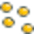

``Bounds`` :index:`\ <Bounds>`\  shows the spatial bounds of the datasets in 3D Cartesian space. This
will be unavailable for non-geometric datasets such as tables.

For reader modules, the  ``Time`` :index:`\ <Time>`\  group shows the available time steps and corresponding
time values provided by the file.

For structured datasets such as uniform rectilinear grids or curvilinear grids,
the  ``Extents`` :index:`\ <Extents>`\  group is shown that displays the structured extents and dimensions
of the datasets.

All of the summary information discussed so far provides a synopsis of the entire dataset
produced by the pipeline module, including across all ranks (which will become
clearer once we look at using |ParaView| for parallel data processing). In cases
of composite datasets, such as mutliblock datasets or AMR datasets, recall that
these are datasets that are comprised of other datasets. In such cases, these
are summaries over all the blocks in the composite dataset. Every so often,
you will notice that the  ``Data Arrays`` :index:`\ <Data Arrays>`\  table lists an array with the suffix
``(partial)`` :index:`\ <(partial)>`\  (Figure :numref:`fig:InformationPanelPartialArrays`).
Such arrays are referred to as *partial arrays*. Partial arrays
is a term used to refer to arrays that are present on some non-composite
blocks or leaf nodes in a composite dataset, but not all. The  ``(partial)`` :index:`\ <(partial)>`\ 
suffix to indicate partial arrays :index:`\ <partial arrays>`\  is also used by |paraview| in other
places in the UI.

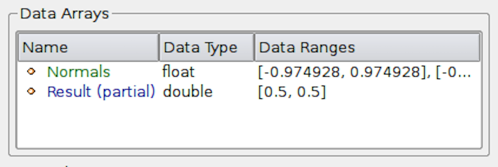

    The  ``Data Arrays`` :index:`\ <Data Arrays>`\  section on  ``Information`` :index:`\ <Information>`\  panel showing *partial* arrays. Partial arrays are arrays that present on certain blocks in a composite dataset, but not all.

While summaries over all of the datasets in the composite dataset are useful,
you may also want to look at the data information for individual blocks.
To do so, you can use the  ``Data Hierarchy`` :index:`\ <Data Hierarchy>`\  group, which appears when
summarizing composite datasets. The  ``Data Hierarchy`` :index:`\ <Data Hierarchy>`\  widget shows the
structure or hierarchy of the composite dataset
(Figure :numref:`fig:InformationPanelDataHierarchy`). The  ``Information`` :index:`\ <Information>`\  panel
switches to showing the summaries for the selected sub-tree.
By default, the root element will be selected. You can now select any block in
the hierarchy to view the summary limited to just that sub-tree.

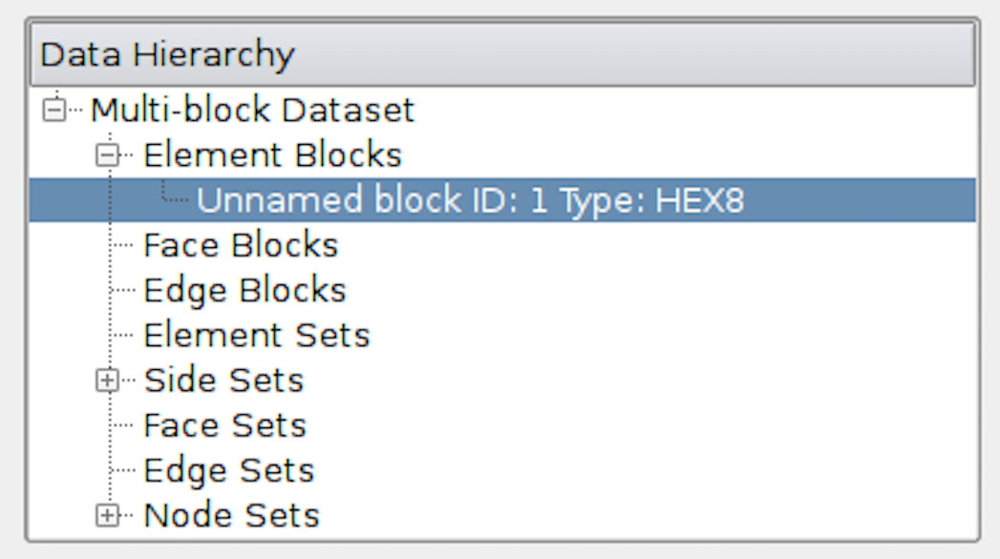

    The  ``Data Hierarchy`` :index:`\ <Data Hierarchy>`\  section on the  ``Information`` :index:`\ <Information>`\  panel showing
    the composite data hierarchy. Selecting a particular block or subtree in this
    widget will result in the reset of the  ``Information`` :index:`\ <Information>`\  panel showing
    summaries for that block or subtree alone.

.. admonition:: **Did you know?**
  :class: tip

  Memory information shown on the  ``Information`` :index:`\ <Information>`\  panel and 
  the  ``Statistics Inspector`` :index:`\ <Statistics Inspector>`\  
  should only be used as an approximate reference and does not translate
  to how much memory the data produced by a particular pipeline module takes. This is due
  to the following factors:

  * The size does not include the amount of memory needed to build the data structures to store the data arrays. While, in most cases, this is negligible compared to that of the data arrays, it can be nontrivial, especially when dealing with deeply-nested composite datasets.

  * Several filters such as  ``Calculator`` :index:`\ <Calculator>`\  and  ``Shrink`` :index:`\ <Shrink>`\  simply pass input data arrays through, so there's no extra space needed for those data arrays that are shared with the input. The memory size numbers shown, however, do not take this into consideration.
  
  If you need an overview of how much physical memory is being used by |ParaView| in
  its current state, you can use the  ``Memory Inspector`` :index:`\ <Memory Inspector>`\ 
  (:numref:`chapter:MemoryInspector`).

The ``Statistics Inspector`` panel
^^^^^^^^^^^^^^^^^^^^^^^^^^^^^^^^^^
 :index:`\ <Statistics Inspector>`\ 

The  ``Information`` :index:`\ <Information>`\  panel shows data information for the active source. If you
need a quick summary of the data produced by all the pipeline modules, you can
use the  ``Statistics  Inspector`` :index:`\ <Statistics  Inspector>`\  panel. It's accessible from
:guilabel:`Views > Statistics Inspector`.

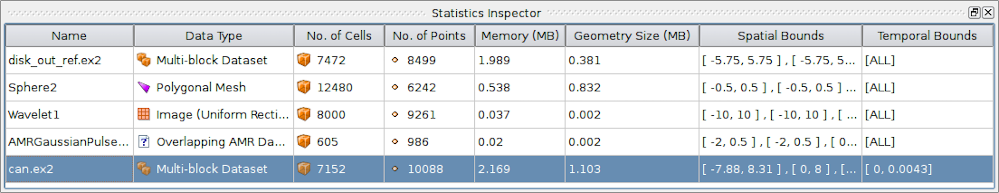

    The  ``Statistics Inspector`` :index:`\ <Statistics Inspector>`\  panel in |paraview| showing summaries for all pipeline modules.

All of the information on this panel is also presented on the  ``Information`` :index:`\ <Information>`\ 
panel, except  ``Geometry Size`` :index:`\ <Geometry Size>`\ . This corresponds to how much memory is
needed for the transformed dataset used for rendering in the active view. For example, to
render a 3D dataset as a surface in the 3D view, |ParaView| must extract the
surface mesh as a polydata.  ``Geometry Size`` :index:`\ <Geometry Size>`\  represents the memory needed for
this polydata with the same memory-size-related caveats as with the
``Information`` :index:`\ <Information>`\  panel.

.. _sec:DataInformationInPython:

Getting data information in ``pvpython``
========================================

When scripting with |ParaView|, you will often find yourself needing information
about the data. While |paraview| sets up filter properties and color
tables automatically using the information from the data, you
must do that explicitly when scripting.

In |pvpython|, for any pipeline module (sources, readers, or
filters), you can use the following ways to get information about the data
produced.

.. code-block:: python

  >>> from paraview.simple import *
  >>> reader = OpenDataFile(".../ParaViewData/Data/can.ex2")
  
  # We need to update the pipeline. Otherwise, all of the data
  # information we get will be from before the file is actually
  # read and, hence, will be empty.
  >>> UpdatePipeline()
  
  >>> dataInfo = reader.GetDataInformation()
  
  # To get the number of cells or points in the dataset:
  >>> dataInfo.GetNumberOfPoints()
  10088
  >>> dataInfo.GetNumberOfCells()
  7152
  
  # You can always nest the call, e.g.:
  >>> reader.GetDataInformation().GetNumberOfPoints()
  10088
  >>> reader.GetDataInformation().GetNumberOfCells()
  7152
  
  # Use source.PointData or source.CellData to get information about
  # point data arrays and cell data arrays, respectively.
  
  # Let's print the available point data arrays.
  >>> reader.PointData[:]
  [Array: ACCL, Array: DISPL, Array: GlobalNodeId, Array: PedigreeNodeId, Array: VEL]
  
  # Similarly, for cell data arrays:
  >>> reader.CellData[:]
  [Array: EQPS, Array: GlobalElementId, Array: ObjectId, Array: PedigreeElementId]
  
``PointData`` :index:`\ <PointData>`\  (and  ``CellData`` :index:`\ <CellData>`\ ) is a map or dictionary where the keys are the
names of the arrays, and the values are objects that provide more information
about each of the arrays. In the rest of this section, anything we demonstrate on
``PointData`` :index:`\ <PointData>`\  is also applicable to  ``CellData`` :index:`\ <CellData>`\ .
  

.. code-block:: python

  # Let's get the number of available point arrays.
  >>> len(reader.PointData)
  5
  
  # Print the names for all available point arrays.
  >>> reader.PointData.keys()
  ['ACCL', 'DISPL', 'GlobalNodeId', 'PedigreeNodeId', 'VEL']
  
  >>> reader.PointData.values()
  [Array: ACCL, Array: DISPL, Array: GlobalNodeId, Array: PedigreeNodeId, Array: VEL]
  
  # To test if a particular array is present:
  >>> reader.PointData.has_key("ACCL")
  True
  
  >>> reader.PointData.has_key("--non-existent-array--")
  False

From  ``PointData`` :index:`\ <PointData>`\  (or  ``CellData`` :index:`\ <CellData>`\ ), you can get access to an object
that provides information for each of the arrays. This object gives us
methods to get data ranges, component counts, tuple counts, etc.

.. code-block:: python

  # Let's get information about 'ACCL' array.
  >>> arrayInfo = reader.PointData["ACCL"]
  >>> arrayInfo.GetName()
  'ACCL'
  
  # To get the number of components in each tuple and the number
  # of tuples in the data array:
  >>> arrayInfo.GetNumberOfTuples()
  10088
  >>> arrayInfo.GetNumberOfComponents()
  3
  
  # Alternative way for doing the same:
  >>> reader.PointData["ACCL"].GetNumberOfTuples()
  10088
  >>> reader.PointData["ACCL"].GetNumberOfComponents()
  3
  
  # To get the range for a particular component, e.g. component 0:
  >>> reader.PointData["ACCL"].GetRange(0)
  (-4.965284006175352e-07, 3.212448973499704e-07)
  
  # To get the range for the magnitude in cases of multi-component arrays
  # use -1 as the component number.
  >>> reader.PointData["ACCL"].GetRange(-1)
  (0.0, 1.3329898584157294e-05)
  
  # To determine the data data type for this array:
  >>> from paraview import vtk
  >>> reader.PointData["ACCL"].GetDataType() == vtk.VTK_DOUBLE
  True
  # The paraview.vtk module provides access to these constants such as
  # VTK_DOUBLE, VTK_FLOAT, VTK_INT, etc.
  
  # Likewise, to test the dataset type, itself:
  >>> reader.GetDataInformation().GetDataSetType() == \
                                 vtk.VTK_MULTIBLOCK_DATA_SET
  True

Here's a sample script to iterate over all point data arrays and print their
magnitude ranges:

.. code-block:: python

  >>> def print_point_data_ranges(source):
  ...    """Prints array ranges for all point arrays"""
  ...    for arrayInfo in source.PointData:
  ...        # get the array's name
  ...        name = arrayInfo.GetName()
  ...        # get magnitude range
  ...        range = arrayInfo.GetRange(-1)
  ...        print "%s = [%.3f, %.3f]" % (name, range[0], range[1])
  
  # Let's call this function on our reader.
  >>> print_point_data_ranges(reader)
  ACCL = [0.000, 0.000]
  DISPL = [0.000, 0.000]
  GlobalNodeId = [1.000, 10088.000]
  PedigreeNodeId = [1.000, 10088.000]
  VEL = [0.000, 5000.000]

.. admonition:: **Did you know?**
  :class: tip

  The example scripts in this section all demonstrated how to obtain information about the data such
  as the number of points and cells, data bounds, and array ranges. However, what they
  do not show is how to access the raw data itself. To see how to obtain the full data,
  please see :numref:`sec:Fetch`.

.. \begin{TODO}
  \begin{itemize}
  \item Explain what is involved when collecting data information so user
  understand the costs involved. Then we could add a didyouknow blurb about how
  that differs in symmetric batch -- or something.
  \end{itemize}
  \end{TODO}
