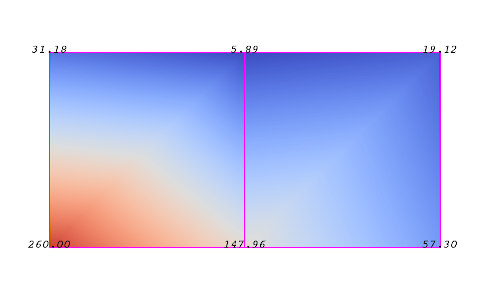
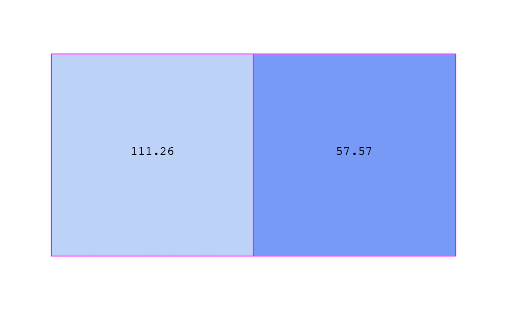
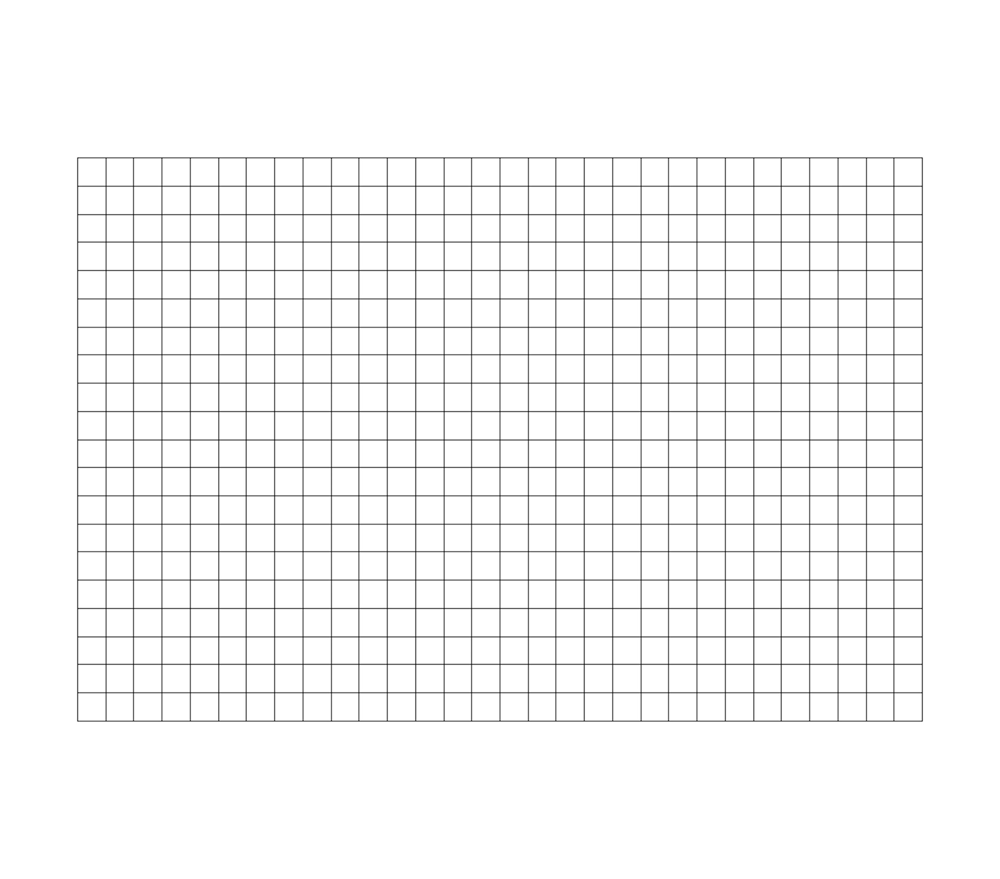
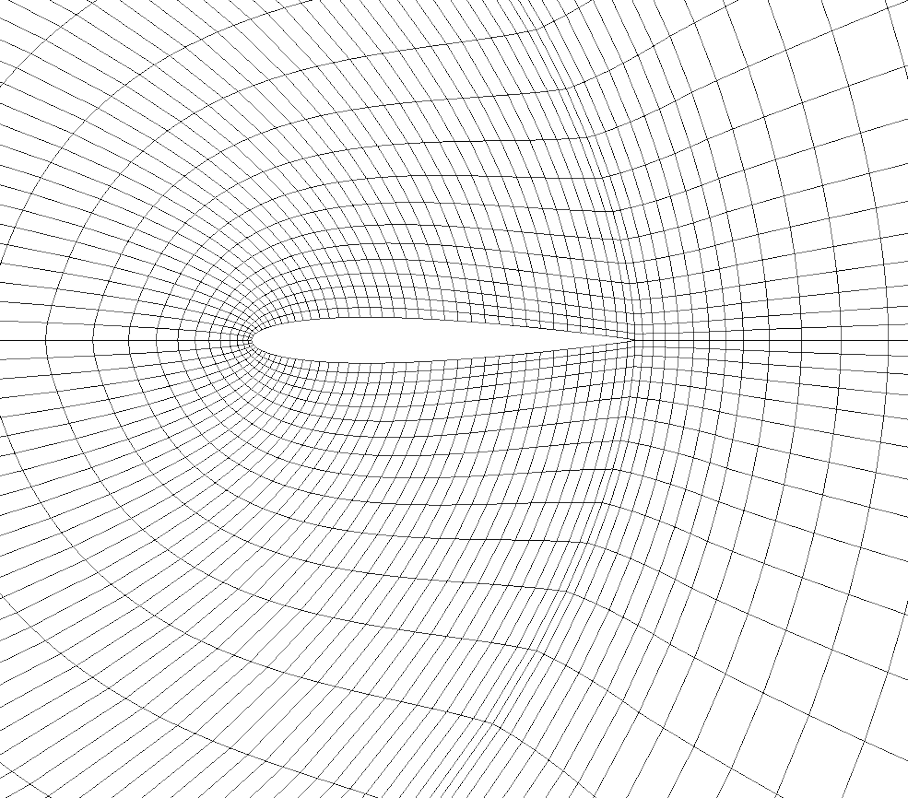
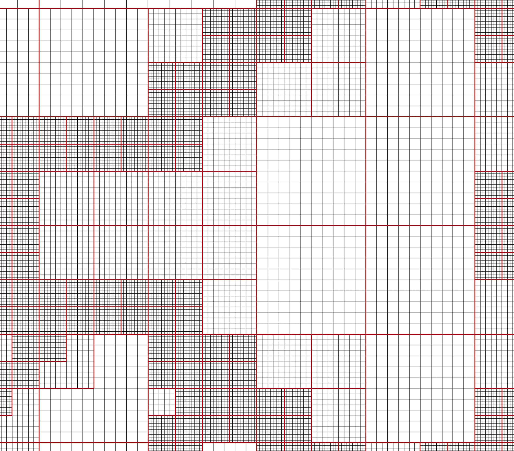
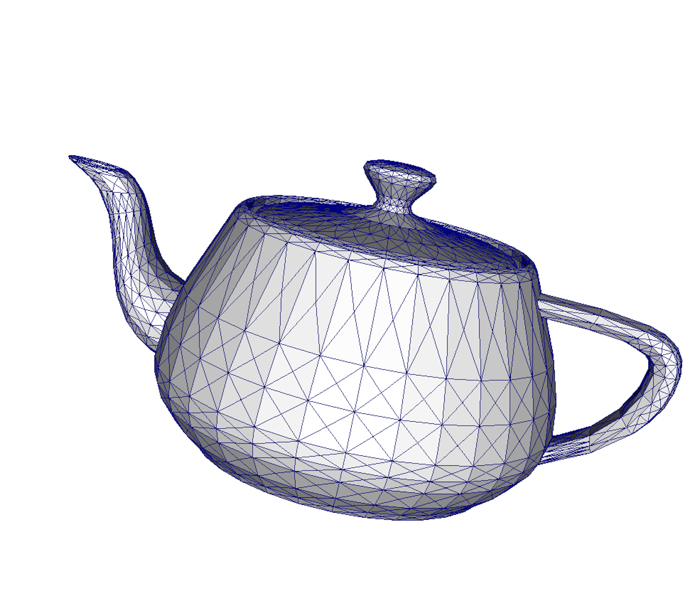
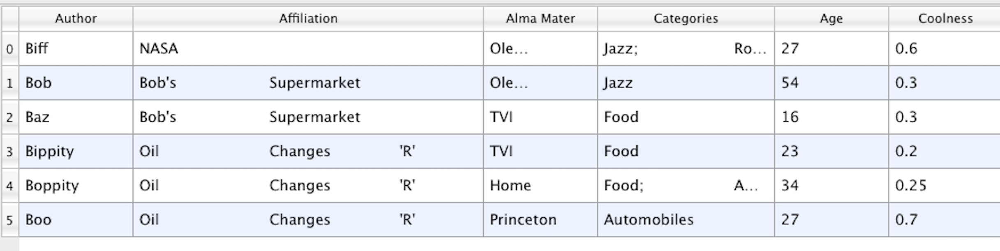
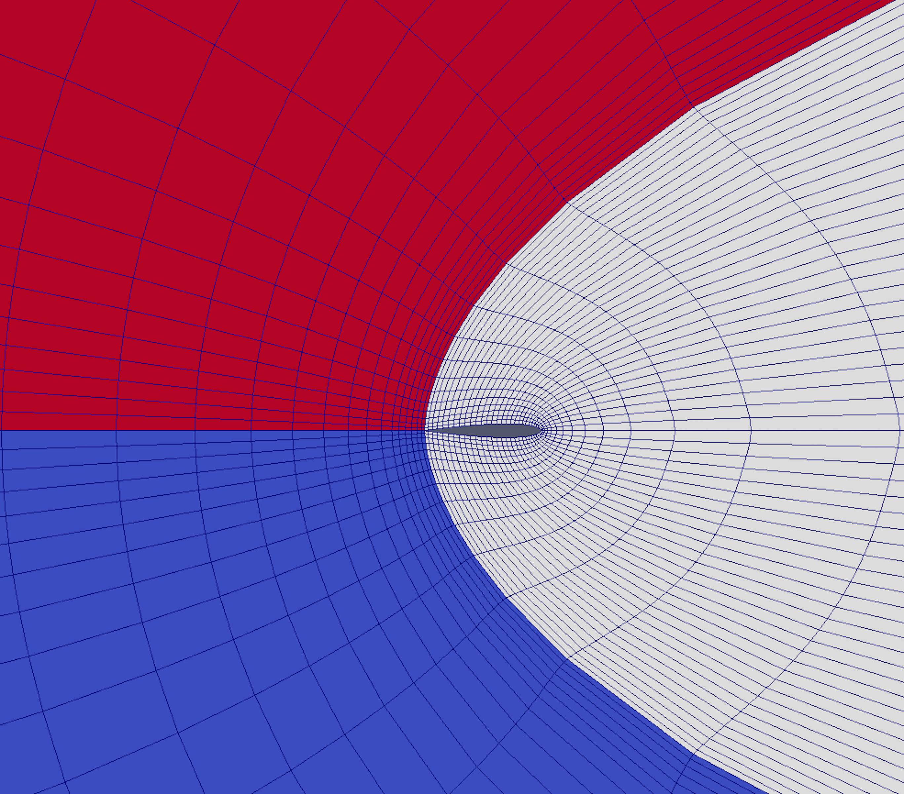

.. include:: macros.hrst
.. include:: abbreviations.hrst

.. _sec:VTKDataModel:
VTK data model
==============

To use |ParaView| effectively, you need to understand the |ParaView| data model.
|ParaView| uses VTK, the Visualization Toolkit, to provide the visualization
and data processing model. This chapter briefly introduces the VTK
data model used by |ParaView|. For more details, refer to one of the VTK books.

The most fundamental data structure in VTK is a data object. Data objects can
either be scientific datasets, such as rectilinear grids or finite elements meshes
(see below), or more abstract data structures, such as graphs or trees. These
datasets are formed from smaller building blocks: mesh (topology and geometry) and
attributes.

.. _sec:VTKDataModel:Mesh:
Mesh
^^^^

Even though the actual data structure used to store the mesh in memory depends
on the type of the dataset, some abstractions are common to all types. In
general, a mesh consists of vertices (points :index:`\ <Points>`\ ) and
cells :index:`\ <Cells>`\  (elements, zones). Cells
are used to discretize a region and can have various types such as tetrahedra,
hexahedra, etc. Each cell contains a set of vertices. The mapping from cells to
vertices is called the connectivity. Note that even though it is possible to
define data elements such as faces and edges, VTK does not represent these
explicitly. Rather, they are implied by a cell's type and by its connectivity. One
exception to this rule is the arbitrary polyhedron, which explicitly stores its
faces. :numref:`fig:ExampleMesh` is an example mesh that consists of two cells.
The first cell is defined by vertices :math:`(0, 1, 3, 4)`, and the second cell is
defined by vertices :math:`(1, 2, 4, 5)`. These cells are neighbors because they share
the edge defined by the points :math:`(1, 4)`.

.. figure:: images/ParaView_UG_Cells.png
    :name: fig:ParaView_UG_Cells
    :width: 40%
    :align: center

    Example of a mesh.

A mesh is fully defined by its topology and the spatial coordinates of its
vertices. In VTK, the point coordinates may be implicit, or they may be explicitly defined by
a data array of dimensions :math:`(number\_of\_points \times 3)`.

.. _sec:VTKDataModel:Attributes:
Attributes (fields, arrays)
^^^^^^^^^^^^^^^^^^^^^^^^^^^

.. \fixme{Attribute \& data array are in the UI index, but are defined here. Remove one or both keyword tags?} 

An attribute  :index:`\ <Attribute>`\  :index:`\ <Data Array>`\ (or a data array or field)
defines the discrete values of a field
over the mesh. Examples of attributes include pressure, temperature, velocity,
and stress tensor. Note that VTK does not specifically define different types of
attributes. All attributes are stored as data arrays, which can have an arbitrary
number of components. |ParaView| makes some assumptions in regards to the number
of components. For example, a 3-component array is assumed to be an array of
vectors. Attributes can be associated with points or cells. It is also possible
to have attributes that are not associated with either.
:numref:`fig:PointCenteredAttributes` demonstrates the use of a point-centered
attribute. Note that the attribute is only defined on the vertices.
Interpolation is used to obtain the values everywhere else. The interpolation
functions used depend on the cell type. See the VTK documentation for details.

    Point-centered attribute in a data array or field.

:numref:`fig:CellCenteredAttributes` demonstrates the use of a cell-centered
attribute. Note that cell-centered attributes are assumed to be constant over
each cell. Due to this property, many filters in VTK cannot be directly applied
to cell-centered attributes. It is normally required to apply a  ``Cell Data to
Point Data`` :index:`\ <Cell Data to
Point Data>`\  filter. In |ParaView|, this filter is applied automatically, when
necessary.

    Cell-centered attribute.

Uniform rectilinear grid (image data)
^^^^^
.. _sec:VTKDataModel:UniformRectilinearGrid:

    Sample uniform rectilinear grid.

A uniform rectilinear grid, or image data, defines its topology and point
coordinates implicitly (:numref:`fig:UniformRectilinearGrid`). To fully define
the mesh for an image data, VTK uses the following:

\begin{compactenum}
\item *Extents* - These define the minimum and maximum indices in each
direction. For example, an image data of extents $(0, 9)$, $(0, 19)$, $(0, 29)$
has 10 points in the x-direction, 20 points in the y-direction, and 30 points in the
z-direction. The total number of points is $10 \times 20 \times 30$.
\item *Origin* - This is the position of a point defined with indices $(0, 0, 0)$.
\item *Spacing* - This is the distance between each point. Spacing for each
direction can defined independently.
\end{compactenum}

The coordinate of each point is defined as follows: $coordinate = origin +
index \times spacing$ where $coordinate$, $origin$, $index$, and $spacing$ are vectors of
length 3.

Note that the generic VTK interface for all datasets uses a flat index. The
$(i,j,k)$ index can be converted to this flat index as follows:
$idx\_flat = k \times (npts_x \times npts_y) + j \times nptr_x + i$.

A uniform rectilinear grid consists of cells of the same type. This type is determined by the dimensionality of the dataset (based on the extents) and can either be vertex (0D), line (1D), pixel (2D), or voxel (3D).

Due to its regular nature, image data requires less storage than other datasets.
Furthermore, many algorithms in VTK have been optimized to take advantage of
this property and are more efficient for image data.

.. _sec:VTKDataModel:RectilinearGrid:
Rectilinear grid
^^^^^

.. figure:: images/ParaView_UG_Rectilinear.png
    :name: fig:ExampleMesh
    :width: 40%
    :align: center

    Rectilinear grid.

A rectilinear grid, such as :nuref:`fig:ExampleMesh`, defines its topology
implicitly and point coordinates semi-implicitly. To fully define the mesh for a
rectilinear grid, VTK uses the following:

\begin{compactenum}
\item *Extents* - These define the minimum and maximum indices in each
direction. For example, a rectilinear grid of extents $(0, 9)$, $(0, 19)$, $(0,
29)$ has 10 points in the x-direction, 20 points in the y-direction, and 30
points in the z-direction. The total number of points is $10 \times 20 \times 30$.
\item *Three arrays defining coordinates in the x-, y- and z-directions* -
These arrays are of length $npts_x$, $npts_y$, and $npts_z$. This is a significant
savings in memory, as the total memory used by these arrays is
$npts_x+npts_y+npts_z$ rather than $npts_x \times npts_y \times npts_z$.
\end{compactenum}

The coordinate of each point is defined as follows:

$coordinate = (coordinate\_array_x(i), coordinate\_array_y(j), coordinate\_array_z(k))$.

Note that the generic VTK interface for all datasets uses a flat index. The
$(i,j,k)$ index can be converted to this flat index as follows:
$idx\_flat = k \times (npts_x \times npts_y) + j \times nptr_x + i$.

A rectilinear grid consists of cells of the same type. This type is determined
by the dimensionality of the dataset (based on the extents) and can either be
vertex (0D), line (1D), pixel (2D), or voxel (3D).

Curvilinear grid (structured grid)
^^^^^
.. _sec:VTKDataModel:CurvilinearGrid:

    Curvilinear or structured grid.

A curvilinear grid, such as  :numref:`fig:CurvilinearGrid`, defines its
topology implicitly and point coordinates explicitly. To fully define the mesh
for a curvilinear grid, VTK uses the following:

\begin{compactenum}
\item \emph {Extents} - These define the minimum and maximum indices in each
direction. For example, a curvilinear grid of extents $(0, 9)$, $(0, 19)$, $(0,
29)$ has $10 \times 20 \times 30$ points regularly defined over a curvilinear mesh.
\item \emph {An array of point coordinates} - This array stores the position of
each vertex explicitly.
\end{compactenum}

The coordinate of each point is defined as follows:
$coordinate = coordinate\_array(idx\_flat)$.
The $(i,j,k)$ index can be converted to this flat index as follows:
$idx\_flat = k \times (npts_x \times npts_y) + j \times npts_x + i$.

A curvilinear grid consists of cells of the same type. This type is determined
by the dimensionality of the dataset (based on the extents) and can either be
vertex (0D), line (1D), quad (2D), or hexahedron (3D).

.. _sec:VTKDataModel:AMRDataset:
AMR dataset
^^^^^

    AMR dataset.

VTK natively supports Berger-Oliger type |AMR| datasets,
as shown in :numref:`fig:AMRDataset`. An |AMR| dataset is essentially a
collection of uniform rectilinear grids grouped under increasing refinement
ratios (decreasing spacing). VTK's |AMR| dataset does not force any constraint on
whether and how these grids should overlap. However, it provides support for
masking (blanking) sub-regions of the rectilinear grids using an array of bytes.
This allows VTK to process overlapping grids with minimal artifacts. VTK can
automatically generate the masking arrays for Berger-Oliger compliant meshes.

Unstructured grid
^^^^^
.. _sec:VTKDataModel:UnstructuredGrid:

.. figure:: images/ParaView_UG_Unstructured.png
    :name: fig:Unstructured
    :width: 40%
    :align: center

    Unstructured grid.

An unstructured grid, such as :numref:`fig:UnstructuredGrid`, is the most
general primitive dataset type. It stores topology and point coordinates
explicitly. Even though VTK uses a memory-efficient data structure to store the
topology, an unstructured grid uses significantly more memory to represent its
mesh. Therefore, use an unstructured grid only when you cannot represent your
dataset as one of the above datasets. VTK supports a large number of cell types,
all of which can exist (heterogeneously) within one unstructured grid. The full
list of all cell types supported by VTK can be found in the file  ``vtkCellType.h`` :index:`\ <vtkCellType.h>`\ 
in the VTK source code. Here is the list of cell types as of when this document was written:

\begin{multicols}{2}
\begin{compactitem}
\item VTK\_EMPTY\_CELL
\item VTK\_VERTEX
\item VTK\_POLY\_VERTEX
\item VTK\_LINE
\item VTK\_POLY\_LINE
\item VTK\_TRIANGLE
\item VTK\_TRIANGLE\_STRIP
\item VTK\_POLYGON
\item VTK\_PIXEL
\item VTK\_QUAD
\item VTK\_TETRA
\item VTK\_VOXEL
\item VTK\_HEXAHEDRON
\item VTK\_WEDGE
\item VTK\_PYRAMID
\item VTK\_PENTAGONAL\_PRISM
\item VTK\_HEXAGONAL\_PRISM
\item VTK\_QUADRATIC\_EDGE
\item VTK\_QUADRATIC\_TRIANGLE
\item VTK\_QUADRATIC\_QUAD
\item VTK\_QUADRATIC\_POLYGON
\item VTK\_QUADRATIC\_TETRA
\item VTK\_QUADRATIC\_HEXAHEDRON
\item VTK\_QUADRATIC\_WEDGE
\item VTK\_QUADRATIC\_PYRAMID
\item VTK\_BIQUADRATIC\_QUAD
\item VTK\_TRIQUADRATIC\_HEXAHEDRON
\item VTK\_QUADRATIC\_LINEAR\_QUAD
\item VTK\_QUADRATIC\_LINEAR\_WEDGE
\item VTK\_BIQUADRATIC\_QUADRATIC\_WEDGE
\item VTK\_BIQUADRATIC\_QUADRATIC\_HEXAHEDRON
\item VTK\_BIQUADRATIC\_TRIANGLE
\item VTK\_CUBIC\_LINE
\item VTK\_CONVEX\_POINT\_SET
\item VTK\_POLYHEDRON
\item VTK\_PARAMETRIC\_CURVE
\item VTK\_PARAMETRIC\_SURFACE
\item VTK\_PARAMETRIC\_TRI\_SURFACE
\item VTK\_PARAMETRIC\_QUAD\_SURFACE
\item VTK\_PARAMETRIC\_TETRA\_REGION
\item VTK\_PARAMETRIC\_HEX\_REGION
\item VTK\_HIGHER\_ORDER\_EDGE
\item VTK\_HIGHER\_ORDER\_TRIANGLE
\item VTK\_HIGHER\_ORDER\_QUAD
\item VTK\_HIGHER\_ORDER\_POLYGON
\item VTK\_HIGHER\_ORDER\_TETRAHEDRON
\item VTK\_HIGHER\_ORDER\_WEDGE
\item VTK\_HIGHER\_ORDER\_PYRAMID
\item VTK\_HIGHER\_ORDER\_HEXAHEDRON
\item VTK\_LAGRANGE\_CURVE
\item VTK\_LAGRANGE\_TRIANGLE
\item VTK\_LAGRANGE\_QUADRILATERAL
\item VTK\_LAGRANGE\_TETRAHEDRON
\item VTK\_LAGRANGE\_HEXAHEDRON
\item VTK\_LAGRANGE\_WEDGE
\item VTK\_LAGRANGE\_PYRAMID
\end{compactitem}
\end{multicols}

Many of these cell types are straightforward. For details, see the VTK
documentation.

.. _sec:VTKDataModel:PolyData:

Polygonal grid (polydata)
^^^^^^^^^^^^^^^^^^^^^^^^

    Polygonal grid.

A polydata, such as :numref:`fig:PolyData`, is a specialized version of an
unstructured grid designed for efficient rendering. It consists of 0D cells
(vertices and polyvertices), 1D cells (lines and polylines), and 2D cells
(polygons and triangle strips). Certain filters that generate only these cell
types will generate a polydata. Examples include the Contour and Slice filters.
An unstructured grid, as long as it has only 2D cells supported by polydata, can
be converted to a polydata using the  ``Extract Surface Filter`` :index:`\ <Extract Surface Filter>`\ . A polydata can be
converted to an unstructured grid using  ``Clean to Grid`` :index:`\ <Clean to Grid>`\ .

.. _sec:VTKDataModel:Table:
Table
^^^^^

    Table

A table, such as :numref:`fig:Table`, is a tabular dataset that consists of rows
and columns. All chart views have been designed to work with tables. Therefore,
all filters that can be shown within the chart views generate tables. Also,
tables can be directly loaded using various file formats such as the comma-separated
values format. Tables can be converted to other datasets as long as
they are of the right format. Filters that convert tables include  ``Table to
Points`` :index:`\ <Table to
Points>`\  and  ``Table to Structured Grid`` :index:`\ <Table to Structured Grid>`\ .

Multiblock dataset
^^^^^
.. _sec:MultiblockDataset:

.. figure:: images/ParaView_UG_Multiblock.png
    :name: fig:MultiblockDataset
    :width: 40%
    :align: center

    Multiblock dataset.

You can think of a multi-block dataset (:numref:`fig:MultiblockDataset`) as a
tree of datasets where the leaf nodes are *simple* datasets. All of the
data types described above, except |AMR|, are *simple* datasets. Multi-block
datasets are used to group together datasets that are related. The relation
between these datasets is not necessarily defined by |ParaView|. A multi-block
dataset can represent an assembly of parts or a collection of meshes of
different types from a coupled simulation. Multi-block datasets can be loaded or
created within |ParaView| using the  ``Group`` :index:`\ <Group>`\  filter. Note that the leaf nodes of a
multi-block dataset do not all have to have the same attributes. If you apply a
filter that requires an attribute, it will be applied only to blocks that have
that attribute.

.. _sec:MultipieceDataset:
Multipiece dataset
^^^^^^^^^^^^^^^^^^

    Multipiece dataset.

Multi-piece datasets, such as :numref:`fig:MultipieceDataset`, are similar to
multi-block datasets in that they group together simple datasets. There is one key
difference. Multi-piece datasets group together datasets that are part of a
whole mesh - datasets of the same type and with the same attributes. This data
structure is used to collect datasets produced by a parallel simulation without
having to append the meshes together. Note that there is no way to create a
multi-piece dataset within |ParaView|. It can only be created by using certain readers.
Furthermore, multi-piece datasets act, for the most part, as simple datasets.
For example, it is not possible to extract individual pieces or to obtain
information about them.
